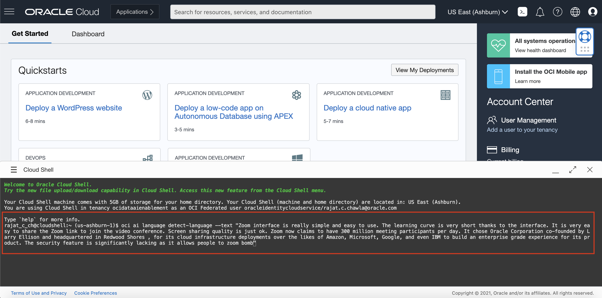

# Lab 2: Access OCI Language Service with OCI CLI

## Introduction

Our language services also support to use CLI tool.

In this lab session, we will show several code snippets to access our service with CLI.

You do not need to execute those codes, but review them to understand what information and steps are needed to implement your own integration.

*Estimated Lab Time*: 10 minutes

### Objectives:

* Learn how to use CLI to communicate with our language service endpoints.

### Prerequisites:
* Familiar with Python programming is required
* Have a Python environment ready in local
* Familiar with local editing tools, vi and nano
* Installed with Python libraries: `oci` and `requests`

## Python CLI Setup

The CLI is a small-footprint tool that you can use on its own or with the Console to complete Oracle Cloud Infrastructure tasks. The CLI provides the same core functionality as the Console, plus additional commands. Some of these, such as the ability to run scripts, extend Console functionality.


## **TASK 1:** OCI Language Service Pre-Deployed CLI Command

```Python
oci ai language detect-language --text, -? | -h | --help
 
 
oci ai language detect-entities --text, -? | -h | --help, --is-pii
 
 
oci ai language detect-key-phrases --text, -? | -h | --help
 
 
oci ai language detect-sentiments --text, -? | -h | --help
 
 
oci ai language detect-text-classification --text, -? | -h | --help
```

## **TASK 2:** Analyze Text using Cloud Shell

### 1: Navigate to Cloud Shell

Log into OCI Cloud Console. Navigate to Cloud Shell Icon on the top right and click it.


### 2: Enter Language CLI Command

Enter any one of the Language Pre-Deployed CLI commands you want to execute.


### 2: View Result

The Language service displays the results as shown below:


<!-- ## **TASK 3:**To Install CLI in your Local
To install and use the CLI, follow [CLI](https://docs.oracle.com/en-us/iaas/Content/API/Concepts/cliconcepts.htm)


For information about using the CLI, see [Command Line Interface (CLI)](https://docs.oracle.com/iaas/Content/API/Concepts/cliconcepts.htm#Command_Line_Interface_CLI).
For a complete list of flags and options available for CLI commands, see the [Command Line Reference](https://docs.oracle.com/iaas/tools/oci-cli/latest/oci_cli_docs/). -->

To know more about CLI, follow [CLI](https://docs.oracle.com/en-us/iaas/Content/API/Concepts/cliconcepts.htm)

Congratulations on completing this lab!

[Proceed to the next section](#next).

## Acknowledgements
* **Authors**
    * Rajat Chawla  - Oracle AI OCI Langauge Services
    * Ankit Tyagi -  Oracle AI OCI Langauge Services
* **Last Updated By/Date**
    * Rajat Chawla  - Oracle AI OCI Langauge Services, August 2021
