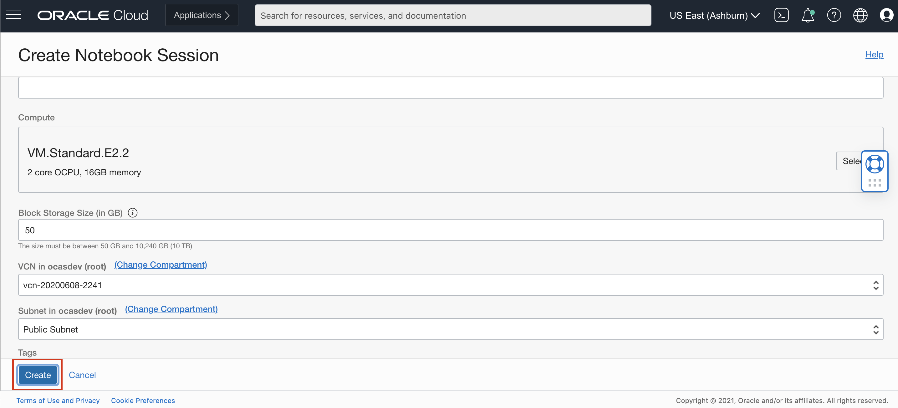

# Lab 5: Access OCI Language Service in DataScience NotebookSession.
 

## **Data Science Prerequisites:**

Before you can start using Data Science, your tenancy administrator should set up the following networking, dynamic group, and policies.
### 1. Create VCN and Subnets
Create a VCN and subnets using Virtual Cloud Networks > Start VCN Wizard > VCN with Internet Connectivity option.
The Networking Quickstart option automatically creates the necessary private subnet with a NAT gateway.

### 2. Create Dynamic Group
Create a dynamic group with the following matching rule:
ALL { resource.type = 'datasciencenotebooksession' }

### 3. Create Policies
Create a policy in the root compartment with the following statements:

3.1 Service Policies
```
<copy>allow service datascience to use virtual-network-family in tenancy</copy>
```
3.2 Non-Administrator User Policies
```
<copy>allow group <data-scientists> to use virtual-network-family in tenancy</copy>
```
```
<copy>allow group <data-scientists> to manage data-science-family in tenancy</copy>
```
where data-scientists represents the name of your user group

3.3 Dynamic Group Policies
```
<copy>allow dynamic-group <dynamic-group> to manage data-science-family in tenancy</copy>
```
where dynamic-group represents the name of your dynamic group

## **TASK 1:** Navigate to the NoteBook

Follow the below steps to open Notebook in DataScience:
### 1. Navigate to Data Science Service
Log into OCI Cloud Console. Using the Burger Menu on the top left corner, navigate to Analytics and AI menu and click it, and then select Data Science item under Machine Learning.


### 2. Select Compartment
Select the Compartment in which want to create your project.

<!-- Click Create Project to create a new project. -->
<!-- Select the Root Compartment -->


### 2. Create Project
Click Create Project to create a new project.
<!-- Select the Project named 'oci-language-livelabs' -->


### 3. Create Notebook
Enter name and click Create Button.
<!-- Select the Notebook named 'Livelabs Notebook' -->


### 4. Create Notebook Session
Click Create Notebook Session to create a new Notebook session.


### 5. Enter Details
Select a name.
We recommend you choose VM.Standard2.8 (not VM.Standard.E2.8) as the shape. This is a high performance shape, which will be useful for tasks such as AutoML.
Set block storage to 50 GB.
Select the subset with Internet connectivity. (Select private subnet if you have use VCN Wizard to create VCN)


### 4. Open the OCI Data Science notebook
The Notebook Session VM will be created. This might take a few minutes. When created you will see a screen like the following.
Open the notebook session that was provisioned.


## **TASK 2:** Invoke the Language Service


### 1. Download and Upload the Files
Download this [Sentiment Analysis](./files/Sentiment.ipynb) and [Named Entitiy Recognition](./files/NER.ipynb) files and upload it in the Notebook. 
Download this [Dataset](./files/Data.csv) and upload it in the Notebook.


### 2. Setup API Signing Key and Config File
Make sure you create a .oci directory in the Data Science notebook session.
```
<copy>mkdir ~/.oci</copy>
```

Upload the config file and the Private Key to Notebook Session and move it to the .oci folder.
```
<copy>mv <path of the config file> ~/.oci/</copy>
```
```
<copy>mv <path of the private key> ~/.oci/</copy>
```
To More about about how to create API Key and config file, Refer Lab-3(Setup API Signing Key and Config File.


### 3. Execute the Notebooks

Open the Notebook that you've just uploaded

Now go through each of the cells and run them one by one.

These notebooks demonstrates how you can be more productive by using the various Language services.

Congratulations on completing this lab!

[Proceed to the next section](#next).

