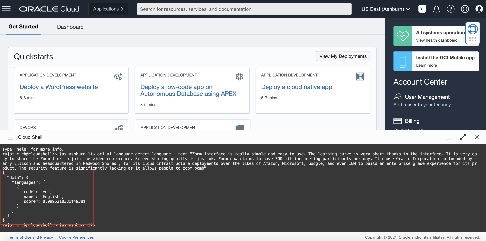

# Lab 2: Access OCI Speech with OCI CLI

## Introduction

OCI Speech can be called from the OCI Command Line Interface (CLI).

In this lab session, we will show several code snippets to access our service with CLI.

You do not need to execute these codes, but review them to understand what information and steps are needed to implement your own integration.

*Estimated Lab Time*: 10 minutes

### Objectives:

* Learn how to use CLI to communicate with our speech service endpoints.

### Prerequisites:
* Have completed Lab #1 policy setup
* Familiar with Python programming is required
* Have a Python environment ready in local
* Familiar with local editing tools, vi and nano
* Installed with Python libraries: `oci` and `requests`
* If you don't have the permission to access the cloud shell, ask your administrator to add the below policy
    ```
    <copy>allow any-user to use cloud-shell in tenancy</copy>
    ```

## CLI Info

The CLI is a small-footprint tool that you can use on its own or with the Console to complete Oracle Cloud Infrastructure tasks. The CLI provides the same core functionality as the Console, plus additional commands. Some of these, such as the ability to run scripts, extend Console functionality.


## **TASK 1:** Navigate to the Cloud Shell

### 1: Navigate to Cloud Shell

Log into OCI Cloud Console. Navigate to Cloud Shell Icon on the top right and click it.
    

### 2: Enter Speech CLI Command

Enter any one of the Speech Pre-Deployed CLI commands you want to execute.
    


### 3: View Result

The Speech service displays the results as shown below:
    


<!-- ## **TASK 3:**To Install CLI in your Local
To install and use the CLI, follow [CLI](https://docs.oracle.com/en-us/iaas/Content/API/Concepts/cliconcepts.htm)


For information about using the CLI, see [Command Line Interface (CLI)](https://docs.oracle.com/iaas/Content/API/Concepts/cliconcepts.htm#Command_Line_Interface_CLI).
For a complete list of flags and options available for CLI commands, see the [Command Line Reference](https://docs.oracle.com/iaas/tools/oci-cli/latest/oci_cli_docs/). -->


## **TASK 2:** Try issuing some of the OCI Speech commands

### 1. Create Transcription Job
Run this command : oci speech transcription-job create -c 
    ```
    <copy>
    oci speech transcription-job create -c ocid1.tenancy.oc1..<unique_ID> --input-location '{
    "location_type": "OBJECT_LIST_INLINE_INPUT_LOCATION",
    "object_locations": [
      {
        "bucket_name": <your_bucket_here>,
        "namespace_name": <namespace_here>,
        "object_names": [
            <object_file_name>
            <object_file_name>
        ]
      }
    ]
  }' --model-details '{"domain": "GENERIC","language_code": "en-US"}' --output-location '{
    "bucket_name": <output_bucket_placeholder>,
    "namespace_name": <namespace_here>,
    "prefix": <job_prefix>
  }' --defined-tags null --description "This is newly created Job from CLI" --display-name "cli_test_job" --freeform-tags null
 
    </copy>
    ```

### 2. Get Transcription Job
Run this command : oci speech transcription-job get
    ```
    <copy>
    oci speech transcription-job get --transcription-job-id ocid1.aispeechtranscriptionjob.oc1..<unique_ID>
    </copy>
    ```

### 3. Gets All Transcription Jobs from a particular compartment
Run this command : oci speech transcription-job list --all --compartment-id
    ```
    <copy> 
    oci speech transcription-job list --all --compartment-id ocid1.tenancy.oc1..<unique_ID>
    </copy>
    ```

### 4. Gets Transcription tasks under given transcription Job Id
Run this command : oci speech transcription-task list --transcription-job-id 
    ```
    <copy>
    oci speech transcription-task list --transcription-job-id ocid1.aispeechtranscriptionjob.oc1..<unique_ID> --all
    </copy>
    ```

### 5. Gets a Transcription Task with given Transcription task id under Transcription Job id
Run this command : oci speech transcription-task get --transcription-job-id <jobID> --transcription-task-id <taskID>
    ```
    <copy>
    oci speech transcription-task get --transcription-job-id ocid1.aispeechtranscriptionjob.oc1..<unique_ID> --transcription-task-id ocid1.aispeechtranscriptiontask.oc1..<unique_ID>
    </copy>
    ```


To know more about CLI, follow [CLI](https://docs.oracle.com/en-us/iaas/Content/API/Concepts/cliconcepts.htm)

Congratulations on completing this lab!

[Proceed to the next section](#next).

## Acknowledgements
* **Authors**
    * Alex Ginella - Oracle AI Services
    * Rajat Chawla  - Oracle AI Services
    * Ankit Tyagi -  Oracle AI Services
* **Last Updated By/Date**
    * Srijon Sarkar  - Oracle AI Services, September 2021
