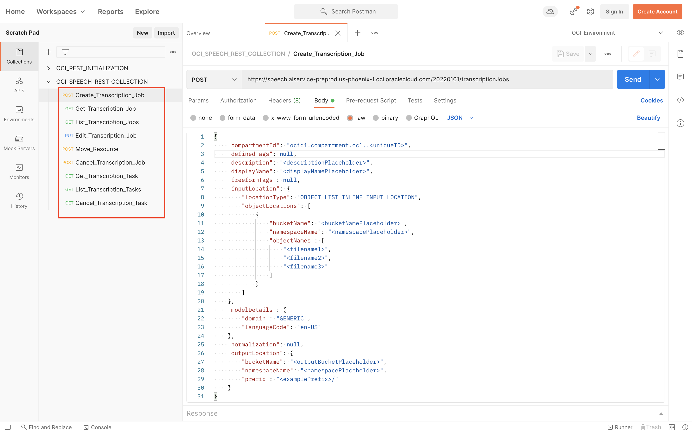

# Lab 4: Access OCI Speech with REST APIs

## Introduction


In this lab session, we will show you how to access OCI Speech using POSTMAN.

Postman is a GUI-based REST API invocation tool that is very popular among developers.

*Estimated Lab Time*: 10 minutes

### Objectives:
* Learn how to access Speech Service through REST APIs.

### Prerequisites:
* Basic knowledge of REST API calls.
* Postman GUI in your local setup. If you don't have POSTMAN, please download it from [POSTMAN](https://www.postman.com/downloads/)

## **TASK 1:** Setting Up Postman for OCI REST APIs
We have provided some scripts and steps below that can be used to allow invoking OCI REST APIs through Postman. Please follow the steps in the order described.

### 1. Import the environment into Postman

Download the [OCI Environment](./files/OCI_Environment.postman_environment.json) and import the environment into Postman using the 'Import' button at the top.
    

Make sure to set OCI_Environment as the active environment.
    

### 2. Set the Variables
Open and edit the newly imported environment (OCI_Environment), and set the variables tenancyId, authUserId, keyFingerprint and private Key. These are same that are found in the .oci/config file you created in the Lab 3.

Make sure to set both Initial Value and Current Value of the variables(set both as the same value).

Click the Save button to commit your changes to the environment.
(sensitive information redacted from below screenshot)
    

### 3. Import the Collections
Download and import [OCI REST INITIALIZATION](./files/OCI_REST_INITIALIZATION.postman_collection.json) and [OCI SPEECH REST COLLECTION](./files/OCI_SPEECH_REST_COLLECTION.postman_collection.json) into Postman using the 'Import' button at the top.

### 4. Execute OCI REST Initializer
From the OCI REST INITIALIZATION collection, invoke the Initializer GET for 'jsrsasign-all-min.js' , which imports and initializes a required library jsrsasign for encryption and digital signatures. This is a one-time setup task. 
    

<!-- ### 5. Add Request in OCI REST COLLECTION

Add Request in the OCI REST COLLECTION Folder


Enter Name and click 'Save to OCI REST COLLECTION'


Just make sure that the OCI REST calls are executed as part of the OCI REST COLLECTION, as that collection contains the necessary javascript code to generate OCI's authentication header -->

## **TASK 2:** Invoke Speech OCI REST APIs

Invoke Speech OCI REST APIs by clicking any one of the requests in the OCI SPEECH REST COLLECTION.
    
Below in the example shown to invoke Create Transcription Job.

Replace all <placeholder> values with the corresponding values of the job you want to create
    

OCI Speech Service EndPoints for all the services:
NOTE: be sure to replace <placeholder> values with actual job values


### <u>Create Transcription Job</u>
Endpoint:
```
<copy>
https://speech.aiservice"".us-phoenix-1.oci.oraclecloud.com/20220101/transcriptionJobs
</copy>
```
Body:
```
<copy>
{
    "compartmentId": "ocid1.compartment.oc1..<uniqueID>",
    "definedTags": null,
    "description": "<descriptionPlaceholder>",
    "displayName": "<displayNamePlaceholder>",
    "freeformTags": null,
    "inputLocation": {
        "locationType": "OBJECT_LIST_INLINE_INPUT_LOCATION",
        "objectLocations": [
            {
                "bucketName": "<bucketNamePlaceholder>",
                "namespaceName": "<namespacePlaceholder>",
                "objectNames": [
                    "<filename1>",
                    "<filename2>",
                    "<filename3>"
                ]
            }
        ]
    },
    "modelDetails": {
        "domain": "GENERIC",
        "languageCode": "en-US"
    },
    "normalization": null,
    "outputLocation": {
        "bucketName": "<outputBucketPlaceholder>",
        "namespaceName": "<namespacePlaceholder>",
        "prefix": "<examplePrefix>/"
    }
}
</copy>
```

### <u>Get Transcription Job</u>
Endpoint:
```
<copy>
https://speech.aiservice.us-phoenix-1.oci.oraclecloud.com/20220101/transcriptionJobs/<transcriptionJobId></copy>
```
### <u>List Transcription Jobs</u>
Endpoint:
```
<copy>
https://speech.aiservice.us-phoenix-1.oci.oraclecloud.com/20220101/transcriptionJobs?compartmentId=<compartmentId></copy>
```
### <u>Edit Transcription Job</u>
Endpoint:
```
<copy>
https://speech.aiservice.us-phoenix-1.oci.oraclecloud.com/20220101/transcriptionJobs/<transcriptionJobId>
</copy>
```
Body:
```
<copy>
{
    "displayName": "<newNameOfJob>",
    "description": "<newDescriptionOfJob>"
}
</copy>
```
### <u>Move Resource</u>
Endpoint:
```
<copy>
https://speech.aiservice.us-phoenix-1.oci.oraclecloud.com/20220101/transcriptionJobs/<transcriptionJobId>/actions/changeCompartment</copy>
```
Body:
```
<copy>
{
    "compartmentId": "<targetCompartmentHere>"
}
</copy>
```
### <u>Cancel Transcription Job</u>
Endpoint:
```
<copy>
https://speech.aiservice.us-phoenix-1.oci.oraclecloud.com/20220101/transcriptionJobs/<transcriptionJobId>/actions/cancel
</copy>
```

### <u>Get Transcription Task</u>
Endpoint:
```
<copy>
https://speech.aiservice.us-phoenix-1.oci.oraclecloud.com/20220101/transcriptionJobs/<transcriptionJobId>/transcriptionTasks/<transcriptionTaskId>
</copy>
```

### <u>Get Transcription Tasks</u>
Endpoint:
```
<copy>
https://speech.aiservice.us-phoenix-1.oci.oraclecloud.com/20220101/transcriptionJobs/<transcriptionJobId>/transcriptionTasks
</copy>
```

### <u>Cancel Transcription Task</u>
Endpoint:
```
<copy>
https://speech.aiservice.us-phoenix-1.oci.oraclecloud.com/20220101/transcriptionJobs/<transcriptionJobId>/transcriptionTasks/<transcriptionTaskId>/actions/cancel
</copy>
```


[Proceed to the next section](#next).


## Acknowledgements
* **Authors**
    * Alex Ginella - Oracle AI Services
    * Rajat Chawla  - Oracle AI Services
    * Ankit Tyagi -  Oracle AI Services
* **Last Updated By/Date**
    * Srijon Sarkar  - Oracle AI Services, September 2021