d#Lab 3: Train Anomaly Detection Model And Detect

## Introduction

In this session, we will show you how to train an anomaly detection model, deploy the model, and make predictions with new data.

***Estimated Lab Time***: 30 minutes

### Objectives

In this lab, you will:
- Learn to train an anomaly detection model with created data asset
- Learn to verify the trained model performance
- Learn to deploy the model to be ready
- Upload testing data to check detection result

### Prerequisites
- A Free tier or paid tenancy account in OCI
- Understand basic model terminology FAP - False Alarm Probability


## **STEP 1:** Create a Model

Creating a model is requiring the 3 actions to kick off training the AD model.

* Select the proper compartment and data asset that we just created.
* Set training parameters
* Train a model

Select the proper compartment(e.g, the compartment matching your name or company name), and then the project you have created.
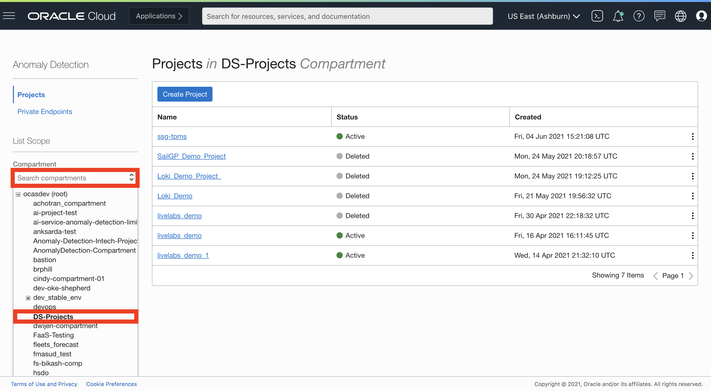

Once the project ad_demo is selected, it will navigate the User to Created Anomaly Detection Project, then click "Create and Train Model".
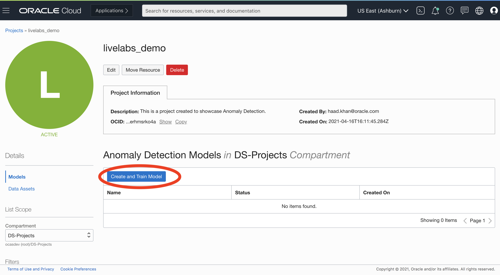

The data asset created in previous lab session should be pop up in the drop down menu. Click "Next" button.
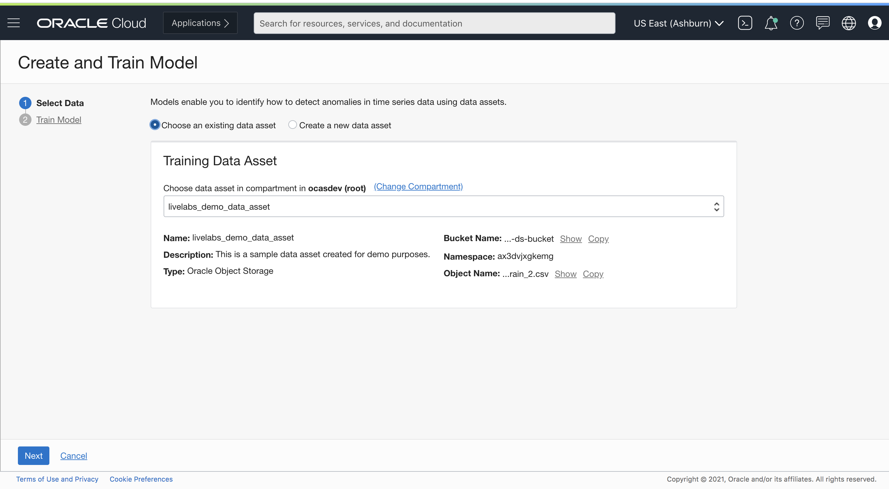

This takes us to "Train Model" form with parameter selections.

We can specify FAP(false alarm probability) and Train Fraction Ratio. The default values for these are 0.01 and 0.7 (implying 70%) respectively.

###FAP (False Alarm Probability)

FAP stands for False Alarm Probability, which is basically the likelihood (percentage) of a timestamp is flagged as anomaly in the clean (anomaly-free) training data. It is calculated at every signal level and then averaged across all signals as the final achieved FAP by our model.  

A model with high FAP means the likelihood of an anomaly flagged by AD service to be a false alarm is high. If this is not desired, depending on the sensitivity requirements of a user, user can specify it to be low.

Typically, FAP can be set to be around the same level of percentage of anomalies in real business scenarios, and a value 0.01 or 1% is relatively appropriate for many scenarios. Also, be aware that if specifying a lower target FAP, the model needs more time to train, and may not achieve to the target FAP.

###How to calculate FAP


**FAP = sum(number of anomalies in each signal) / (number of signals * number of timestamps)**

As can be inferred from the formula, the more the number of false alarms allowed for the model to learn, the higher FAP will be.

###Train Fraction Ratio
Train Fraction Ratio specifies the ratio of the whole training data used for our algorithm to learn the pattern and train the model. The rest (1-ratio) of training data will be used for our algorithm to evaluate and report model performance (e.g., FAP). The default value 0.7 or 70% specifies the model to use 70% of the data for training, and the rest 30% is used to produce model performance.

In this demo data set, the default value for FAP and Train Fraction Ratio are appropriate, we will leave them as is.
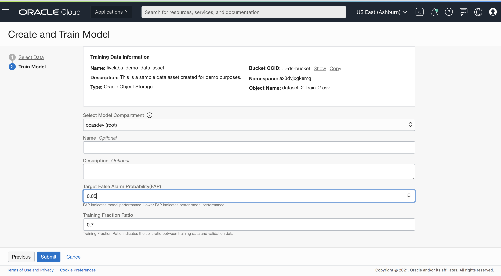

Click Submit. For this demo dataset, it takes **5 minutes** to finish training a model.
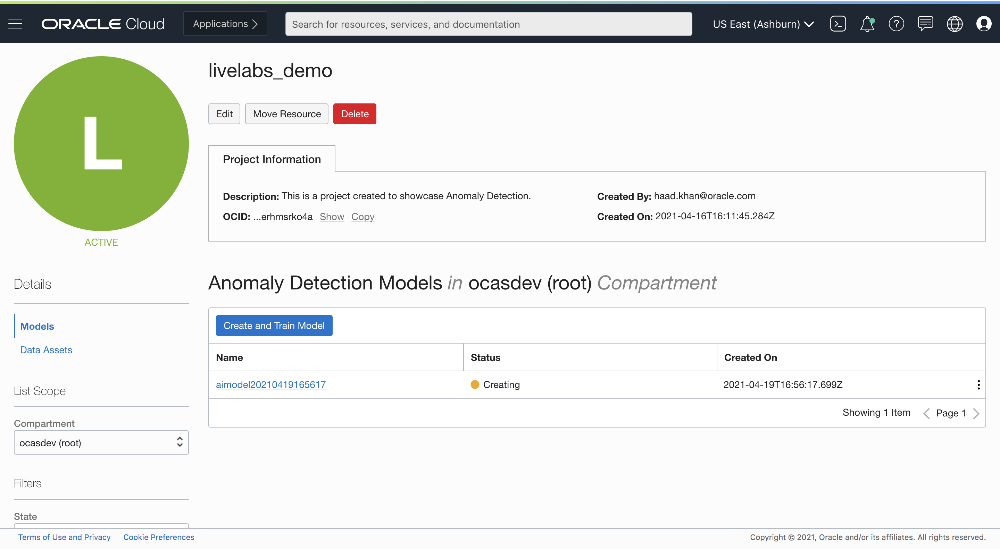

## **STEP 2:** Deploy a Model
Once we have verified that our model is successfully created now it is time to deploy our model.

To initiate the process, click on the model you desire to deploy. It will direct you to the model deployment form
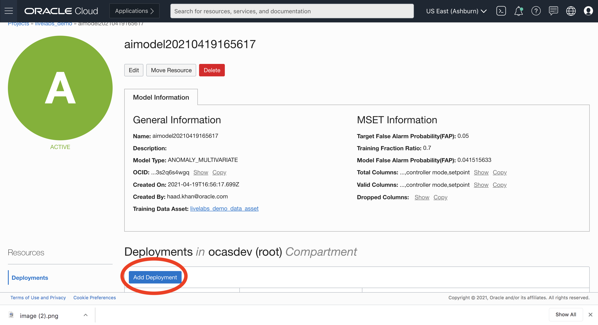

* Click on Add Deployment.
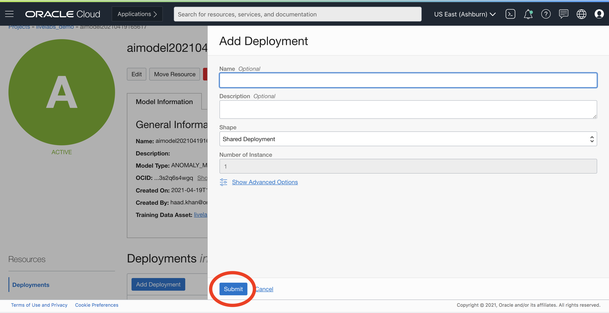

* Click Submit button.

Once the deployment is successful, the model is ready to be used for detecting anomalies.
Select the deployment.

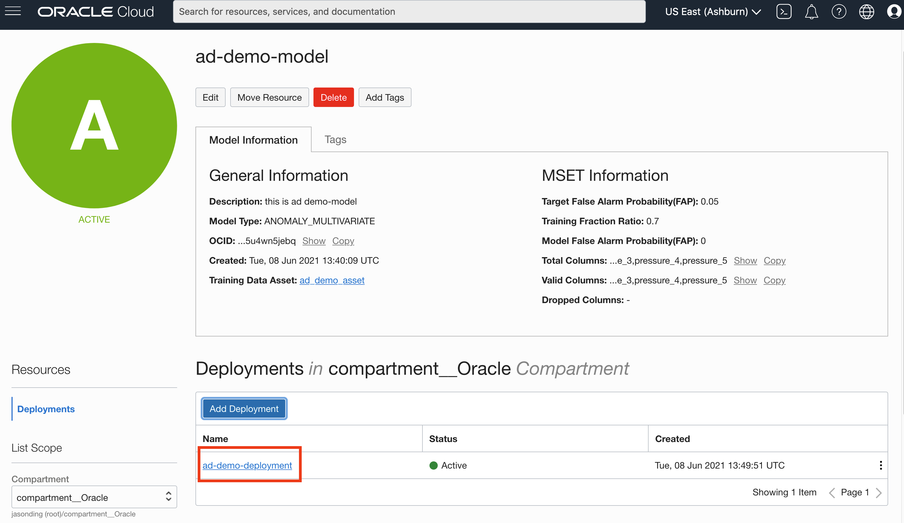

## **STEP 3:** Detect Anomaly with new Data

* Upload to UI
To start the  process of anomaly detection select "Detect Anomalies".


Select a file from local filesystem or drag and drop the desired file.


Now press detect.

* See result in graph
Once the test file is submitted, you have the option to select the column to see anomalies for.
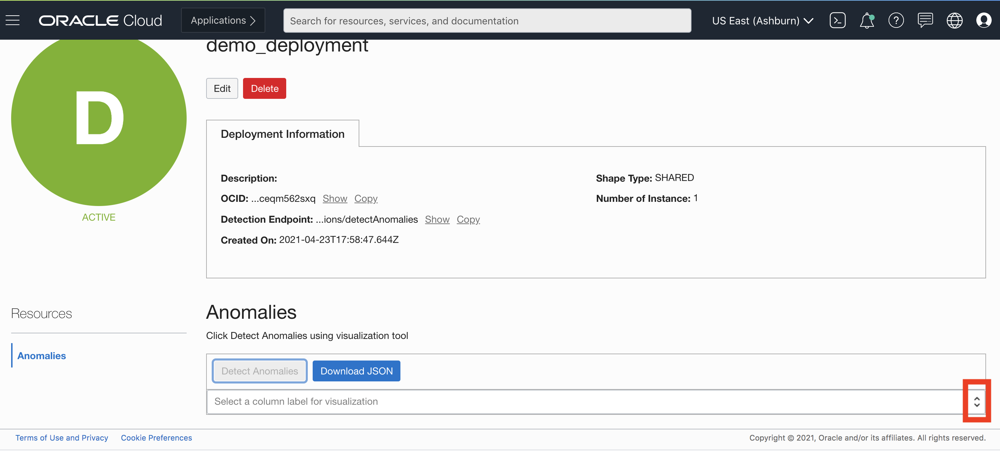

Use the drop wizard to select column. The columns for which the model has detected anomalies will be labelled as such.
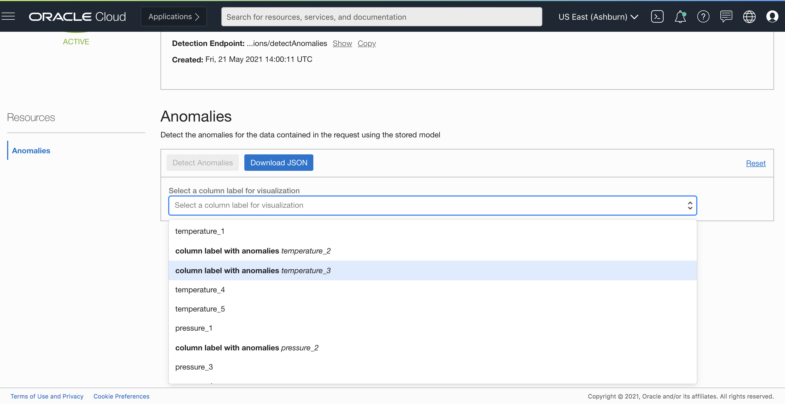

Lets select temperature_3 to see where the model has detected an anomaly.

**Explanation of the Graph**

Each signal in your detection data can be selected to show a separate graph.

In the graph, horizontal axis represents the timestamp, and the vertical axis represents sensor values.

The BLACK curve is the actual data you provided, GREEN curve is the value estimated by our model.

The WHITE background means no anomaly detected, or the RED background means data in that range is detected as anomalies by the model.

You can move your mouse over the graph, the actual value & estimated value at a certain timestamp will show at the upper right corner of the graph.

You can also use the sliding bar under the graph to zoom in/out in different timestamp period.

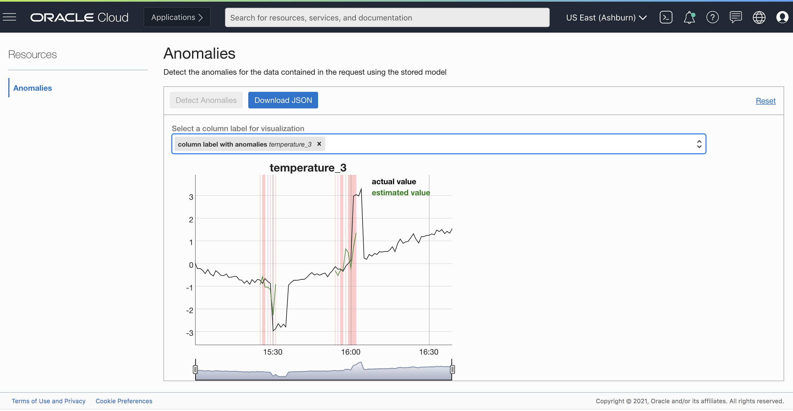


The part of the signal where the model has determined to be an anomaly is highlighted. There is also an option to download the anomaly detection result.

Click the "Download JSON" buton, this will download a file named anomalies.json Lets peek at the contents
 ```json
 {
  "anomalies": {
    "temperature_2": [
      {
        "timestamp": "2019-01-07T21:24:10.000Z",
        "estimatedValue": -1.0369099653879483,
        "actualValue": -1.2668546827677871
      },
      {
        "timestamp": "2019-01-07T21:25:09.000Z",
        "estimatedValue": -1.235158043794402,
        "actualValue": -1.0951845543726701
      },
      {
        "timestamp": "2019-01-07T21:26:02.000Z",
        "estimatedValue": -0.8712109187257178,
        "actualValue": -1.3004140146576293
      },
      {
        "timestamp": "2019-01-07T21:27:02.000Z",
        "estimatedValue": -1.4555483702952539,
        "actualValue": -1.4437079075522783
      },
      {
        "timestamp": "2019-01-07T21:28:10.000Z",
        "estimatedValue": -1.5897761429806785,
        "actualValue": -1.558825042437789
      },
      {
        "timestamp": "2019-01-07T21:29:06.000Z",
        "estimatedValue": -1.6118245257019435,
        "actualValue": -1.6622950856002754
      },
      {
        "timestamp": "2019-01-07T21:30:09.000Z",
        "estimatedValue": -2.422534102791472,
        "actualValue": -2.46873032051319
      },
      {
        "timestamp": "2019-01-07T21:31:07.000Z",
        "estimatedValue": -1.1170899307185704,
        "actualValue": -2.9787643449781758
      },
      {
        "timestamp": "2019-01-07T21:54:02.000Z",
        "estimatedValue": -0.46913836454282665,
        "actualValue": -0.1818702987807544
      },
      {
        "timestamp": "2019-01-07T21:55:04.000Z",
        "estimatedValue": -0.6085697630370803,
        "actualValue": 0.1349151809026957
      },
      {
        "timestamp": "2019-01-07T21:56:03.000Z",
        "estimatedValue": -0.32509987688327835,
        "actualValue": 0.16483956815126233
      },
      {
        "timestamp": "2019-01-07T21:57:03.000Z",
        "estimatedValue": -0.4169997956502778,
        "actualValue": -0.09141636894896348
      },
      {
        "timestamp": "2019-01-07T21:58:05.000Z",
        "estimatedValue": 0.5415503864711994,
        "actualValue": 0.05849590414812823
      },
      {
        "timestamp": "2019-01-07T21:59:03.000Z",
        "estimatedValue": 0.3679455269574995,
        "actualValue": 0.047311577628485355
      },
      {
        "timestamp": "2019-01-07T22:00:03.000Z",
        "estimatedValue": -0.33220940600921467,
        "actualValue": 0.07145888335246428
      },
      {
        "timestamp": "2019-01-07T22:01:03.000Z",
        "estimatedValue": 0.6060950893420641,
        "actualValue": 3.029309810148419
      },
      {
        "timestamp": "2019-01-07T22:02:04.000Z",
        "estimatedValue": 1.1532551181554445,
        "actualValue": 3.038691195904264
      }
    ],
    "temperature_3": [
      {
        "timestamp": "2019-01-07T21:19:03.000Z",
        "estimatedValue": -0.4073596609839182,
        "actualValue": -0.8625880297394809
      },
      {
        "timestamp": "2019-01-07T21:20:04.000Z",
        "estimatedValue": -0.4571406127589782,
        "actualValue": -0.7527052658335041
      },
      {
        "timestamp": "2019-01-07T21:21:10.000Z",
        "estimatedValue": -0.7756912038155248,
        "actualValue": -1.1998935176672367
      },
      {
        "timestamp": "2019-01-07T21:22:02.000Z",
        "estimatedValue": -0.8973406381122566,
        "actualValue": -1.3438788332165472
      },
      {
        "timestamp": "2019-01-07T21:23:09.000Z",
        "estimatedValue": -0.8536656820527129,
        "actualValue": -1.531234044477103
      },
      {
        "timestamp": "2019-01-07T21:24:10.000Z",
        "estimatedValue": -0.8796117947109457,
        "actualValue": -1.6861941415631714
      },
      {
        "timestamp": "2019-01-07T21:25:09.000Z",
        "estimatedValue": -1.1733418024804936,
        "actualValue": -1.9286121501292226
      },
      {
        "timestamp": "2019-01-07T21:26:02.000Z",
        "estimatedValue": -0.7981021223407211,
        "actualValue": -2.171597377067204
      },
      {
        "timestamp": "2019-01-07T21:27:02.000Z",
        "estimatedValue": -1.326381908636695,
        "actualValue": -2.253762405930675
      },
      {
        "timestamp": "2019-01-07T21:28:10.000Z",
        "estimatedValue": -1.39686469824473,
        "actualValue": -2.3941492028804823
      },
      {
        "timestamp": "2019-01-07T21:29:06.000Z",
        "estimatedValue": -1.5377455948563366,
        "actualValue": -2.5713350176048646
      },
      {
        "timestamp": "2019-01-07T21:30:09.000Z",
        "estimatedValue": -2.2280378569032857,
        "actualValue": -2.969391704072731
      },
      {
        "timestamp": "2019-01-07T21:31:07.000Z",
        "estimatedValue": -0.9000745817441772,
        "actualValue": -2.8692496787296853
      },
      {
        "timestamp": "2019-01-07T21:54:02.000Z",
        "estimatedValue": -0.3138576614295762,
        "actualValue": -0.1306604163645831
      },
      {
        "timestamp": "2019-01-07T21:55:04.000Z",
        "estimatedValue": -0.5223729574244983,
        "actualValue": -0.24356808593710755
      },
      {
        "timestamp": "2019-01-07T21:56:03.000Z",
        "estimatedValue": -0.2774910607216509,
        "actualValue": -0.23763427036555224
      },
      {
        "timestamp": "2019-01-07T21:57:03.000Z",
        "estimatedValue": -0.26381393788153223,
        "actualValue": -0.3350101010434371
      },
      {
        "timestamp": "2019-01-07T21:58:05.000Z",
        "estimatedValue": 0.6531658032084661,
        "actualValue": -0.11342634283328369
      },
      {
        "timestamp": "2019-01-07T21:59:03.000Z",
        "estimatedValue": 0.4835100766326755,
        "actualValue": 0.009396930473847816
      },
      {
        "timestamp": "2019-01-07T22:00:03.000Z",
        "estimatedValue": -0.18709759915024488,
        "actualValue": 0.14430348115098618
      },
      {
        "timestamp": "2019-01-07T22:01:03.000Z",
        "estimatedValue": 0.7319274991768888,
        "actualValue": 2.9807631561178547
      },
      {
        "timestamp": "2019-01-07T22:02:04.000Z",
        "estimatedValue": 1.354871765349969,
        "actualValue": 3.049010279530258
      }
    ],
    "pressure_2": [
      {
        "timestamp": "2019-01-07T22:04:03.000+00:00",
        "estimatedValue": 0.5014895636574898,
        "actualValue": 1.6334379720706242
      },
      {
        "timestamp": "2019-01-07T22:05:07.000+00:00",
        "estimatedValue": -0.5285874553724151,
        "actualValue": 1.4661385443962462
      },
      {
        "timestamp": "2019-01-07T22:06:05.000+00:00",
        "estimatedValue": -1.1663263985023549,
        "actualValue": 0.0490478171262037
      },
      {
        "timestamp": "2019-01-07T22:07:06.000+00:00",
        "estimatedValue": -2.347703439766484,
        "actualValue": -3.1899739406153196
      },
      {
        "timestamp": "2019-01-07T22:08:08.000+00:00",
        "estimatedValue": -0.7656199601912647,
        "actualValue": -0.7961303437489068
      },
      {
        "timestamp": "2019-01-07T22:09:10.000+00:00",
        "estimatedValue": -1.0094694332479368,
        "actualValue": 0.6997339833791824
      },
      {
        "timestamp": "2019-01-07T22:10:05.000+00:00",
        "estimatedValue": -0.8479968141425986,
        "actualValue": -0.8644751237229334
      },
      {
        "timestamp": "2019-01-07T22:11:03.000+00:00",
        "estimatedValue": 2.6883284144256523,
        "actualValue": 9.637427929543756
      },
      {
        "timestamp": "2019-01-07T22:12:02.000+00:00",
        "estimatedValue": 2.7912052622701147,
        "actualValue": 8.636504808483837
      },
      {
        "timestamp": "2019-01-07T22:13:05.000+00:00",
        "estimatedValue": 3.2019284312239877,
        "actualValue": 7.592321707893466
      }
    ]
  }
}
 ```

We see that the results for all the anomalies are within their own key. And each value is a further a tuple that contains the timestamp, actual value and what the model expects the value to be.

In the results, pay attention to the difference between the estimatedValue and actualValue. Generally, some differences are expected from model expected to actual values. In this particular example, values are what the AD service predicted to be anomalous.

**Congratulations on completing this lab!**

You now have completed the full cycle of using the training data to create a model and deploy, and also making predictions with testing data.

The next 2 sessions are optional for advanced users, which cover the topic on using REST API to integrate our services and how to prepare the training and testing data from raw data in different scenarios.

[Proceed to the next section](#next).

## Acknowledgements

* **Authors**
    * Jason Ding - Principal Data Scientist - Oracle AI Services
    * Haad Khan - Senior Data Scientist - Oracle AI Services
* **Last Updated By/Date**
    * Jason Ding - Senior Data Scientist, June 2021
