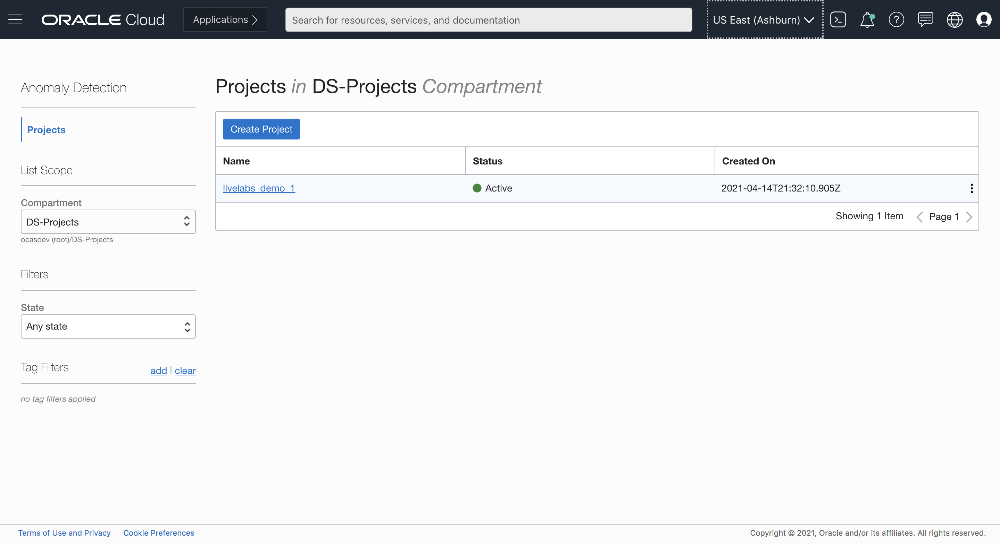
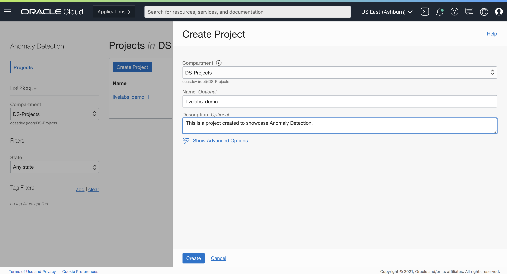
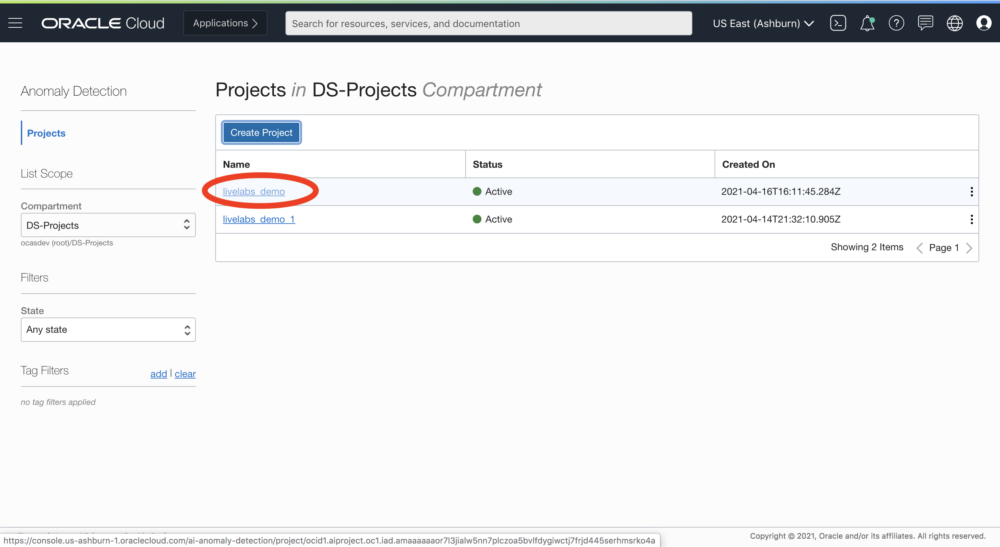
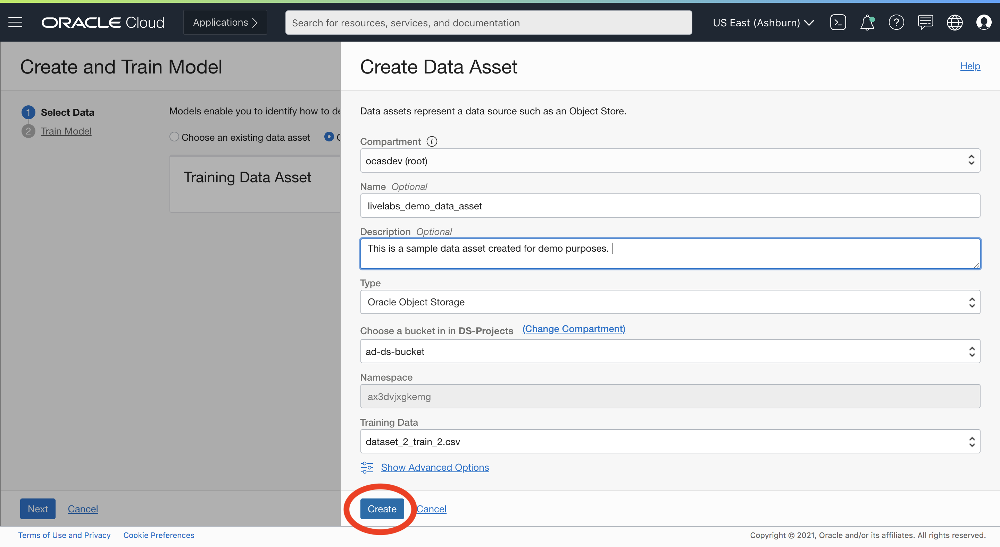

# Lab 3: Create AD Project

## Introduction
## Create a Project
Logon to OCI Console. Using the Burger Menu, Navigate to Artificial Intelligence and select Anomaly Detection.

Clicking the Anomaly Detection Option will navigate one to the Anomaly Detection Console. Once here, select Create Project.

The Create Project button navigates User to a form where they can specify the compartment in which to create an Anomaly Detection Project. The project we create here is named livelabs_demo.

Once the details are entered click the Create Button. If the project is successfully created it will show up in projects pane. From here onwards, select livelabs_demo.

## Upload Data to Object Storage
screenshot

## Create a Data Asset
The Create and Train Model will take the User to a form where they have the option to either choose an existing dataset or create a new dataset. Select `Create a new dataset` radio button.

Create a new dataset navigates the User to a form, where they can specify the compartment of Object storage that houses the data. Select Create Button.

