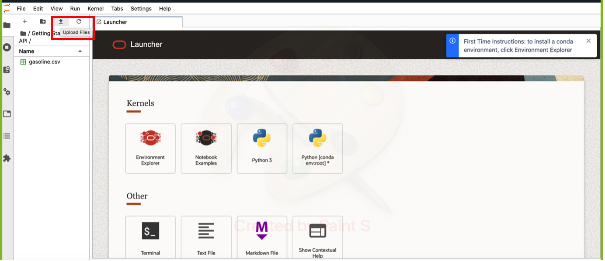

# Lab 2: Understand Data, Download Samples, Prepare data, Create Project

## Introduction

Due to the nature of time-series forecast, the data required for training any machine learning algorithm needs to be formatted properly. Similarly here, our core ML algorithm behind our service has few basic requirements on the data to train an effective model.

In this session, we will discuss the data requirements and formats, and provide sample dataset as examples. 


***Estimated Lab Time***: 20 minutes

### Objectives

In this lab, you will:
- Understand the data requirements and data formats for training model and forecast 
- Be able to download prepared sample datasets
- Upload the downloaded dataset into Data Science Notebook Session

### Prerequisites
- A Free tier or paid tenancy account in OCI

## Task 1: Understand Data Requirements

The core of forecasting is an auto ML solution with multiple univariate/ multivariate algorithms that can run on single series or multiple series at once. 

* The training data should have a target series with date and target values defined.
* The training data can have an additional covariates that can help, to forecast target series.

Additionally, the algorithm also has some requirements on data type, minimum number of  attributes and observations on the training data as follows:

* Number of rows >= 10 and <= 5000
* Series length >= 3 X Forecast Horizon
* Series length >= 2 X Major Seasonality
* If the series is non-seasonal, at least one non-seasonal method needs to be available for running
* If ensemble method is selected, at least 2 other methods need to be selected as well
* Number of missing values <= 10% of series length
* If there are missing values for 5 consecutive time steps, throw an error
* All the timestamps in the primary data source should exist in the secondary data source also the number of rows in the additional data source should be equal to the number of rows in the primary data source + forecast horizon size (adjusted by input and output frequency).
* Check is there any duplicate date exists in Timeseries after grouping also(Check for both additional and primary data)
* All values have to be >= 0

### Data format requirement

The service currently accepts *Inline Data* that can be generated from csv files.
Detailed document on how to generate inline data from csv file can be referred in Task 3 below 

The data should only contain one timestamp and other numeric attributes, and timestamp has to be the first column, which satisfy the [ISO 8601 format](https://en.wikipedia.org/wiki/ISO_8601).

#### CSV format
CSV-formatted data should have comma-separated lines, with first line as the header, and other lines as data. Note the first column is the timestamp column.

**Note:**
* Missing value is permitted(with empty), data is sorted by timestamp, and boolean flag values should be converted to numeric (0/1).
* Do not have a new line as the last line. The last line should still be an observation with other attributes/signals.

Here is an example of CSV-formatted data:
```csv
timestamp,target
2020-07-13T00:00:00Z,20
2020-07-14T00:00:00Z,30
2020-07-15T00:00:00Z,28
```

## Task 2: Download Sample Data

Here is a sample dataset to help you to easily understand how the training data looks like, Download the files to your local machine.

* [training csv data](../files/gasoline.csv)
    - gasoline purchase column (target to be forecasted) & period column (timestamp) with 31 observations

## Task 3: Upload Data to Data Science Notebook

You need to upload the sample training data into data science notebook, to be used for *inline data* preparation for model training in next steps.

Click on upload and then browse to file which you desire to upload:


Here, we selected Gasoline  purchase data csv file to be uploaded


## Task 4: Inline Data preparation

### Step 1 :
You need to load the data in notebook via below mentioned python commands in a data frame
Specify the correct path for the csv file that has the time series data.

```Python
df = pd.read_csv('gasoline.csv')
```

### Step 2 :
Convert the date field to "yyyy-mm-dd hh:mm:ss" format with below commands
Use this link https://docs.python.org/3/library/datetime.html#strftime-and-strptime-behavior for other date time formats

```Python
df['period'] = pd.to_datetime(df['period'],format='%d/%m/%y').apply(lambda x: str(x))
```

### Step 3 :
#### Setting variables to create forecast with below commands
- Specify the column having dates in date_col
- Specify the time-series of interest in target_col
- prim_load : is the variable having inline data

```Python
date_col = 'period'
target_col = 'gasoline purchase'
prim_load = df[[date_col,target_col]].values.transpose().tolist()
prim_load
```

```Json
[['2021-01-01 00:00:00',
  '2021-01-02 00:00:00',
  '2021-01-03 00:00:00',
  '2021-01-04 00:00:00',
  '2021-01-05 00:00:00',
  '2021-01-06 00:00:00',
  '2021-01-07 00:00:00',
  '2021-01-08 00:00:00',
  '2021-01-09 00:00:00',
  '2021-01-10 00:00:00',
  '2021-01-11 00:00:00',
  '2021-01-12 00:00:00',
  '2021-01-13 00:00:00',
  '2021-01-14 00:00:00',
  '2021-01-15 00:00:00',
  '2021-01-16 00:00:00',
  '2021-01-17 00:00:00',
  '2021-01-18 00:00:00',
  '2021-01-19 00:00:00',
  '2021-01-20 00:00:00',
  '2021-01-21 00:00:00',
  '2021-01-22 00:00:00',
  '2021-01-23 00:00:00',
  '2021-01-24 00:00:00',
  '2021-01-25 00:00:00',
  '2021-01-26 00:00:00',
  '2021-01-27 00:00:00',
  '2021-01-28 00:00:00',
  '2021-01-29 00:00:00',
  '2021-01-30 00:00:00'],
 [275,
  291,
  307,
  281,
  295,
  268,
  252,
  279,
  264,
  288,
  302,
  287,
  290,
  311,
  277,
  245,
  282,
  277,
  298,
  303,
  310,
  299,
  285,
  250,
  260,
  245,
  271,
  282,
  302,
  285]]
  ```


## Task 5 : Create Project ID forecast
Once, the data is prepared , you  will learn how to create the forecasting service project
- Give any compartment ID that is available for the account
- Create new project
- Change displayName to - Give a custom name


**Note** : It is not needed to create new projects everytime we run this notebook. A project id once created can be used again and again.

```Python
url = "https://forecasting.---------------------.oraclecloud.com/20220101/projects"

payload = json.dumps({
  "displayName": "Forecast API Demo",
  "compartmentId": "ocid-------------------",
  "description": "Forecasting service API Demo",
  "freeformTags": None,
  "definedTags": None,
  "systemTags": None
})
headers = {
  'Content-Type': 'application/json'
}
response = requests.request("POST", url, headers=headers, data=payload, auth=auth)
create_project_response = json.loads(response.text)
create_project_response
```

```Json
{"id":"ocid.forecastproject..-----------",
"displayName":"Forecast API Demo",
"compartmentId":"ocid.tenancy.----------",
"description":"Forecasting service API Demo",
"timeCreated":"2021-11-18T05:18:58.737Z",
"timeUpdated":"2021-11-18T05:18:58.737Z",
"lifecycleState":"ACTIVE",
"freeformTags":{},
"definedTags":{"Oracle-Tags":{"CreatedBy":"demo_user_2","CreatedOn":"2021-11-18T05:18:58.568Z"}},"systemTags":{}}
```

Congratulations on completing this lab!

[Proceed to the next section](#next).


## Acknowledgements
* **Authors**
    * Ravijeet Kumar - Senior Data Scientist - Oracle AI Services
    * Anku Pandey - Data Scientist - Oracle AI Services
    * Sirisha Chodisetty - Senior Data Scientist - Oracle AI Services
    * Sharmily Sidhartha - Principal Technical Program Manager - Oracle AI Services
