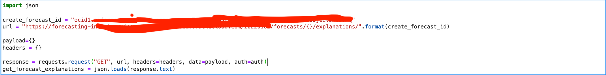
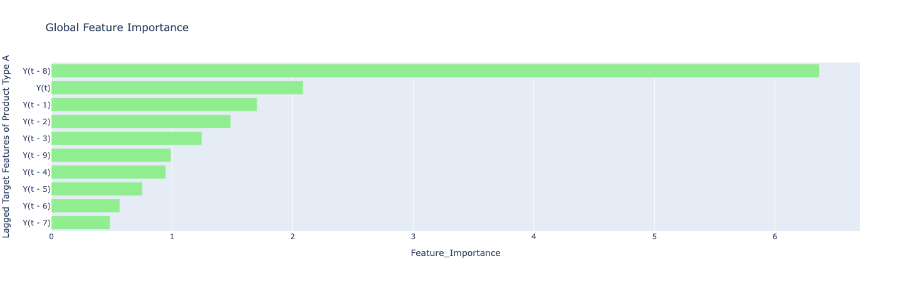
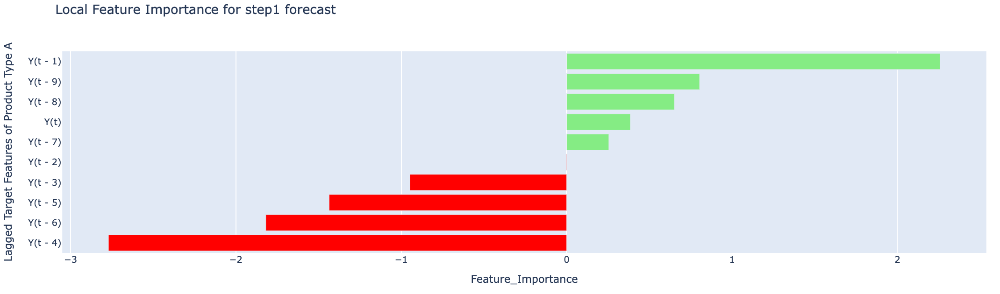

# Lab 4: Get Explainability for Forecast

## Introduction

Forecast will also give explainability for each of the target time series in the dataset. Explainability report includes both global and local level explanations. Explanations provides insights on the features that are influencing the forecast. Global explanation represents the general model behaviour - e.g., which features does the model consider important ? Local explanation tells the impact of each feature at a single time step level. Forecast provides local explanations for all the forecasts that it generates

In this session, we will discuss how to get global and local explanation for the best model chosen by forecast, inorder to understand the features that are influencing the forecast

Here is a case study on using the forecast api to get the global and local explanations

***Estimated Lab Time***: 15 minutes

### Objectives
In this lab, you will:
- learn how to generate global explanation
- learn how to generate local explanation for all the time steps in the forecast forizon

### Prerequisites
- Forecast ID from the create forecast API

### Task 1: Get Global Explanation

### Step 1. Call the explanation API as shown below



### Step 2. Sample Json ouput

#### JSON Format
The JSON format is also straight-forward, it contains a key `globalFeatureImportance` listing all the influencing features and their feature importance scores. 

```Json
{
    "objectStoreDetails": null,
  "explanations": [
    {
      "targetColumn": "gasoline purchase",
      "bestModel": "HoltWintersAdditiveMethod",
      "bestHyperParameters": {
        "hyperParameters": {
          "frequencyOfSeasonality": 9,
          "alpha": 0.12953689187153627,
          "beta": 0.001,
          "gamma": 0.04183519693490505
        }
      },
      "hyperparameterSearchMethod": "NLOPT",
      "bestModelSelectionMetric": "SMAPE",
      "modelValidationScheme": "ROCV",
      "globalFeatureImportance": {
        "influencingFeatures": {"Y(t - 8)": 6.368269, "Y(t - 9)": 0.9920104, "Y(t - 4)": 0.9487139, 
        "Y(t - 5)": 0.75489503, "Y(t - 6)": 0.56687367, "Y(t - 7)": 0.48659593, "Y(t)": 2.0871973, 
        "Y(t - 1)": 1.7058487, "Y(t - 2)": 1.4861954, "Y(t - 3)": 1.2476459
        }
      },
      "localFeatureImportance": {
        "forecastHorizon": 7,
        "influencingFeatures": [
          {
            "Y(t - 8)": 1.3487852, "Y(t - 9)": 0.7856572, "Y(t - 4)": -2.7679126, "Y(t - 5)": -1.4348975, 
            "Y(t - 6)": -1.8177031, "Y(t - 7)": 0.14667921, "Y(t)": 0.38467708, "Y(t - 1)": 2.2558856,
            "Y(t - 2)": -0.0032815093, "Y(t - 3)": -0.94642097
          },
          {
            "Y(t - 8)": 0.65153044, "Y(t - 9)": 0.80354553, "Y(t - 4)": -2.770662, "Y(t - 5)": -1.43632,
            "Y(t - 6)": -1.8195009, "Y(t - 7)": 0.25485802, "Y(t)": 0.38506135, "Y(t - 1)": 2.2581365,
            "Y(t - 2)": -0.0032847794, "Y(t - 3)": -0.94736266
          },
          {
            "Y(t - 8)": 0.66255754, "Y(t - 9)": 0.8192477, "Y(t - 4)": -2.7734115, "Y(t - 5)": -1.4377425,
            "Y(t - 6)": -2.9878244, "Y(t - 7)": 0.1329602, "Y(t)": 0.38544565, "Y(t - 1)": 2.2603877, 
            "Y(t - 2)": -0.0032880495, "Y(t - 3)": -0.9483044
          },
          {
            "Y(t - 8)": 0.6722584, "Y(t - 9)": 0.8330451, "Y(t - 4)": -2.7761607, "Y(t - 5)": -2.2415307,
            "Y(t - 6)": -1.6718373, "Y(t - 7)": 0.13490732,  "Y(t)": 0.38582996, "Y(t - 1)": 2.2626388,
            "Y(t - 2)": -0.0032913196, "Y(t - 3)": -0.9492461
          },
          {
            "Y(t - 8)": 0.6808036, "Y(t - 9)": 0.8451827, "Y(t - 4)": -4.127516, "Y(t - 5)": -1.3365475,
            "Y(t - 6)": -1.6930972, "Y(t - 7)": 0.13662253, "Y(t)": 0.38621426, "Y(t - 1)": 2.2648897,
            "Y(t - 2)": -0.00329459, "Y(t - 3)": -0.95018786
          },
          {
            "Y(t - 8)": 0.6883419, "Y(t - 9)": 0.85587406, "Y(t - 4)": -2.6067908, "Y(t - 5)": -1.3513565,
            "Y(t - 6)": -1.7118533, "Y(t - 7)": 0.13813569, "Y(t)": 0.38659853, "Y(t - 1)": 2.2671409,
            "Y(t - 2)": -0.00329786, "Y(t - 3)": -1.3529193
          },
          {
            "Y(t - 8)": 0.6950028, "Y(t - 9)": 0.86530524, "Y(t - 4)": -2.63204, "Y(t - 5)": -1.3644432,
            "Y(t - 6)": -1.7284274, "Y(t - 7)": 0.13947278, "Y(t)": 0.38698283, "Y(t - 1)": 2.2693918,
            "Y(t - 2)": -0.004514997, "Y(t - 3)": -0.8999726
          }
        ]
      }
    }
  ],
  "freeformTags": {},
  "definedTags": {
    "Oracle-Tags": {
      "CreatedBy": "fc-mcs-team",
      "CreatedOn": "2021-11-24T05:02:45.943Z"
    }
  },
  "systemTags": {}
}
```
### Step 3. Plotting the global feature importance 

Here is a simple function to plot the global feature importance from the above json output.

```Python
import plotly.express as px
import plotly.graph_objects as go

def plot_global_feature_importance(explanation_json):
    df = pd.DataFrame()
    global_feature_importance = explanation_json['explanations'][0]
                                                ['globalFeatureImportance']['influencingFeatures']
    df['Feature_Importance'] = global_feature_importance.values()

    feature_names = global_feature_importance.keys()
    df['Lagged Target Features of Product Type A'] = feature_names

    title = "Global Feature Importance "
    
    fig = px.bar(df, y="Lagged Target Features of Product Type A", 
                x='Feature_Importance', title=title).update_yaxes(categoryorder = "total ascending")
    fig.update_traces(marker_color='lightgreen')
    fig.show()
```

### Sample Global feature importance plot



### Task 2: Get Local Explanation

To get local explanation, there is no seperate api call required. The api call for get explanation will fetch both global and local explanations

To get local explanation, the key `localFeatureImportance` in the json output contains all the influencing features and their feature importance scores for all the time steps in the forecast horizon

### Step 1. Plotting the local feature importance 

Here is a simple function to plot the local feature importance from the above json output.

```Python
import plotly.express as px
import plotly.graph_objects as go
import numpy as np

def plot_local_feature_importance(explanation_json, time_step):
    df = pd.DataFrame()
    local_feature_importance = get_forecast_explanations['explanations'][0]['localFeatureImportance']
                                                        ['influencingFeatures'][time_step]
    df['Feature_Importance'] = local_feature_importance.values()
    feature_names = local_feature_importance.keys()
    df['Lagged Target Features of Product Type A'] = feature_names
    df["Color"] = np.where(df["Feature_Importance"]<0, 'Negative', 'Positive')

    title = "Local Feature Importance for step" + str(time_step) + " forecast " 
    fig = px.bar(df, y="Lagged Target Features of Product Type A", x='Feature_Importance', 
                 title=title, color='Color',  color_discrete_map={ 'Negative': 'red', 
                 'Positive': 'lightgreen'}).update_yaxes(categoryorder = "total ascending")
    fig.show()
```

### Sample Local feature importance plot for step 1 forecast



Similarly, by changing the time step, you can get the local feature importance for that corresponding forecast

Congratulations on completing this lab! You now have finished all the sessions of this lab, please feel free to contact us if any additional questions.


## Acknowledgements
* **Authors**
    * Ravijeet Kumar - Senior Data Scientist - Oracle AI Services
    * Anku Pandey - Data Scientist - Oracle AI Services
    * Sirisha Chodisetty - Senior Data Scientist - Oracle AI Services
    * Sharmily Sidhartha - Principal Technical Program Manager - Oracle AI Services
