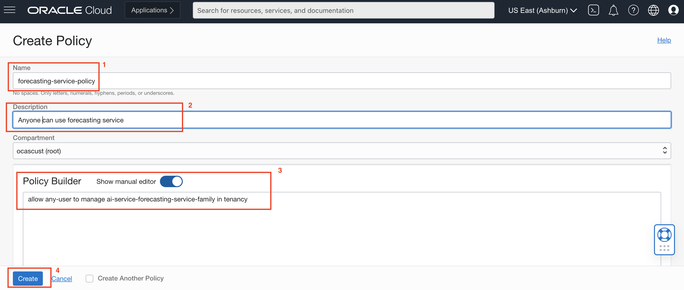

# Get Started

## Introduction

Before you get started, you will need an Oracle Cloud account.
If you don't have an existing account, you can sign up [here.](https://signup.cloud.oracle.com)

### Existing Cloud Accounts

If you already have access to an Oracle Cloud account, including an Oracle Cloud account through [Oracle Universal Credits](https://docs.oracle.com/en/cloud/get-started/subscriptions-cloud/csgsg/universal-credits.html), follow the steps in **Task 1** to sign in.

*Estimated Time*: 5 minutes

### Objectives:

*	Set up Oracle Cloud account and get relevant permissions

### Prerequisites:
*	For existing Oracle Cloud accounts , you would need credentials to log in
  

## Task 1: Sign in to Your Account

1.  Go to [cloud.oracle.com](https://cloud.oracle.com) and Enter your Cloud Account Name and click **Next**. This is the name you chose while creating your account in the previous section. It's NOT your email address. If you've forgotten the name, see the confirmation email.
    

2.  Expand the arrow after *"Oracle Cloud Infrastructure Direct Sign-In"* to reveal the login input fields. 
    **Note:** Don't use SSO option. Use the Direct Sign-in.  

    

3.  Enter your Cloud Account credentials and click **Sign In**. Your username is your email address. The password is what you chose when you signed up for an account.

    

4.  You are now signed in to Oracle Cloud!

    

## Task 2: Set Up Policy

In order for users to create and manage the resources used in Forecasting service, the administrators of the tenancy need to add proper policy to grant permissions to users.

1.  Navigate to Policies

    Log into OCI Cloud Console. Using the Burger Menu on the top left corner, navigate to Identity & Security and click it, and then select Policies item under Identity.

    

2.  Create Policy

    Click Create Policy button.
    
    **Note: only tenancy administrators or user in administrator group have permissions to create new policies.**


    

3.  Create a new policy with the following statements:

    If you want to allow all the users in your tenancy to use forecasting service. Create a new policy with the below statement:

    ```
    <copy>allow any-user to manage ai-service-forecasting-service-family in tenancy</copy>
    ```

    

    If you want to limit access to a user group, you can create a new policy with the below statement:

    ```
    <copy> allow group <group-name> to manage ai-service-forecasting-service-family in tenancy</copy>
    ```
You may now proceed to the next lab

## **Acknowledgements**
* **Authors**
    * Ravijeet Kumar - Senior Data Scientist - Oracle AI Services
    * Anku Pandey - Data Scientist - Oracle AI Services
    * Sirisha Chodisetty - Senior Data Scientist - Oracle AI Services
    * Sharmily Sidhartha - Principal Technical Program Manager - Oracle AI Services
    * Last Updated By/Date: Ravijeet Kumar, 19th-January 2022
