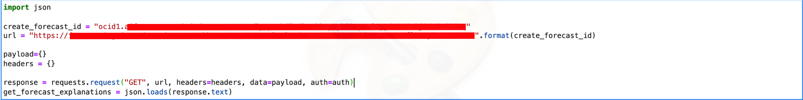
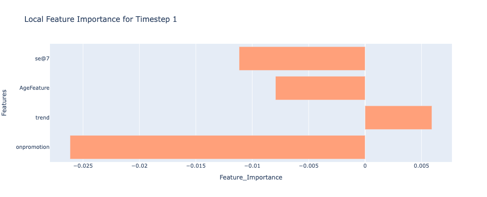

# Lab 4: Get Explainability for Forecast

## Introduction

Forecast will also give explainability for each of the target time series in the dataset. Explainability report includes both global and local level explanations. Explanations provides insights on the features that are influencing the forecast. Global explanation represents the general model behaviour - e.g., which features does the model consider important ? Local explanation tells the impact of each feature at a single time step level. Forecast provides local explanations for all the forecasts that it generates

In this session, we will discuss how to get global and local explanation for the best model chosen by forecast, inorder to understand the features that are influencing the forecast

Here is a case study on using the forecast api to get the global and local explanations

***Estimated Time***: 15 minutes

### Objectives
In this lab, you will:
* Learn how to generate global explanation
* Learn how to generate local explanation for all the time steps in the forecast forizon

### Prerequisites
* You have completed all the task in Lab 3

## Task 1: Get Global Explanation

1. Call the explanation API using below code as shown below:
    ```Python
    url = "https://forecasting----.------.------.---.oraclecloud.com/20220101/forecasts/{}/explanations/".format(create_forecast_id)

    payload={}
    headers = {}
    response = requests.request("GET", url, headers=headers, data=payload, auth=auth)
    get_forecast_explanations = json.loads(response.text)
    get_forecast_explanations
    ```

    

    
2. Sample Json ouput

    The JSON format is also straight-forward, it contains a key `globalFeatureImportance` listing all the influencing features and their feature importance scores. 

    ```Json
    {'objectStoreDetails': None,
    'explanations': [{'targetColumn': '13_BEVERAGES',
      'bestModel': 'PROPHET',
      'bestHyperParameters': {'changepoint_range': '0.9000000000000001',
        'seasonality_mode': 'additive',
        'changepoint_prior_scale': '0.21544346900318823',
        'seasonality_prior_scale': '0.09068284513434938',
        'holidays_prior_scale': '0.021544346900318832'},
      'hyperparameterSearchMethod': 'OPTUNA',
      'bestModelSelectionMetric': 'RMSE',
      'modelValidationScheme': 'ROCV',
      'globalFeatureImportance': {'influencingFeatures': {'onpromotion': 118.36533,
        'trend': 0.8626744,
        'se@7': 132.8267}},
      'localFeatureImportance': {'forecastHorizon': 14,
        'influencingFeatures': [{'onpromotion': 121.38914,
          'trend': 1.7426023,
          'se@7': -128.58055},
        {'onpromotion': -68.8318, 'trend': 1.7771093, 'se@7': -204.31053},
        {'onpromotion': -118.14834, 'trend': 1.8116163, 'se@7': 47.606293},
        {'onpromotion': 177.7509, 'trend': 1.8461232, 'se@7': 293.2125},
        {'onpromotion': 43.89172, 'trend': 1.8806303, 'se@7': 133.56232},
        {'onpromotion': -47.69614, 'trend': 1.9151372, 'se@7': -71.62683},
        {'onpromotion': -174.5101, 'trend': 1.9496442, 'se@7': -60.430515},
        {'onpromotion': -26.56048, 'trend': 1.9841512, 'se@7': -128.58055},
        {'onpromotion': -153.37444, 'trend': 2.0186582, 'se@7': -204.31053},
        {'onpromotion': -160.41966, 'trend': 2.0531652, 'se@7': 47.606293},
        {'onpromotion': 57.98216, 'trend': 2.0876722, 'se@7': 293.2125},
        {'onpromotion': -104.0579, 'trend': 2.122179, 'se@7': 133.56232},
        {'onpromotion': -33.605698, 'trend': 2.156686, 'se@7': -71.62683},
        {'onpromotion': -111.10312, 'trend': 2.191193, 'se@7': -60.430515}]}}],
    'freeformTags': {},
    'definedTags': {'Oracle-Tags': {'CreatedBy': 'demo_user',
      'CreatedOn': '2021-12-14T09:17:08.153Z'}},
    'systemTags': {}}
    ```
*The above explanation shows features contributing towards the model output/prediction from the base value. The base value is nothing but the average model output computed over most recent 100 time steps in the training data. If the dataset size is less than 100, then the base value is computed over the whole dataset. The features which have positive feature importance scores, push the prediction higher and the features that have negative feature importance scores, push the prediction lower. The feature importance scores are raw scores and those features with high in magnitude influence the prediction most and the sign of the scores indicates whether the influence is positive or negative.*

3. Plotting the global feature importance 

    Here is a simple function to plot the global feature importance from the above json output.

    ```Python
    import plotly.express as px
    import plotly.graph_objects as go

    def plot_global_feature_importance(get_forecast_explanations):
        global_feature_importance = get_forecast_explanations['explanations'][0]['globalFeatureImportance']['influencingFeatures']
        df_imps = pd.DataFrame()
        df_imps['Feature_Importance'] = global_feature_importance.values()

        feature_names = global_feature_importance.keys()
        df_imps['Features'] = feature_names

        title = "Global Feature Importance "
        fig = px.bar(df_imps, y="Features", x='Feature_Importance', 
                    title=title).update_yaxes(categoryorder = "total ascending")
        fig.update_traces(marker_color='lightsalmon')
        fig.show()

    plot_global_feature_importance(get_forecast_explanations)
    ```

  ### Sample Global feature importance plot

  

## Task 2: Get Local Explanation

  To get local explanation, there is no seperate api call required. The api call for get explanation will fetch both global and local explanations.
  The key `localFeatureImportance` in the json output contains all the influencing features and their feature importance scores for all the time steps in the forecast horizon

1. Plotting the local feature importance 

    Here is a simple function to plot the local feature importance from the above json output.

    ```Python
    import plotly.express as px
    import plotly.graph_objects as go
    import numpy as np

    def plot_local_feature_importance(get_forecast_explanations, time_step):
        df_imps = pd.DataFrame()
        local_feature_importance = get_forecast_explanations['explanations'][t]['localFeatureImportance']['influencingFeatures'][time_step]
        df_imps['Feature_Importance'] = local_feature_importance.values()

        feature_names = local_feature_importance.keys()
        df_imps['Features'] = feature_names

        title = "Local Feature Importance for Timestep " + str(time_step)
        fig = px.bar(df_imps, y="Features", x='Feature_Importance', title=title)
        fig.update_traces(marker_color='lightsalmon')
        fig.show()

    plot_local_feature_importance(get_forecast_explanations, time_step)
    ```

    ### Sample Local feature importance plot for step 1 forecast

    

    Similarly, by changing the time step, you can get the local feature importance for that corresponding forecast.

Congratulations on completing this lab! You now have finished all the sessions of this lab, please feel free to contact us if any additional questions.


## Acknowledgements
* **Authors**
    * Ravijeet Kumar - Senior Data Scientist - Oracle AI Services
    * Anku Pandey - Data Scientist - Oracle AI Services
    * Sirisha Chodisetty - Senior Data Scientist - Oracle AI Services
    * Sharmily Sidhartha - Principal Technical Program Manager - Oracle AI Services
    * Last Updated By/Date: Ravijeet Kumar, 19th-January 2022
