# Lab 5: Learn how to access Forecast Service from OCI Console

## Introduction

In this session, we will show you how to create the forecast project, upload data into object storage, create the data assets , train model , get forecasts and predictions intervals for the forecast horizon from OCI console 

***Estimated Time***: 20 minutes

### Objectives

In this lab, you will:
- Learn how to set up pre-requisites for using console
- Learn the data requirements and download data
- Learn how to create a forecast project from console
- Learn how to upload data into Oracle object storage
- Learn how to create data asset to refer data in Oracle object storage
- Learn to train a forecasting model with created data asset
- Explore forecast results and prediction intervals

### Prerequisites
- A Free tier or paid tenancy account in OCI
- Tenancy must be whitelisted to use Forecasting Service
- Tenancy must be subscribed to US West (Phoenix)
- You have completed **Introduction and Getting Started** sections

## Task 1: Set up pre-requisites for console

1. If the user tenancy is not subscribed to US West (Phoenix) then user should look for tenancy region drop down for US West (Phoenix) and select it as below :
  

2. Now, you need to create a Dynamic group in your tenancy by following below steps:

    - Go to Identity & Security from Sidebar Menu of OCI console and select Dynamic Groups
        

    - Now, click on Create Dynamic Group
        

    - Now, fill in the below details in the relevant fields as shown in image:
        Name: DynamicGroupRPSTAccess 
        Rule: ANY {resource.type='aiforecastproject'}
        

    - Now, you can verify that dynamic group DynamicGroupRPSTAccess is created:    
        

3. Now, you need to create a Policy in your tenancy by following below steps:

    - Go to Identity & Security from Sidebar Menu of OCI console and select Policies
        


    - Now, click on Create policy
        


    - Now, fill in the below details in the relevant fields as shown in image:

        Name: FC_POLICY

        Policy statements:
        ```
        Allow dynamic-group DynamicGroupRPSTAccess to manage objects in tenancy
        Allow dynamic-group DynamicGroupRPSTAccess to read buckets in tenancy
        Allow dynamic-group DynamicGroupRPSTAccess to manage objects in compartment <compartment-name>
        Allow dynamic-group DynamicGroupRPSTAccess to read buckets in compartment <compartment-name>       
        ```

        


    - Now, you can verify that FC_POLICY policy is created:    
        

    - Post this step , you are ready to use Object Storage for OCI Forecasting service 
    
4.  In addition to above, ***tenancy admin** should allow group to manage forecasting service
    Admin can do so by modifying the existing policy for the user group or new policy for user group
    ```
    Allow group <group-name> to manage ai-service-forecasting-family in tenancy
    Allow group <group-name> to manage ai-service-forecasting-family in compartment <compartment-name>
    ```
    ``` <group-name> ``` is the name of the group to which user is added

    ``` <compartment-name> ``` is the name of the compartment to which user is added 
 

## Task 2: Understand Data Requirements
 Our forecasting service provides an AutoML solution with multiple univariate/multivariate algorithms that can run on single series or multiple series at once. For this, there are some data validations and data format requirements that the input data must satisfy.
### **Data Validations**
For a successful forecast, the input data should pass the following data validations:

* Number of rows for a time series >= 5 and <= 5000
* Series length >= 2 X Major Seasonality
* If the series is non-seasonal, at least one non-seasonal method needs to be available for running.
* If ensemble method is selected, at least 2 other methods need to be selected as well.
* Number of missing values <= 10% of series length
* If there are missing values for 5 consecutive time steps, throw an error.
* Input Data Frequency : 'MINUTE','HOUR', 'DAY', 'WEEK', 'MONTH' or 'YEAR'  and custom frequency depending on frequency of input data
* Forecast Frequency : 'HOUR', 'DAY', 'WEEK', 'MONTH' or 'YEAR' and custom frequency depending on forecast frequency required . For custom frequency : If input dataFrequency multiplier is more than 1, then the forecast frequency should be also at the same base frequency as the input. 
Eg. If Input Data Frequency : 2HOURS , then forecastFrequency: 24HOURS if you want Forecast Frequency to be a DAY level
* All the timestamps in the primary data source should exist in the secondary data source also the number of rows in the additional data source should be equal to the number of rows in the primary data source + forecast horizon size (adjusted by input and output frequency).
* Check if there are any duplicate dates in timeseries after grouping also (Check for both additional and primary data)

### **Data format requirements**
The data should contain one timestamp column and other columns for target variable and series id (if using grouped data).
- timestamp column should contain dates in standard [ISO 8601]('https://en.wikipedia.org/wiki/ISO_8601') format. Allowed formats: "yyyy-MM-dd","yyyy-MM-dd HH:mm:ss","yyyy-dd-MM HH:mm:ss","MM-dd-yyyy HH:mm:ss" ,"dd-MM-yyyy HH:mm:ss","dd-MM-yyyy","MM-dd-yyyy", "yyyy-dd-MM" 
- target_column should contain target values of time series. For example it be sales number of a sales data 
- series_id column should contain identifiers for different series e.g., if the data is having sales for different products, then series id can have product codes. 

**Note**: The column names used in the examples here are just for representation and actual data can have different custom names.  

Currently, our APIs support datasets that can be in one of the following formats:

1.  Single time series without any additional data:**
    Such datasets have only two columns in them. The first column should be a timestamp column and the second column should be the target column.

    **Here is a sample CSV-formatted data:**
    ```csv
    timestamp,target_column
    2020-07-13T00:00:00Z,20
    2020-07-14T00:00:00Z,30
    2020-07-15T00:00:00Z,28
    ...
    ...
    ```
2.  Multiple time series without any additional data:** 
    The input data can have multiple time series in it(grouped data). For such datasets there must be a column to identify different time-series.

    **Here is a sample CSV-formatted data:**
    ```csv
    timestamp,target_column,series_id
    2020-07-13T00:00:00Z,20,A
    2020-07-14T00:00:00Z,30,A
    2020-07-15T00:00:00Z,28,A
    ....
    ....
    2020-07-13T00:00:00Z,40,B
    2020-07-14T00:00:00Z,50,B
    2020-07-15T00:00:00Z,28,B
    ....
    ....
    2020-07-13T00:00:00Z,10,C
    2020-07-14T00:00:00Z,20,C
    2020-07-15T00:00:00Z,30,C
    ....
    ....
    ``` 
3.  Time series with additional data:** 
    The input data can have additional influencers that help in forecasting. We call the two datasets as primary and additional. The primary data should have three columns - timestamp, target column and a column for series id. The additional data should have a timestamp column, a series id column and columns for additional influencers.   

    **Here is a sample CSV-formatted data:**

    Primary data 
    ```csv
    timestamp,target_column,series_id
    2020-07-13T00:00:00Z,20,A
    2020-07-14T00:00:00Z,30,A
    2020-07-15T00:00:00Z,28,A
    ....
    ....
    2020-07-13T00:00:00Z,40,B
    2020-07-14T00:00:00Z,50,B
    2020-07-15T00:00:00Z,28,B
    ....
    ....
    2020-07-13T00:00:00Z,10,C
    2020-07-14T00:00:00Z,20,C
    2020-07-15T00:00:00Z,30,C
    ....
    ....
    ```
    Additional data 
    ```csv
    timestamp,feature_1,series_id
    2020-07-13T00:00:00Z,0,A
    2020-07-14T00:00:00Z,1,A
    2020-07-15T00:00:00Z,2,A
    ....
    ....
    2020-07-13T00:00:00Z,0,B
    2020-07-14T00:00:00Z,0,B
    2020-07-15T00:00:00Z,1,B
    ....
    ....
    2020-07-13T00:00:00Z,1,C
    2020-07-14T00:00:00Z,0,C
    2020-07-15T00:00:00Z,0,C
    ....
    ....
    ```
    **Note:**
    * Missing values are permitted (with empty), and boolean flag values should be converted to numeric (0/1)

## Task 3: Download Sample Data

Here is a sample dataset to help you to easily understand how the input data looks like, Download the files to your local machine.

* [Primary data](files/favorita_13_beverages_primary_v1.csv)
* [Additional data](files/favorita_13_beverages_add_v1.csv)
  

## Task 4: Upload Data to Object Storage

After downloading the dataset , you need to upload the sample training data into Oracle object storage, to be used for Data Asset creation for model training in next steps.

1.  Create an Object Storage Bucket (This step is optional in case the bucket is already created)

    - First, From the OCI Services menu, click Object Storage

    

    - Then, select Compartment from the left dropdown menu and choose the compartment
       Next, click on Create bucket 

    

    - Now,fill out the dialog box , fill Bucket Name & Storage Tier : STANDARD
    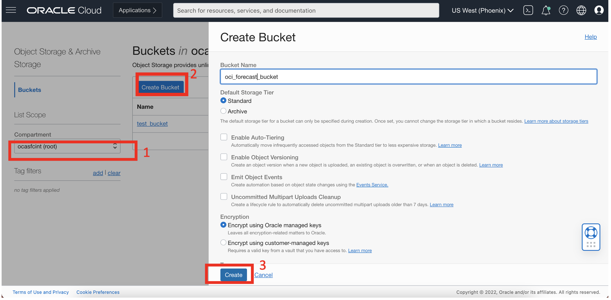


2.  Upload the Downloaded training csv data file into Storage Bucket

    - Switch to OCI window and click the bucket name that you created just now.
    
    

    - Bucket detail window should be visible. Scroll down and click Upload
    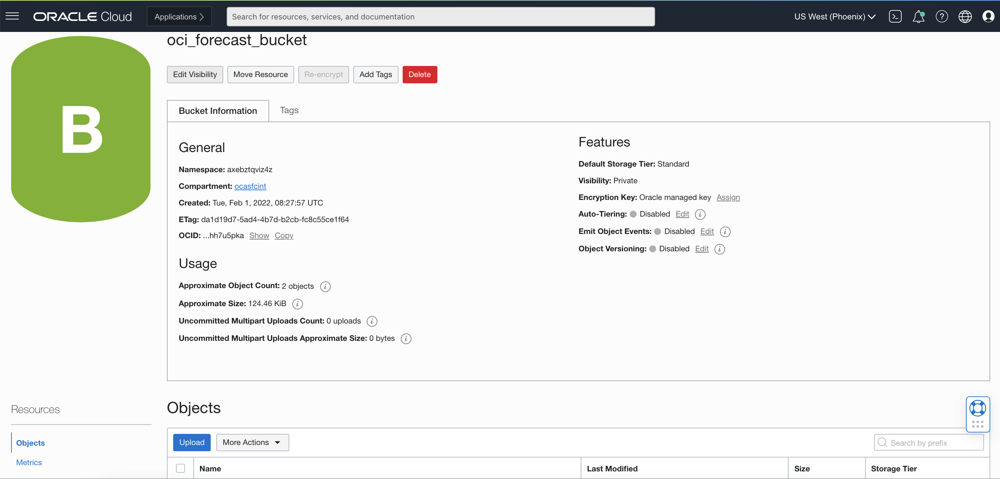


    - Browse to file which you desire to upload and click  Upload button at the botton
    

    More details on Object storage can be found on this [page](https://oracle.github.io/learning-library/oci-library/oci-hol/object-storage/workshops/freetier/index.html?lab=object-storage) to see how to upload.

## Task 5: Create a project 

Project is a way to organize multiple data assets, models, deployments to the same workspace. It is the first step to start.

1.  Log into OCI Cloud Console. Using the Burger Menu on the top left corner, navigate to Analytics and AI menu and  click it, and then select Forecasting item under AI services

    

2.  Clicking the Forecasting Option will navigate one to the Forecast Console.
    
    Under Projects, select compartment and click Create Project

    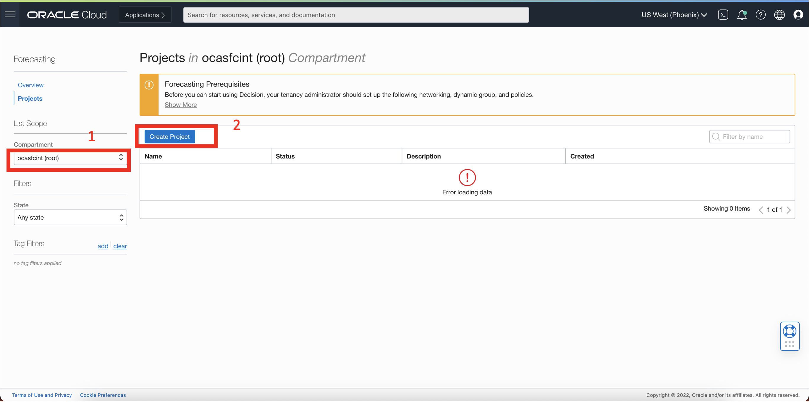

3.  The Create Project button navigates user to a form where they can specify the compartment in which to create a Forecast Project. The project we create here is named livelabs_forecast_demo.Once the details are entered click the Create Button.
    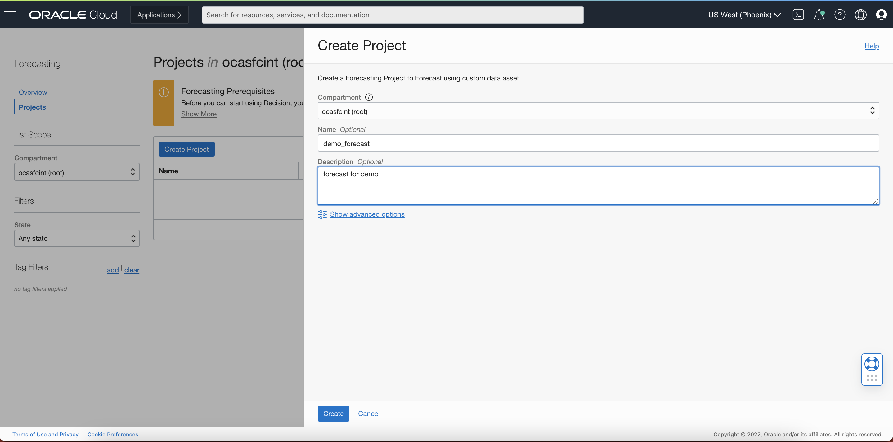

4.  If the project is successfully created it will show up in projects pane. From here onwards, select livelabs_forecast_demo.
    

5.  Click on your project you just created and go to project page.
    

## Task 6: Create Forecast

1.  Click on the Create Forecast button , it will take you to Create Forecast Page:
    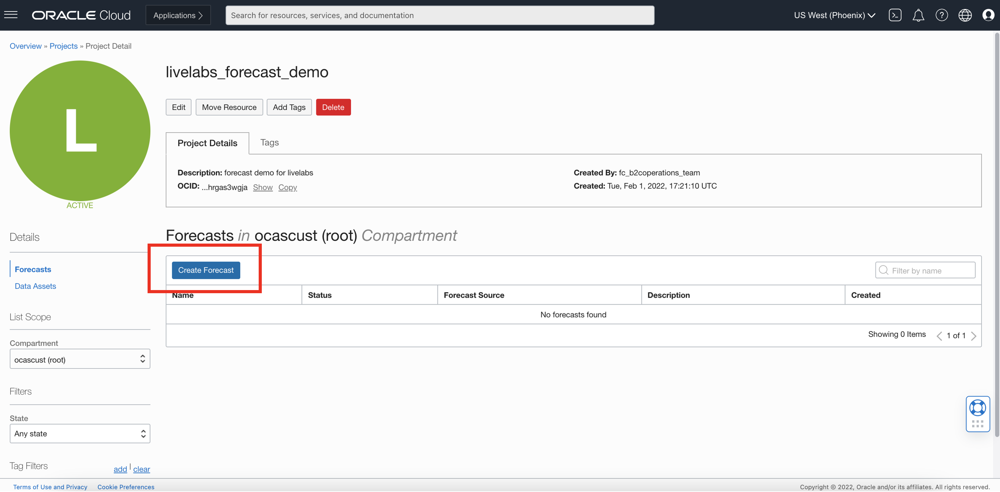

2.  First, you need to select a Data Asset needed to train a model and forecast.There are two types of Data Assets i.e. Primary and Additional. For each of the Data Asset types. Either, you can select a previously existing Data Asset or create a new Data Asset. As we dont have any existing Data Asset , we click on the Create  New Data Asset 
    

    Then, in Create Data Asset window, you can specify the compartment of Object storage that houses the data. 
    Click Create Button.
    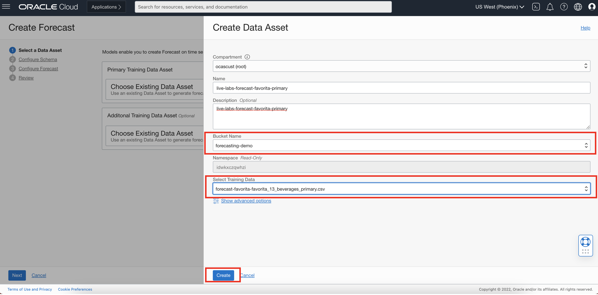

    After a few seconds, the data asset will be shown in the data asset main panel,select the
    data that we just created now

    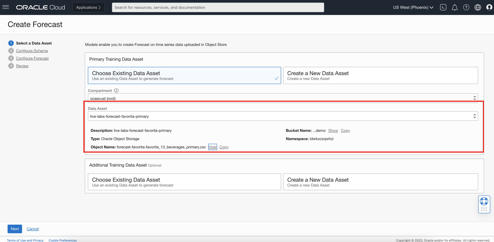
    
    Similarly, we can create Data Asset for Additional Data (Optional)
    
    

    Now , select the Addtional Data Asset created just now , and click Next
    


2.  Configure Schema :

    Next , we provide schema for the primary and additional data in the next screen
    In addition to schema , we also provide Time stamp format , Data frequency and Time stamp column
    
    

    After filling the details, click Next

3.  Configure Forecast :

    Next, we provide details for Forecast configuration as below:
    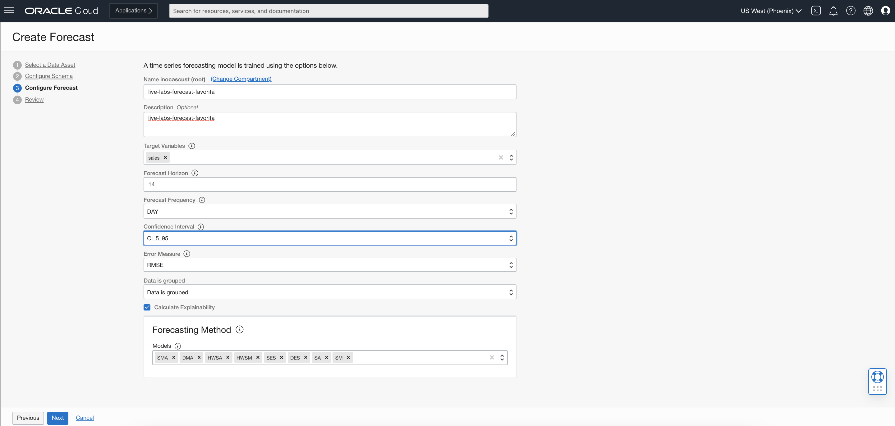

4.  Review the Configuration for Forecast and click Submit
    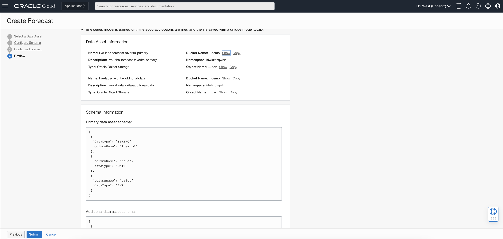
     
    Once submitted, the model training and forecast is started and status is ***Creating**

    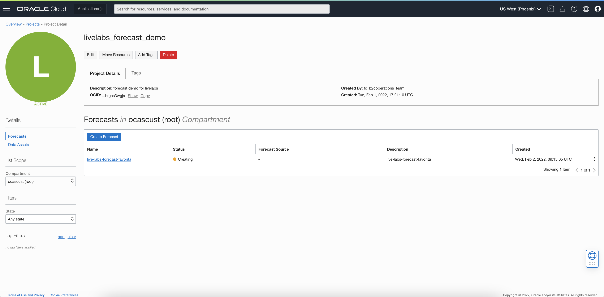


## Task 7: Forecast Results
1. Forecast Status:
    After 2.32 minutes the status will change to **Active**.Now , click on the Forecast Link as you can see below
    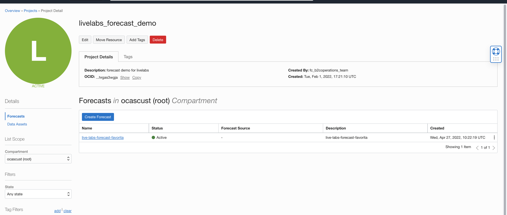

2. Review Forecast Results:
    
    Now, let's review  forecast results
    1. We get general information like OCID (forecast ID) , description etc.
    2. We get generation time of forecast , total number of series provided for forecast and forecast horizon
    3. Dropdown list of series for which we want to see visualization of forecast
    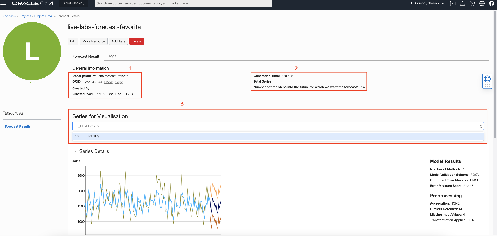

## Task 8: Explore the Forecast and Explainability  
1.  Forecast:

    Next step is to explore the forecast graph which has forecast and historical data along with prediction intervals
    - Highlighted box 1 highlights forecast for a particular time step
    - Highlighted box 2 highlights information on forecast metrics like lowest error metric measure, number of methods ran etc.
    

2.  Explainability: 

    Forecast will also give explainability for each of the target time series in the dataset. Explainability report includes both global and local level explanations. Explanations provides insights on the features that are influencing the forecast. Global explanation represents the general model behaviour - e.g., which features does the model consider important ? Local explanation tells the impact of each feature at a single time step level. Forecast provides local explanations for all the forecasts that it generates. Here we get global and local explanation for the best model chosen by forecast, inorder to understand the features that are influencing the forecast

    


    - Global Feature Importance:
    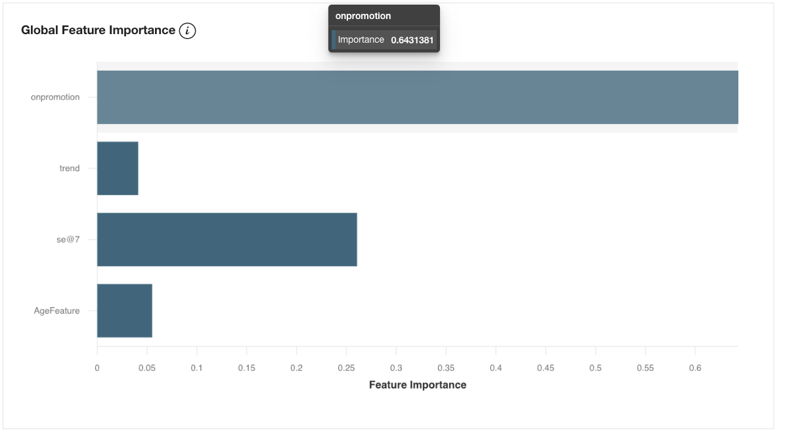

    
    - Local Feature Importance:
       We can select the time step for which we want to see the local feature importance
    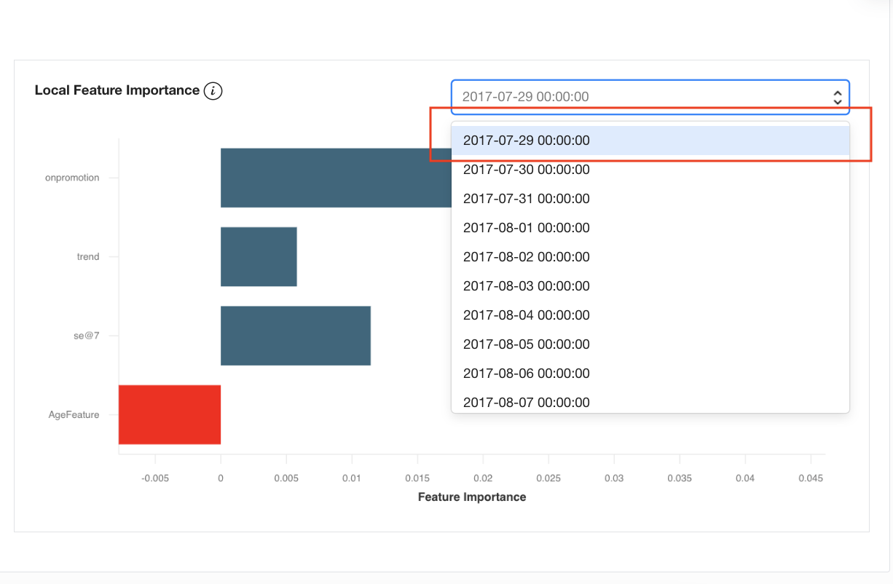


Congratulations on completing this lab! You now have finished all the sessions of this lab, please feel free to contact us if any additional questions.


## Acknowledgements
* **Authors**
    * Ravijeet Kumar - Senior Data Scientist - Oracle AI Services
    * Anku Pandey - Data Scientist - Oracle AI Services
    * Sirisha Chodisetty - Senior Data Scientist - Oracle AI Services
    * Sharmily Sidhartha - Principal Technical Program Manager - Oracle AI Services
    * Last Updated By/Date: Ravijeet Kumar, 29th-April 2022
