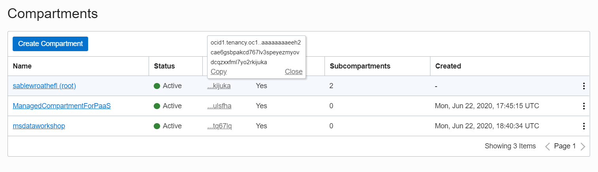

#  Getting started with the OCI Command Line Interface (CLI)

## Introduction

Automation is a critical component when it comes to managing Cloud workloads at scale.  Although the OCI UI is user-friendly, many tasks may be repetitive and could further reduce an administrator's effort if they can be automated. The OCI Command Line Interface (CLI) is a toolkit developed in Python that is capable of performing almost any task that can be executed in the OCI UI.  The toolkit runs on Linux, Mac, and Windows, making it easy to write BASH or PowerShell scripts that perform a series of commands when executed.

This lab will walk you through installation and configuration of the CLI, along with the execution of several create, read, and terminate commands.  Upon completion of this lab you should have a good understanding of how to use the OCI CLI to automate common tasks in OCI.

*Note: We recommend using Chrome or Edge as the broswer.*

### Pre-Requisites
1. [OCI Training](https://cloud.oracle.com/en_US/iaas/training)
2. [Familiarity with OCI console](https://docs.us-phoenix-1.oraclecloud.com/Content/GSG/Concepts/console.htm)
3. [Overview of Networking](https://docs.us-phoenix-1.oraclecloud.com/Content/Network/Concepts/overview.htm)
4. [Familiarity with Compartment](https://docs.us-phoenix-1.oraclecloud.com/Content/GSG/Concepts/concepts.htm)
5. [Connecting to a compute instance](https://docs.us-phoenix-1.oraclecloud.com/Content/Compute/Tasks/accessinginstance.htm)
   
## **Step 1**: Create a VCN
1. From the OCI Services menu,Click **Virtual Cloud Networks** under Networking. Select the compartment assigned to you from drop down menu on left part of the screen under Networking and Click **Start VCN Wizard**

    

    **NOTE:** Ensure the correct Compartment is selected under COMPARTMENT list.

3. Click **VCN with Internet Connectivity** and click **Start Workflow**.

    

4. Fill out the dialog box:

    - **VCN NAME**: Provide a name
    - **COMPARTMENT**: Ensure your compartment is selected
    - **VCN CIDR BLOCK**: Provide a CIDR block (10.0.0.0/16)
    - **PUBLIC SUBNET CIDR BLOCK**: Provide a CIDR block (10.0.1.0/24)
    - **PRIVATE SUBNET CIDR BLOCK**: Provide a CIDR block (10.0.2.0/24)
    - Click **Next**

    

    

5. Verify all the information and  Click **Create**.

    

6. This will create a VCN with the following components.

    *VCN, Public subnet, Private subnet, Internet gateway (IG), NAT gateway (NAT), Service gateway (SG)*

7. Click **View Virtual Cloud Network** to display your VCN details.

    
              
## **Step 2**: Create Compute instance, configure OCI CLI and upload API keys
1. Switch to the OCI console. From OCI services menu, Click **Instances** under **Compute**.

    

2. Click **Create Instance**. Enter a name for your workshop and the compartment you used earlier to create your VCN. Select **Show Shape, Network and Storage Options**.

    

    

    Leave **Image or Operating System** and **Availability Domain** as the default values.

    Scroll down to **Shape** and click **Change Shape**.

    

    Select **Virtual Machine** and **VM.Standar2.1**. Click **Select Shape**.

    

    Scroll down to the section labeled **Configure Networking** select the following.

    - **Virtual Cloud Network Compartment**: Choose the compartment you created your VCN in
    - **Virtual Cloud Network**: Choose the VCN you created in step 1
    - **Subnet Compartment:** Choose the compartment you created your VCN in
    - **Subnet:** Choose the Public Subnet under **Public Subnets**(it should be named `Public Subnet-NameOfVCN`)
    - **Use Network Security Groups to Control Traffic** : Leave un-checked
    - **Assign a Public IP Address**: Check this option

    

    - **Boot Volume:** Leave the default
    - **Add SSH Keys:** Choose 'Paste SSH Keys' and paste the Public Key you created in Cloud Shell earlier. 
    
    *Ensure when you are pasting that you paste one line*

    

3. Click **Create**.

    *NOTE: If 'Service limit' error is displayed choose a different shape from VM.Standard2.1, VM.Standard.E2.1, VM.Standard1.1, VM.Standard.B1.1  OR choose a different AD.*

4. Wait for Instance to be in **Running** state. In git-bash Enter Command:

    ```
    <copy>
    cd ~/.ssh
    </copy>
    ```
5.  Enter **ls** and verify your key file exists.

    ```
    <copy>ls</copy>
    ```

6. To ssh into the compute instance enter the following command replacing SSH-KEY-NAME with the name of your ssh key and replacing PUBLIC-IP-OF-COMPUTE1 with the IP address of the compute instance you created.

    *Note: Your SSH-KEY-NAME name should NOT end in .pub*
            
    ```
    <copy>
    ssh -i SSH-KEY-NAME opc@PUBLIC-IP-OF-COMPUTE-1
    </copy>
    ```
    *Note: User name is "opc".*

    *Note: If a "Permission denied error" is seen, ensure you are using '-i' in the ssh command. Also make sure that you correctly copied the name of your ssh key and the public IP of your compute instance.*

7. Enter 'Yes' when prompted for security message.

    
 
8. Verify opc@`<COMPUTE_INSTANCE_NAME>` appears on the prompt.

9. Install OCI CLI on the compute instance by entering the following command. When prompted for the install directory press enter(leave default). When prompted for the oci executable directory press enter(leave default). When prompted for the OCI script directory press enter(leave default). When prompted to install optional packages press enter(leave default). When prompted to update your $PATH enter `Y`.

    ```
    <copy>
    bash -c "$(curl –L https://raw.githubusercontent.com/oracle/oci-cli/master/scripts/install/install.sh)"
    </copy>
    ```

10. Check oci CLI installed version, Enter command:
   
    ```
    <copy>
    oci -v
    </copy>
    ```
    **NOTE:** Version should be minimum 2.5.X (3/23/2019)

     

11. Next you will need to gather some information so that you can configure oci. First you will need your user OCID. Go to your profile page by clicking the icon in the top right and then click your username. Then click the copy button to copy your user OCID. Record your OCID in a text file because you will need it later.

    

12. Next you will need to get your tenancy OCID. Click the icon in the top right and then your tenancy. Then click the copy button to copy your tenancy OCID. Record your tenancy OCID because you will need it later.

    

13. Next you will need to get your region identifier. Click your region and then click manage regions. Then copy your region identifier and record it.

    

14. Next we will configure OCI CLI. Enter command:

    ```
    <copy>
    oci setup config
    </copy>
    ```

    

15. The `oci setup config` command also generated an API key. We will need to upload this API key into our OCI account for authentication of API calls.

    ```
    <copy>
    cat ~/.oci/oci_api_key_public.pem
    </copy>
    ```

16. Highlight and copy the content from the oracle cloud shell. Click the human icon followed by your user name. Then scroll down and click **API Keys**. In your user details page click **Add Public Key**. In the dialog box paste the public key content and click **Add**.

    

    

We will now test the functionality of the CLI.

## **Step 3**: Testing the CLI, Create another VCN with one public subnet

1. In the SSH terminal session, type the following command:

    ```
    <copy>
    oci iam availability-domain list
    </copy>
    ```

    This will list all availability domains in the current region.  Make note of one of the availability domain names.  It should look something like this ``nESu:PHX-AD-3``.  You will use this in a future step.

    

2. Return to the OCI Console and navigate to Identity -> Compartments.  Retrieve the OCID of the assigned compartment.

    

    

3. Enter the following command to list VCN's:
    
    ```
    <copy>
    oci network vcn list --compartment-id COMPARTMENT-ID
    </copy>
    ```

    

    *Note: It should return the details of the VCN you created at the start of this lab.  If you encounter an error message, please contact the instructor.*

4. Create a new virtual cloud network with a unique CIDR block.  You will need the OCID of your compartment.

    ```
    <copy>
    oci network vcn create --cidr-block 192.168.0.0/16 -c COMPARTMENT-ID --display-name CLI-Demo-VCN --dns-label clidemovcn
    </copy>
    ```
    Record the `id:` of the resource after it is created.  You will need it in the upcoming steps.

    

5. Create a new security list.

    ```
    <copy>
    oci network security-list create --display-name PubSub1 --compartment-id COMPARTMENT-ID --vcn-id VCN-OCID --egress-security-rules  '[{"destination": "0.0.0.0/0", "destination-type": "CIDR_BLOCK", "protocol": "all", "isStateless": false}]' --ingress-security-rules '[{"source": "0.0.0.0/0", "source-type": "CIDR_BLOCK", "protocol": 6, "isStateless": false, "tcp-options": {"destination-port-range": {"max": 80, "min": 80}}}]'
    </copy>
    ```
    Make a note of the resource ``id:`` for use in the next step.

    

6. Create a public subnet.
    ```
    <copy>
    oci network subnet create --cidr-block 192.168.10.0/24 -c COMPARTMENT-ID --vcn-id VCN-OCID --security-list-ids '["SECURITY-LIST-OCID"]'
    </copy>
    ```
    Record the ``id:`` of the resources after it is created.  You will need it in an upcoming step.

    

    *Note: You have the option to specify up to 5 security lists and a custom route table.  In this case, we are only assigning one security list and allowing the system to automatically associate the default route table.*

7. Create an Internet Gateway.  You will need the OCID of your VCN and Compartment.
    ```
    <copy>
    oci network internet-gateway create -c COMPARTMENT-ID --is-enabled true --vcn-id VCN-OCID --display-name DemoIGW
    </copy>
    ```
    Make a note of the ``id:`` for this resource after it has been created.

    

8. Next, we will update the default route table with a route to the internet gateway.  First, you will need to locate the OCID of the default route table.

    ```
    <copy>
    oci network route-table list -c COMPARTMENT-ID --vcn-id VCN-OCID
    </copy>
    ```
    

    record the ``id:`` of the `Default Route Table`

9. Update the route table with a route to the internet gateway. When prompted to continue enter `y`.
    
    ```
    <copy>
    oci network route-table update --rt-id ROUTE-TABLE-OCID --route-rules '[{"cidrBlock":"0.0.0.0/0","networkEntityId":"INTERNET-GATEWAY-OCID"}]'
    </copy>
    ```

    

    *Note: When updating route tables or security lists you cannot insert a single rule.  You must ``update`` with the entire set of rules.  The prompt shown in the screenshot above illustrates this point.*

    *Note: Use QUERY to find Oracle Linux Image ID, then launch a compute instance.*

10. Use the CLI ``query`` command to retrieve the OCID for the latest Oracle Linux image.  Make a note of the image ID for future use.

    ```
    <copy>
    oci compute image list --compartment-id COMPARTMENT-ID --query 'data[?contains("display-name",`Oracle-Linux-7.6-20`)]|[0:1].["display-name",id]'
    </copy>
    ```

    You may find more information on the Query command [here](https://docs.cloud.oracle.com/iaas/Content/API/SDKDocs/cliusing.htm#ManagingCLIInputandOutput).

11. Launch a compute instance with the following command.  We previously created a regional subnet because our command did not include a specific availability domain. For compute instances, we must specify an availability domain and subnet.

    You will need the following pieces of information:

    - Availability domain name
    - Subnet OCID
    - Valid compute shape (i.e. VM.Standard.E2.1)
    - Your public SSH key

    ```
    <copy>
    oci compute instance launch --availability-domain AD-NAME --display-name demo-instance --image-id IMAGE-ID --subnet-id SUBNET-OCID --shape VM.Standard.E2.1 --compartment-id COMPARTMENT-ID --assign-public-ip true --metadata '{"ssh_authorized_keys": "PASTE-CONTENTS-OF-PUBLIC-SSH-KEY-HERE"}'
    </copy>
    ```

    Capture the ``id:`` of the compute instance launch output.

12. Check the status of the instances

    ```
    <copy>
    oci compute instance get --instance-id <the instance OCID> --query 'data."lifecycle-state"'
    </copy>
    ```

13. Rerun the command every 30-60 seconds until the lifecycle-state is ``RUNNING``

    ***This completes the exercise for basic usage of the OCI CLI.***

    **Bonus Exercise: Use the CLI to create the rest of the VCN resources**

    This section is optional and does not contain detailed instructions.  Instead, there are a series of objectives that you will complete on your own.  Use the [OCI CLI](https://docs.cloud.oracle.com/iaas/tools/oci-cli/latest/oci_cli_docs/index.html) reference documentation for guidance.

14. Locate the public IP address of the instance using the CLI.

    ```
    <copy>
    oci compute instance list-vnics --instance-id <instance OCID> | grep "ip.:"
    </copy>
    ```

15. Attempt to connect via SSH.  Does it work? (hint: it should time out)

16. Use the CLI to create an ingress rule for SSH traffic in your custom security list.  Don't forget the ``oci network security-list update`` command requires you to pass all current and new rules.  If you just pass one rule, it will overwrite the existing rules.

17. Connect via SSH now.  Is it working?

18. Create and attach a 50GB block volume to your instance.

19. Terminate / destroy all of the resources you created in this lab.  Hint: the order in which you delete the resources is very important.

20. Delete the Block volume, then compute instance and then VCN. Example command to delete VCN

    ```
    <copy>
    oci network vcn delete --vcn-id VCN-OCID
    </copy>  
    ```
## **Step 4**: Delete the resources

1. Switch to  OCI console window.

2. If your Compute instance is not displayed, From OCI services menu Click **Instances** under **Compute**.

3. Locate first compute instance, Click Action icon and then **Terminate**.

     

4. Make sure Permanently delete the attached Boot Volume is checked, Click Terminate Instance. Wait for instance to fully Terminate.

     

5. From OCI services menu Click **Virtual Cloud Networks** under Networking, list of all VCNs will 
appear.

6. Locate your VCN , Click Action icon and then **Terminate**. Click **Delete All** in the Confirmation window. Click **Close** once VCN is deleted.

     

*Congratulations! You have successfully completed the lab.*

## Acknowledgements
- **Author** - Flavio Pereira, Larry Beausoleil
- **Adapted by** -  Yaisah Granillo, Cloud Solution Engineer
- **Contributors** - Jaden McElvey, Technical Lead - Oracle LiveLabs Intern
- **Last Updated By/Date** - Jaden McElvey, August 2020

## See an issue?
Please submit feedback using this [form](https://apexapps.oracle.com/pls/apex/f?p=133:1:::::P1_FEEDBACK:1). Please include the *workshop name*, *lab* and *step* in your request.  If you don't see the workshop name listed, please enter it manually. If you would like for us to follow up with you, enter your email in the *Feedback Comments* section. 

