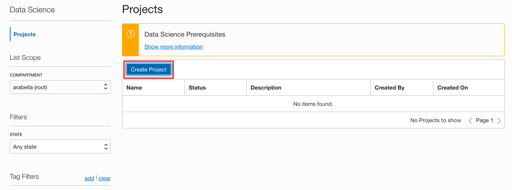
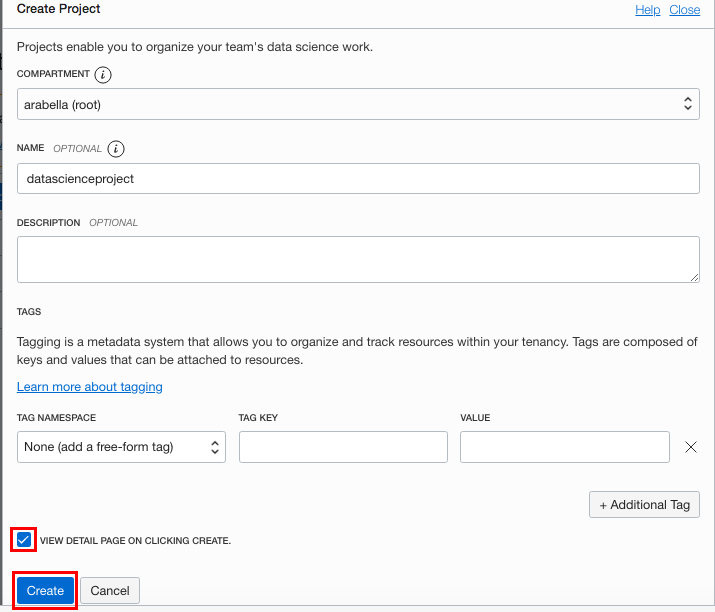

# Data Science Project Setup

## Introduction

Projects are used to collect related data science resources and artifact, such that it enables you to organize your work. They contain a collection of notebook sessions and models.

*Estimated Lab Time*: 5 minutes

### Objective
In this lab, you:
* Use the Console to create a Data Science Project.

### Prerequisites

* A tenancy that is configured to work with the Data Science service.
* An account that has permission to create a Data Science project.

## **STEP 1:** Creating a Project

You create a Data Science project to organize your notebook sessions and models within your project.

1. [Login to the OCI Console](https://www.oracle.com/cloud/sign-in.html).
1. Open the navigation menu.
1. Under **Data and AI**, select **Data Science**, and then click **Projects**.
    

1. Click **Create Project**.
    

1. Select the compartment you want to add the project to.
1. (Optional, but recommended) Enter a unique name (255 character limit) for the project. If you don't provide a name, a name is automatically generated for you. For example, ``datascienceproject20200108222435``.
1. (Optional, but recommended) Enter a description (400 character limit) for the project. If you don't add a description, it remains empty.
1. (Optional) Add tags to easily locate and track the project by selecting a tag namespace, then entering the key and value. To add more than one tag, click **+Additional Tags**. [Tagging](https://docs.cloud.oracle.com/iaas/Content/Tagging/Concepts/taggingoverview.htm) describes the various tags that you can use organize and find projects including [cost-tracking tags](https://docs.cloud.oracle.com/iaas/Content/Tagging/Tasks/usingcosttrackingtags.htm).
1. (Optional) To view the details for your project immediately after creation, select **VIEW DETAIL PAGE ON CLICKING CREATE.**.
    

1. Click **Create**.
    

    This creates the project and opens the project page.

You can *proceed to the next lab*.

## Acknowledgements

* **Author**: [John Peach](https://www.linkedin.com/in/jpeach/), Principal Data Scientist
* **Last Updated By/Date**:
    * [John Peach](https://www.linkedin.com/in/jpeach/), Principal Data Scientist, November 2020

## Need Help?
Please submit feedback or ask for help using our [LiveLabs Support Forum](https://community.oracle.com/tech/developers/categories/oracle-cloud-infrastructure-fundamentals). Please click the **Log In** button and login using your Oracle Account. Click the **Ask A Question** button to the left to start a *New Discussion* or *Ask a Question*.  Please include your workshop name and lab name.  You can also include screenshots and attach files.  Engage directly with the author of the workshop.

If you do not have an Oracle Account, click [here](https://profile.oracle.com/myprofile/account/create-account.jspx) to create one.

