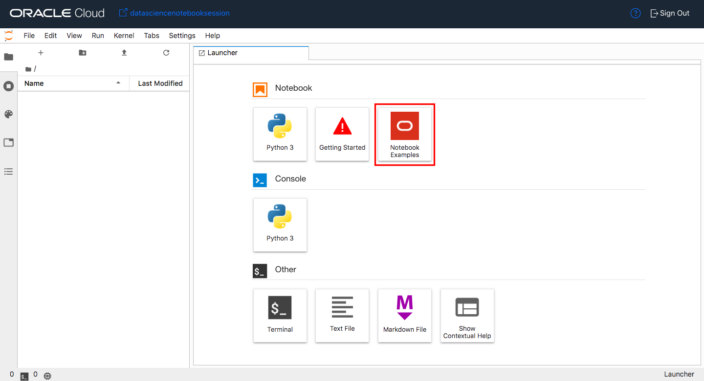

1. **Open dataset**: ``ds = DatasetFactory.open()``
1. **Visualize dataset**: ``ds.show_in_notebook()``
1. **Automatic feature engineering**: ``transformed_ds = ds.auto_transform()``
1. **Split data into train and test sets**: ``train, test = transformed_ds.train_test_split()``
1. **Train the model with AutoML**: ``model, baseline = automl.train()``
1. **Evaluate the model**: ``evaluator = ADSEvaluator()``
1. **Explain the model**: ``explainer = ADSExplainer(test, model)``
1. **Global explanations**: ``global_explainer = explainer.global_explanation()``
1. **Local explanations**: ``local_explainer = explainer.local_explanation()``
1. **Feature important**: ``global_explainer.feature_importance_summary()`` and ``global_explainer.compute_feature_importance()``

## Task 3: Install a Conda Package

A conda package is a collection of libraries, programs, components and metadata. It defines a reproducible set of libraries that are used in the data science environment. There is an Environment Explore that allows you to learn about the different conda environments that are available. We are going to use the General Machine Learning for CPUs conda.

1. Open a terminal window by clicking on **File**, **New** and then **Terminal**.
1. Run the command: `odsc conda install -s generalml_p37_cpu_v1`
1. You will receive a prompt related to what version number you want. Press `Enter` to select the default.
1. Wait for the conda package to be installed.

## Task 4: Binary Classification Model

To open the notebook, that is used in this lab, have the launcher open. The launcher is open by default but if it is currently closed it can be opened by clicking on **File** and then click on **New Launcher**.

1. Click on the **Notebook Examples**. A drop down will appear.
    

<<<<<<< HEAD
1. Select the environment **generalml_p37_cpu_v1** and then the notebook **binary\_classification\_attrition.ipynb**. 
    

1. Click **Load Example**. The notebook will open in a new tab.
    

1. Read through the document. When you encounter a chunk of code, click in the cell and press *shift + enter* to execute it. When the cell is running a ``[*]`` will appear in the top left corner of the cell. When it is finished, a number will appear in ``[ ]``, for example ``[1]``.
    
    

1. Execute the cells in order. If you run into problems and want to start over again, click the **restart** button then click **Restart**.
    
    

1. Step through the lab and look at the tools that are provided by Oracle Accelerated Data Science (ADS) SDK. This automates a number of time-consuming and repetitive processes by analyzing the data and creating appropriate outputs.

## Task 5: Next Steps

There are some other notebooks that you may find interesting. They can be accessed by clicking **File** then clicking **New Launcher**. This will open Launcher. Click **Notebook Examples** and select a notebook then click **Load Example**. Some notebooks of interest are:

* **ads\_feature\_type.ipynb**: Learn how to use Feature Types to speed up your EDA and improve the robustness of your data.
* **data\_visualizations.ipynb**: It provides a comprehensive overview of the data visualization tools in ADS. This includes smart data visualization for columns based on data types and values.
* **transforming\_data.ipynb**: Learn about the ``ADSDatasetFactory`` and how it can clean and transform data.

## Acknowledgements

* **Author**: [John Peach](https://www.linkedin.com/in/jpeach/), Principal Data Scientist
* **Last Updated By/Date**:
    * [John Peach](https://www.linkedin.com/in/jpeach/), Principal Data Scientist, February 2022
