# Provision a GPU instance

## Introduction

In this lab, we will walk through the required steps to provision a GPU instance on OCI with Ubuntu running on it.

**Note:** A PAYG account is required to provision GPU instances on OCI. If you are using the Oracle 30-day free trial, you can make use all available VM and BMs instances.

Estimated workshop time: 15 minutes

### Objectives

- Login to Oracle Cloud
- Provision a GPU instance on OCI

### What Do You Need?

- An user (with a username and password) that is part of a user group on OCI. Check the page [Managing users](https://docs.oracle.com/en-us/iaas/Content/Identity/Tasks/managingusers.htm) to read how **To create a user** and how **To add a user to a group** using the console.
- Cloud Account Name - The name of your tenancy (supplied by the administrator or in your Oracle Cloud welcome email)
- A user group. Check the page [Managing groups](https://docs.oracle.com/en-us/iaas/Content/Identity/Tasks/managinggroups.htm#three) to read how **To create a group** using the console.
- Assigned policies to the group that let the users launch compute instances. Check the page [Common Policies](https://docs.oracle.com/en-us/iaas/Content/Identity/Concepts/commonpolicies.htm#top) to read which policies you need **To let users launch Compute instances** using the console.
- A compartment for the user. Check the page [Managing Compartments](https://docs.oracle.com/en-us/iaas/Content/Identity/Tasks/managingcompartments.htm#uscons) to read how **To create a compartment** using the console.
- Check service limits for the allowed maximum number of GPU instances per availability domain in the region you wish to provision the GPU instance. To increase the service limit, follow the steps in the page [Service Limits](https://docs.oracle.com/en-us/iaas/Content/General/Concepts/servicelimits.htm#top).

## Task 1: Login to Oracle Cloud

If you've signed out of the Oracle Cloud, use these steps to sign back in.

1. Go to [cloud.oracle.com](https://cloud.oracle.com) and enter your Cloud Account Name and click **Next**. This is the name you chose while creating your account in the previous section. It's NOT your email address. If you've forgotten the name, see the confirmation email.

   

2. Expand the arrow after _"Oracle Cloud Infrastructure Direct Sign-In"_ to reveal the login input fields.

   

3. Enter your Cloud Account credentials and click **Sign In**. Your username is your email address. The password is what you chose when you signed up for an account.

   

4. You are now signed in to Oracle Cloud!

   

## Task 2: Launch a GPU instance

1.  After you login, click on the **Create a VM instance** button in the **Quick Actions** section.

    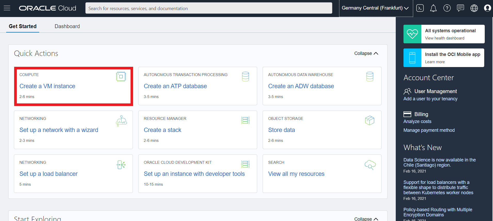

Alternatively, you can click on the service menu on the top left and then on **Compute** -> **Instances**. A new page opens up with a blue **Create Instance** button on which you click on.

2. Fill in the name for your compute instance.

   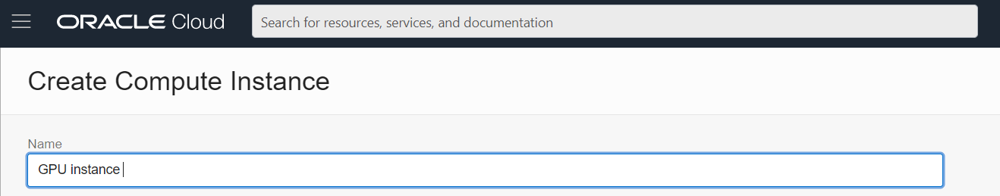

3. Select your compartment from the drop-down list.

   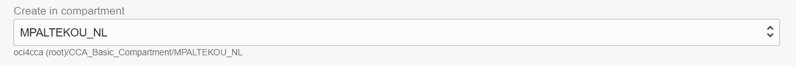

4. Before you select the availability domain, check under **Governance** -> **Limits, Quotas and Usage**, in which availability domain of your selected region you have GPU instances available.
   Select the availability domain, in which the compute instance will be provisioned.

   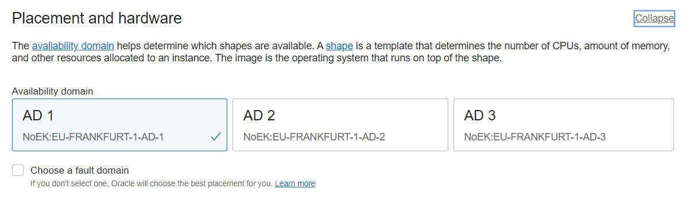

5. Click on the **Change image** button.

   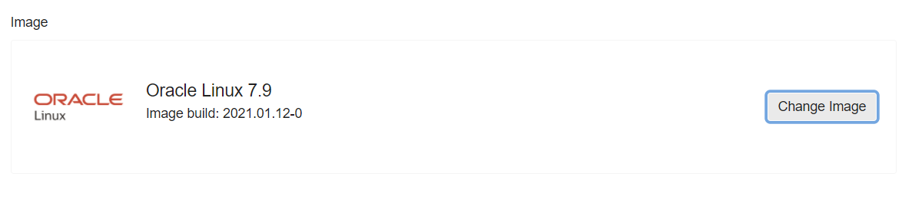

   Select the image you want to use for your compute instance and click on the **Select Image** button. We will select Ubuntu 18.04 which is recommended by Faceswap, but any other Linux distribution and Windows operating system might work as well.

   

6. Click on the **Change Shape** button.

   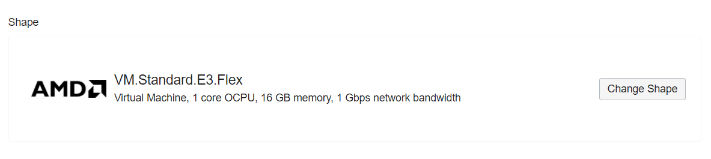

   Select **Virtual Machine** and **Specialty and Legacy**. There you will find the GPU instance and the **Always Free** VM.Standard.E2.1.Micro shape (in case you are not owning a PAYG account to run GPU instances).

   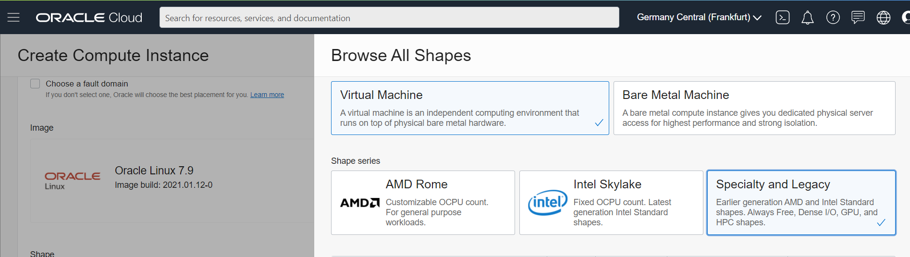

   Select the GPU instance you want to provision, read & check the box _I have reviewed and accept the following documents: Oracle and Nvidia terms of use_ and click on the **Select shape** button. In our case, it is the VM.GPU2.1 based on the P100 (NVIDIA Pascal GPU architecture) with 1 GPU. You can request service limits for virtual and bare metal machines based on V100 (NVIDIA Volta GPU architecture) and A100 (NVIDIA Ampere GPU architecture) as well.

   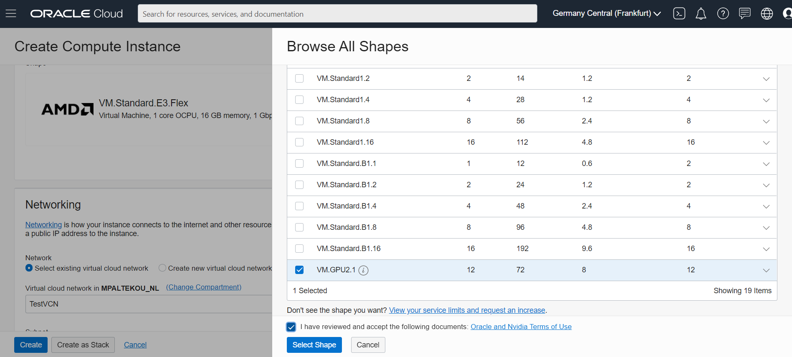

7. In case you have already created a VCN in your compartment, you select the VCN and subnet you want to place your compute instance in. If not, you can click on **Create new virtual cloud network**, select a name and compartment for your VCN and a name for your public subnet. You can keep the default CIDR block or adjust it.
   You can choose to assign a public IP address to your instance.
   Assigning a public IP address makes this instance accessible from the internet. If you're not sure whether you need a public IP address, you can always assign one later.

   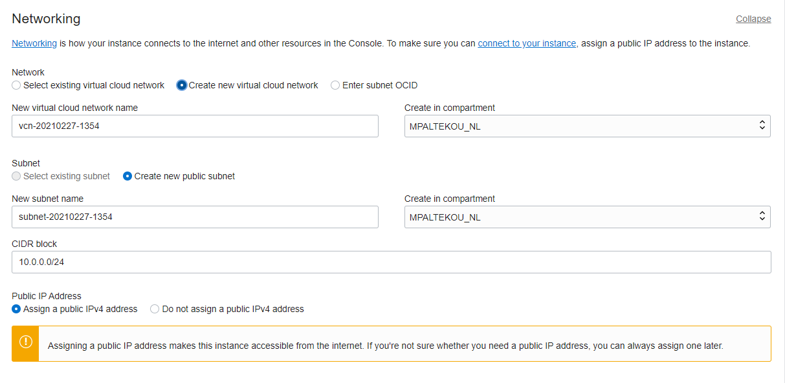

8. In case you want to make use of the SSH public & private key pair that you have created in _Lab 1 - Create SSH keys_, you can either click on **Choose public keys files** and select the SSH public key file(s) or click on **Paste public keys** and paste the SSH public key(s) in the field. You can as well genereate a SSH public and private key on OCI and save it to your local machine.
   Note, that if you don't provide SSH keys, you will not be able to connect to the instance using SSH.

   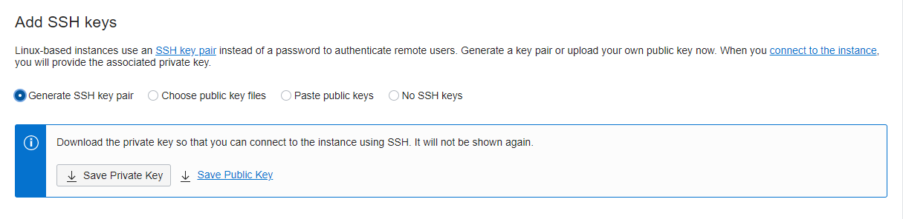

9. The final step is specifying your boot volume size, choosing whether or not to make use of in-transit encryption and how to manage the encryption keys. You can go with the default boot volume size which is 46.6 GB for Linux syxtems, or increase it to a maximum of 32 TB. You may leave all boxes unchecked, and click on **Create** (to finalize the compute instance creation).

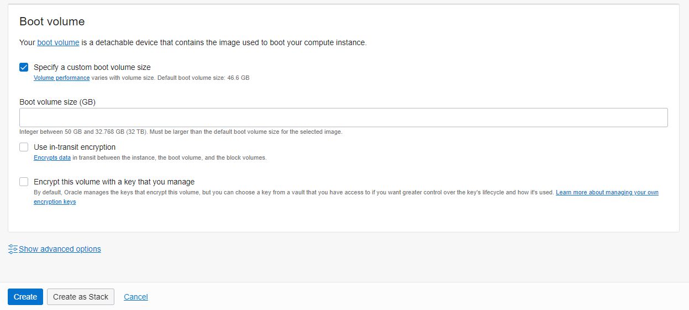

After a couple of minutes, your GPU compute instance will change its status to **RUNNING**

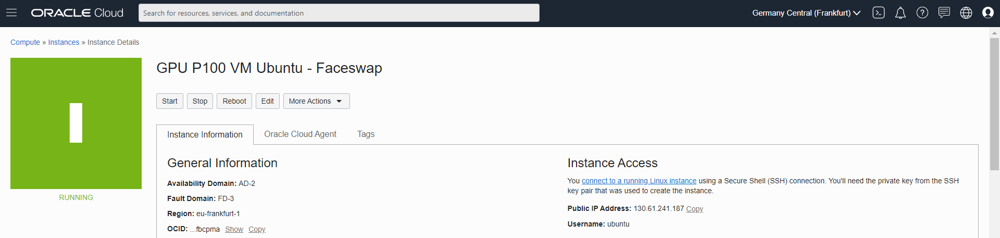

## **Acknowledgements**

- **Created By/Date** - Maria Patelkou, HPC Solution Architect, Oracle Proposal to Production programme, March 2021
- **Last Updated By/Date** - Maria Patelkou, HPC Solution Architect, Oracle Proposal to Production programme, March 2021