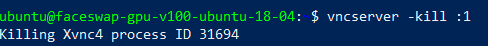
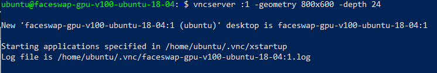

# Set up and access through VNC

## Introduction

In this lab, we will walk through the required steps to set up and access your Ubuntu instance through a VNC client (here: TigerVNC).

Estimated workshop time: 15 minutes

### Objectives

- Connect to your compute instance through SSH
- Set up and configure VNC on your Ubuntu instance
- Access your compute instance through a VNC client (e.g. TigerVNC)

### What Do You Need?

- Complete Lab 1 and Lab 2
- [Add an ingress rule to the VCN security list](https://docs.oracle.com/en-us/iaas/Content/Network/Concepts/securitylists.htm#Using) to allow TCP traffic for the ports port 5900+N where N is the display number (usually :0 for a physical display).
  

## Task 1: Connect to your compute instance through SSH

1. Open a terminal (also known as command line or console) of your choice. In this example, we work on a local Windows machine and use Windows PowerShell as terminal.

2. Note the public IP address of your Ubuntu instance that you will find under **Compute -> Instances** in the instance list of your compartment.

3. In your terminal, navigate to the folder in which your SSH key pair resides that you used during the creation of the Ubuntu compute instance. In our case, the folder is called _ssh_.

```
   <copy>cd .ssh</copy>
```

4. Enter the following command to access your Ubuntu compute instance where you need to substitute _private-key_ with your OpenSSH private key and _public ip_ with the public IP address of your Ubuntu instance.

```
   <copy>ssh -i private-key ubuntu@public_ip</copy>
```

## Task 2: Set up and configure VNC on your Ubuntu instance

1. Install VNC server by running the commands below in your terminal:

```
   <copy>sudo apt update</copy>
```

```
<copy>sudo apt -y install vnc4server</copy>
```

2. Install a desktop environment. We will install the Xfce desktop environment (but you can choose to use other Desktop environments) by entering the following command:

```
   <copy>sudo apt install xfce4 xfce4-goodies</copy>
```

3. Run the vncpasswd command to set password for your VNC server.

```
   <copy>vncpasswd</copy>
```

When prompted, enter your password and verify it by entering a second time.

4. Start VNC Server by using the command:

```
   <copy>vncserver :1</copy>
```

You will receive the following output.


5. Kill VNC Server using the command:

```
   <copy>vncserver -kill :1</copy>
```



6. The VNC configuration file is located on ~/.vnc/xstartup. Edit it with your favorite text editor. We will use vim.

```
   <copy>sudo vim ~/.vnc/xstartup</copy>
```

7. Add the following line at the end of the file:

```
   <copy>exec /usr/bin/startxfce4 &</copy>
```

In case you are working with vim:
Press **A** to append text at the end and copy paste the above command.
Switch to command mode by pressing the ESC key.
Type **:wq** - to save and exit.

8. Start VNC Server by executing the following command.

```
   <copy>vncserver :1</copy>
```



9. Close the SSH connection to your instance by executing the following command:

```
   <copy>exit</copy>
```

## Task 3: Connect to the VNC Desktop

You can connect to remote desktop using a VNC client (e.g. TigerVNC) and SSH tunneling.

1.  Create a SSH tunnel to the VNC server using the following command (where private-key is your private OpenSSH key and public_ip the private IP address from your Ubuntu compute instance):

```
<copy>ssh -i private-key ubuntu@public_ip -C -L 5901:127.0.0.1:5901</copy>
```

2. Install the vncviewer client, which will be TigerVNC in our case.

```
   <copy>sudo apt install tigervnc-viewer</copy>
```

3. Download and install a VNC client (e.g. TigerVNC) on your local machine. Connect to **127.0.0.1:5901** using your VNC client.
   

4. When prompted for password, enter the password created during the VNC server configuration.
   

Your remote Ubuntu desktop will open up.


## **Acknowledgements**

- **Created By/Date** - Maria Patelkou, HPC Solution Architect, Oracle Proposal to Production programme, March 2021
- **Last Updated By/Date** - Maria Patelkou, HPC Solution Architect, Oracle Proposal to Production programme, March 2021
