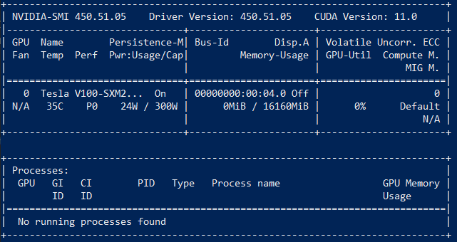

# Install Faceswap

## Introduction

In this lab, we will install Faceswap on our compute instance. We will closely follow the Faceswap documentation to [install Faceswap](https://forum.faceswap.dev/viewtopic.php?f=4&t=68).

Estimated workshop time: 30 minutes

**Note:** In case you are using a GPU instance, you can install an assortment of drivers and libraries in **step 1** that are required for the Tensorflow GPU support. The correct versions of Cuda/cuDNN need to be installed for the required version of Tensorflow. See the [tested build configurations](https://www.tensorflow.org/install/source#linux) to know which CUDA and cuDNN versions to use with respective TensorFlow releases. For tensorflow-2.4.0, we need to install CUDA 11.0.

### Objectives

- Optional: Prepare your GPU instance to ensure Tensorflow GPU support
- Install Faceswap on our Ubuntu machine

### What Do You Need?

- Complete Lab 1 to Lab 3

## Task 1: Install CUDA Toolkit (optional)

In this step, we will install the CUDA Toolkit that includes the CUDA SDK, GUI tools and the Nvidia driver.

We will install the CUDA Toolkit 11.0 (including CUDA 11.0) required for tensorflow-2.4.0 that will be installed in **step 2** during the Faceswap installation.

**Note:** For future releases of Faceswap, always make sure to check which version of tensorflow is going to be installed and which version of CUDA is supported for that version of tensorflow (see [tested build configurations](https://www.tensorflow.org/install/source#linux))

1. Enter the following command in your terminal to access your Ubuntu compute instance where you need to substitute _private-key_ with your OpenSSH private key and _public ip_ with the public IP address of your Ubuntu instance.

```
   <copy>ssh -i private-key ubuntu@public_ip</copy>
```

2. We will closely follow the Nvidia developer documentation for the [download and installation of the CUDA Toolkit 11.0](https://developer.nvidia.com/cuda-11.0-download-archive?target_os=Linux&target_arch=x86_64&target_distro=Ubuntu&target_version=1804&target_type=deblocal)

```
<copy>
wget https://developer.download.nvidia.com/compute/cuda/repos/ubuntu1804/x86_64/cuda-ubuntu1804.pin
sudo mv cuda-ubuntu1804.pin /etc/apt/preferences.d/cuda-repository-pin-600
wget http://developer.download.nvidia.com/compute/cuda/11.0.2/local_installers/cuda-repo-ubuntu1804-11-0-local_11.0.2-450.51.05-1_amd64.deb
sudo dpkg -i cuda-repo-ubuntu1804-11-0-local_11.0.2-450.51.05-1_amd64.deb
sudo apt-key add /var/cuda-repo-ubuntu1804-11-0-local/7fa2af80.pub
sudo apt-get update
sudo apt-get -y install cuda-11.0
</copy>
```

3. Check that GPUs are visible and that CUDA 11.0 is succesfully installed using the command:

```
   <copy>nvidia-smi</copy>
```

The nvidia-smi output will look like this:



## Task 2: Install Faceswap

1. Download the latest version of the Faceswap installer.

```
   <copy>wget https://github.com/deepfakes/faceswap/releases/latest/download/faceswap_setup_x64.sh</copy>
```

2. Navigate to the download location and enter the following command:

```
   <copy>bash ./faceswap_setup_x64.sh</copy>
```

Please follow the configuration steps from the [Faceswap Install Guide](https://forum.faceswap.dev/viewtopic.php?f=4&t=68)

## **Acknowledgements**

- **Created By/Date** - Maria Patelkou, HPC Solution Architect, Oracle Proposal to Production programme, March 2021
- **Last Updated By/Date** - Maria Patelkou, HPC Solution Architect, Oracle Proposal to Production programme, March 2021
