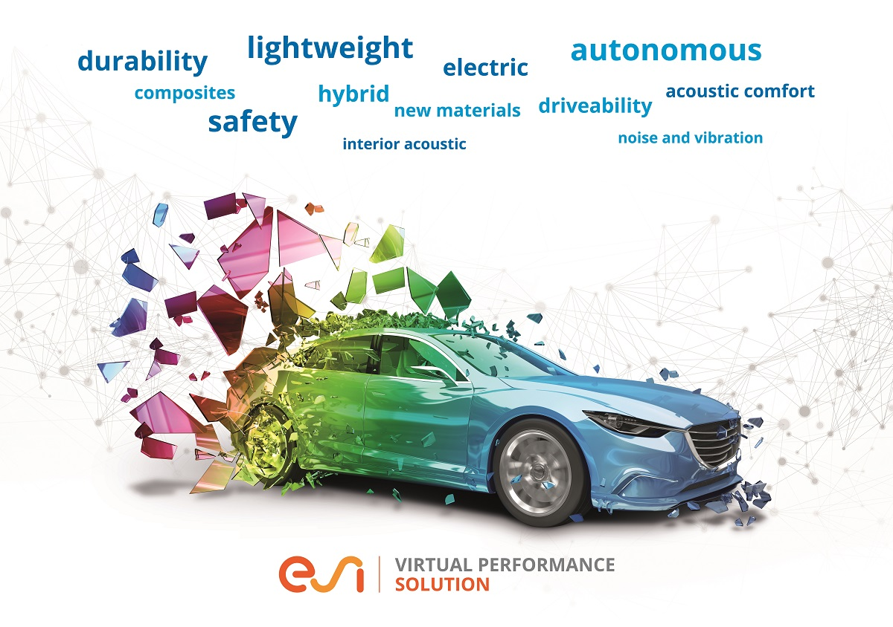

# ESI Pam-Crash Introduction

## Introduction

This Runbook will take you through the process of deploying one or multiple machines on Oracle Cloud Infrastructure, installing Virtual Performance Solution, also known as Pam-Crash, configuring the license, and then running a model.

Virtual Performance Solution is a software package used for crash simulation.

Running VPS on Oracle Cloud Infrastructure is quite straightforward, follow along this guide for all the tips and tricks.

### Objectives

In this lab, we provide: 
* A Brief introduction to the ESI Pam-Crash Software, along with an overview about the entire runbook.

### Prerequisites

* Some understanding of cloud and database terms is helpful
* Familiarity with Oracle Cloud Infrastructure (OCI) is helpful
* Familiarity with networking is helpful

## Acknowledgements

* **Author** - High Performance Compute Team
* **Contributors** -  Chris Iwicki, Harrison Dvoor, Gloria Lee, Selene Song, Bre Mendonca, Samrat Khosla
* **Last Updated By/Date** - Samrat Khosla, March 2021

