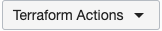

# Run the Stack

## Introduction
In this lab, you will run the stack.

Estimated Lab Time: 2 minutes

## Task: Run the Stack
Now that your stack is created, you can run jobs.

1. Select the stack that you created. 

2. In the "Terraform Actions" dropdown menu, run 'Apply' to launch the GPU infrastructure.
    

## Acknowledgements
* **Author** - High Performance Compute Team
* **Contributors** -  Chris Iwicki, Harrison Dvoor, Gloria Lee, Selene Song, Bre Mendonca, Samrat Khosla
* **Last Updated By/Date** - Samrat Khosla, October 2020

