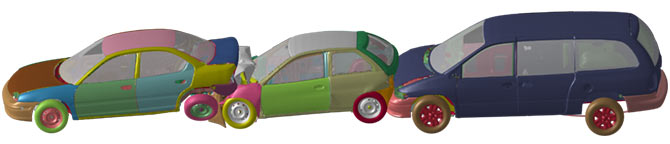

# LS_DYNA Introduction

## Introduction 

LS-DYNA is a general-purpose finite element program capable of simulating complex real world problems. It is used by the automobile, aerospace, construction, military, manufacturing, and bioengineering industries. [LS-DYNA Website](https://www.lstc.com/products/ls-dyna)

This Runbook will take you through the process of deploying an LS Dyna cluster on Oracle Cloud with low latency networking between the compute nodes. Running LS Dyna on Oracle Cloud is quite straightforward, follow along this guide for all the tips and tricks.

## Acknowledgements
* **Author** - High Performance Compute Team
* **Contributors** -  Chris Iwicki, Harrison Dvoor, Gloria Lee, Selene Song, Bre Mendonca, Samrat Khosla
* **Last Updated By/Date** - Samrat Khosla, October 2020

## Need Help?
Please submit feedback or ask for help using our [LiveLabs Support Forum](https://community.oracle.com/tech/developers/categories/high-performance-computing-hpc). Please click the **Log In** button and login using your Oracle Account. Click the **Ask A Question** button to the left to start a *New Discussion* or *Ask a Question*.  Please include your workshop name and lab name.  You can also include screenshots and attach files.  Engage directly with the author of the workshop.

If you do not have an Oracle Account, click [here](https://profile.oracle.com/myprofile/account/create-account.jspx) to create one.