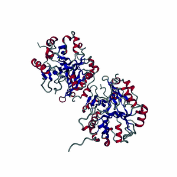
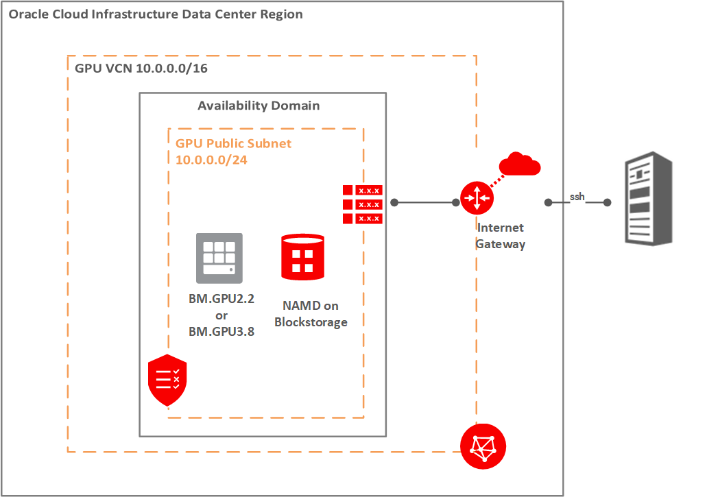

# NAMD Introduction

This Runbook provides the steps to deploy a GPU machine on Oracle Cloud Infrastructure, install NAMD, and run a model using NAMD software.

NAMD is a molecular dynamics software that simulates the movements of atoms in biomolecules under a predefined set of conditions. It is used to identify the behavior of these biomolecules when exposed to changes in temperature, pressure and other inputs that mimic the actual conditions encountered in a living organism. NAMD can be used to establish patterns in protein folding, protein-ligand binding, and cell membrane transport, making it a very useful application for drug research and discovery.

NAMD is built on Charm++ and Converse, and can run on high performance computers to execute parallel processing. It was developed by the University of Illinois. More information can be found [here](http://charm.cs.illinois.edu/research/moldyn).

## **Architecture**

The architecture for this runbook is simple, a single machine running inside of an OCI VCN with a public subnet.
Since a GPU instance is used, block storage is attached to the instance and installed with the NAMD application. The instance is located in a public subnet and assigned a public ip, which can be accessed via ssh.

## Acknowledgements
* **Author** - High Performance Compute Team
* **Contributors** -  Chris Iwicki, Harrison Dvoor, Gloria Lee, Selene Song, Bre Mendonca, Samrat Khosla
* **Last Updated By/Date** - Samrat Khosla, October 2020

## Need Help?
Please submit feedback or ask for help using our [LiveLabs Support Forum](https://community.oracle.com/tech/developers/categories/high-performance-computing-hpc). Please click the **Log In** button and login using your Oracle Account. Click the **Ask A Question** button to the left to start a *New Discussion* or *Ask a Question*.  Please include your workshop name and lab name.  You can also include screenshots and attach files.  Engage directly with the author of the workshop.

If you do not have an Oracle Account, click [here](https://profile.oracle.com/myprofile/account/create-account.jspx) to create one.