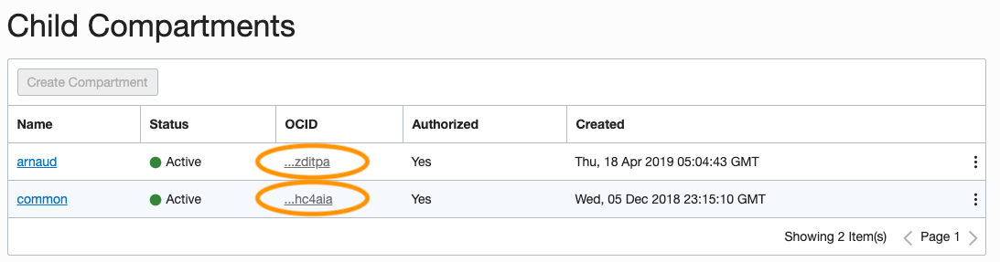
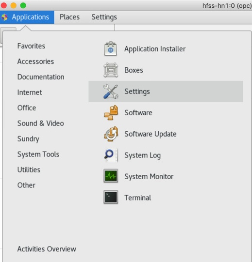

# Deployment

## Introduction

There are many different ways of deploying the architecture (which we talked about in the previous lab) in OCI. In this particular lab, we will cover three different methods for deployment. 

* **via Resource Manager** - The *resource Manager* let you deploy it from the console. Only relevant variables are shown but others can be changed in the zip file.
* **via Terraform** - *Terraform* is a scripting language for deploying resources. It is the foundation of the Resource Manager, using it will be easier if you need to make modifications to the terraform stack often.
* **via Web Console** - The *web console* let you create each piece of the architecture one by one from a webbrowser. This can be used to avoid any terraform scripting or using existing templates.

Estimated Lab Time: 30 minutes

### Objectives

In this lab:
* We will walk you through the different steps that you would need to deploy the architecture in OCI. 

### Prerequisites

* Familiarity with Oracle Cloud Infrastructure (OCI) is helpful
* Familiarity with networking is helpful

## ****OPTION 1****: Deployment through Resource Manager

1. **Log In**

    * You can start by logging in the Oracle Cloud console. If this is the first time, instructions to do so are available [here](https://docs.cloud.oracle.com/iaas/Content/GSG/Tasks/signingin.htm). Select the region in which you wish to create your instance. Click on the current region in the top right dropdown list to select another one.

   

2. **Resource Manager**

    * In the OCI console, there is a Resource Manager available that will create all the resources needed. The region in which you create the stack will be the region in which it is deployed.

    * Select the menu   on the top left, then select Resource Manager and Stacks.
        

    * Create a new stack:  

    * Download the [ZIP file](https://github.com/oci-hpc/oci-hpc-runbook-rocky/raw/master/Resources/rocky.zip) for Rocky and upload it as a stack.

    * Choose the Name and Compartment.


3. **Add Rocky Installer to Object Storage**

    * Select the menu on the top left, then select Object Storage and Object Storage.
         

    * Create a new bucket or select an existing one. To create one, click on  

    * Leave the default options: Standard as Storage tiers and Oracle-Managed keys. Click on  

    * Click on the newly created bucket name and then select  

    * Select your file and click  

    * Click on the 3 dots to the right side of the object you just uploaded   and select "Create Pre-Authenticated Request".

    * In the following menu, leave the default options and select an expiration date for the URL of your installer. Click on  

    * In the next window, copy the "PRE-AUTHENTICATED REQUEST URL" and keep it. You will not be able to retrieve it after you close this window. If you loose it or it expires, it is always possible to recreate another Pre-Authenticated Request that will generate a different URL.

4. **Select Variables**

    Click on 'Next' and fill in the following variables.  
    

    **Headnode:**

    * CLUSTER AVAILABILITY DOMAIN: Availability Domain of the headnode (1,2 or 3)
    * SHAPE OF THE HEADNODE: Shape of the Head Node which is also the Compute Node in our architecture (BM.GPU3.8)
    * VNC TYPE FOR THE HEADNODE: Visualization Type for the headnode: none, VNC or X11VNC

    **Visualization Nodes:**

    * NUMBER OF VISUALIZATION NODES: Number of visualization machines for Pre/Post
    * PASSWORD FOR THE VNC SESSIONS: password to use the VNC session on the Pre/Post Node 

    **Visualization Nodes Options:**

    * VNC TYPE FOR THE VISUALIZATION NODES: Visualization Type for the headnode: none, VNC or X11VNC
    * SHAPE OF THE VISUALIZATION NODES: Shape of the Visualization Node (VM.GPU2.1, BM.GPU2.2,...)
    * VISUALIZATION NODE AVAILABILITY DOMAIN: Availability Domain of the GPU Machine (1, 2 or 3)

    **File Storage:**

    * NVME SHARE DRIVE: Create a NFS shared drive from a NVMe disk on the headnode (Only available if headnode is BM.HPC2.36 or DENSE shapes)
    * BLOCK VOLUME SHARE DRIVE: Create a NFS shared drive from block storage.
    * FSS: Create a FSS to be accessible from all nodes.

    **Block Options:**

    * BLOCK VOLUME SIZE ( GB ): Size of the shared block volume

    **FSS Options**:

    * AVAILABILITY DOMAIN OF FSS: AD of the FSS mount


    **Rocky:**

    * URL TO DOWNLOAD ROCKY DEM: URL of the installer of Rocky (Leave blank if you wish to download later)
    * URL TO DOWNLOAD A MODEL TARBALL: URL of the model you wish to run (Leave blank if you wish to download later)
    * IP ADRESS OF THE LICENSE SERVER: IP Adress of the license server (Leave blank to enter manually)
    * LICENSE PORT: IP Adress of the license server (Leave blank to enter manually)
    * SHARE DRIVE FOR THE INSTALLER: Drive on which the installer will be installed (NVMe, Block or FSS)
    * SHARE DRIVE FOR THE MODEL: Drive on which the installer will be installed (NVMe, Block or FSS)


    Click on 

    Review the informations and click on 


5. **Run the stack**

    Now that your stack is created, you can run jobs.

    Select the stack that you created. In the "Terraform Actions" dropdown menu , run terraform apply to launch the cluster and terraform destroy to delete it.

    Click on 


6. **Access your Cluster**

    Once you have created your cluster, if you gave a valid URL for the Rocky installation, no other action will be needed except [running your jobs](https://github.com/oci-hpc/oci-hpc-runbook-rocky/blob/master/Documentation/STAR-CCM%2B.md#running-the-application).

    Public IP addresses of the created machines can be found on the lower left menu under Outputs.

    The Private Key to access the machines can also be found there. Copy the text in a file on your machine, let's say /home/user/key.

    ```
    <copy>
    chmod 600 /home/user/key
    ssh -i /home/user/key opc@ipaddress 
    </copy>
    ```

    Access to the GPU instances can be done through a SSH tunnel:

    ```
    <copy>
    ssh -i /home/user/key -x -L 5902:127.0.0.1:5900 opc@ipaddress
    </copy>
    ```

    And then connect to a VNC viewer with localhost:2.
    
    [More information](https://github.com/oci-hpc/oci-hpc-runbook-rocky/blob/master/Documentation/ManualDeployment.md#accessing-a-vnc) about using a VNC session.


## ****OPTION 2****: Deployment through Terraform Scripts

1. **Terraform Installation**

    Download the binaries on the [terraform website](https://www.terraform.io/) and unzip the package. Depending on your Linux distribution, it should be similar to this:

    ```
    <copy>
    tf_install_dir=~/tf_install_dir
    cd $tf_install_dir
    wget https://releases.hashicorp.com/terraform/0.12.0/terraform_0.12.0_linux_amd64.zip
    unzip terraform_0.12.0_linux_amd64.zip
    echo export PATH="\$PATH:$tf_install_dir" >> ~/.bashrc
    source ~/.bashrc    
    </copy>
    ```

    To check that the installation was done correctly: ``` terraform -version ``` should return the version

2. **Using Terraform:**

    **Configure**

    1. Download the [zip](https://github.com/oci-hpc/oci-hpc-runbook-rocky/raw/master/Resources/tf_rocky.zip) file and unzip the content.

    2. Edit the file terraform.tfvars for your settings, info can be found [on the terraform website](https://www.terraform.io/docs/providers/oci/index.html#authentication)

        * Tenancy_ocid
        * User_ocid
        * Compartment_ocid
        * Private_key_path
        * Fingerprint
        * Region

    **Note1: For Compartment_ocid: To find your compartment ocid, go to the menu and select Identity, then Compartments. Find the compartment and copy the ocid.**

    

    
 
    **Note2: The private_key_path and fingerprint are not related to the ssh key to access the instance. You can create using those [instructions](https://docs.cloud.oracle.com/iaas/Content/API/Concepts/apisigningkey.htm).**

    In the variable.tf file, you can change the availability domain, the shapes of the nodes, the number of visualization nodes, the VNC settings, Rocky installer URL,... The different variables are explained in the [Resource Manager section](https://github.com/oci-hpc/oci-hpc-runbook-rocky/blob/master/Documentation/ResourceManager.md#select-variables)
    


    **Run**

    ```
    <copy>
    cd <folder>
    terraform init
    terraform plan
    terraform apply   
    </copy>
    ```    

    If you wish to add or remove nodes after the setup has happened, just modify the variable in the variable.tf file and rerun the ```terraform apply``` command


    **Destroy**

    ```
    <copy>
    cd <folder>
    terraform destroy  
    </copy>
    ```    

3. **Access your Cluster**

    Once you have created your cluster, if you gave a valid URL for the Rocky installation, no other action will be needed except [running your jobs](https://github.com/oci-hpc/oci-hpc-runbook-rocky/blob/master/Documentation/STAR-CCM%2B.md#running-the-application).

    Public IP addresses of the created machines can be found on the lower left menu under Outputs.

    The key to log on to your cluster has been created in your main directory as key.pem

    ```
    <copy>
    ssh -i /home/user/key.pem opc@ipaddress
    </copy>
    ```

    Access to the visualization instances can be done through a SSH tunnel:

    ```
    <copy>
    ssh -i /home/user/key.pem -x -L 5902:127.0.0.1:5900 opc@ipaddress
    </copy>
    ```

    And then connect to a VNC viewer with localhost:2.
    
    [More information](https://github.com/oci-hpc/oci-hpc-runbook-rocky/blob/master/Documentation/ManualDeployment.md#accessing-a-vnc) about using a VNC session.

## ****OPTION 3****: Deployment via Web Console

1. **Log In**

    You can start by logging in the Oracle Cloud console. If this is the first time, instructions to do so are available [here](https://docs.cloud.oracle.com/iaas/Content/GSG/Tasks/signingin.htm). Select the region in which you wish to create your instance. Click on the current region in the top right dropdown list to select another one.

    

2. **Virtual Cloud Network**

    Before creating an instance, we need to configure a Virtual Cloud Network. Select the menu on the top left, then select Networking and Virtual Cloud Networks.

    On the next page, select the following:

    * Name of your VCN
    * Compartment of your VCN
    * Choose "CREATE VIRTUAL CLOUD NETWORK PLUS RELATED RESOURCES"

    Scroll all the way down and 

    Close the next window.

3. **Compute Instance**

    Create a new instance by selecting the menu on the top left, then select Compute and Instances.

    

    On the next page, select 

    On the next page, select the following:

    * Name of your instance
    * Availibility Domain: Each region has multiple availability domain. Some instance shapes are only available in certain AD.
    * Change the image source to CentOS 7 or Oracle Linux 7.6.
    * Instance Type: Select Bare metal
    * Instance Shape:
        * For 8 V100 GPU, select BM.GPU3.8
        * For 2 P100 GPU, select BM.GPU2.2
        * For CPUs, select BM.HPC2.36
        * Other shapes are available as well, [click for more information](https://cloud.oracle.com/compute/bare-metal/features).
    * SSH key: Attach your public key file. For more information, click [here](https://cloud.oracle.com/compute/bare-metal/features).
    * Virtual Cloud Network: Select the network that you have previsouly created.

    Click 

    After a few minutes, the instances will turn green meaning it is up and running. You can now SSH into it. After clicking on the name of the instance, you will find the public IP. You can now connect using ``` ssh opc@xx.xx.xx.xx ``` from the machine using the key that was provided during the creation.

    **If you are using Oracle Linux 7.6 on a machine with GPU's, during instance definition, select the advanced options at the bottom, select image and make sure to take one that contains GPU in its name. That will remove the need to install any driver**


4. **Block Storage**

    **If you are running an HPC shape to run Rocky on CPUs, you can skip this part as you already have local storage on your machine. However, you will still need to mount it Create a new Block Volume by selecting the menu  on the top left, then select Block Storage and Block Volumes.**

    Click 

    On the next page, select the following:

    * Name
    * Compartment
    * Size (in GB)
    * Availability Domain: Make sure to select the same as your Compute Instance.

    Click 

    Select the menu  on the top left, then select Compute and Instances.

    Click on the instance to which the drive will be attached.

    On the lower left, in the Ressources menu, click on "Attached Block Volumes"

    

    Click 

    All the default setting will work fine. Select the Block Volume that was just created and select /dev/oracleoci/oraclevdb as device path. Click 
 
    **Note: If you do not see the Block Volume, it may be because you did not place it in the same AD as your running instance**

    Once it is attached, hit the 3 dots at the far right of the Block Volume description and select "iSCSi Commands and Information"

    

    Copy the command to attach it to the instance.
    
    


    Those commands will be used to mount the Block Volume to the instance. Log in to the machine ``` ssh opc@xx.xx.xx.xx ``` as seen at the end of the previous section.

5. **Mounting a drive**

    If you have local NVMe storage or if you have attached a block storage as seen in the previous section. You will need to mount it to your running instance to be able to use it.

    After logging in using ssh, run the command lsblk. The drive should be listed with the NAME on the left (Probably sdb for block and nvme0n1 for local storage, refered to as DNAME in the next commands)

    Format the drive:

    ```
    <copy>
    sudo mkfs -t ext4 /dev/DNAME
    </copy>
    ```

    Create a directory and mount the drive to it.

    ```
    <copy>
    sudo mkdir /mnt/disk1
    sudo mount /dev/DNAME /mnt/disk1
    sudo chmod 777 /mnt/disk1
    </copy>
    ```
    

6. **Creating a Network File System**

    In case you want to have a visualization node that is different from your main compute node/ head node. You should share the drive between the machines.

    * **Headnode**  

        Since the headnode is in a public subnet, we will keep the firewall up and add an exception through.

        ```
        <copy>
        sudo firewall-cmd --permanent --zone=public --add-service=nfs
        sudo firewall-cmd --reload
        </copy>
        ```

        We will also activate the nfs-server:

        ```
        <copy>
        sudo yum -y install nfs-utils
        sudo systemctl enable nfs-server.service
        sudo systemctl start nfs-server.service
        </copy>
        ```

        Edit the file /etc/exports with vim or your favorite text editor. ``` sudo vi /etc/exports ``` and add the line ``` /mnt/share 10.0.0.0/16(rw) ```

        To activate those changes:

        ```
        <copy>
        sudo exportfs -a
        </copy>
        ```

    * **Visualization Node**  

        We will also install the nfs-utils tools and mount the drive. You will need to grab the private IP address of the headnode. You can find it in the instance details in the webbrowser where you created the instances, or find it by running the command ```ifconfig``` on the headnode. It will probably be something like 10.0.0.2, 10.0.1.2 or 10.0.2.2 depending on the CIDR block of the public subnet.

        ```
        <copy>
        sudo firewall-cmd --permanent --zone=public --add-service=nfs
        sudo firewall-cmd --reload
        sudo yum -y install nfs-utils
        sudo mkdir /mnt/share
        sudo mount 10.0.0.2:/mnt/share /mnt/share
        </copy>
        ```


7. **Adding a GPU Node for pre/post processing**

    Rocky DEM can let you take advantage of the power of GPUs for post-processing your model. We can turn a GPU node on demand while the simulation is done.

    Create a new instance by selecting the menu  on the top left, then select Compute and Instances.

    

    On the next page, select 

    On the next page, select the following:

    * Name of your instance
    * Availibility Domain: Each region has multiple availability domain. Some instance shapes are only available in certain AD.
    * Change the image source to Oracle Linux 7.6
    * Instance Type: Select Bare metal for BM.GPU2.2 or Virtual Machine for VM.GPU2.1
    * Instance Shape:
        * BM.GPU2.2
        * VM.GPU2.1
        * BM.GPU3.8
        * VM.GPU3.*
        * Other shapes are available as well, [click for more information](https://cloud.oracle.com/compute/bare-metal/features). 
    * SSH key: Attach your public key file. [For your more information].(https://docs.cloud.oracle.com/iaas/Content/GSG/Tasks/creatingkeys.htm)
    * Virtual Cloud Network: Select the network that you have previsouly created. In the case of a cluster: Select the public subnet.

    Click 

    After a few minutes, the instances will turn green meaning it is up and running. You can now SSH into it. After clicking on the name of the instance, you will find the public IP. You can now connect using ```ssh opc@xx.xx.xx.xx``` from the machine using the key that was provided during the creation.

    Use SSH to remote login to the machine and mount the share drive as show before:

    ```
    <copy>
    sudo firewall-cmd --permanent --zone=public --add-service=nfs
    sudo firewall-cmd --reload
    sudo yum -y install nfs-utils
    sudo mkdir /mnt/share
    sudo mount 10.0.0.2:/mnt/share /mnt/share
    </copy>
    ```

    You will need to follow the steps to set up a VNC session described below.

8. **Set up a VNC**

    If you used terraform to create the cluster, this step has been done already for the GPU instance.

    By default, the only access to the machines is through SSH in a console mode. If you want to see the Rocky DEM interface, you will need to set up a VNC connection. The following script will work for the default user opc. The password for the vnc session is set as "password" but it can be edited in the next commands.

    ```
    <copy>
    sudo yum -y groupinstall "Server with GUI"
    sudo yum -y install tigervnc-server mesa-libGL
    sudo systemctl set-default graphical.target
    sudo cp /usr/lib/systemd/system/vncserver@.service /etc/systemd/system/vncserver@:0.service
    sudo sed -i 's/<USER>/opc/g' /etc/systemd/system/vncserver@:0.service
    sudo mkdir /home/opc/.vnc/
    sudo chown opc:opc /home/opc/.vnc
    echo "password" | vncpasswd -f > /home/opc/.vnc/passwd
    chown opc:opc /home/opc/.vnc/passwd
    chmod 600 /home/opc/.vnc/passwd
    sudo systemctl start vncserver@:0.service
    sudo systemctl enable vncserver@:0.service
    </copy>
    ```

9. **Accessing a VNC**

    We will connect through an SSH tunnel to the instance. On your machine, connect using ssh

    ```
    <copy>
    ssh -x -L 5902:127.0.0.1:5900 opc@public_ip
    </copy>
    ```

    You can now connect using any VNC viewer using localhost:2 as VNC server and the password you set during the vnc installation.

    If you would rather connect without a SSH tunnel. You will need to open ports 5900 and 5901 on the Linux machine both in the firewall and in the security list.

    ```
    <copy>
    sudo firewall-offline-cmd --zone=public --add-port=5900-5901/tcp
    </copy>
    ```
    Select the menu  on the top left, then select Networking and Virtual Cloud Networks. 

    

    Select the VCN that you created. Select the Subnet in which the machine reside, probably your public subnet. Select the security list.

    Click 

    * CIDR : 0.0.0.0/0
    * IP PROTOCOL: TCP
    * Source Port Range: All
    * Destination Port Range: 5900-5901 Click 

    Now you should be able to VNC to the address: ip.add.re.ss:5900

    Once you accessed your VNC session, you should go into Applications, then System Tools Then Settings.

    

    In the power options, set the Blank screen timeout to "Never". If you do get locked out of your user session, you can ssh to the instance and set a password for the opc user.

    ```
    <copy>
    sudo passwd opc 
    </copy>
    ```


## Acknowledgements
* **Author** - High Performance Compute Team
* **Contributors** -  Chris Iwicki, Harrison Dvoor, Gloria Lee, Selene Song, Bre Mendonca, Samrat Khosla
* **Last Updated By/Date** - Samrat Khosla, October 2020

