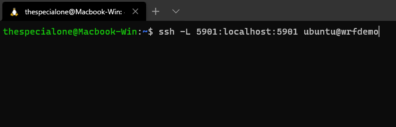
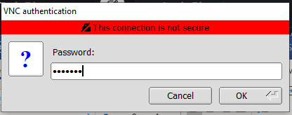
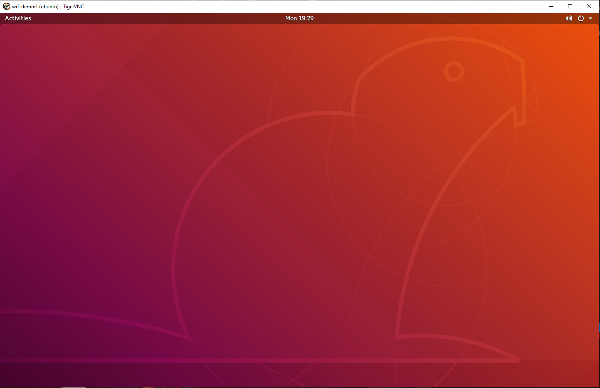
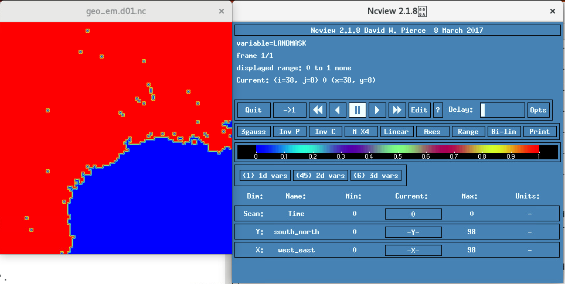
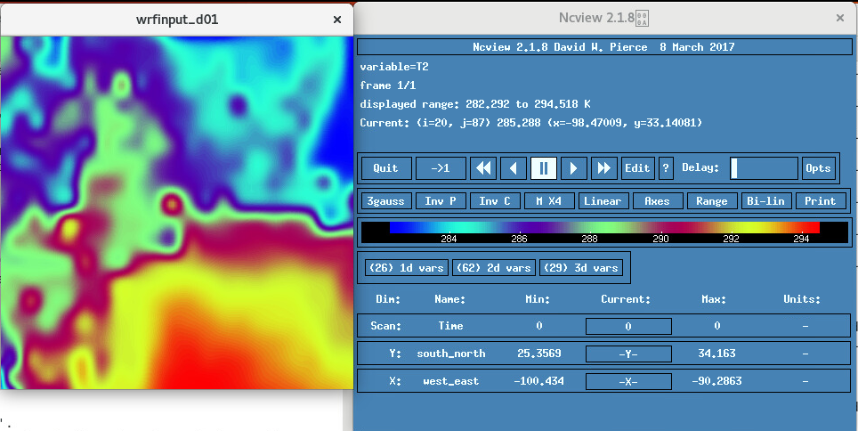

# Changing Experiment Data with WRF

## Introduction
This is a smaller guide in comparison to the WRF Setup, Installation, and Run Guide. It is intended to be used after you have completed WRF Setup, Installation, and Run Guide or used the download link to get started using a custom image with WRF 4.1.5 and WPS 4.1 already set up.

Estimated Lab Time: 45 minutes
### Objectives
In this lab, you will learn about:

* Creating WRF domain with Geogrid
* Downloading GFS data and running Ungrib and Metgrid
* Running WRF with real data

### Prerequisites

This lab assumes you have:
- An Oracle Free Tier or Paid Cloud account
- Access to an Ubuntu 18.04 CPU instance as covered in labs 1 and 2  
    -  Note for this lab we will be using a **VM.Standard2.16 shape**. You can use a smaller shape if you 
    desire.
- Have gone through the WRF Setup, Installation, and Run Guide or downloaded the custom image provided there or [here](https://objectstorage.us-ashburn-1.oraclecloud.com/p/lRqMYYN5VTdSgBz9f8nv7Tz5mzMGMqr7wlN2Y_q6g6GHmTdc9GX8lokgmTui81BA/n/hpc_limited_availability/b/Demo_Materials/o/WRF_DEMOV2).
    - **Note**: Ubuntu password is ppkkego and vnc password is ppkkego  
    They can be changed with the following commands in the remote terminal:

        ```
        <copy>
        sudo passwd ubuntu
        sudo vncpasswd
        </copy> 
        ```


## **STEP 1**: Connecting to the Gnome Desktop
We will be using [TigerVNC Viewer](https://tigervnc.org/) to connect to our instance.

1. Open a local terminal
    
    Run the following command with information pertaining to your instance: ssh -L 5901:localhost:5901 ubuntu@IPADDRESS
    

2. Start vncserver session  
    vncserver  
    
3. Open TigerVNC Viewer

    VNC server: localhost:1  
    Then click connect  
    
4. Enter in your VNC password  
   Then click OK   
        

5. You will finally be presented with a gnome desktop and you should continue working from here.  
    

## **STEP 2**: Creating Geographical area / Domain
1. We need to adjust the namelist.wps file to zero in on a location of choice. It will be a small grid (10,000 x 10,000 meters) with Houston Texas USA as the centerpoint.  
   
    ```
    <copy>
    cd ~/WRF/WPS-4.1
    vi namelist.wps
    </copy>
    ```  
    **Please change all the values below to your liking based on your experiment**.  
    - `max_dom` An integer specifying the total number of domains, including the parent domain, in the simulation. Default value is 1.  
    - `e_we`: Integers specifying the full west-east dimension of your grid. No default value.  
    - `e_sn`: Integers specifying the full south-north dimension of your grid. No default value.  
    - `dx`:  A real value specifying the grid distance (in meters) in the x-direction where the map scale factor is 1.  
    - `dy`: A real value specifying the grid distance (in meters) in the y-direction where the map scale factor is 1.  
    - `ref_lat`: A real value specifying the latitude part of a (latitude, longitude) location whose (i,j) location in the simulation domain is known.  
    - `ref_lon`: A real value specifying the longitude part of a (latitude, longitude) location whose (i, j) location in the simulation domain is known.   
    - `truelat1`: A real value specifying the first true latitude for the Lambert conformal projection, or the only true latitude for the Mercator and polar stereographic projections.   
    - `truelat2`: A real value specifying the second true latitude for the Lambert conformal conic projection.   
    - `stand_lon`: A real value specifying the longitude that is parallel with the y-axis in the Lambert conformal and polar stereographic projections. For the regular latitude-longitude projection, this value gives the rotation about the earth's geographic poles.    
    - `geog_data_path`: A character string giving the path, either relative or absolute, to the directory where the geographical data directories may be found.
    
    ```
    <copy>
    &share  
    wrf_core = 'ARW',  
    max_dom = 1,  
    start_date = '2006-08-16_12:00:00','2006-08-16_12:00:00',  
    end_date   = '2006-08-16_18:00:00','2006-08-16_12:00:00',  
    interval_seconds = 21600  
    io_form_geogrid = 2,  
    /  
    &geogrid  
    parent_id         =   1,   1,  
    parent_grid_ratio =   1,   3,  
    i_parent_start    =   1,  31,  
    j_parent_start    =   1,  17,  
    e_we              =  100, 112,  
    e_sn              =  100,  97,  
    !  
    !!!!!!!!!!!!!!!!!!!!!!!!!!!!!!!!!!!!!!!!!!!!!! IMPORTANT NOTE !!!!!!!!!!!!!!!!!!!!!!!!!!!!!!!!!!!!!!!!!!!!!!  
    ! The default datasets used to produce the MAXSNOALB and ALBEDO12M  
    ! fields have changed in WPS v4.0. These fields are now interpolated  
    ! from MODIS-based datasets.  
    !  
    ! To match the output given by the default namelist.wps in WPS v3.9.1,  
    ! the following setting for geog_data_res may be used:  
    !  
    ! geog_data_res = 'maxsnowalb_ncep+albedo_ncep+default','maxsnowalb_ncep+albedo_ncep+default',  
    !  
    !!!!!!!!!!!!!!!!!!!!!!!!!!!!!!!!!!!!!!!!!!!!!! IMPORTANT NOTE !!!!!!!!!!!!!!!!!!!!!!!!!!!!!!!!!!!!!!!!!!!!!!  
    !  
    geog_data_res = 'default','default',  
    dx = 10000,  
    dy = 10000,  
    map_proj = 'lambert',  
    ref_lat   =  41.87,  
    ref_lon   = -87.62,  
    truelat1  =  41.87,  
    truelat2  =  41.87,  
    stand_lon = -87.62,  
    geog_data_path = '~/WRF/GEOG/'  
    /  
    </copy>
    ```
    **To exit, simply press esc, then shift: followed by wq enter**  
    **All of these changes are for a geographic area with Houston TX as the epicenter.**  
    
2. Now that we have put in the information for our geographic area of interest (This guide uses Houston TX USA as the centerpoint) lets use ncview to verify we have the correct location after runing the geogrid program.
    
    ```
    <copy>
    ./geogrid.exe
    ncview geo_em.d01.nc
    </copy>
    ``` 
3. Use the 2d var to check landmask to verify location. If satisfied with image then we are done creating domain.

    


## **STEP 3**: Adding Meteorological Data to Geographical area / Domain
After setting up our geographic area or domain. We now need to obtain meteorological data to overlay on to the domain.

1. In a web browser navigate to  https://nomads.ncep.noaa.gov/pub/data/nccf/com/gfs/prod/
2. Click the link with the latest date (ex gfs.20201120/ as today is November 20th, 2020) 
3.	Choose 00  
`Don’t actually download anything.` We will create a script for that. We are going the lower resolution for an easier to handle datasize for this lab so 0p50 instead of 0p25. Use 0p25 if you have additional storage and want higher resolution/more reliable data. Need to download the number of files for the amount of time you want to run. Each file is one hour of data at given interval. EX if you want to run for six hours you need gfs.t00z.pgrb2.0p50.f000, gfs.t00z.pgrb2.0p50.f003, and gfs.t00z.pgrb2.0p50.f006. 0p25 is in one hour steps and 0p50 is in 3 hour steps. For tutorial we will use only 6 hours worth of data. Feel free to use more as you become more comfortable using WRF later on.

4. Lets navigate to the correct directory and edit pre-created script to download data.
    
    ```
    <copy>
    cd ~/WRF
    cd scripts
    vi download_gfs.sh
    </copy>
    ```
    The script will be the following:  
    You just need to edit the `year`, `month`, and `day` for the data you wish to download.  
    
    ```
    <copy>
    #!/bin/bash  

    inputdir=/home/ubuntu/WRF/GFS  
    rm -rf $inputdir  
    mkdir $inputdir  

    year=2020  
    month=12  
    day=09  
    cycle=00  

    for ((i=000; i<=006; i+=3))  
    do  
            ftime=`printf "%03d\n" "${i}"`  
            server=https://nomads.ncep.noaa.gov/pub/data/nccf/com/gfs/prod  
            directory=gfs.${year}${month}${day}/${cycle}  
            file=gfs.t${cycle}z.pgrb2.0p50.f${ftime}  
            url=${server}/${directory}/${file}  
            echo $url  
            wget -O ${inputdir}/${file} ${url}  
    done
    </copy>  
    ```
    **To exit, simply press esc, then shift: followed by wq enter**   
    **This script will download SIX hours of data for the date 12/09/20 at the 0p50 resolution. Please adjust to fit your needs.**  

5. The following commands make the script executable and run it to download the data:
    
    ```
    <copy>
    chmod +x download_gfs.sh
    ./download_gfs.sh
    </copy>
    ```
6. Now that we have downloaded our data, lets go through the process of overlaying it over our domain. We will use ungrib and metgrid to accomplish this.  We will break this up into two sections: a configure  and a run section.

    **Configure:**
    
    ```
    <copy>
    cd ~/WRF/WPS-4.1
    rm ./Vtable
    ln -s ungrib/Variable_Tables/Vtable.GFS ./Vtable
    ./link_grib.csh ~/WRF/GFS/
    vi namelist.wps 
    </copy> 
    ```
    **Please change all the values below based on the files you downloaded**.  
    - `start_date` in the form: Year-Month-Day_hour:minute:second  
    - `end_date`  in the form: Year-Month-Day_hour:minute:second  
    - `interval seconds`: The integer number of seconds between time-varying meteorological input files. No default value.
        
    ```
    <copy>
    &share  
    wrf_core = 'ARW',  
    max_dom = 1,  
    start_date = '2020-12-09_00:00:00',         # start time  
    end_date   = '2020-12-09_06:00:00',         #6 hours later than start time  
    interval_seconds = 10800                    #3 hours worth of seconds interval between steps  
    io_form_geogrid = 2,  
    /
    </copy>
    ```

    **To exit, simply press esc, then shift: followed by wq enter**  

    **Run:**
    
    ```
    <copy>
    ./ungrib.exe
    rm ./METGRID.TBL 
    ln -s metgrid/METGRID.TBL.ARW ./METGRID.TBL
    ./metgrid.exe
    </copy>
    ```
7. We can look at the results by using ncview and looking at skintemp to see the value of the data downloaded.
    
    ```
    <copy>
    ncview met_em.d01.2020-12-09_00\:00\:00.nc 
    </copy>
    ```
    

## **STEP 4**: Running Real and WRF
1. We have downloded data to represent a geographic location and we have added meteorological data to it; its finally time to run WRF using real data.

    ```
    <copy>
    cd ~/WRF/WRF-4.1.5
    cd run
    rm met_em*
    ln -s ../../WPS-4.1/met_em* .  
    vi namelist.input
    </copy>
    ```
2. In the namelist.input file we need to edit the contents to reflect our geographic area/domain and our date and interval.  
**Please change all the values to your liking based on your experiment**.  
    - `run_days`: Run time in days.
    - `run_hours`: Run time in hours. **Note**: if it is more than 1 day, you may use both run_days and run_hours or just run_hours. e.g. if the total run length is 36 hrs, you may set run_days = 1, and run_hours = 12, or run_days = 0, and run_hours = 36.
    - `run_minutes`: Run time in minutes.
    - `run_seconds`: Run time in seconds.
    - `start_year`: A 4 digit year of starting time.  
    - `start_month`: A 2 digit month of starting time.  
    - `start_day`: A 2 digit day of starting time.  
    - `start_hour`: A 2 digit hour of starting time.    
    - `end_year`: A 4 digit year of ending time.  
    - `end_month`: A 2 digit month of ending time.  
    - `end_day`: A 2 digit day of ending time.  
    - `end_hour`: A 2 digit hour of ending time.  
    - `interval_seconds`: The time interval between the incoming real data, which will be the interval between the lateral boundary condition file.  
    - `e_we`: The end index in x (west_east) direction (staggered dimension).  
    - `e_sn`: The end index in y (south-north) direction (staggered dimension).     
    - `e_vert`: end index in z (vertical) direction (staggered dimension -- this refers to full levels).   
    - `dx`:  The grid length in x-direction (in meters).  
    - `dy`: grid length in y-direction (in meters).

    ```
    <copy>
    &time_control
    run_days                            = 0,
    run_hours                           = 6,
    run_minutes                         = 0,
    run_seconds                         = 0,
    start_year                          = 2020, 2000, 2000,
    start_month                         = 12,   01,   01,
    start_day                           = 09,   24,   24,
    start_hour                          = 00,   12,   12,
    end_year                            = 2020, 2000, 2000,
    end_month                           = 12,   01,   01,
    end_day                             = 09,   25,   25,
    end_hour                            = 06,   12,   12,
    interval_seconds                    = 10800
    input_from_file                     = .true.,.true.,.true.,
    history_interval                    = 60,  60,   60,
    frames_per_outfile                  = 1, 1000, 1000,                                        
    restart                             = .false.,
    restart_interval                    = 7200,
    io_form_history                     = 2
    io_form_restart                     = 2
    io_form_input                       = 2
    io_form_boundary                    = 2
    /

    &domains
    time_step                           = 60,
    time_step_fract_num                 = 0,
    time_step_fract_den                 = 1,
    max_dom                             = 1,
    e_we                                = 100,    112,   94,
    e_sn                                = 100,    97,    91,
    e_vert                              = 40,    33,    33,
    p_top_requested                     = 5000,
    num_metgrid_levels                  = 34,
    num_metgrid_soil_levels             = 4,
    dx                                  = 10000, 10000,  3333.33,
    dy                                  = 10000, 10000,  3333.33,
    grid_id                             = 1,     2,     3,
    parent_id                           = 0,     1,     2,
    i_parent_start                      = 1,     31,    30,
    j_parent_start                      = 1,     17,    30,
    parent_grid_ratio                   = 1,     3,     3,
    parent_time_step_ratio              = 1,     3,     3,
    feedback                            = 1,
    smooth_option                       = 0
    /

    &physics
    physics_suite                       = 'CONUS'
    mp_physics                          = -1,    -1,    -1,
    cu_physics                          = -1,    -1,     0,
    ra_lw_physics                       = -1,    -1,    -1,
    ra_sw_physics                       = -1,    -1,    -1,
    bl_pbl_physics                      = -1,    -1,    -1,
    sf_sfclay_physics                   = -1,    -1,    -1,
    sf_surface_physics                  = -1,    -1,    -1,
    radt                                = 30,    30,    30,
    bldt                                = 0,     0,     0,
    cudt                                = 5,     5,     5,
    icloud                              = 1,
    num_land_cat                        = 21,
    sf_urban_physics                    = 0,     0,     0,
    /

    &dynamics
    hybrid_opt                          = 2,
    w_damping                           = 1,
    diff_opt                            = 1,      1,      1,
    km_opt                              = 4,      4,      4,
    diff_6th_opt                        = 0,      0,      0,
    diff_6th_factor                     = 0.12,   0.12,   0.12,
    base_temp                           = 290.
    damp_opt                            = 3,
    zdamp                               = 5000.,  5000.,  5000.,
    dampcoef                            = 0.2,    0.2,    0.2
    khdif                               = 0,      0,      0,
    kvdif                               = 0,      0,      0,
    non_hydrostatic                     = .true., .true., .true.,
    moist_adv_opt                       = 1,      1,      1,
    scalar_adv_opt                      = 1,      1,      1,
    gwd_opt                             = 0,
    /

    &bdy_control
    spec_bdy_width                      = 5,
    specified                           = .true.
    /

    &namelist_quilt
    nio_tasks_per_group = 0,
    nio_groups = 1,
    /
    </copy>
    ```
    **To exit, simply press esc, then shift: followed by wq enter**  

3. Now we can finally run real.exe and wrf.exe. This program takes a while to run. To help speed this up, we will use MPI to run the programs on multiple cores of our shape. Remember this guide was written using a VM.Standard2.16 shape, so we will run real.exe on 2 cores.

    ```
    <copy>
    cat /proc/cpuinfo #To get cpu infor (use if you forgot your OCI shape).
    mpirun -n 2 ./real.exe #This has real.exe running on two cores
    cat rsl.out.0000 #Use this command check for errors
    </copy>
    ```

4. We can look at the results by using ncview and looking at T2 to see the value of the data downloaded.
   
    ```
    <copy>
    ncview wrfinput_d01
    </copy>
    ```
    Here you can see the temperature at two meters for the target area.
      
    

5. We have our input, now lets use it to generate a prediction. We will run real.exe using 10 cores.

    ```
    <copy>
    mpirun -n 10 ./wrf.exe #This will run on 10 cores
    tail -F rsl.out.0000 #can be used to check for errors and progress.
    </copy>
    ```
6. We can look at the results of our prediction with ncview with the following:

    ```
    <copy>
    ncview wrfout_d01_2020-11-20_06\:00\:00 
    </copy>
    ```
      
From our prediction you can see that some changes have occured when we look at the same area six hours later. There are many variables to explore, so have fun.

## Acknowledgements
* **Author** - Brian Bennett, Solution Engineer, Big Compute
* **Last Updated By/Date** - Brian Bennett, Big Compute, December 2020

## Need Help?
Please submit feedback or ask for help using our [LiveLabs Support Forum](https://community.oracle.com/tech/developers/categories/high-performance-computing-hpc). Please click the **Log In** button and login using your Oracle Account. Click the **Ask A Question** button to the left to start a *New Discussion* or *Ask a Question*.  Please include your workshop name and lab name.  You can also include screenshots and attach files.  Engage directly with the author of the workshop.

If you do not have an Oracle Account, click [here](https://profile.oracle.com/myprofile/account/create-account.jspx) to create one.