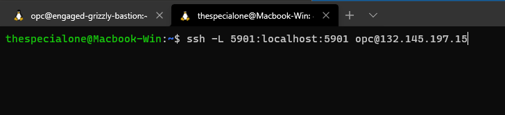
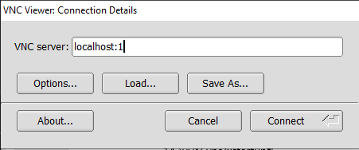
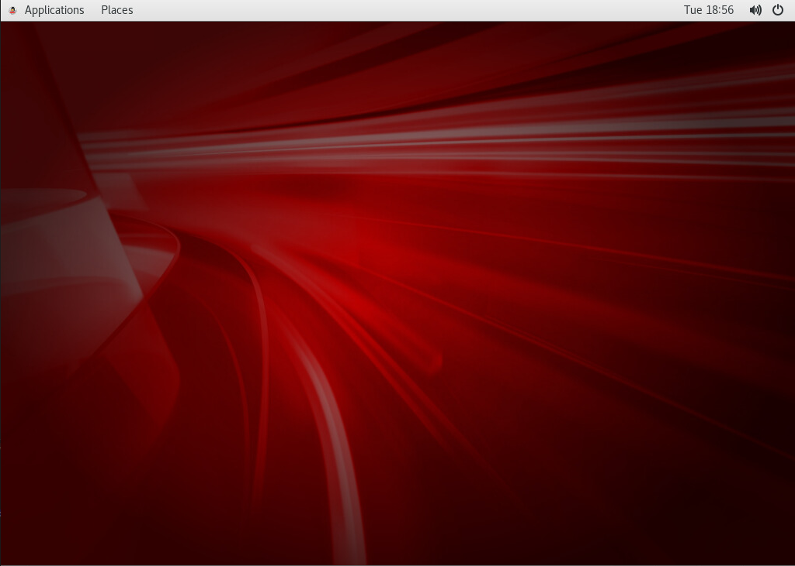
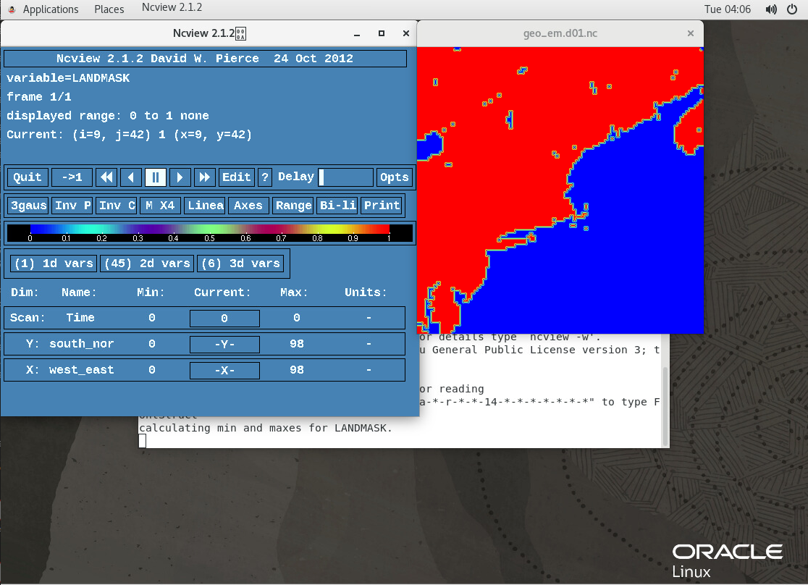
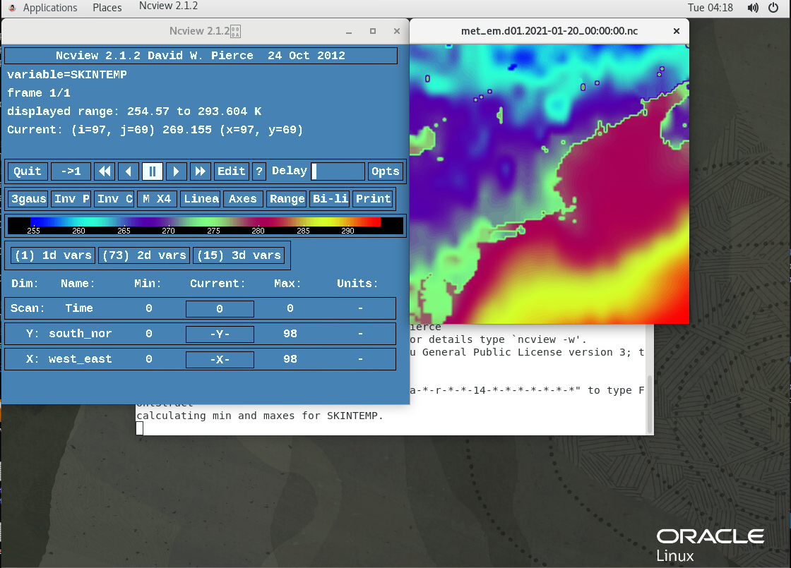
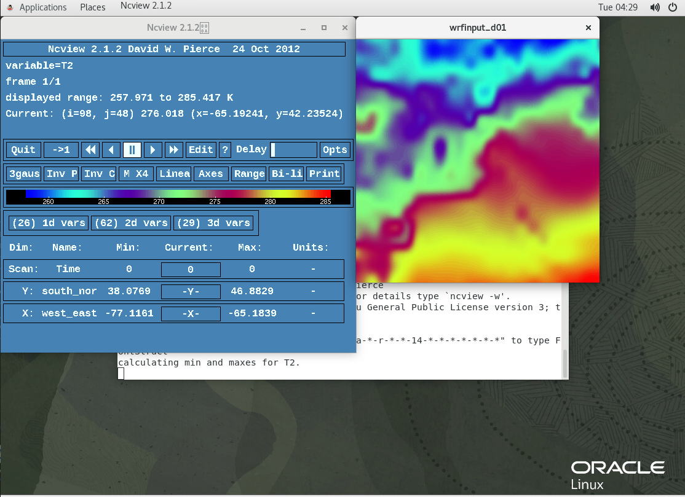
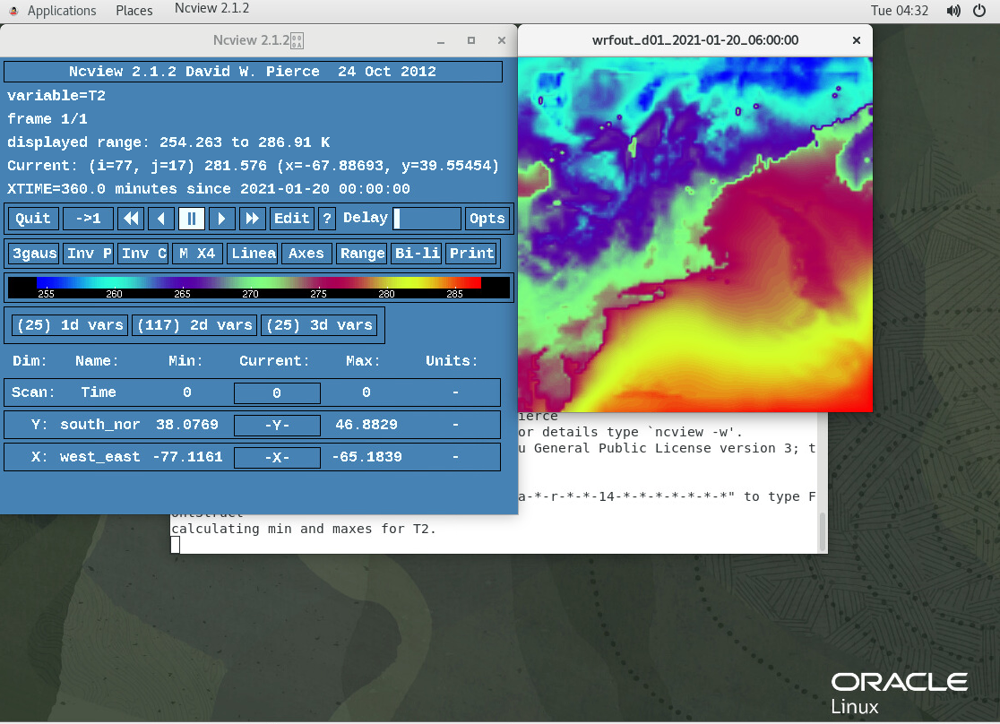

# WRF Setup, Installation, and Run on HPC Cluster

## Introduction
This lab is going to discuss and guide you through how to set up and run a WRF cluster on OCI infrastructure. This guide is intended to show you how to create a two node HPC cluster to setup environment where you will be able to run experiments and weather simulations.

Estimated Lab Time:  90 minutes

### Objectives
In this lab, you will learn about:
* Deploying a two node HPC Cluster
* Downloading dependencies and WRF/WPS
* Compiling libraries for WRF/WPS
* Compiling WRF and WPS
* Creating WRF domain with Geogrid
* Downloading GFS data and running Ungrib and Metgrid
* Running WRF with real data

### Prerequisites

This lab assumes you have:
- An Oracle Trial or Paid Cloud account  
- Note for this lab we will be using two **BM.HPC2.36** nodes for our cluster and a VM.Standard2.4 for our Bastion.

## **STEP 1**: Setup HPC Infrastructure

1. Use the navigation menu on the left and navigate to **Solutions and Platform** > Marketplace > Applications.
2. In the searchbar type HPC, then press your ENTER/Return key.
3. In the All Applications section, choose HPC Cluster. and then launch the stack. It should should look the image on the left followed by the image on the right.  
     
4. In the create stack menu, give a name and description as appropriate then click next.
5. Choose an AD, paste in your SSH key and leave the CONFIGURE NFS SHARE box checked.
6. For the Bastion choose the same AD as the cluster and choose the **VM.Standard.2.4** shape, then click NEXT.
7. At the review screen, double check all the information you have entered, then click create.

## **STEP 2**: Setup Gnome Desktop

1. There are a number of different desktop technologies you can use, but this guide will go over setting up and congifuring Gnome desktop as it is the default for Oracle Linux. The following steps will download, install, and configure Gnome Desktop for our Oracle Linux 7 Bastion instance.

    ```
    <copy>
    sudo yum groupinstall "server with gui"
    Y
    sudo yum install tigervnc-server
    Y
    vncserver # DO NOT MAKE READ ONLY and password should be no greater than 8 characters
    </copy>
    ```
2. Open a local terminal  
    Run the following command with information pertaining to your instance: ssh -L 5901:localhost:5901 opc@IPADDRESS
    
3. Open TigerVNC Viewer
    Type `localhost:1` in the VNC Server: section  
    Then click connect  
    
3. Enter in your VNC password  
   Then click OK   
        

4. You will finally be presented with a gnome desktop and you should continue working from here.  
        

## **STEP 3**: Configuring Oracle Linux
1. Now that we can access the desktop environment of our instance we can begin to configure it to run WRF. To begin lets install the dependencies we will need to go forward. Click Applications on the top left, click System Tools, then click Terminal. Perform the following in the terminal.  
    
    ```
    <copy>
    sudo yum update -y
    sudo yum upgrade -y
    sudo yum group install "Development Tools" -y
    sudo yum install ncview -y
    sudo yum install mc -y
    </copy>
    ```

## **STEP 4**: Downloading and Compiling libraries for WRF
Now that we have installed most dependencies we will need for WRF, lets begin to compile the libraries WRF needs to function.
### Creating folder structure and downloading libraries
1. Enter in the following commands in the remote terminal to begin setting up the required folder structure.  
    
    ```
    <copy>  
    cd /mnt/nfs-share
    mkdir WRF
    cd WRF
    mkdir downloads
    cd downloads
    </copy>
    ```
2. In the downloads directory lets download all the libraries we need with the following commands.  

    ```
    <copy>
    curl -O ftp://ftp.unidata.ucar.edu/pub/netcdf/old/netcdf-4.1.2.tar.gz  
    curl -O https://www.zlib.net/zlib-1.2.11.tar.gz  
    curl -O ftp://ftp.simplesystems.org/pub/libpng/png/src/libpng16/libpng-1.6.37.tar.gz  
    curl -O https://www2.mmm.ucar.edu/wrf/OnLineTutorial/compile_tutorial/tar_files/jasper-1.900.1.tar.gz  
    curl -O https://www.mpich.org/static/downloads/3.3.2/mpich-3.3.2.tar.gz
    </copy>
    ```
3. Insteading of unziping the files one by one, lets use a **loop** to do it for us then go back to our WRF directory.  

    ```
    <copy>
    for i in *.gz ; do tar -xzf $i ; done
    cd /mnt/nfs-share/WRF  
    </copy>
    ```
4. Now that we are back into the WRF directory, lets set up the folder structure for our libraries for WRF. WE will also create an environmental variable to reference the library path to be used later in the guide.  

    ```
    <copy>
    mkdir libs  
    cd libs  
    mkdir netcdf  
    mkdir mpich  
    mkdir grib2 # (this will be used for the jasper, libpng, and zlib libraries)  
    export LIBDIR=/mnt/nfs-share/WRF/libs
    </copy>
    ```
### Compiling grib2 library
The grib2 library is actually a compilation of three separate libraries, specifically, zlib, jasper, and libpng.    

5. Compiling Zlib  
    
    ```
    <copy> 
    cd /mnt/nfs-share/WRF/downloads
    cd zlib-1.2.11
    ./configure --prefix=$LIBDIR/grib2
    make
    make install
    </copy>
    ```   
6. Compiling libpng  
    
    ```
    <copy>
    cd /mnt/nfs-share/WRF/downloads
    cd libpng-1.6.37/
    ./configure --prefix=$LIBDIR/grib2 LDFLAGS="-L$LIBDIR/grib2/lib" CPPFLAGS="-I$LIBDIR/grib2/include"
    make
    make install
    </copy>
    ```
7. Compiling jasper  

    ```
    <copy>
    cd /mnt/nfs-share/WRF/downloads
    cd jasper-1.900.1/
    ./configure --prefix=$LIBDIR/grib2
    make
    make install
    </copy>
    ```

### Compiling Netcdf and Mpich libraries
8. Compiling netcdf library  

    ```
    <copy>
    cd /mnt/nfs-share/WRF/downloads
    cd netcdf-4.1.2/
    ./configure --prefix=$LIBDIR/netcdf --disable-dap --disable-netcdf-4
    make
    make install
    </copy>
    ```

9. Compiling mpich library  
    
    ```
    <copy>
    cd /mnt/nfs-share/WRF/downloads
    cd mpich-3.3.2/
    ./configure --prefix=$LIBDIR/mpich
    make
    make install
    </copy>
    ```

## **STEP 5**: Compiling WRF & WPS
1. Now that we have set up the folder structure for the libraries, we can begin to download and compile WRF and WPS. The following code block will download and place the programs in the appropriate locations.     
    
    ```
    <copy>
    cd /mnt/nfs-share/WRF/downloads
    wget https://github.com/wrf-model/WRF/archive/v4.1.5.tar.gz
    wget https://github.com/wrf-model/WPS/archive/v4.1.tar.gz
    for i in *.gz ; do tar -xzf $i ; done
    mv WRF-4.1.5/ /mnt/nfs-share/WRF/
    mv WPS-4.1/ /mnt/nfs-share/WRF/
    </copy>
    ```
2. Before we can compile WRF we need to set up some environment variables so that the program can find and use the libraries we have compiled to function.  
    
    ```
    <copy>
    cd .. or /mnt/nfs-share/WRF
    cd WRF-4.1.5/
    export NETCDF=$LIBDIR/netcdf
    export PATH=$LIBDIR/mpich/bin:$PATH
    export JASPERLIB=$LIBDIR/grib2/lib
    export JASPERINC=$LIBDIR/grib2/include
    </copy>
    ```
3. Now that we have referenced all the libraries to environment variables, we can finally compile WRF. For this lab we will be compiling WRF to be able to use real meteorological data tha has been collected. We will break this up into two sections: a configure  and a compile section.

    **Configure:**  
    We choose option 34 to go along with our choice of using gfortran/gcc and option 1 because we will not be covering nesting in this guide.    
    
    ```
    <copy>  
    ./configure
    34 (dmpar)
    1
    vi ~/.bashrc  
        export LIBDIR=/mnt/nfs-share/WRF/libs  
        export LD_LIBRARY_PATH=$LIBDIR/netcdf/lib:$LIBDIR/grib2/lib   
        export PATH=$LIBDIR/mpich/bin:$PATH
    source ~/.bashrc
    </copy>
    ```
    **Compile:**  
    Here we compile WRF and test that it will run.  
    
    ```
    <copy>
    ./compile em_real
    cd main
    ./wrf.exe
    ./real.exe
    </copy>
    ```
4. Now that WRF has been compiled we need to compile WPS. WRF must be compiled first. Here we choose option 3 because we are using the a Linux operating system (Oracle Linux) on x86 infrastructure (OCI BM.HPC2.36) along with the gfortran compiler.  
   
    ```
    <copy>
    cd /mnt/nfs-share/WRF/WPS-4.1
    export WRF_DIR=/mnt/nfs-share/WRF/WRF-4.1.5/
    ./configure
    3
    ./compile
    </copy>
    ```
5. Now that WPS is compiled, we need to download the data that we will use to simulate the geography of the world. We will create a new folder to house this information. It takes a while to uncompress since we are using the reccommended high resolution files, so we are using PV dialog to generate a progress bar for us.  
    
    ```
    <copy>
    cd /mnt/nfs-share/WRF/
    mkdir GEOG
    cd GEOG
    wget https://www2.mmm.ucar.edu/wrf/src/wps_files/geog_high_res_mandatory.tar.gz  
    tar xzf geog_high_res_mandatory.tar.gz
    </copy>
    ```
6. Now that we have downloaded and extracted the geography data we need move some files around to the correct location and delete some additional files we don't need. We will use midnight commander for this, but you can just use terminal comands if you like. The following after mc will be using the Midnight Commander interface, so **`DO NOT`** `copy the following entire code block into terminal`.
    
    ```
    <copy>
    mc    #Opens Midnight Commander
    Click on the left WPS_GEOG
    Use CTRL + T to highlight all the folders
    F6    #This will move the files to the GEOG directory
    ENTER #This will confirm the choice
    F10   #This is used to exit Midnight commander
    sudo rm -r WPS_GEOG   #This will delete the additional GEOG folder.
    mc    #Opens Midnight Commander
    Highlight *._WPS_GEOG
    F8    #This deletes the highlighted file
    ENTER #This will confirm the choice
    F10 #This is used to exit Midnight commander
    </copy>
    ```  

7. We need to adjust the namelist.wps file to zero in on a location of choice. I will be a small grid (10,000 x 10,000 meters) with Woburn Massachusetts USA as the centerpoint.  
    
    ```
    <copy>
    cd /mnt/nfs-share/WRF/WPS-4.1
    vi namelist.wps
    </copy>
    ```  
    **Please change all the values below to your liking based on your experiment**.
    - `max_dom`: An integer specifying the total number of domains, including the parent domain, in the simulation. Default value is 1.  
    - `e_we`: Integers specifying the full west-east dimension of your grid. No default value.  
    - `e_sn`: Integers specifying the full south-north dimension of your grid. No default value.  
    - `dx`:  A real value specifying the grid distance (in meters) in the x-direction where the map scale factor is 1.  
    - `dy`: A real value specifying the grid distance (in meters) in the y-direction where the map scale factor is 1.  
    - `ref_lat`: A real value specifying the latitude part of a (latitude, longitude) location whose (i,j) location in the simulation domain is known.  
    - `ref_lon`: A real value specifying the longitude part of a (latitude, longitude) location whose (i, j) location in the simulation domain is known.   
    - `truelat1`: A real value specifying the first true latitude for the Lambert conformal projection, or the only true latitude for the Mercator and polar stereographic projections.   
    - `truelat2`: A real value specifying the second true latitude for the Lambert conformal conic projection.   
    - `stand_lon`: A real value specifying the longitude that is parallel with the y-axis in the Lambert conformal and polar stereographic projections. For the regular latitude-longitude projection, this value gives the rotation about the earth's geographic poles.    
    - `geog_data_path`: A character string giving the path, either relative or absolute, to the directory where the geographical data directories may be found.  
    
    ```
    <copy>
        &share  
        wrf_core = 'ARW',  
        max_dom = 1,  
        start_date = '2006-08-16_12:00:00','2006-08-16_12:00:00',  
        end_date   = '2006-08-16_18:00:00','2006-08-16_12:00:00',  
        interval_seconds = 21600  
        io_form_geogrid = 2,  
        /  
        &geogrid  
        parent_id         =   1,   1,  
        parent_grid_ratio =   1,   3,  
        i_parent_start    =   1,  31,  
        j_parent_start    =   1,  17,  
        e_we              =  100, 112,  
        e_sn              =  100,  97,  
        !  
        !!!!!!!!!!!!!!!!!!!!!!!!!!!!!!!!!!!!!!!!!!!!!! IMPORTANT NOTE !!!!!!!!!!!!!!!!!!!!!!!!!!!!!!!!!!!!!!!!!!!!!!  
        ! The default datasets used to produce the MAXSNOALB and ALBEDO12M  
        ! fields have changed in WPS v4.0. These fields are now interpolated  
        ! from MODIS-based datasets.  
        !  
        ! To match the output given by the default namelist.wps in WPS v3.9.1,  
        ! the following setting for geog_data_res may be used:  
        !  
        ! geog_data_res = 'maxsnowalb_ncep+albedo_ncep+default','maxsnowalb_ncep+albedo_ncep+default',  
        !  
        !!!!!!!!!!!!!!!!!!!!!!!!!!!!!!!!!!!!!!!!!!!!!! IMPORTANT NOTE !!!!!!!!!!!!!!!!!!!!!!!!!!!!!!!!!!!!!!!!!!!!!!  
        !  
        geog_data_res = 'default','default',  
        dx = 10000,  
        dy = 10000,  
        map_proj = 'lambert',  
        ref_lat   =  42.48,  
        ref_lon   = -71.15,  
        truelat1  =  42.48,  
        truelat2  =  42.48,  
        stand_lon = -71.15,  
        geog_data_path = '/mnt/nfs-share/WRF/GEOG/'  
        / 
    </copy>     
    ```
    **To exit, simply press esc, then shift: followed by wq enter**  
    **All of these changes are for a geographic area with Woburn MA as the epicenter.**  

8. Now that we have put in the information for our geographic area of interest (This guide uses Woburn MA USA as the centerpoint) lets use ncview to verify we have the correct location after runing the geogrid program.
    
    ```
    <copy>
    ./geogrid.exe
    sudo ncview geo_em.d01.nc
    </copy>
    ``` 
    Use the 2d var to check landmask to verify location. If satisfied with image then we are done creating domain.

    

9. After setting up our geographic area or domain. We now need to obtain meteorological data to overlay on to the domain.

    1. In a web browser navigate to  https://nomads.ncep.noaa.gov/pub/data/nccf/com/gfs/prod/
    2. Click the link with the latest date (ex gfs.20210120/ as today is January 20th, 2021) 
    3. Choose 00  
Don’t actually download anything. We will create a script for that. We are going the lower resolution for an easier to handle datasize for this lab so 0p50 instead of 0p25. Use 0p25 if you have additional storage and want higher resolution/more reliable data. Need to download the number of files for the amount of time you want to run. Each file is one hour of data at given interval. EX if you want to run for six hours you need gfs.t00z.pgrb2.0p50.f000, gfs.t00z.pgrb2.0p50.f003, and gfs.t00z.pgrb2.0p50.f006. 0p25 is in one hour steps and 0p50 is in 3 hour steps. For tutorial we will use only 6 hours worth of data. Feel free to use more as you become more comfortable using WRF later on.

10. Lets navigate to the correct directory and create our script to download data.
    
    ```
    <copy>
    cd /mnt/nfs-share/WRF
    mkdir scripts
    mkdir GFS
    cd scripts
    vi download_gfs.sh
    </copy>
    ```
11. The script will be the following:  
    
    ```
    <copy>
    #!/bin/bash  

    inputdir=/mnt/nfs-share/WRF/GFS  
    rm -rf $inputdir  
    mkdir $inputdir  

    year=2021  
    month=01  
    day=20  
    cycle=00  

    for ((i=000; i<=006; i+=3))  
    do  
            ftime=`printf "%03d\n" "${i}"`  
            server=https://nomads.ncep.noaa.gov/pub/data/nccf/com/gfs/prod  
            directory=gfs.${year}${month}${day}/${cycle}  
            file=gfs.t${cycle}z.pgrb2.0p50.f${ftime}  
            url=${server}/${directory}/${file}  
            echo $url  
            wget -O ${inputdir}/${file} ${url}  
    done 
    </copy> 
    ```
    **To exit, simply press esc, then shift: followed by wq enter**   
    **This script will download SIX hours of data for the date 01/20/21 at the 0p50 resolution. Please adjust to fit your needs.**  

12. The following commands make the script executable and run it to download the data:
   
    ```
    <copy>
    chmod +x download_gfs.sh
    ./download_gfs.sh
    </copy>
    ```
13. Now that we have downloaded our data, lets go through the process of overlaying it over our domain. We will use ungrib and metgrid to accomplish this.  We will break this up into two sections: a configure  and a run section.

    **Configure:**
    
    ```
    <copy>
    cd /mnt/nfs-share/WRF/WPS-4.1
    ln -s ungrib/Variable_Tables/Vtable.GFS ./Vtable
    ./link_grib.csh /mnt/nfs-share/WRF/GFS/
    vi namelist.wps
    </copy>  
    ```
    
    **Please change all the values below based on the files you downloaded**.  
    - `start_date` in the form: Year-Month-Day_hour:minute:second  
    - `end_date`  in the form: Year-Month-Day_hour:minute:second  
    - `interval seconds`: The integer number of seconds between time-varying meteorological input files. No default value.
    
    ```
    <copy>
    &share  
    wrf_core = 'ARW',  
    max_dom = 1,  
    start_date = '2021-01-20_00:00:00',         # start time  
    end_date   = '2021-01-20_06:00:00',         #6 hours later than start time  
    interval_seconds = 10800                    #3 hours worth of seconds interval between steps  
    io_form_geogrid = 2,  
    / 
    </copy>
    ``` 
    **To exit, simply press esc, then shift: followed by wq enter**  

    **Run:**
    
    ```
    <copy>
    ./ungrib.exe
    ln -s metgrid/METGRID.TBL.ARW ./METGRID.TBL
    ./metgrid.exe
    </copy>
    ```
14. We can look at the results by using ncview and looking at skintemp to see the value of the data we downloaded.
    
    ```
    <copy>
    sudo ncview met_em.d01.2021-01-20_00:00:00.nc 
    </copy>
    ```
      

## **STEP 6**: Running Real and WRF
1. We have downloded data to represent a geographic location and we have added meteorological data to it; its finally time to run WRF using real data.

    ```
    <copy>
    cd /mnt/nfs-share/WRF/WRF-4.1.5
    cd run
    ln -s ../../WPS-4.1/met_em* .
    vi namelist.input
    </copy>
    ```
2. In the namelist.input file we need to edit the contents to reflect our geographic area/domain and our date and interval.  
**Please change all the values to your liking based on your experiment**.  
    - `run_days`: Run time in days.
    - `run_hours`: Run time in hours. **Note**: if it is more than 1 day, you may use both run_days and run_hours or just run_hours. e.g. if the total run length is 36 hrs, you may set run_days = 1, and run_hours = 12, or run_days = 0, and run_hours = 36.
    - `run_minutes`: Run time in minutes.
    - `run_seconds`: Run time in seconds.
    - `start_year`: A 4 digit year of starting time.  
    - `start_month`: A 2 digit month of starting time.  
    - `start_day`: A 2 digit day of starting time.  
    - `start_hour`: A 2 digit hour of starting time.    
    - `end_year`: A 4 digit year of ending time.  
    - `end_month`: A 2 digit month of ending time.  
    - `end_day`: A 2 digit day of ending time.  
    - `end_hour`: A 2 digit hour of ending time.  
    - `interval_seconds`: The time interval between the incoming real data, which will be the interval between the lateral boundary condition file.  
    - `e_we`: The end index in x (west_east) direction (staggered dimension).  
    - `e_sn`: The end index in y (south-north) direction (staggered dimension).     
    - `e_vert`: end index in z (vertical) direction (staggered dimension -- this refers to full levels).   
    - `dx`:  The grid length in x-direction (in meters).  
    - `dy`: grid length in y-direction (in meters).
    - `frames_per_outfile`: How often you split the output file.
    - `num_metgrid_levels`: The number of vertical levels in WPS output.
        - Type ncdump -h on one of the met_em* files to find out this number.
    - `w_damping`: vertical velocity damping flag (for operational use). Set to 1.
    
    ```
    <copy>
    &time_control
    run_days                            = 0,
    run_hours                           = 6,
    run_minutes                         = 0,
    run_seconds                         = 0,
    start_year                          = 2021, 2000, 2000,
    start_month                         = 01,   01,   01,
    start_day                           = 20,   24,   24,
    start_hour                          = 00,   12,   12,
    end_year                            = 2021, 2000, 2000,
    end_month                           = 01,   01,   01,
    end_day                             = 20,   25,   25,
    end_hour                            = 06,   12,   12,
    interval_seconds                    = 10800
    input_from_file                     = .true.,.true.,.true.,
    history_interval                    = 60,  60,   60,
    frames_per_outfile                  = 1, 1000, 1000,                                        
    restart                             = .false.,
    restart_interval                    = 7200,
    io_form_history                     = 2
    io_form_restart                     = 2
    io_form_input                       = 2
    io_form_boundary                    = 2
    /

    &domains
    time_step                           = 60,
    time_step_fract_num                 = 0,
    time_step_fract_den                 = 1,
    max_dom                             = 1,
    e_we                                = 100,    112,   94,
    e_sn                                = 100,    97,    91,
    e_vert                              = 40,    33,    33,
    p_top_requested                     = 5000,
    num_metgrid_levels                  = 34,
    num_metgrid_soil_levels             = 4,
    dx                                  = 10000, 10000,  3333.33,
    dy                                  = 10000, 10000,  3333.33,
    grid_id                             = 1,     2,     3,
    parent_id                           = 0,     1,     2,
    i_parent_start                      = 1,     31,    30,
    j_parent_start                      = 1,     17,    30,
    parent_grid_ratio                   = 1,     3,     3,
    parent_time_step_ratio              = 1,     3,     3,
    feedback                            = 1,
    smooth_option                       = 0
    /

    &physics
    physics_suite                       = 'CONUS'
    mp_physics                          = -1,    -1,    -1,
    cu_physics                          = -1,    -1,     0,
    ra_lw_physics                       = -1,    -1,    -1,
    ra_sw_physics                       = -1,    -1,    -1,
    bl_pbl_physics                      = -1,    -1,    -1,
    sf_sfclay_physics                   = -1,    -1,    -1,
    sf_surface_physics                  = -1,    -1,    -1,
    radt                                = 30,    30,    30,
    bldt                                = 0,     0,     0,
    cudt                                = 5,     5,     5,
    icloud                              = 1,
    num_land_cat                        = 21,
    sf_urban_physics                    = 0,     0,     0,
    /

    &dynamics
    hybrid_opt                          = 2,
    w_damping                           = 1,
    diff_opt                            = 1,      1,      1,
    km_opt                              = 4,      4,      4,
    diff_6th_opt                        = 0,      0,      0,
    diff_6th_factor                     = 0.12,   0.12,   0.12,
    base_temp                           = 290.
    damp_opt                            = 3,
    zdamp                               = 5000.,  5000.,  5000.,
    dampcoef                            = 0.2,    0.2,    0.2
    khdif                               = 0,      0,      0,
    kvdif                               = 0,      0,      0,
    non_hydrostatic                     = .true., .true., .true.,
    moist_adv_opt                       = 1,      1,      1,
    scalar_adv_opt                      = 1,      1,      1,
    gwd_opt                             = 0,
    /

    &bdy_control
    spec_bdy_width                      = 5,
    specified                           = .true.
    /

    &namelist_quilt
    nio_tasks_per_group = 0,
    nio_groups = 1,
    /
    </copy>
    ```
    **To exit, simply press esc, then shift: followed by wq enter**  

3. Now we can finally run real.exe and wrf.exe. This program takes a while to run. To help speed this up, we will use MPI to run the programs on multiple cores and nodes of our HPC cluster. Remember this guide was written using a VM.Standard2.4 shape for the bastion server, so we will run real.exe on 2 cores.

    ```
    <copy>
    cat /proc/cpuinfo #To get cpu infor (use if you forgot your OCI shape).
    mpirun -n 2 ./real.exe #This has real.exe running on two cores
    cat rsl.out.0000 #Use this command check for errors
    </copy>
    ```

4. Lets use ncview to get a look at our input file.
    
    ```
    <copy>
    sudo ncview wrfinput_d01
    </copy>
    ```
    Here you can see the temperature at two meters for the target area.
      
    

5. We have our input, now lets use it to generate a prediction.

    ```
    <copy>
    mpirun -np 72 -hosts 172.16.1.2,172.16.1.3 ./wrf.exe #This will run on 72 cores on two nodes with ipaddesses of 172.16.1.2 and 172.16.1.3
    tail -F rsl.out.0000 #can be used to check for errors and progress. 
    </copy>
    ```
6. We can check our prediction with the following:
    
    ```
    <copy>
    sudo ncview wrfout_d01_2020-11-20_06\:00\:00 
    </copy>
    ```

      
    From our prediction you can see that some changes have occured when we look at the same area six hours later. There are many variables to explore, so have fun.

    With this you have learned how to set up and configure WRF to run weather predictions with real data on an HPC Cluster. There are many variables and configurations to explore, so have fun.
    
## Acknowledgements
* **Author** - Brian Bennett, Solution Engineer, Big Compute
* **Last Updated By/Date** - Brian Bennett, Big Compute, January 2021

## Need Help?
Please submit feedback or ask for help using our [LiveLabs Support Forum](https://community.oracle.com/tech/developers/categories/high-performance-computing-hpc). Please click the **Log In** button and login using your Oracle Account. Click the **Ask A Question** button to the left to start a *New Discussion* or *Ask a Question*.  Please include your workshop name and lab name.  You can also include screenshots and attach files.  Engage directly with the author of the workshop.

If you do not have an Oracle Account, click [here](https://profile.oracle.com/myprofile/account/create-account.jspx) to create one.