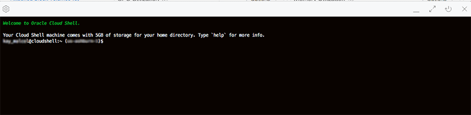
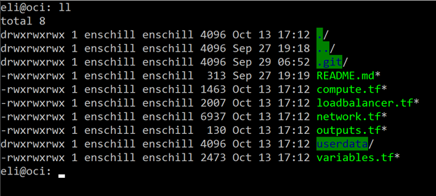
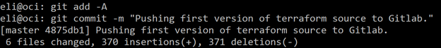

# Resource Manager

## Introduction

In this lab, you will create configure identity access manager, create a resource manager stack, and execute the stack job.  As an optional exercise, you can migrate your Terraform configuration to Gitlab and redirect the source of your resource manager stack.

**Note:** *Some of the UIs might look a little different than the screenshots included in the instructions. However, you can still use the instructions to complete the hands-on labs.*

### Prerequisites

- Oracle Cloud Infrastructure account credentials (User, Password, and Tenant)
- Basic understanding of Terraform concepts
- (Optional) Gitlab.com account.

**Note:** You can skip the steps below if you are using an user with admin privileges. If this were a real production system, it's both more secure and practical to create additional groups with more granular permissions. For example, it is likely we'd need to create a development team group that can only use predefined stacks and run jobs against it (use-orm-stack and use-orm-job, respectively).
[Check Best Practices for IAM](https://docs.cloud.oracle.com/iaas/Content/Security/Concepts/security_features.htm#IdentityandAccessManagementIAMService).

If you are not the adminstrator, you have to request the admin to give you permissions to manage Resource Manager Stacks by creating the following IAM policies in a compartment of your choice with the following statements:

  - `Allow group <group_name> to manage orm-stacks in compartment <compartment_name>`
  - `Allow group <group_name> to manage orm-jobs in compartment <compartment_name>`

## **Step 1:** Generating SSH Keys using Cloud Shell

We recommend you use the Oracle Cloud Shell to interface with the OCI compute instance you will create. Oracle Cloud Shell is browser-based, does not require installation or configuration of software on your laptop, and works independently of your network setup.

1. To start the Oracle Cloud shell, go to your Cloud console and click the cloud shell icon at the top right of the page.

  

  

  


2. Once the cloud shell has started, enter the following command to generate a SSH Key. Press Enter twice for no passphrase.

```
<copy>ssh-keygen -f ssh-keyname<copy> 
```

Note in the output that there are two files, a private key: <<ssh-keyname>> and a public key: <<ssh-keyname>>.pub. Keep the private key safe and don't share its content with anyone. The public key will be needed in our next step.

## **Step 2:** Create Resource Manager Stack

 A Stack represents definitions for a collection of OCI resources within a specific compartment. With this in mind, we're going to configure a new stack in the compartment of your choice name it "HA Load Balanced Simple Web App". As the stack's name suggests, its configuration files define the load balancing, networking, and compute resources to deploy the target architecture plus an HTTP server.

 Download [HA Load Balanced Simple Web App](https://objectstorage.us-ashburn-1.oraclecloud.com/p/u4g0srIXPIMJkmes0A8cBkfP8IthyGXLA1rU_zTmkw6296rG72-QUoxHw5EFzhm0/n/c4u03/b/oci-library/o/orm-lbass-demo.zip) and save to your local machine.

1. Create a Stack by clicking on **Menu** --> **Resource Manager** --> **Stacks**.

    

2. Click **Create Stack**.

      - **Select a Terraform Configuration (.zip) File to Upload:** Upload the zip file [orm-lbass-demo.zip](https://objectstorage.us-ashburn-1.oraclecloud.com/p/u4g0srIXPIMJkmes0A8cBkfP8IthyGXLA1rU_zTmkw6296rG72-QUoxHw5EFzhm0/n/c4u03/b/oci-library/o/orm-lbass-demo.zip)
      - **Name:** HA Load Balanced Simple Web App
      - **Description:** Provisions a primary load balancer and a failover load balancer into public subnets distributing load across 2 compute instances hosting a simple web app application.
      - **Create in Compartment:** Select an existing compartment
      - **Terraform Version:** Select 0.12.x

    

3. Click **Next**.   
      - **Configure Variables:** Configure the variables for the infrastructure resources that this stack will create when you run the apply job for this execution plan.
        - **Select Load Balancer Shape:** 100Mbps
        - **Select Compute Shape:** VM.Standard2.1
        - **SSH Key Configuration:** <*Enter the content of your public ssh key*>
      - **Virtual Cloud Network Configuration:** 
        - **Enter your VCN Name:** vcn01
        - **Enter your CIDR Block:** 10.0.0.0/16
        - **Enter your Subnet Name:** subnet

        

4. Click **Next**.
      - **Verify your configuration variables**
      - Click **Create**

     

5. Before moving on to executing a job, quickly review the newly configured stack and then click on the hyperlinked stack name.

    

## **Step 3:** Execute Jobs: Plan & Apply

Jobs perform actions against the Terraform configuration files associated with a stack. You can perform 3 actions and they are plan, apply and destroy. Since Terraform command execution is not atomic, it is crucial to prevent any race conditions or state corruption from occurring due to parallel execution. To prevent this from happening, the Resource Manager ensures only one job can run against a stack at a given time against a single state file.

From the Stack Details page, we can completely manage the stack's configuration (i.e., update, delete, add tag/s, edit variables) and also download the zip archive containing the latest Terraform configuration - which can be especially helpful when troubleshooting.

1. Lets execute a plan by clicking on **Terraform Actions** --> **Plan** and enter the following information:

      - **Name:** HA LB App Plan
      - Click **Plan**

    

    

    **Note:** Once the modal closes, notice the job's state appears as "Accepted" - which indicates that the platform is spinning up resources needed for executing the command  - followed by "In Progress" and then either "Succeeded" or "Failed".

    

2. Once the job succeeded, on the Job Details page review the information and scroll through the logs containing the Terraform output. You may also edit the job or download the Terraform Configuration and logs.

    

3. Since the previous plan action succeeded, lets go back to the Stack page by clicking the HA Load Balanced Simple Web App breadcrumb on top of the page. On the Stack details page you can select the Apply from the Terraform Actions menu. Click on **Terraform Actions** --> **Apply**.

    

4. Enter the following information:

      - **Name:** HA LB App Apply
      - **Apply Job Plan Resolution** HA LB App Plan (you can select the latest succeed plan job to apply)
      - Click **Apply**

    

5. The job state is updated as the job execution nears completion:

   
   
   

6. Once the apply action succeeds, verify the resources have been provisioned by reading the Terraform output contained with the logs or navigate to Networking and view the different resources that now exist (VCN, load balancer, subnets, etc.) and that the 2 instances are listed in Compute. The Health Status of the Load Balancer will need a few minutes to get into OK status.

    
    

7. When you see the Load Balancer status change to OK, copy the **IP Address** and paste it into a new web browser tab.  You should see the sample web page load and atop the page it indicates which web server you are connected to.  Press **F5** a couple of times and see the web server change as you refresh the page.  Congratulations - your sample application deployed successfully.

## **Step 4:** (OPTIONAL) Migrate source code to Gitlab

As you often hear Terraform referred to as Infrastructure is Code, an optimal strategy includes the use of source control for all Terraform configuration.  With resource manager, you can integrate directly to your source control through the use of **Configuration Source Providers**.  In this section you will create a new configuration source provider using Gitlab and store your configuration.  To test it out, you will make a small change to your code and apply (update) the stack.  Watch as ORM pulls directly from Gitlab.

**Important** This exercise requires some working experience with Git, and an account with gitlab.com.  You can set up a free account here:
https://gitlab.com/users/sign_up

1. In order to create a configuration source provider, you will need an **Access Token** for gitlab.com.  While logged into gitlab.com, navigate to: https://gitlab.com/profile/personal_access_tokens.  Enter the following details:

    

      - Name
      - Expires at
      - Scopes: **read_api**


    For security reasons, you may choose to set the token expiration 30 days out.  The personal access token (PAT) should be rotated regularly.

2. Return to the resource manager console and navigate to configuration source providers.  Click **Create Configuration Source Provider**.

3. Complete the required fields as follows and click **Create**:

    

    ...pasting the PAT created in step 1.

    *Important* The configuration source provider need only reference your Gitlab account.  You will specify a particular repository and branch at the Stack level.

4. Create a new Project (repository) in Gitlab. Again, we are using *Sample ORM Source* for this guide.

  https://docs.gitlab.com/ee/gitlab-basics/create-project.html

4. In order to modify the source for the existing stack, you will need to utilize the Cloud Shell utility to execute a Command Line Interface (CLI) command.  Click the Cloud Shell link in the top right corner of the console.

    

5. When the Cloud Shell console opens, run the following command.  *NOTE* you will need to change the property values to match your environment.

    ```
    oci resource-manager stack update-from-git-provider \
    --config-source-configuration-source-provider-id <the OCID of your source provider> \
    --stack-id <the OCID of your ORM stack> \
    --config-source-branch-name master \
    --config-source-repository-url <the URL to your gitlab repo>
    ```

    The command will look something like this:
    ```
    oci resource-manager stack update-from-git-provider \
    --config-source-configuration-source-provider-id ocid1.ormconfigsourceprovider.oc1.phx.aaxxxxxxrlz6totua \
    --stack-id ocid1.ormstack.oc1.phx.aaaaaaaayiqk6xxxxxxxxxxntbz4hq \
    --config-source-branch-name master \
    --config-source-repository-url https://gitlab.com/oci-labs/sample-orm-source.git
    ```

6. When the command completes, return to Stacks, select the stack created earlier in this lab, and view the stack details to confirm that the changes were applied.

  

7. You may close / exit the cloud shell now.

8. Next, you will need to push your Terraform code to Gitlab.  At a high level, you will clone your Gitlab repo locally, extract the terraform zip file into this directory, then Add / Commit / Push to Gitlab.  The following screenshots illustrate the process using Git client in Linux.

    

    

    

9. Run terraform plan once more.  Your new source (Gitlab) should contain the same code that was used to create the stack initially.  Therefore, the plan will result in ZERO changes.

10. **EXPERIMENT** Now you can update the code in Gitlab and Plan/Apply them directly to your stack.

- Return to the folder where you unzipped the Terraform files and created the local Git repo.  
- Modify the ./userdata/bootstrap file by adding one more line of html just before the line that started with `hostname >>`:

  ``echo '<marquee>My app now has a scrolling marquee' >> /var/www/html/index.html``

- Save / Commit / Push to gitlab
- Apply the changes to your stack.

## **Step 5:** Execute Jobs: Destroy

Now that we've successfully applied our Terraform to build out our cloud resources (and optionally completed the source migration to Gitlab), let's return to the Stack Details page and use the Resource Manager to tear it all down.

1. Start by clicking on **Terraform Actions** --> **Destroy** and enter the following information:

      - **Name:** HA LB App Destroy
      - Click **Destroy**

    
    

2. Once again, notice that the state change is reflected in the console:  

    
    Wait until the status shows **Succeeded** before proceeding.

3. The final step is to delete the stack by clicking on the Delete Stack button on Stack Details page. Click on **Delete Stack** and confirm it by clicking **Delete** on the modal window.

    
    

*Congratulations! You have successfully completed the lab.*

## Acknowledgements

- **Author** - Flavio Pereira, Larry Beausoleil, Eli Schilling
- **Adapted by** -  Yaisah Granillo, Cloud Solution Engineer
- **Contributors** - Arabella Yao, Kamryn Vinson
- **Last Updated By/Date** - Eli Schilling, October 2020
- **Valid through** - October 2021

## Need Help?
Please submit feedback or ask for help using our [LiveLabs Support Forum](https://community.oracle.com/tech/developers/categories/resource-manager-terraform). Please click the **Log In** button and login using your Oracle Account. Click the **Ask A Question** button to the left to start a *New Discussion* or *Ask a Question*.  Please include your workshop name and lab name.  You can also include screenshots and attach files.  Engage directly with the author of the workshop.

If you do not have an Oracle Account, click [here](https://profile.oracle.com/myprofile/account/create-account.jspx) to create one.
