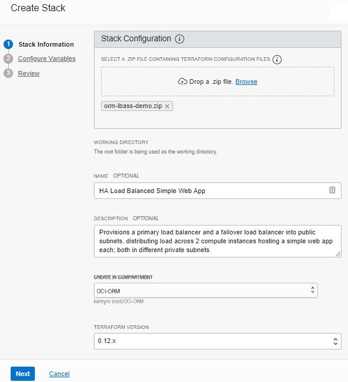
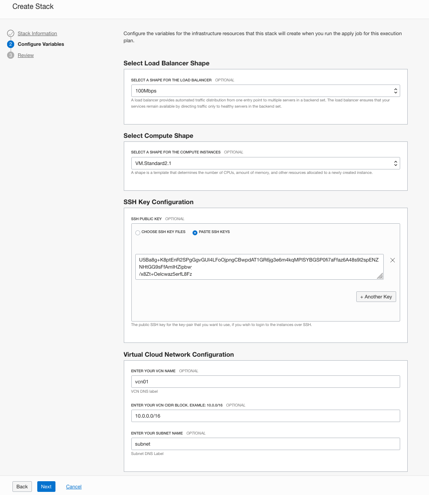

# Resource Manager

## Introduction

In this lab, you will create configure identity access manager, create a resource manager stack, and execute the stack job.

**Note:** *Some of the UIs might look a little different than the screen shots included in the instructions, but you can still use the instructions to complete the hands-on labs.*

### Prerequisites

- Oracle Cloud Infrastructure account credentials (User, Password, and Tenant)
- Basic understanding of Terraform concepts

## **Step 1:** Configuring IAM to control user access in Resource Manager

**Note:** You can skip the steps below if you are using an user with admin privileges. If this were a real production system, it's both more secure and practical to create additional groups with more granular permissions. For example, it is likely we'd need to create a development team group that can only use predefined stacks and run jobs against it (use-orm-stack and use-orm-job, respectively).
[Check Best Practices for IAM](https://docs.cloud.oracle.com/iaas/Content/Security/Concepts/security_features.htm#IdentityandAccessManagementIAMService).

1. Create a Policy by clicking on **Menu** --> **Identity** --> **Policies**.

2. Click **Create Policies**.

      - **Name:** orm-admin-policy
      - **Description:** Admin policy over all Resource Manager Stacks and Jobs in the OCI-ORM compartment
      - Add the following statements:
        - `Allow group orm-admin-group to manage orm-stacks in compartment OCI-ORM`
        - `Allow group orm-admin-group to manage orm-jobs in compartment OCI-ORM`
      - Click **Create**.

## **Step 2:** Create Resource Manager Stack

 A Stack represents definitions for a collection of OCI resources within a specific compartment. With this in mind, we're going to configure a new stack in the OCI-ORM compartment in the us-phoenix-1 region and name it "HA Load Balanced Simple Web App". As the stack's name suggests, its configuration files define the load balancing, networking, and compute resources to deploy the target architecture plus an HTTP server.

 Download [HA Load Balanced Simple Web App](https://objectstorage.us-ashburn-1.oraclecloud.com/p/S0GnbQCFMdXaJ9BHVoqJ-h5kTtmkvqBl3IwVLtpPDxA/n/c4u03/b/oci-library/o/orm-lbass-demo.zip) and save to your local machine.

1. Create a Stack by clicking on **Menu** --> **Resource Manager** --> **Stacks**.

    

2. Click **Create Stack**.

      - **Select a Terraform Configuration (.zip) File to Upload:** Upload the zip file [orm-lbass-demo.zip](https://objectstorage.us-ashburn-1.oraclecloud.com/p/S0GnbQCFMdXaJ9BHVoqJ-h5kTtmkvqBl3IwVLtpPDxA/n/c4u03/b/oci-library/o/orm-lbass-demo.zip)
      - **Name:** HA Load Balanced Simple Web App
      - **Description:** Provisions a primary load balancer and a failover load balancer into public subnets distributing load across 2 compute instances hosting a simple web app each in different private subnets.
      - **Create in Compartment:** OCI-ORM
      - **Terraform Version:** Select 0.11.x  

    

3. Click **Next**.   
      - **Configure Variables:** (Information gathered from variables.tf file in orm-lbass-demo.zip)
        - **REGION:** eu-frankfurt-1
        - **COMPARTMENT\_OCID:** ocid1.compartment.oc1..aaaaaaaa... <*The OCID of OCI-ORM compartment*>
        - **BACKENDSET\_NAME:** ormdemobackendset
        - **BACKENDSET\_POLICY:** ROUND\_ROBIN
        - **BOOTSTRAP\_FILE:** ./userdata/bootstrap
        - **INSTANCE\_IMAGE_OCID:** <*The OCIDs of instance images in different regions*>
        - **INSTANCE\_SHAPE:** VM.Standard2.1
        - **LB\_SHAPE:** 100Mbps
        - **AVAILABILITY\_DOMAINS:** 3
        - **VCN\_CIDR:** 10.0.0.0/16
        - **PRIMARY\_LB\_CIDR:** 10.0.4.0/24
        - **FAILOVER\_LB\_CIDR:** 10.0.5.0/24
        - **BS2\_SUBNET\_CIDR:** 10.0.2.0/24
        - **NON\_SSL\_LISTENER\_PORT:** 80
        - **HC\_PROTOCOL:** HTTP
        - **HC\_PORT:** 80
        - **HC\_INTERVAL\_MS:** 30000
        - **HC\_RETRIES:** 3
        - **HC\_RETURN\_CODE:** 200
        - **HC\_TIMEOUT\_IN\_MILLIS:** 3000
        - **HC\_RESPONSE\_BODY\_REGEX:** .*
        - **HC\_URL\_PATH:** /
        - **SSH\_PUBLIC\_KEY:** <*Enter the content of your public ssh key*>

        

4. Click **Next**.
      - **Verify your configuration variables**
      - Click **Create**

     

5. Before moving on to executing a job, quickly review the newly configured stack and then click on the hyperlinked stack name.

    

## **Step 3:** Execute Jobs: Plan, Apply, Destroy

Jobs perform actions against the Terraform configuration files associated with a stack. You can perform 3 actions and they are plan, apply and destroy. Since Terraform command execution is not atomic, it is crucial to prevent any race conditions or state corruption from occurring due to parallel execution. To prevent this from happening, the Resource Manager ensures only one job can run against a stack at a given time against a single state file.

From the Stack Details page, we can completely manage the stack's configuration (i.e., update, delete, add tag/s, edit variables) and also download the zip archive containing the latest Terraform configuration - which can be especially helpful when troubleshooting.

1. Lets execute a plan by clicking on **Terraform Actions** --> **Plan** and enter the following information:

      - **Name:** HA LB App Plan
      - Click **Plan**

       
       

       **Note:** Once the modal closes, notice the job's state appears as "Accepted" - which indicates that the platform is spinning up resources needed for executing the command  - followed by "In Progress" and then either "Succeeded" or "Failed".

       

2. Once the job succeeded, on the Job Details page review the information and scroll through the logs containing the Terraform output. You may also edit the job or download the Terraform Configuration and logs.

    

3. Since the previous plan action succeeded, lets go back to the Stack page by clicking the HA Load Balanced Simple Web App breadcrumb on top of the page. On the Stack details page you can select the Apply from the Terraform Actions menu. Click on **Terraform Actions** --> **Apply**.

    

4. Enter the following information:

      - **Name:** HA LB App Apply
      - **Apply Job Plan Resolution** HA LB App Plan (you can select the latest succeed plan job to apply)
      - Click **Apply**

    

5. The job state is updated as the job execution nears completion:

   
   
   

6. Once the apply action succeeds, verify the resources have been provisioned by reading the Terraform output contained with the logs or navigate to Networking and view the different resources that now exist (VCN, load balancer, subnets, etc.) and that the 2 instances are listed in Compute. The Health Status of the Load Balancer will need a few minutes to get into OK status.

    
    

7. Now that we've successfully applied our Terraform to build out our cloud resources, let's return to the Stack Details page and use the Resource Manager to tear it all down by clicking on **Terraform Actions** --> **Destroy** and enter the following information:

      - **Name:** HA LB App Destroy
      - Click **Destroy**

    
    

8. Once again, notice that the state change is reflected in the console:

    

9. The final step is to delete the stack by clicking on the Delete Stack button on Stack Details page. Click on **Delete Stack** and confirm it by clicking **Delete** on the modal window.

    
    

*Congratulations! You have successfully completed the lab.*

## Acknowledgements

- **Author** - Flavio Pereira, Larry Beausoleil
- **Adapted by** -  Yaisah Granillo, Cloud Solution Engineer
- **Contributors** - Arabella Yao, Product Manager Intern, DB Product Management
- **Last Updated By/Date** - Kamryn Vinson, August 2020
- **Valid through** - August 2021

## See an issue?
Please submit feedback using this [form](https://apexapps.oracle.com/pls/apex/f?p=133:1:::::P1_FEEDBACK:1). Please include the *workshop name*, *lab* and *step* in your request.  If you don't see the workshop name listed, please enter it manually. If you would like us to follow up with you, enter your email in the *Feedback Comments* section.
