#  Using Reserved Public IP. 

## Introduction

A public IP address is an IPv4 address that is reachable from the internet. If a resource in your tenancy needs to be directly reachable from the internet, it must have a public IP address. Depending on the type of resource, there might be other requirements.

The purpose of this lab is to give you an overview of the Reserved Public IP Service and an example scenario to help you understand how the service works.

Estimated lab time: 35 minutes

### Prerequisites

1. Oracle Cloud Infrastructure account credentials (User, Password, Tenant, and Compartment).
   
2. [OCI Training](https://cloud.oracle.com/en_US/iaas/training)

3. [Familiarity with OCI console](https://docs.us-phoenix-1.oraclecloud.com/Content/GSG/Concepts/console.htm)

4. [Overview of Networking](https://docs.us-phoenix-1.oraclecloud.com/Content/Network/Concepts/overview.htm)

5. [Familiarity with Compartment](https://docs.us-phoenix-1.oraclecloud.com/Content/GSG/Concepts/concepts.htm)

6. [Connecting to a compute instance](https://docs.us-phoenix-1.oraclecloud.com/Content/Compute/Tasks/accessinginstance.htm)

## **Step 1:** Sign in to OCI console and create reserved Public IP

1. Sign in using your tenant name, user name and password. Use the login option under **Oracle Cloud Infrastructure**.

    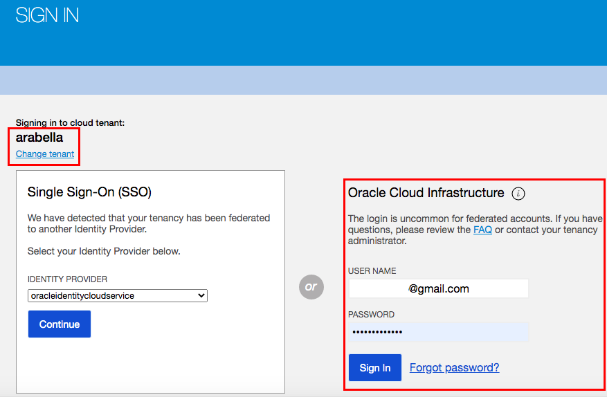

2. From the OCI Services menu, Click **Virtual Cloud Networks** under Networking. Select the compartment assigned to you from the drop down menu on the left part of the screen under Networking and Click **Start VCN Wizard**.
    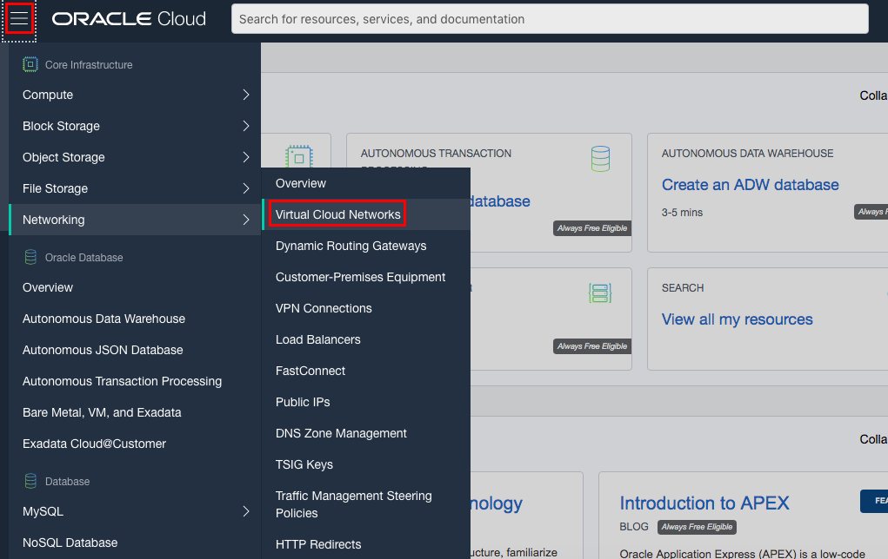
    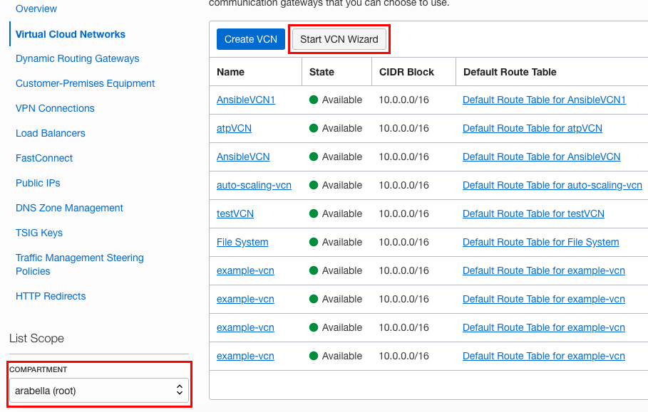

    **NOTE:** Ensure the correct Compartment is selected under COMPARTMENT list.

3. Click **VCN with Internet Connectivity** and click **Start VCN Wizard**.

4. Fill out the dialog box:

      - **VCN NAME**: Provide a name
      - **COMPARTMENT**: Ensure your compartment is selected
      - **VCN CIDR BLOCK**: Provide a CIDR block (10.0.0.0/16)
      - **PUBLIC SUBNET CIDR BLOCK**: Provide a CIDR block (10.0.1.0/24)
      - **PRIVATE SUBNET CIDR BLOCK**: Provide a CIDR block (10.0.2.0/24)
      - Click **Next**
    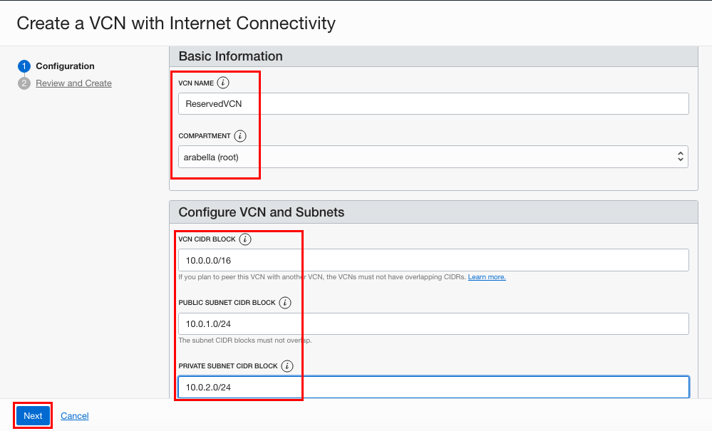

5. Verify all the information and  Click **Create**.

6. This will create a VCN with following components.

    *VCN, Public subnet, Private subnet, Internet gateway (IG), NAT gateway (NAT), Service gateway (SG)*

7. Click **View Virtual Cloud Network** to display your VCN details.
             
8. From OCI services menu Click **Public IPs** under **Networking**.
    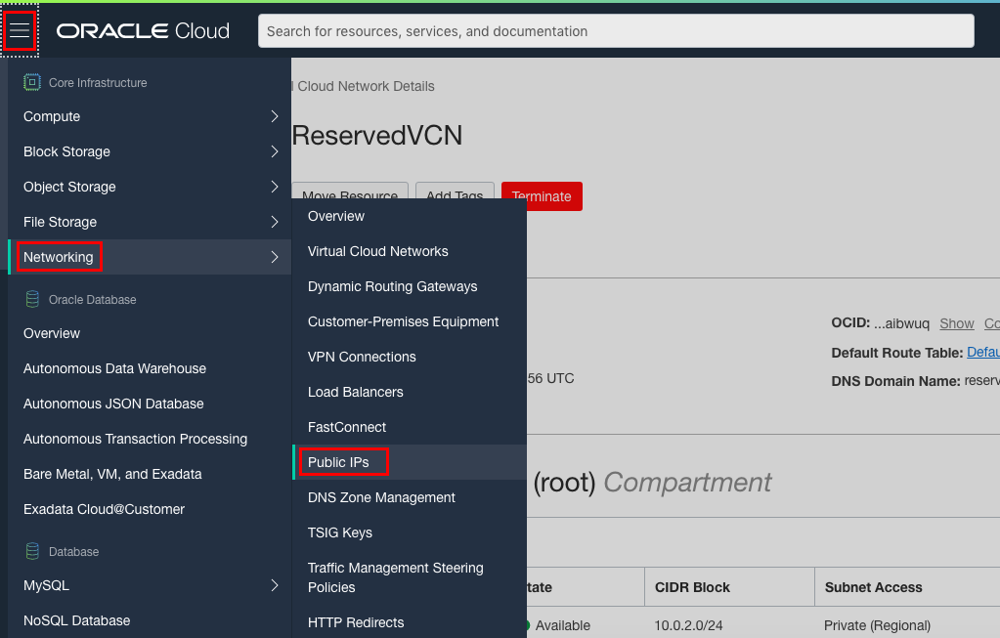

9. Click **Create Reserved Public IP**.  Fill out the dialog box:

    - **NAME:** Provide a name (optional)
    - **COMPARTMENT:** Ensure correct compartment is selected

10. Click **Create Reserved Public IP**.

    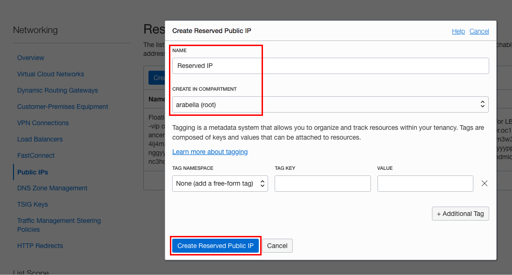

## **Step 2:** Assign reserved public IP to first compute instance

1. Switch to the OCI console. From OCI services menu, Click **Instances** under **Compute**.
    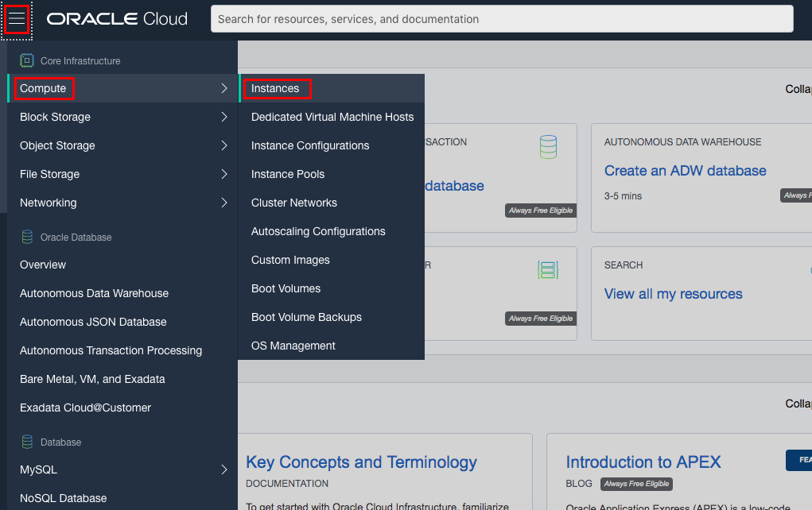

2. Click **Create Instance**. Enter a name for your workshop and the compartment you used earlier to create your VCN. Select **Show Shape, Network and Storage Options**.

    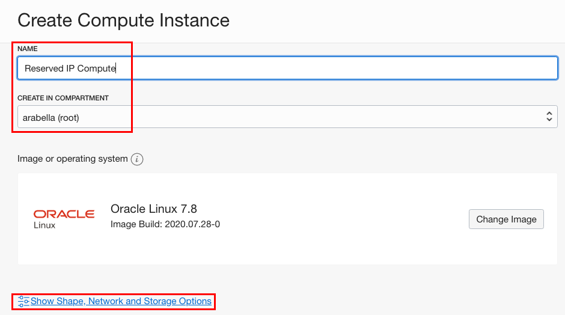

    Leave **Image or Operating System** and **Availability Domain** as the default values.

    Scroll down to **Shape** and click **Change Shape**.

    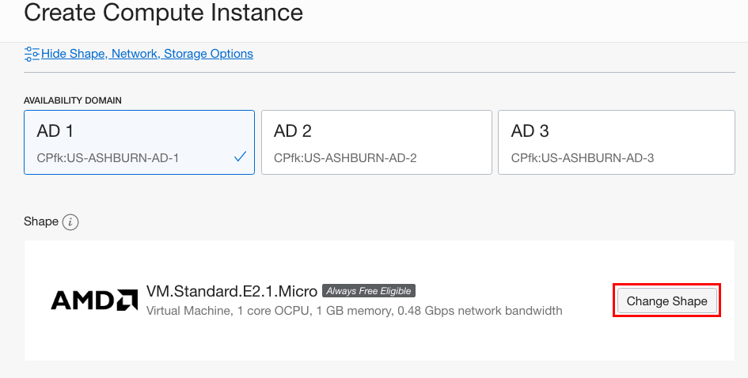

    Select **Virtual Machine** and **VM.Standard.E2.1**. Click **Select Shape**.

    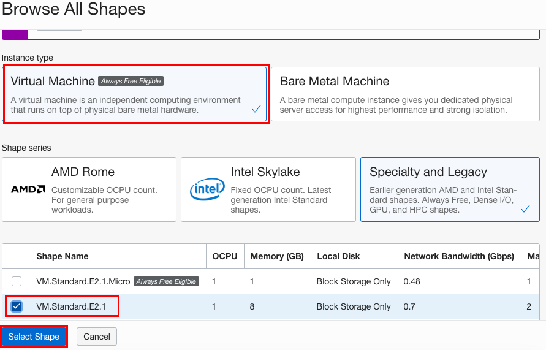

    Scroll down to the section labeled **Configure Networking** select the following.

    - **Virtual Cloud Network Compartment**: Choose the compartment you created your VCN in
    - **Virtual Cloud Network**: Choose the VCN you created in step 1
    - **Subnet Compartment:** Choose the compartment you created your VCN in
    - **Subnet:** Choose the Public Subnet under **Public Subnets**(it should be named `Public Subnet-NameOfVCN`)
    - **Use Network Security Groups to Control Traffic** : Leave un-checked
    - **Do Not Assign a Public IP Address**: Check this option

    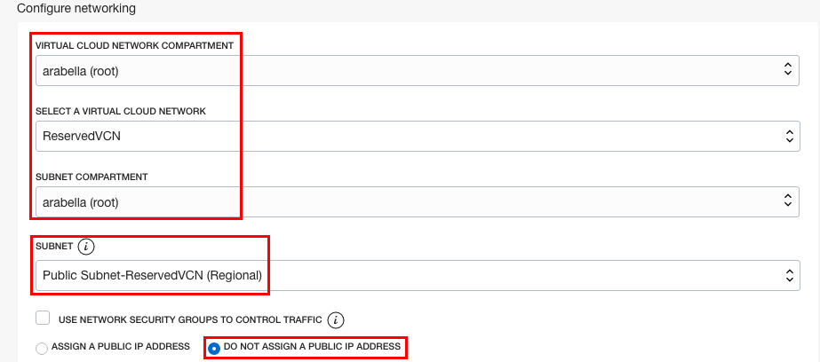

    - **Boot Volume:** Leave the default
    - **Add SSH Keys:** Choose 'Paste SSH Keys' and paste the Public Key you created in Cloud Shell in lab 1.

    *Ensure when you are pasting that you paste one line*

    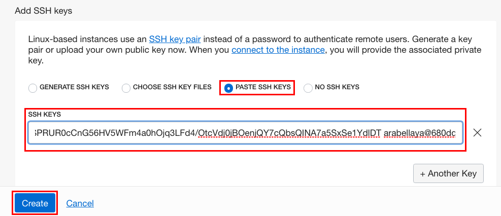

3. Click **Create**.

    *NOTE: If 'Service limit' error is displayed choose a different shape from VM.Standard2.1, VM.Standard.E2.1, VM.Standard1.1, VM.Standard.B1.1  OR choose a different AD.*

4. Once the instance is in Running state, Click Instance name.

5. In the instance detail page Click **Attached VNICs** and then VNIC name.

    

6. In VNIC detail page Click **IP Addresses**, then **Edit** under the Action icon.

    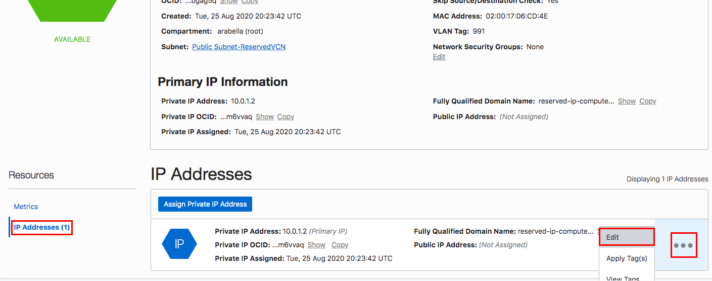


7. In the dialog box under Public IP Address choose RESERVED PUBLIC IP. From the drop down list select the Reserved Public IP created earlier. Click **Update**.

    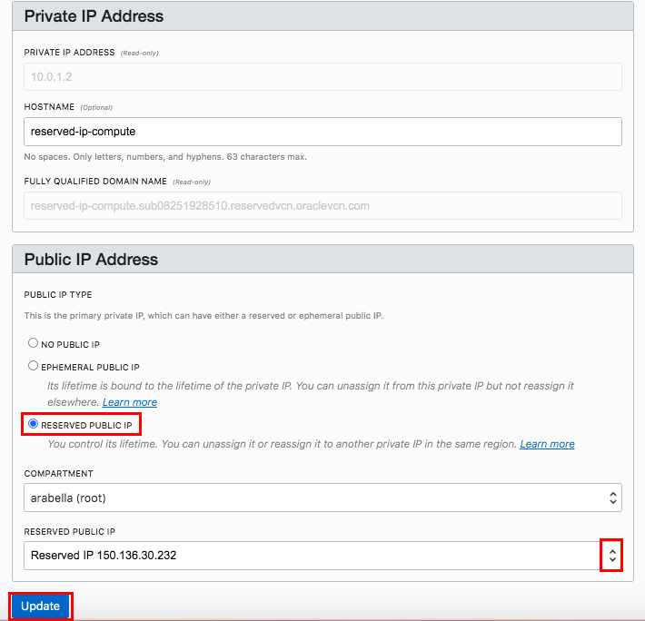

8. Note down the Public IP address.

    ***We have successfully assigned a Reserved Public IP address to the compute instance***

    In Cloud Shell Terminal Enter Command:

    ```
    <copy>
    cd .ssh
    </copy>
    ```
9. Enter **ls** and verify your key file exists.

10. Enter command: **Make sure to use the Reserved Public IP that we assigned to the compute instance**

    ```
    <copy>
    bash
    ssh -i SSH-KEY-NAME opc@<RESERVED_PUBLIC_IP_OF_COMPUTE>
    </copy>
    ```

    **HINT:** If 'Permission denied error' is seen, ensure you are using '-i' in the ssh command

11. Enter 'Yes' when prompted for security message

    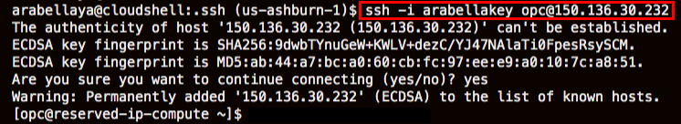
 
12. Verify opc@`<COMPUTE_INSTANCE_NAME>` appears on the prompt.

We successfully ssh into the compute instance using the reserved public IP. Next we will use the same Public IP and assign it to a different Compute instance

## **Step 3:** Un assign Reserved Public IP and assign it to a new compute instance

1. Navigate to VNIC details page in OCI console window. Click **IP Addresses**, then **Edit** under the Action icon.
    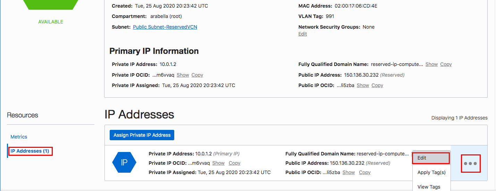

2. In the dialog box under Public IP Address choose **NO PUBLIC IP** (Note the Warning message indicating
Reserved Public IP will be unassigned). Click **Update**.
    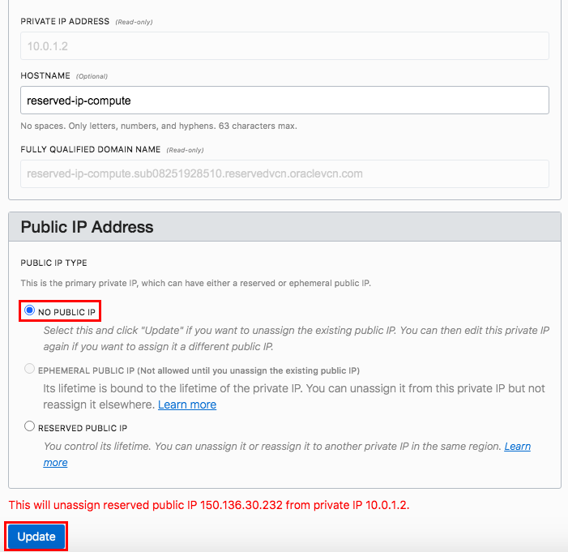

    **Reserved Public IP has now been un-assigned from this compute instance. Next we will create a new compute instance and assign this same Public IP to it.**

3. Create a second compute instance following same steps as for the first compute instance. **Make sure to not assign a Public IP to this compute either**.

4. Following same steps as earlier Edit the VNIC information for this compute instance and assign it the same Reserved Public IP that we created.

5. Remove the known_hosts file to ensure old entry for the host is deleted. Enter Command:

    ```
    <copy>
    rm .ssh/known_hosts
    </copy>
    ```
    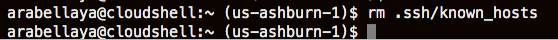

6. Following same steps as earlier, ssh to the second compute instance using the Reserved Public IP address. Verify you logged into the second compute instance.
    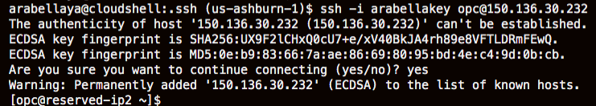

This demonstrated how to use Reserved IP address functionality in OCI to access different compute instances.

## **Step 4:** Delete the resources

1. Switch to  OCI console window.

2. If your Compute instance is not displayed, From OCI services menu Click **Instances** under **Compute**.

3. Locate first compute instance, Click Action icon and then **Terminate**.

    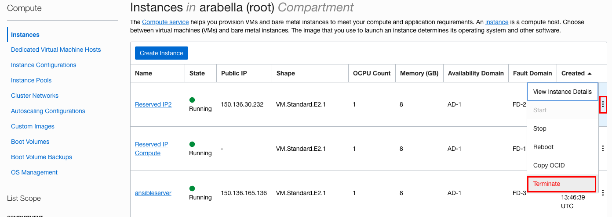

4. Make sure Permanently delete the attached Boot Volume is checked, Click Terminate Instance. Wait for instance to fully Terminate.

    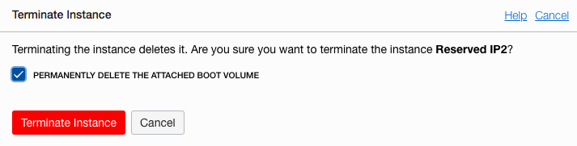

5. Repeat the step to delete the second compute instance.

6. From OCI services menu Click **Virtual Cloud Networks** under **Networking**, list of all VCNs will 
appear.

7. Locate your VCN, Click Action icon and then **Terminate**. Click **Delete All** in the Confirmation window. Click **Close** once VCN is deleted.

    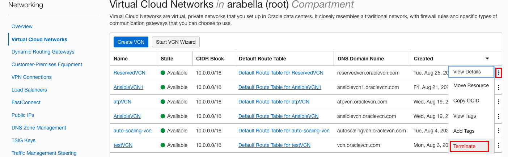

8. From OCI services menu Click **Networking**, then **Public IPs**, locate the Reserved Public IP you created. Click Action icon and then **Terminate**.

    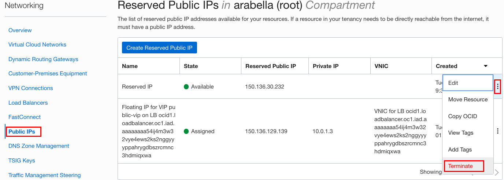

*Congratulations! You have successfully completed the lab.*

## Acknowledgements

- **Author** - Flavio Pereira, Larry Beausoleil
- **Adapted by** -  Yaisah Granillo, Cloud Solution Engineer
- **Last Updated By/Date** - Kamryn Vinson, August 2020

## See an issue?
Please submit feedback using this [form](https://apexapps.oracle.com/pls/apex/f?p=133:1:::::P1_FEEDBACK:1). Please include the *workshop name*, *lab* and *step* in your request.  If you don't see the workshop name listed, please enter it manually. If you would like for us to follow up with you, enter your email in the *Feedback Comments* section. 

