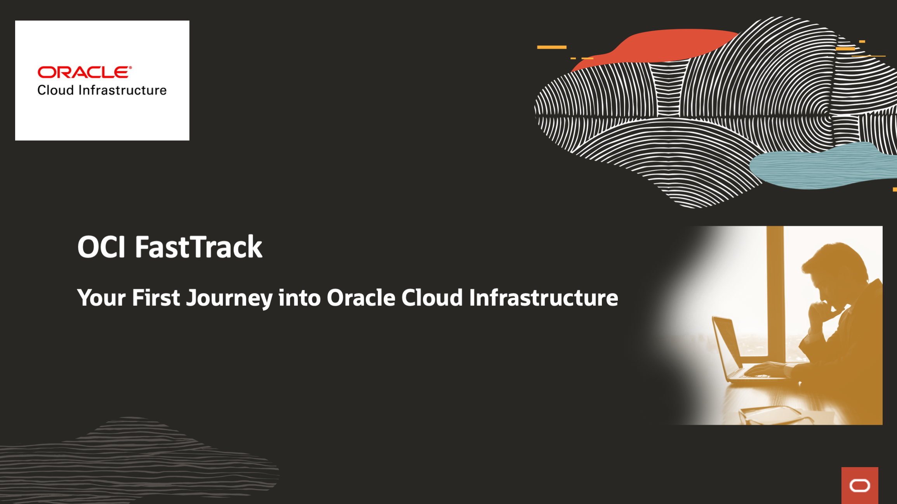

# OCI Fast Track

This directory contains the files used to build and run OCI hands on labs, part of the OCI FastTrack workshop

**Workshop Objectives**

OCI FastTrack's main goal is to bring customer's attention to Oracle Cloud Infrastructure platform. We deliver a hands on experience, where the customer has the opportunity to get in touch with OCI's main components, and check out how fast and easy it is to create and deliver a cloud blueprint.

[**Please download workshop presentation here**](https://publicdocs-corp.documents.us2.oraclecloud.com/documents/link/LD543DD9E49B39008DB83D7BF6C3FF17C1177E4725F3/fileview/D65E2B69332EEC01008EB420F6C3FF17C1177E4725F3/_OCI-FastTrack.pptx)
