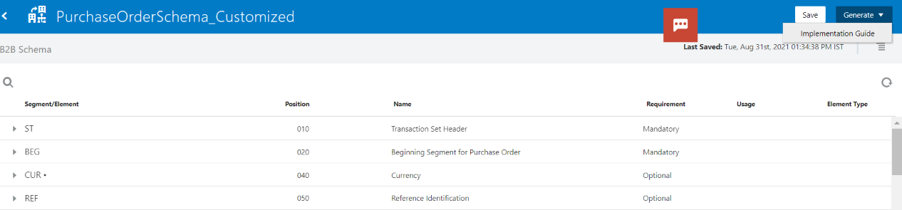

# B2B Documents and Schemas

## Introduction

This lab walks you through the steps to create a B2B Purchase Order Document based on a Schema.

Estimated Time: 15 minutes

### Objectives

In this lab, you will:

* Create a new B2B Schema.
* Create a new B2B Document.
* Customize B2B Schema.
* Generate Implementation Guide.

### Prerequisites

This lab assumes you have:

* All previous labs successfully completed.
* Completed [Getting Started with B2B in Oracle Integration](../workshops/freetier/?lab=gettingStartedB2B) Lab which explains B2B concepts at a high level.

## Task 1: Create a new B2B schema
You can create a new B2B schema based on a standard document type

1. In the left navigation pane, click **Menu > B2B > B2B Schemas**
2. On the B2B Schemas page, click **Create**
3. Enter the following details

| Element | Description |
| --- | --- |
| Name |PurchaseOrderSchema|
| Identifier |This field is automatically populated with the document name. You can manually change this value |
| Description | Purchase Order Schema |
| Document Standard	 | X12 (Select the document standard X12. The document standard identifies the business protocol to follow when exchanging business documents between partners. Supported document standards are EDIFACT & X12)|
| Document Version	 | 4010 |
| Document Type	 | 850 (Purchase Order) |

3. Click **Create and Save**

The below schematic structure represents the Transaction Set Segment (**ST**) standard EDI envelope Structure

[Refer the EDI X12 Documentation](https://docs.oracle.com/en/cloud/paas/integration-cloud/integration-b2b/edi-x12.html#GUID-7C278E59-A35E-41A2-8EB7-9E947FF32F4E)  to understand more details about every segment within Transaction Set (**ST**)

## Task 2: Create a new B2B Document

You can create a new B2B Document based on a standard document type

1. In the left navigation pane, click **Menu > B2B > B2B Documents**
2. On the B2B Documents page, click **Create**
3. Enter the following details

| Element | Description |
| --- | --- |
| Name |PurchaseOrder4010Document|
| Identifier |This field is automatically populated with the document name. You can manually change this value |
| Description | Purchase Order Schema |
| Document Standard	 | X12 (Select the document standard X12. The document standard identifies the business protocol to follow when exchanging business documents between partners. Supported document standards are EDIFACT & X12 ) |
| Document Version	 | 4010 |
| Document Type	 | 850 (Purchase Order) |

3. Click **Create**

The details page for your new B2B document is displayed. The Document Schema field shows Standard as the schema type by default and also any custom schemas created. Select **PurchaseOrderSchema** created in previous Task (Task1)

4. Click **Edit** which will take you to the schemas to create further customizations.
5. Select **Save** and Navigate Back to the PurchaseOrder Document page (Use Go Back and **NOT** browser navigations)

## Task 3: Customize a B2B Schema (Optional)
You can create customized document definitions to use in your B2B integrations. Custom document definitions are useful for scenarios in which your trading partner requires specific customizations to meet certain business requirements.

1. In the left navigation pane, click **Menu > B2B > B2B Schemas**
2. On the B2B Schemas page, **Clone** the **PurchaseOrderSchema** created in previous Task (Task2)

3.	Enter the name as **PurchaseOrderSchema_Customized** Click on **Clone**
4.  Edit the Schema
5.	On the schema page, find the element you want to customize, and select Edit Details. As an example, select the CUR02 currency code element (part of the CUR segment) to edit it. You can also add new constructs to the schema.

The Details pane is displayed with the Properties tab selected.

The three tabs on the Details pane enable you to perform customizations.
| Tab | Description |
| --- | --- |
| Properties |Displayed by default when you initially access the Details pane. You can modify the following standard EDI X12 properties for the selected segment or element: <ul><li>Purpose of element</ul></li><ul><li>Requirement (mandatory, optional, or conditional)</ul></li><ul><li>Usage (must use, do not use, recommended, or not recommended)t</ul></li><ul><li>Minimum and maximum number of characters</ul></li><ul><li>Number of times to repeat the element</ul></li>|
| Code List |A code list defines an enumeration of allowed values for the element. |
| Notes  | Click to add Notes to the Element |

6.	Select **Code list** to add new code.
7.	Click **Add a New Code List** (if the element does not already have a code list defined)
8.	A placeholder code is created for you. Hover over it and select Edit. Add a currency code name and optional description, and click **X** to save your updates.
9.	Click **Add** to add more codes and edit them as necessary for your business requirements. For this example, add EUR (for the Euro currency) and USD (for US dollars).

10.	When complete, click **X** in the upper right corner to close the dialog. Click **Save**.
The segment (CUR) and the element (CUR02) that you customized to deviate from the standard schema are identified by a dot.

11.	 Save the Customized Purchase Order Schema

## Task 4: Generate Implementation Guide (Optional)
You can generate implementation guides for standard or customized schemas to share with your trading partners

**About the Implementation Guide**

An implementation guide is a single, consolidated document with full details about a B2B schema.

Typically, a host company shares the implementation guide for an EDI schema with their trading partners. This guide is shared especially when a schema has been customized to deviate from a standard X12 document. It points out some of the customizations made to the standard schema (not all customizations are highlighted in the document).

In B2B for Oracle Integration, you can generate implementation guides for both standard and custom B2B schemas. The guide is generated as an HTML document, which you can edit to apply branding and print as a PDF file if necessary.

1.	In the left navigation pane, click **Menu > B2B > B2B Schemas**
2.	On the B2B Schemas page, Select any of the Schemas that you have created in the previous tasks.
3.	Select **Generate -> Implementation Guide**

4. You can view and also Download the document
The following image shows an example implementation guide:

You may now [proceed to the next lab](#next).

## Learn More

* [B2B Documents & Schemas](https://docs.oracle.com/en/cloud/paas/integration-cloud/integration-b2b/b2b-documents-and-b2b-schemas.html)

*	[Generate Implementation Guide](https://docs.oracle.com/en/cloud/paas/integration-cloud/integration-b2b/generate-implementation-guide.html#GUID-04ED2504-39C4-4885-8A69-CEDDCA614308)

## Acknowledgements
* **Author** - Kishore Katta, Technical Director, Oracle Integration Product Management
* **Contributors** -  Subhani Italapuram, Oracle Integration Product Management
* **Last Updated By/Date** - Oracle Integration team, December 2021
