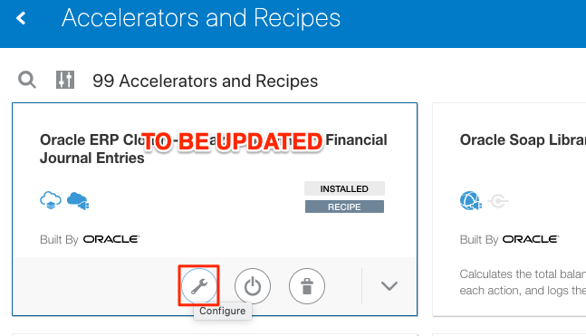
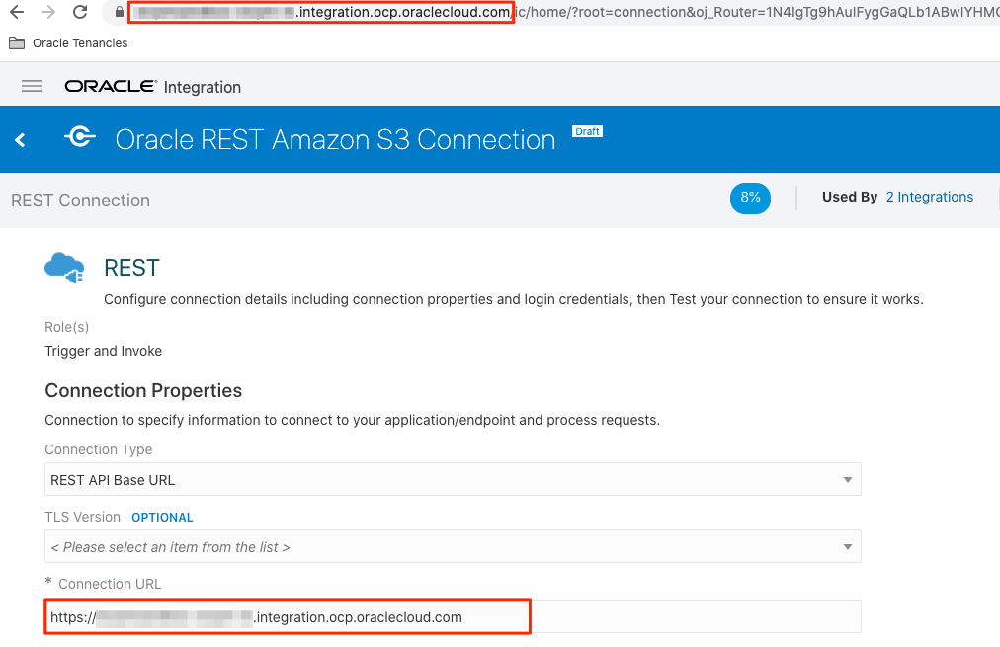

# Setup Workshop Prerequisites

## Introduction
This lab walks you through the setup required to complete this demo workshop.

Estimated Lab Time: 10 minutes

### Objectives

In this lab, you will:

* Install an Integration Recipe

### Prerequisites

This lab assumes you have:

* An Oracle Cloud account
* All previous labs successfully completed

## Task 1: Install Integration Recipe

1. Click the hamburger menu at the top left hand site of the home screen. Then, select the **Home** button.

2. On the **Home** page, scroll to the **Accelerators & Recipes** section.

3. Enter `Order Process` in the search field located on the top left side of the screen, then press **Enter**. 

4. Find the *Order Process* recipe, and then click the **Install (+)** icon. 

    

## Task 2: Configure Recipe 

1. On the **Accelerators & Recipes**, select the *Order Process* recipe you want to edit.

2. Click the **Configure** icon.

    

3. On the Configuration Editor page, find the Order Process connection under the *Connections* section and click the **Edit** icon. 

   

4. In the Connection page, copy the Oracle Integration host name from the browser address bar and past it into the field **ERP Cloud Host**

    

5. Under *Security*, select **Username Password Token** Security Policy, and enter the same credentials used for accessing OCI Integration.

    

6. Click **Test**, wait for confirmation, then click **Save**. 

