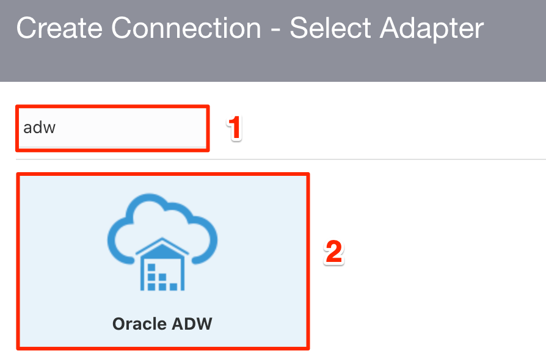
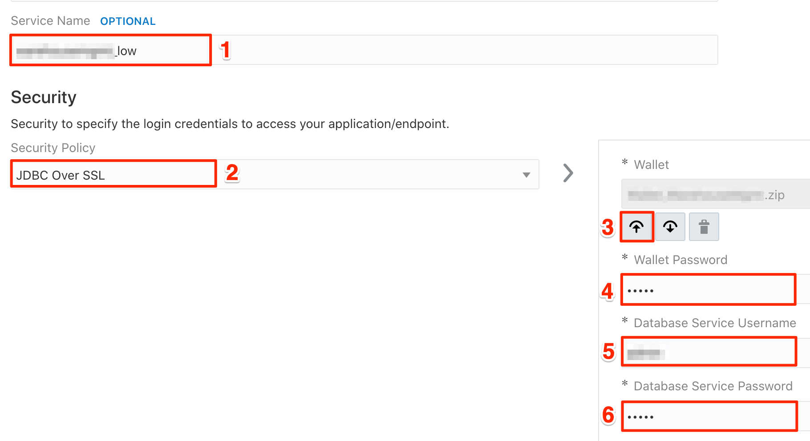

# Create an Oracle ERP Cloud Adapter Connection 
Before you can build an integration, you have to create the connections to the applications with which you want to share data. Follow these steps to create an ERP Cloud connection.

## Introduction
This demo lab will walk you through the steps to create connections for all the services which will used in the ERP Purchase Order Event integration.

## Objectives
You will run through the folowing steps in this lab:
- Create an Oracle ERP Cloud Adapter Connection 
- Create an Oracle Autonomous Data Warehouse connection

## Task 1: Create an Oracle ERP Cloud Adapter Connection 
Create a connection witht the Oracle ERP Cloud Adapter.

1. Show the left Navigation menu, and click **Integrations** > **Connections**.

2. Click **Create**.

3. In the *Create Connection - Select Adapter* dialog, select the **Oracle ERP Cloud** adapter to use for this connection. To find the adapter, enter `erp` in the search field. Click on the highlighted adapter and hit **Select**.
    

4. In the *Create Connection* dialog, enter the following information:

    | **Field**        | **Value**          |       
    | --- | ----------- |
    | Name         | `ERP_LLDemo`       |
    | Description  | `ERP Connection for Livelabs demo` |
    |

    Keep all other values as default.

5. In the *Oracle ERP Cloud Connection* dialog, enter the following information:

    | **Field**  | **Values** |
    |---|---|
    |ERP Cloud Host | `your-host-name` |
    |Security Policy | `Username Password Token`|
    |Username | `<user>`|
    |Password | `<password>`|
    |

6. Click on **Test**, followed by **Save**. Exit the connection canvas by clicking the back button on the top left side of the screen.

## Task 2: Create an Oracle Autonomous Data Warehouse Connection 
Create a connection witht the Oracle Autonomous Data Warehouse Adapter.

1. From the *Connections* window, click **Create**.

2. In the *Create Connection - Select Adapter* dialog, select the **Oracle ADW** adapter to use for this connection. To find the adapter, enter `adw` in the search field. Click on the highlighted adapter and hit **Select**.
    

3. In the *Create Connection* dialog, enter the following information:

    | **Field**  | **Values** |
    |---|---|
    |Service Name | `<adb-service-name>` |
    |Security Policy | `JDBC Over SSL`|
    |Wallet | **Upload wallet file (Zip)** |
    |Wallet Password | `<password>`|
    |Database Service Username | `<db-service-user>` |
    |Database Service Password | `<db-service-password>` |
    |

    
    
4. 

5.

