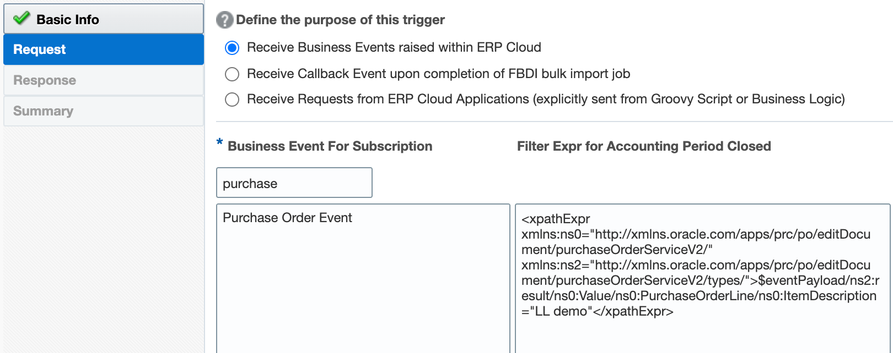
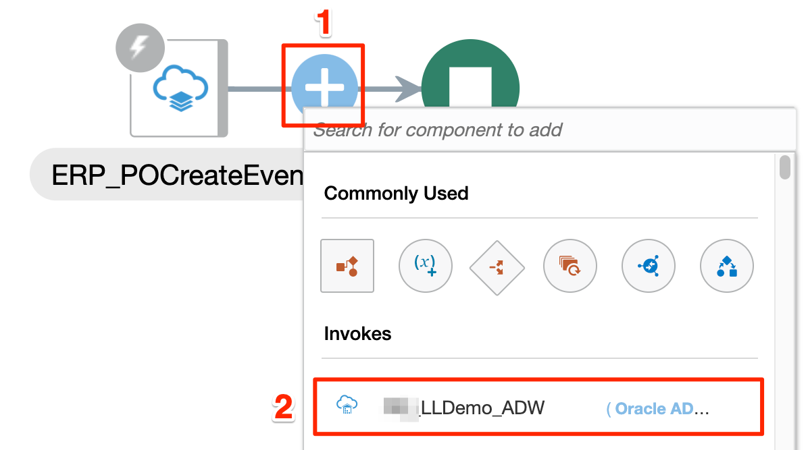
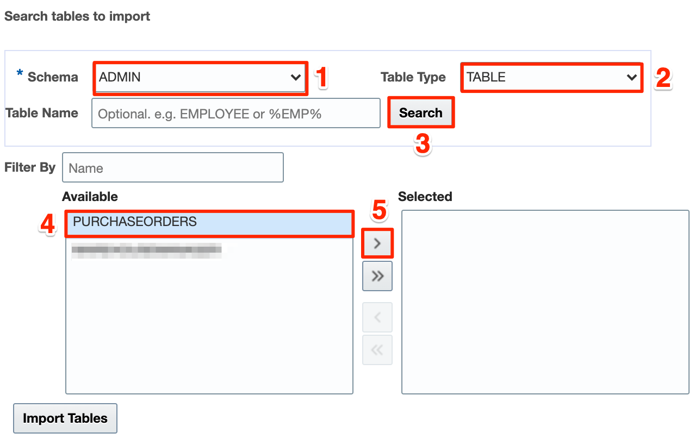
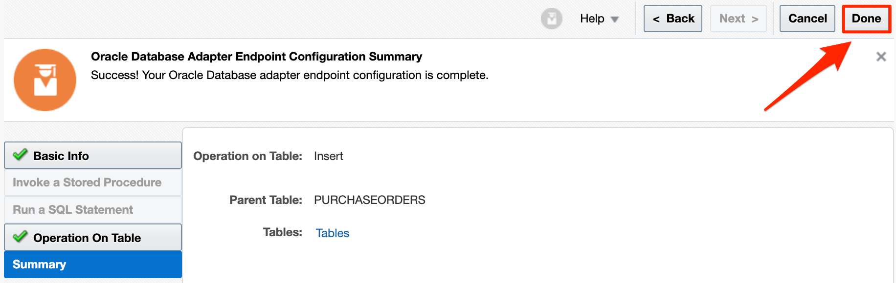
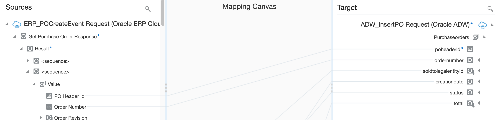

# Create the Purchase Order Event Integration flow

## Introduction
This demo lab will walk you through the steps to create an end-to-end integration of receiving ERP Purchase Order events and persisting the data in an ADW Table.

### Objectives
You will demo the following:
- Initiate an App Driven integration flow
- Define ERP Purchase Order (PO) Event trigger
- Add the ADW invoke activity
- Map data between ERP trigger and ADW invoke
- Define Tracking Fields
- Activate the integration

## **Task 1:** Initiate an App Driven integration Flow
We will start by creating a new integration and adding some basic info.

1. In the left Navigation pane, and click **Integrations** > **Integrations**.
2. On the Integrations page, click **Create**. 
3. On the *Integration Style* dialog, select **App Driven Orchestration**, followed by **Select**. 

    

4. In the *Create New Integration* dialog, enter the following information:

    | **Element**        | **Value**          |       
    | --- | ----------- |
    | Name         | `LLERPEventDemo`       |
    | Description  | `ERP Event integration for LiveLabs demo` |
    |

    Accept all other default values. 

5. Click **Create**. 

6. Click **Save** to persist changes. 

## Task 2: Define ERP Purchase Order (PO) Event trigger
Add ERP PO Event trigger to the empty integration canvas.

1. Click the **+** sign below *START* in the integration canvas.

2. Select the configured ERP Cloud adapter. This invokes the Oracle ERP Cloud Endpoint Configuration Wizard.

3. On the Basic Info page, for *What do you want to call your endpoint?* element, enter `ERP_POEvent`. 

4. Click **Next**.

5. On the Request page, select the following values:

    | **Element**        | **Value**          |       
    | --- | ----------- |
    | Define the purpose of the trigger         | **Receive Business Events raised within ERP Cloud**       |
    | Business Event for Subscription  | **Purchase Order Event** |
    | Filter Expr for Purchase Order Event | `<xpathExpr xmlns:ns0="http://xmlns.oracle.com/apps/prc/po/editDocument/purchaseOrderServiceV2/" xmlns:ns2="http://xmlns.oracle.com/apps/prc/po/editDocument/purchaseOrderServiceV2/types/">$eventPayload/ns2:result/ns0:Value/ns0:DocumentDescription=`**"LL demo"**`</xpathExpr>` |
    |

    > **Note:** You can use a custom filter expression by inserting a different value under **DocumentDescription**. The value you enter is case sensitive. 

    

6. Click **Next**.

7. On the Response page, for *Response Type* element, choose **None**. Click **Next**.

8. On the Summary page, click **Done**.

    

9. On the integration canvas, from the Layout list, choose **Horizontal**. 

    

10. Click **Save** to persist changes. 
 

## Task 3: Add the ADW invoke activity
Add the Oracle Autonomous Data Warehouse Adapter invoke to the integration canvas.

1. Hover you cursor over the **+** sign that is displayed after the trigger activity in the integration canvas. Click the **+** sign and select the ADW connection created in Lab 1. 

    

    This invokes the Oracle Autonomous Data Warehouse Endpoint Configuration Wizard.

2. On the Basic Info page, select the following values:

    | **Element**        | **Value**          |       
    | --- | ----------- |
    | What do you want to call your endpoint? | `ADW_InsertPO`       | 
    | What operation do you want to perform? | **Perform an Operation on a Table** |
    | What operation do want to perform on Table? | **Insert** |
    |

3. On the Table Operation page, select the following values:

    | **Element**        | **Value**          |       
    | --- | ----------- |
    | Schema | **ADMIN**  |
    | Table Type | **TABLE** |
    | Table Name | &lt;keep blank&gt; and click **Search** |
    | Available | **PURCHASEORDER** and click **>** to move the table to the *Selected* column |
    |

    

4. Click on **Import Tables**, wait and press **Next**.

5. When the *Select the parent database table* element appears, click **Next**.

6. On the Summary page, click **Done**.

    

7. Click **Save** to persist changes. 

## Task 4: Map data between ERP trigger and ADW invoke
Use the mapper to drag fields from the source structure (ERP PO event data)  to the target structure (ADW PO table) to map elements between the two.

When we added the ADW invoke to the integration, a map icon was automatically added. 

1. Hover you cursor over the ERP-ADW **Mapper** icon, and click **Edit**.
   

2. Use the mapper to drag element nodes in the source ERP Cloud structure to element nodes in the target Oracle ADW structure.

    Expand the Source node:

       ERP_POCreateEvent Request > Get Purchase Order Response > Result > #2 <sequence> > Value

    Expand the Target node:
    
        ADW_InsertPO Request > Purchaseorder

    Complete the mapping as below:    

    | **Source** *(ERP_POCreateEvent)*        | **Target** *(ADW_InsertPO)* |
    | --- | ----------- |
    | PO Header Id | poheaderid |
    | Order Number | ordernumber |
    | Sold To Legal Entity Id | soldtolegalentityid |
    | Creation Date | creationdate |
    | Document Status | status |
    | Total Amount | total |
    |

   

3. Click **Validate**, then wait for the confirmation message *Mapping is valid and ready to use.*

4. Click **Close**

5. Click **Save** to persist changes. 

## Task 5: Define Tracking Fields
Manage business identifiers that enable you to track fields in messages during runtime. 

A number icon is displayed at the top of the Integration canvas when identifiers have not been set. 

1. Click the **Actions** menu on the top right, then select **Tracking**.
    

2. From the *Source* section, expand **getPurchaseOrderResponse** > **result**, click **Load more**, expand **Value**, and click **Load more**. Drag the **OrderNumber** field from ERP PO source to the *Drag a trigger field here* section:

    

3. Click **Save**. 

4. On the Integration canvas, click **Save**, followed by **Close**.

## Task 6: Activate the integration

1. On the *Integrations* page, click on the **Activate** icon.

    

2. On the *Activate Integration* dialog, select **Enable Tracing**, followed by **Include Payload** options. 

3. Click **Activate**.
    
    The activation will complete in a few seconds. If activation is successful, a status message is displayed in the banner at the top of the page, and the status of the integration changes to *Active*. 

You have completed the final step of Lab 2. Please **proceed to the next lab**. 

## Acknowledgements
* **Author** - Ravi Chablani, Product Management - Oracle Integration
* **Last Updated By/Date** - Ravi Chablani, February 2022