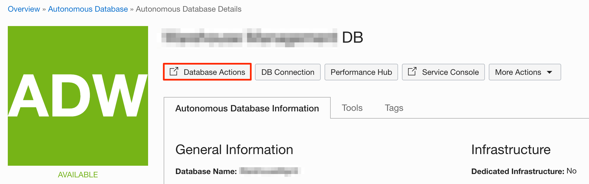
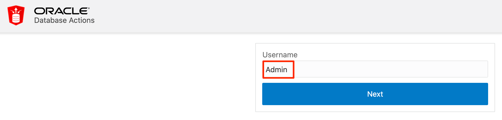
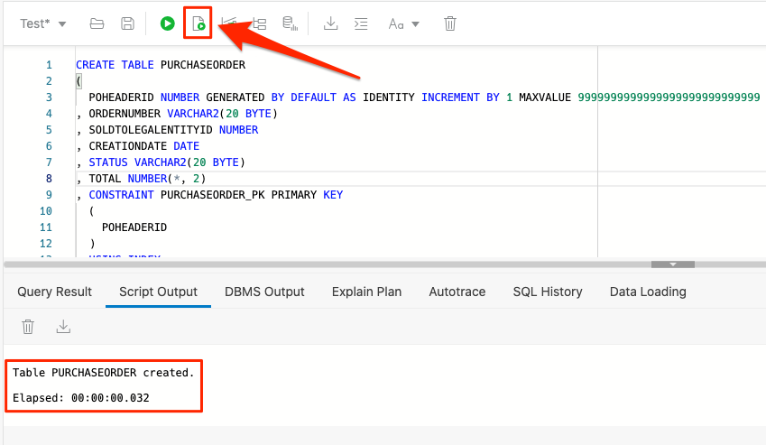

# Lab Setup

## Introduction

This lab walks you through the setup required to complete this demo workshop.

Estimated Lab Time: 5 minutes

### Objectives
In this lab, you will:
- Learn how to create a database table using a SQL script

### Prerequisites
This lab requires successful completion of the **Provision an Oracle Autonomous Database** section in the **Contents** menu on the left.

## Task 1: Create a database table using a SQL script
Follow these steps to create a DB table which will be used as part of this workshop. 

1. If you are not already logged in to Oracle Cloud Console, log in and select Autonomous Data Warehouse from the navigation menu.

    

    > Note: You can also directly access your Autonomous Data Warehouse or Autonomous Transaction Processing service in the **Quick Actions** section of the dashboard.

2. Navigate into your demo database by clicking on the instance link.

    

    > Note: Similar steps apply to either Autonomous Data Warehouse or Autonomous Transaction Processing.

3.  If you are not already logged in to SQL Worksheet, in your ADW Database Details page, click the **Database Actions** button.

    

4. A sign-in page opens for Database Actions. For this lab, simply use your database instance's default administrator account, Username = `ADMIN` and click **Next**.

   

5.  Enter the **ADMIN** password you specified when creating the database and click **Sign in**.

    

6. The Database Actions page opens. In the *Development* box, click **SQL**.

    

7. The SQL Worksheet appears. Copy below code snippet:
    ```
    CREATE TABLE PURCHASEORDER 
    (
    POHEADERID NUMBER GENERATED BY DEFAULT AS IDENTITY INCREMENT BY 1 MAXVALUE 9999999999999999999999999999 MINVALUE 1 CACHE 20 NOT NULL 
    , ORDERNUMBER VARCHAR2(20 BYTE) 
    , SOLDTOLEGALENTITYID NUMBER 
    , CREATIONDATE DATE 
    , STATUS VARCHAR2(20 BYTE) 
    , TOTAL NUMBER(*, 2) 
    , CONSTRAINT PURCHASEORDER_PK PRIMARY KEY 
    (
        POHEADERID 
    )
    USING INDEX 
    (
        CREATE UNIQUE INDEX PURCHASEORDER_PK ON PURCHASEORDER (POHEADERID ASC) 
        LOGGING 
        TABLESPACE DATA 
        PCTFREE 10 
        INITRANS 20 
        STORAGE 
        ( 
            INITIAL 65536 
            NEXT 1048576 
            MINEXTENTS 1 
            MAXEXTENTS UNLIMITED 
            BUFFER_POOL DEFAULT 
        ) 
        NOPARALLEL 
    )
    ENABLE 
    ) 
    LOGGING 
    TABLESPACE DATA 
    PCTFREE 10 
    INITRANS 10 
    STORAGE 
    ( 
    INITIAL 65536 
    NEXT 1048576 
    MINEXTENTS 1 
    MAXEXTENTS UNLIMITED 
    BUFFER_POOL DEFAULT 
    ) 
    COLUMN STORE COMPRESS FOR QUERY HIGH ROW LEVEL LOCKING 
    NO INMEMORY 
    NOPARALLEL;
    ```

8. Paste the script in SQL Worksheet, then click **Run It** button. This will create the **PURCHASEORDER** table. The table is created successfully when you see the notification in the **Script Output**. 

    

Now you have an external table which will be used in the demo flow. 


## Acknowledgements
* **Author** - Ravi Chablani, Product Management - Oracle Integration
* **Last Updated By/Date** - Ravi Chablani, February 2022
