<br>[**Return to Main Page**](../index.html)

# Oracle Digital Assistant

**Before you begin**

This 120-minute hands-on lab is an entry-level exercise for building a skill in Oracle Digital Assistant.

**Background**

Oracle Digital Assistant is an environment for building _digital assistants_, which are user interfaces driven by artificial intelligence (AI) that help users accomplish a variety of tasks in natural language conversations. Digital assistants consist of one or more _skills_, which are individual chatbots that are focused on specific types of tasks.


**Lab Objectives**

In this lab, you will create a skill that can be used by customers to interact with Mama Maggy stores, including ordering pizzas and canceling orders. As part of this process, you will:
* Define intents, utterances, entities.
* Design a conversation flow.
* Validate, debug and test your skill.
* Integrate the skill with your WebApp/Mobile App

**Intended Audience**

- Beginner/Intermediate technical learners
- New to cloud
- New to Oracle Cloud Infrastructure

**Changelog**
- April 10, 2020 - version 1.1

**What Do You Need?**
* Access to Oracle Digital Assistant.

<br>[**Return to Main Page**](../index.html)

****************
<br>

## Welcome to Oracle Digital Assistant

## Create a Skill

In this lab, we’re starting from scratch. So the first thing you’ll do is create a new skill.
1. Access the cloud tenant using your **Oracle SSO account**. 


2. Click on the **Option** icon  to open the side menu.


3. Under **Data and AI** select **Digital Assistant**

	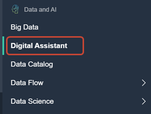


4. On the Digital Assistance console, click the sub menu next to the instance name and select **Service Console**; don't forget to select the compartment if you need to.

    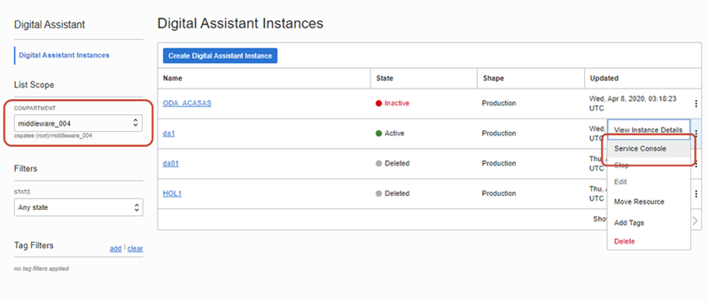
    
    If there is no instance available to you, go to **Get Started** and then to **Create an Digital Assistant Instance** for the steps to create an instance.
	 

5. Provide your tenant name, and click continue

    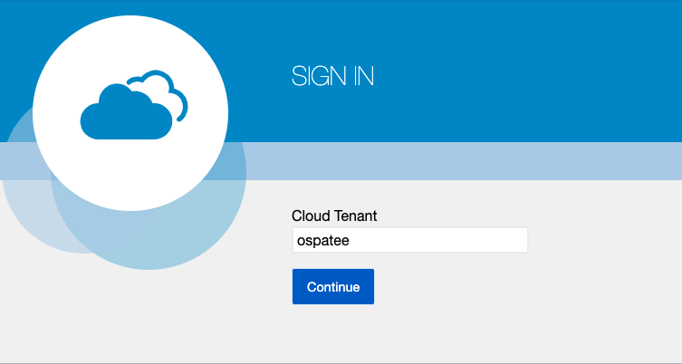


6. Click on continue under SSO and provide your credentials if required

    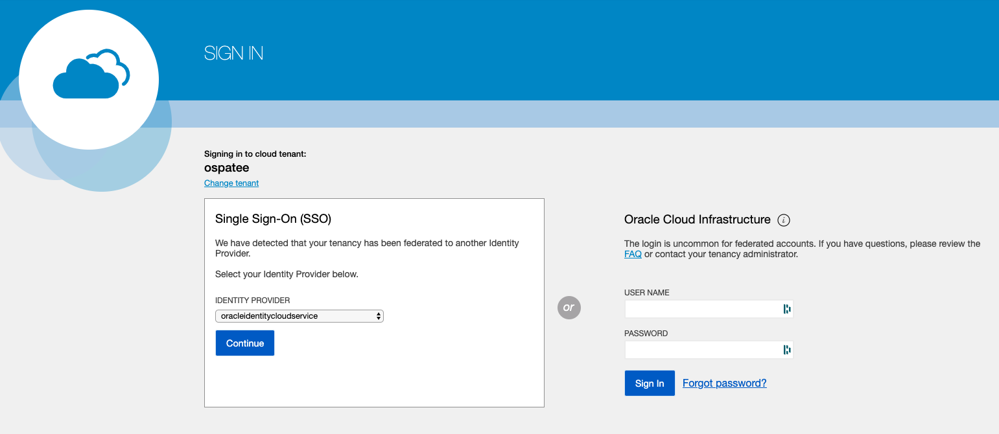

  
7. With the Oracle Digital Assistant UI open in your browser, click on the **Option** icon  to open the side menu.

8. Click **Development** and select **Skills**.

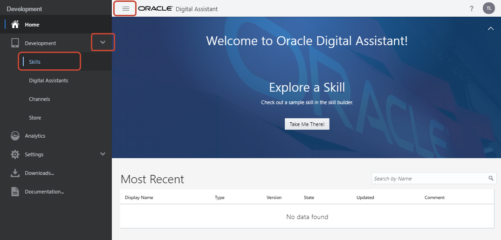


9. Click on the **Option** icon  again to collapse the side menu.


10. Click the **+ New Skill** button

    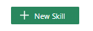


11. The Create Skill dialog appears.

    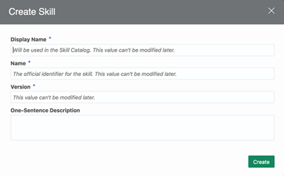


12. For **Display Name** enter `Mama Maggy`. If you are working in an environment where others may also be creating the same tutorial, prefix `Mama Maggy` with your unique initials.

13. For **Version**, enter `1.0`

14. Optionally, fill in a **One-Sentence Description**, e.g. `Skill for ordering from Mama Maggy`

15. Click **Create**. The designer will then open on the **Intents** page. Here’s where we’ll begin to express the use case in terms of the concepts that support Natural Language Processing (NLP): intents and entities.

     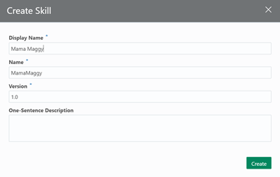
  
*****************

**Congratulations!**

You have created an Oracle Digital Assistant instance. 

*****************

<br>

## Create Intents

Oracle Digital Assistant’s underlying natural language processing (NLP) engine doesn’t inherently know about the business or task that a skill is supposed to assist with. 

For the skill to understand what it should react to, you need to define intents and examples (*utterances*) for how a user would request a specific intent. 

For example, if you want your skill to respond to a “Hello” message, you need to train it on the different variations of the same message:

* *Hello*
* *Hi*
* *Howdy*
* *Hey*
* *What’s up*

As the skill is trained, the engine will be able to automatically identify a `Hello` intent and deliver the expected `Welcome` message.

For the Mama Maggy example, you will create intents for 
* Ordering Pizza
* Cancelling an Order
* Filing a complaint


### Create the Order Pizza Intent

1. In the left navigation for the designer, make sure that  is selected.

2. Click the **+ Intent** button.

3. In the **Name** field, type `OrderPizza`.

4. In the **Conversation Name** field, type `OrderPizza`. 

    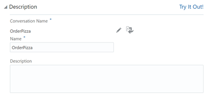


5. Copy the example sentences below, paste them into the **Enter your example utterances here** field, and press the Enter key. (Yes, you can paste all of them at once.)
	
	```
	Would you happen to have thin crust options on your Pizzas?
	Let’s order a cheese pizza
	Would love a large Pepperoni please!
	I feel like eating some pizza
	I would like to order a pizza
	Can I order a Pizza?
	What’s on the menu today?
	I want pizza
	Do you server gluten-free pizza?
	I want to order pizza for lunch
	Do you have deep dish pizzas available?
	Order Pizza!
	```

6. You’ll notice that it's fine for utterances to have inconsistent punctuation and capitalization.

    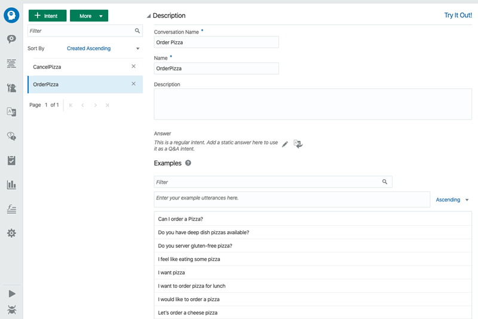


### Create the Cancel Pizza Intent

1. Click the **+Intent** button.
    

2. In the **Name** field, type `CancelPizza`.

3. In the **Conversation Name** field, type `CancelPizza`. 

4. Copy the example sentences below, paste them into the **Enter your example utterances here** field, and press the Enter key.

	```
	Can I cancel my order?
	Cancel my order
    Cancel my Pizza please
    How do I cancel my order?
    I don’t want my Pizza anymore
    I really don’t want the Pizza anymore
    I’d like to cancel my order please
    Its been more than 20 mts. Please cancel my order and issue a refund to my card.
    Need to cancel my order
    Please cancel my pizza order
    Please don’t deliver my Pizza
	```
    
### Create the File Complaint Intent

1. Click the **+Intent** button.

2. In the **Name** field, type `FileComplaint`.

3. In the **Conversation Name** field, type `FileComplaint`.

    


4. Copy the example sentences below, paste them into the **Enter your example utterances here** field, and press the Enter key.
	
	```
    I am upset
    You charged me wrong
    I want to file a complaint
    I am not happy with my recent order
    I have some grief to share
    I want to speak with a manager
    Can I raise a complaint
	```

    Your screen should look similar to what is shown here:

   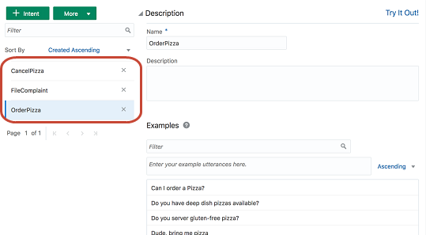


**Note:** If you are stuck, you can import the intents and utterances using [intents.csv](../files/intents.csv).


### Train Your Intents

You’ve now provided the basic ingredients that allow the skill to recognise user inputs for ordering a pizza, but right now, the skill has no cognition. It can’t understand any user input. To enable it to understand the intents, you need to train it.

1. Locate the **Train button** () on the right side of the page.

    


2. Select `Trainer Ht` a linguist based model.
    
    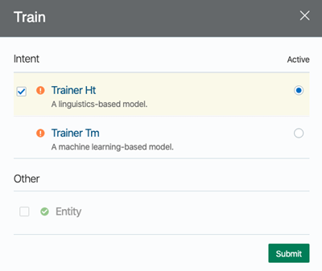

3. Click , click **Submit**, and then wait a few seconds for the training to complete.

<br>

## Test your Model 

It is not realistic to get the training of your intent model right the first time you do it. Good intent models are created in an iterative cycle of training, testing, retraining, and retesting.

A good intent model is one that has a low ambiguity between the different intents. So let’s see how well we’re doing so far.

1. Click 


2. Click the **Try it Out!** label . The Try Out Intents/Q&A dialog appears.


3. In the **Message** field of the dialog, type `I want to order pizza` and click the **Send** button. As you might expect, the result is as shown in the image below.

    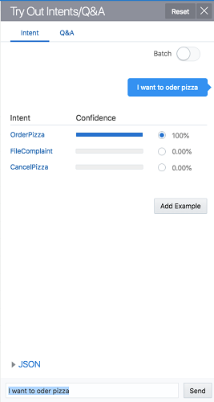


4. Next try `I feel like eating some pizza`. This should also resolve to the OrderPizza intent.


5. Now try `Cancel my order`.  This should resolve to the CancelPizza intent.


6. And now try `Dude, bring me pizza` and see what that resolves to.

    


7. As you can see, the intent engine is (correctly) most confident that the user wants to create an order, but not by a particularly high margin. The sentence "Dude, bring me pizza" deserves a higher confidence score, so we should add it to the list of utterances.


8. Click **Add Example** to add it.


9. Click  to retrain the model using `Trainer Ht` option.


10. Again enter `Dude, bring me pizza` in the **Message** field and click **Send**. The confidence score should be much higher for OrderPizza (possibly even 100%).

    **Note:** Conversational AI does not compare input by exact matches of the words. Though "Dude, bring me pizza" is available as an utterance, when entering the sentence as a message, it is the intent model’s algorithm that determines the matching intent.


11. Type `You are expensive and you still don’t deliver on time` in the **Message** field and click **Send**.

    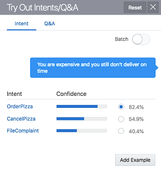


12. In all likelihood, the `FileComplaint` intent did not receive the highest score. In the above screenshot, OrderPizza "won", though it’s also possible that CancelPizza could get the highest score.


13. To help remedy this, in the `FileComplaint` intent row of the dialog, select the radio button and then click the **Add Example** button to add the utterance to the FileComplaint intent.
    
    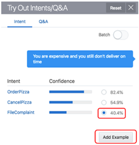

    The utterance is added to the intent.

    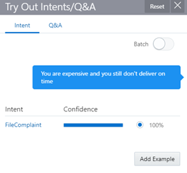

    **Note**
    
    In these examples, you might get slightly different confidence scores than what are shown here. And in some cases, the matching intents themselves could vary, should the differing confidence scores push those intents above or below the given confidence thresholds. 
    
    The cause of this variance is the non-deterministic nature of the AI behind the natural language processing and the fact that these skills have a limited number of training utterances (in order to make the lab simpler).


14. For us humans, it is easy to see that `You are expensive and you still don’t deliver on time` is not an order but a complaint. However, a skill first needs to be trained before it is able to gain the same understanding. The NLP model in this excercise is not trained with a lot of data, so it’s more likely to make mistakes.

    Click **Train** again to retrain the skill.


15. Think of two or three more phrases that the system might have problems matching to an intent with high confidence and try them in the Intent tester. If you find one that doesn’t match well, select the intent that it should be resolved to and click **Add Example**.


16. Train the model again and then re-test.


### Notes on What You Just Did

In this part of the tutorial, you have tested the quality of your intent training with the goal being to ensure a high level of confidence when resolving intents.

In a real skill project, you would always need to go back to the intent testing with user-provided entries you find in the conversation logs. If, using that test input, your intents are not matched the way they should be, you need to add them as example utterances to proper intents and then retrain the model.

**Note:** Oracle Digital Assistant also has a batch mode that allows you to test based on a log of a previous set of tests. This is useful for re-running a set of tests iteratively as you fine-tune your intents.


<br>

## Create Entities

Now it’s time to add entities, which detect information in the user input that can help the intent fulfil a user request. Such information could be the size of pizza, the toppings of pizza, and delivery time. 

For example, the user input `I’d like to order a small meaty pizza at 9:00 pm` contains all three of these information types.

We’ll create custom entities for size and topping and later use a built-in entity for time. While we’re at it, we’ll add some synonyms (including some common misspellings) that optimize the entity’s ability to tag words from sloppy user input.

### Create Entities for Pizza Size and Pizza Topping

1. In the left navigation for the designer, select 

2. Click the **+ Entity** to create a new entity.

    

3. In the **Name** field, change the value to `PizzaSize`
    
    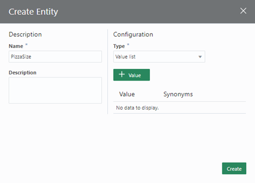

4. In the Configuration section, in the **Type** dropdown, select **Value list**.

5. Click **+ Value**

6. In the **Create Value** window, for **Value**, type `Small` 

7. For **Synonyms**, type `Personal`, press Tab, and type `smallest`
    
    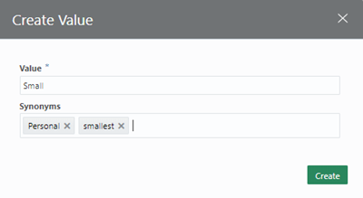

8. Click **Create**

9. Following the pattern in the previous four steps, add the value `Medium` and the synonym `middle`.

10. Following the same pattern, add the value `Large` and the synonyms `Big`, `grande`, and `biggest`.

    Your screen should look like what is shown here:
<br>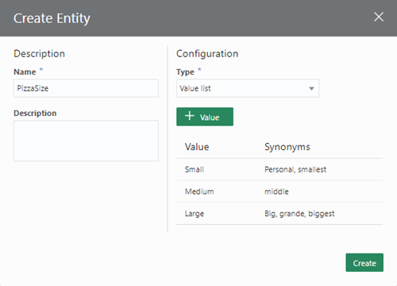

11. Click **Create** in the **Create Entity** window.
<br>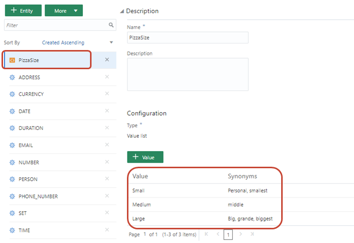

12. Click  to create a new entity.

13. In the **Name** field, change the value to `PizzaTopping`.

14. In the Configuration section, in the **Type** dropdown, select **Value list**.

15. Add values for `Meaty` , `Veggie`, `Hot and Spicy`, and `American Hot`. Your list of entities should look like what is shown here:
<br>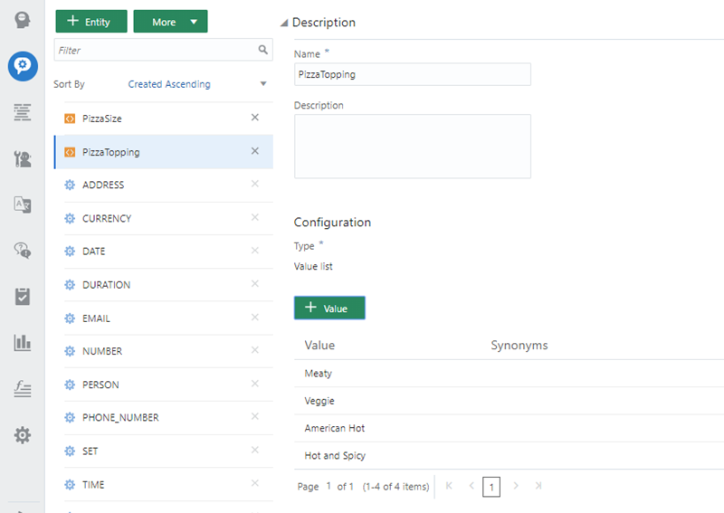


### Associate the Entity with Its Intent

For an entity to be recognised when parsing the user input message, it needs to be associated with an intent. So let’s associate our entities with the appropriate intents:


1. In the left navigation for the designer, select .


2. Select the `OrderPizza` intent.


3. Click **+ Entity** (in the upper right side of the page).

  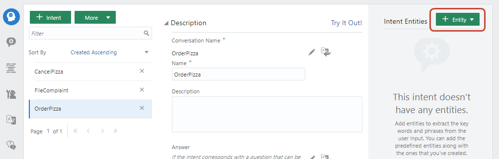


4. Select the `PizzaSize` entity.


5. Repeat the previous two steps for the `PizzaTopping` and `TIME` entities. (TIME is a built-in entity that we’ll use to help the skill process input for pizza delivery time.) 

    The entity list associated with the OrderPizza intent should look like what is shown in the image below (though the order may be different)

    


6. Retrain the model by clicking the **Train** buttom . 


### Test the Entities

The **Try It Out!** feature enables you to test whether the skill identifies entity values in user input.

1. In the left navigation for the designer, select .


2. Click **Try It Out!** 

    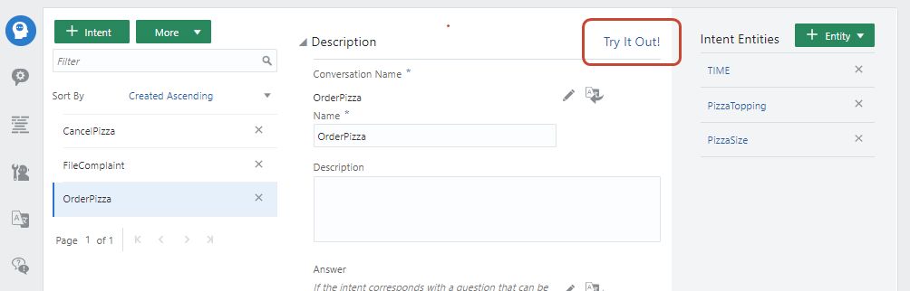


3. In the **Message** field of the dialog, type `I want to order a small hot and spicy pizza at 7:30 pm` and click **Send**. You should see a table showing entities and the values extracted from the input.

   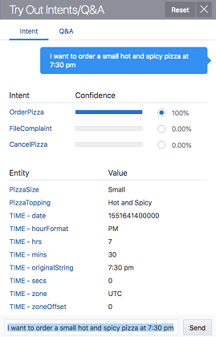

   **Note:** You may need to scroll up in the dialog to see the entities.
Since the entities are recognised in the user input, the skill doesn’t have to ask the user for that information later in the flow.
Now let’s try another one.

4. In the **Message** field, now type `I want to order the biggest meaty pizza at noon` and click **Send**. The result should look like what is shown below and thus prove that the PizzaSize entity shows the right value for the biggest synonym. Also `noon` is properly interpreted as 12:00 p.m.

   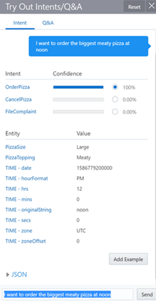


### Notes on What You Just Did
	
In this part of the tutorial, you have created custom entities for the OrderPizza intent, associated the entities with the intent, and tested the entity recognition in the embedded skill tester.
	
Similar to the PizzaOrder intent, you would typically need to create and associate entities for the other intents as well. In the interest of time, this tutorial only focuses on the PizzaOrder intent.

<br>

## Design the Dialog Flow

With the Natural language processing (NLP) model created, you are ready to build the dialog flow for the skill. The dialog flow is a conversation blueprint that defines interactions users may have with the skill. Each interaction is defined as a _state_. Each state references a component, which renders a skill response, receives user input, sets and resets variables, resolves user intents, or authenticates users.

### Set Up the Flow’s Basic Outline

Our first step is to create the basic flow outline, including context variables and states to handle the user’s initial input. Context variables are the skill’s temporary memory. They can be referenced throughout the dialog flow. We’ll add context variables to hold values returned by the intent engine, entity values, and the value for the pizza order message.


1. In the left navigation for the designer, click on the **Flows** button  to open the dialog flow editor.


2. Delete all content between the `variables` and the `states` elements.


3. Delete all content below the `states` element. That should leave you the following remaining code:

    

4.  Under `variables:` add these five context variables: 

	```
	iResult: "nlpresult"
	pizzaSize: "PizzaSize"
	pizzaTopping: "PizzaTopping"
	deliveryTime: "TIME"
	pizzaOrderMsg: "string"
	```


    **Important:** Make sure that they are indented two spaces more than the `variables:` (four spaces total). If the indentation isn’t exact, metadata validation will fail. This is what the flow should now look like: 

    

**** 

One useful tool to verify your YAML file is [CodeBeautify](https://codebeautify.org/yaml-validator). Paste your code and check it by clicking `Validate`.


****

Now we’re ready to add some states.

### Add a State to Determine User Intent

First we’ll add the `System.Intent` component. This component evaluates user input to determine the user intent, extracts all of the entities, and then triggers a subsequent state.

1. Click **+ Components** button  to open the gallery of component templates.


2. Select **Language** as the component type.

    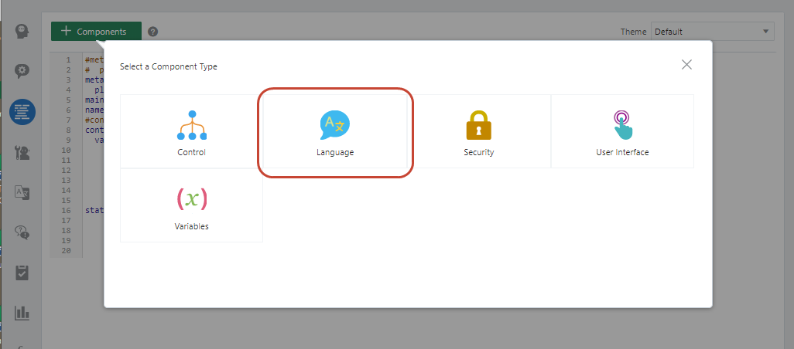


3. In the dialog, select **Intent** and then switch on **Remove Comments**.

    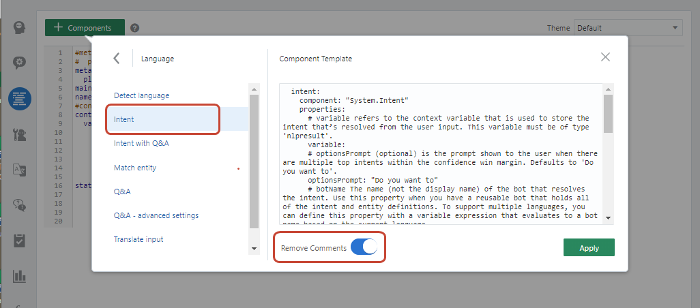


4. Click **Apply**.
    
    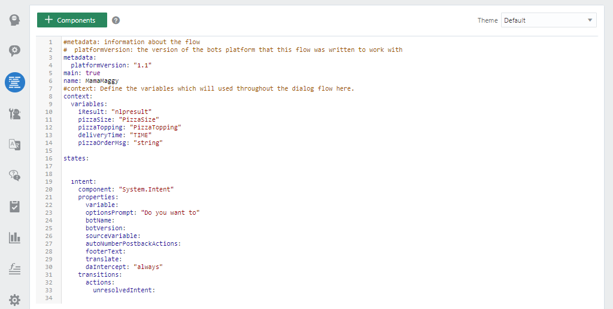


5. In the newly added state, set the value of the `Variable` property to`"iResult"` (including the quotation marks).This means that `iResult` will be the variable to which the NLP engine saves the intent resolution and entity extraction results to.

    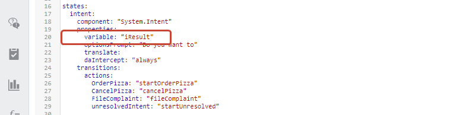


6. Delete the following properties:
    
	* **botName**
	* **botVersion**
	* **sourceVariable**
	* **autoNumberPostbackActions**
	* **footerText**

    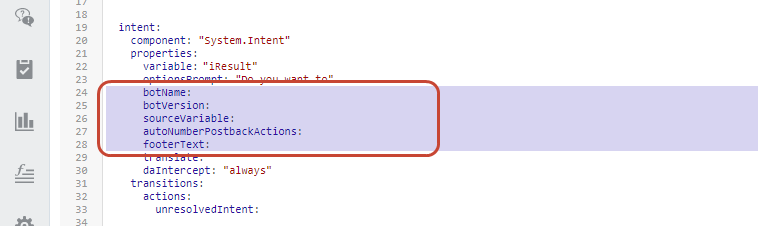


7. Update transition actions so that it looks like the following:

	```
	transitions:
      actions:
        OrderPizza: "startOrderPizza"
        CancelPizza: "cancelPizza"
        FileComplaint: "fileComplaint"
        unresolvedIntent: "startUnresolved" 
	```

### Add Initial States for Each Intent

Next, you need to create the dialog flow states that each possible outcome navigates to. To save you some time, the states are provided here for you to copy and paste.

      startOrderPizza:
        component: "System.Output"
        properties:
          text: "Hello, Starting your order process"
          keepTurn: false
        transitions:
          return: "done"
  
      startUnresolved:
        component: "System.Output"
        properties:
          text: "I am sorry I could not understand, lets connect you with someone to help."
          keepTurn: false
        transitions:
          return: "done"      
    
      cancelPizza:
        component: "System.Output"
        properties:
          text: "I am sorry to hear this. Let me take your cancellation request."
        transitions: 
          return : "done" 
      
      fileComplaint:
        component: "System.Output"
        properties:
          text: "I am sorry to hear this. Let me take your complaint details."
        transitions: 
          return : "done"   
      
      maxError:
        component: "System.Output"
        properties:
          text: "OK lets connect you with someone to help"
        transitions:
          return: "done"  


8. Copy and paste the code at the bottom of the dialog flow. Make sure that the indentation is preserved in the pasted content.

9. Verify the correctness of your edits by clicking the **Validate** button on the top of the page.

   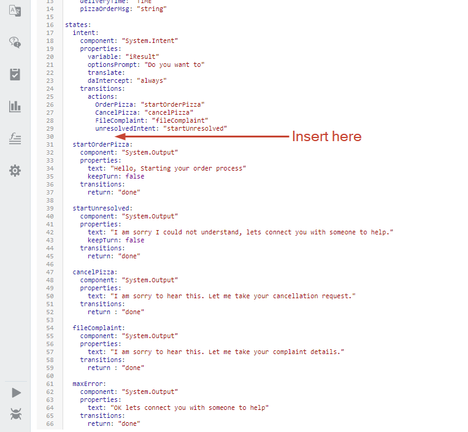

### Troubleshooting Errors in the Dialog Flow

If you see an error message after validating your code, then most likely you misspelled a property name or did not follow the required **two-space indenting increments**. In this case, scroll through the dialog flow until you see an  icon in the left margin. 

Mouse over the icon to display the tooltip with a description of the problem. In addition, you can click the debug icon  which appears to the left of the dialog flow editor. It often provides additional information about the reason. You close the debug window by clicking the debug icon again.

As you keep adding lines, you might introduce syntax errors.  You can use [CodeBeautify](https://codebeautify.org/yaml-validator) to validate your code. 


If you have gotten into a jam and can’t get anything to work, open the [your-first-dialog-flow.txt](../files/your-first-dialog-flow.txt) and replace the content in your dialog flow with the content from the file.


### Tune Intent Resolution

Before moving further, let’s take a look at some settings that are useful for **fine-tuning** intent resolution.
* **Confidence Threshold:** The skill uses this property to steer the conversation by the confidence level of the resolved intent. Set the minimum confidence level required to match an intent. When the level falls below this minimum value, the component triggers its unresolvedIntent action.

* **Confidence Win Margin:** When a skill can’t determine a specific intent, it displays a list of possible intents and prompts the user to choose one. This property helps the skill determine what intents should be in the list. Set the maximum level to use for the delta between the respective confidence levels for the top intents. The list includes the intents that are greater than or equal to this delta and exceed the value set for the Confidence Threshold.

Let’s update these settings:


1. In the left navigation for the skill, click  and select the **Configuration** tab.


2. Set the **Confidence Threshold** property to `0.6`(meaning 60%).


3. Set the **Confidence Win Margin** property to `0.1`(meaning 10%).

    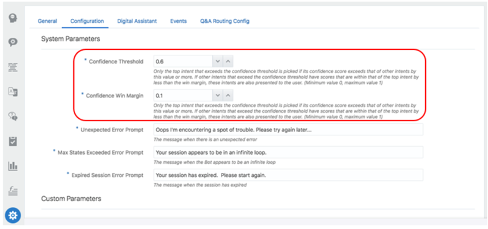


## Test the Basic Flow

Let’s test the basic flow to make sure the skill responds correctly to initial user input.

1. Open the **Skill Tester** by clicking  in the bottom of the skill’s left navigation bar.


2. In the **Message** field, type `I want to order a pizza` and then press Enter.


3. Click the **Intent/Q&A** tab to view intent resolution. You should see an order process message as shown in the image below:

   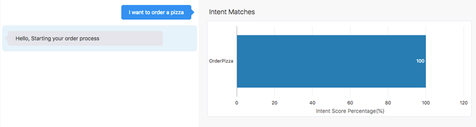


4. Click **Reset**.


5. In the **Message** field, type `I want to cancel my order` and then press Enter. The skill should respond with a message regarding pizza cancelation. And, in the Intent Matches panel, you should see that the `CancelPizza` intent is matched.

   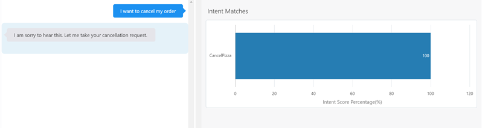


6. Click **Reset**.


7. In the **Message** field, type `Your delivery is too late, either cancel the order or file a complaint right now` and then press Enter.

    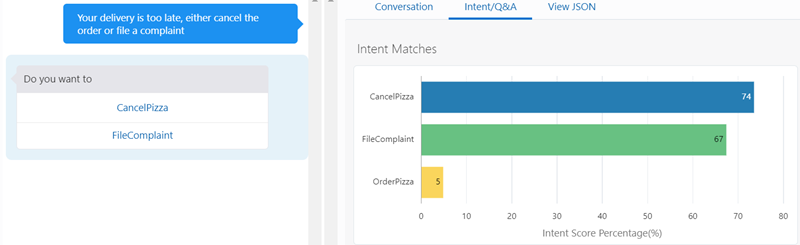

    As you can see, both CancelPizza and FileComplaint exceeded the confidence threshold of 60%. 
    
    CancelPizza has a higher score than FileComplaint. However, since CancelPizza’s score exceeds that of FileComplaint by less than the confidence win margin that we set earlier (10%), the skill presents a dialog so that the user can select what she really wants.


8. Finally, try a last random utterance, click reset and in the message field type `Can you get me a radio taxi now?`

    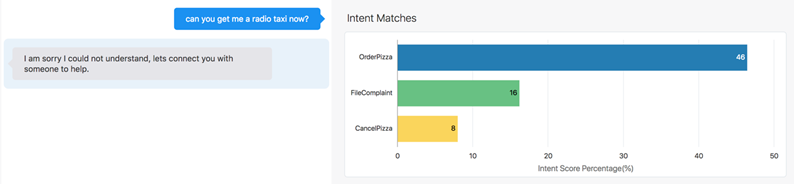

	As you can see, the confidence threshold level falls below this minimum value of **60%** in this case, so the component triggers its unresolvedIntent action.


## Build the Pizza Order Conversation Flow

Now that we have verified that the basic intent model is working, the next step is to implement conversation flows for each intent. In the interest of time, we’ll do this just for the PizzaOrder intent.

We’ll complete the pizza order process by fetching the pizza size, topping, and delivery time, and then printing an order summary.

1. In the dialog flow, navigate to the `startOrderPizza` state
2. Change the `text` property’s value to `"OK, lets get that order sorted"`.
3. Change the `keepTurn` value to ` true`.
4. Delete the line `return: "done"`.
5. Replace the deleted line with `next: "setPizzaSize"`. This is what the state should look like:
  
        startOrderPizza:
          component: "System.Output"
          properties:
            text: "OK, lets get that order sorted"
            keepTurn: true
          transitions:
            next: "setPizzaSize"


### Set Pizza Size


1. Click **+ Components** to open the gallery of component templates.


2. Select the **User Interface** category.

    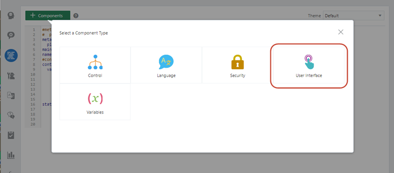


3. Select the **List – set variable** template.


4. From the **Insert After** dropdown, select **startOrderPizza**.


5. Ensure the **Remove Comments** switch is ON.

    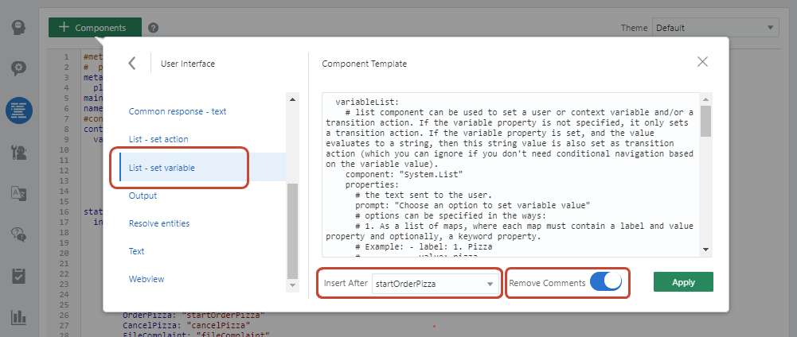


6. Click **Apply**.


7. Change the state name of the newly added component from `variableList` to `setPizzaSize`.


8. Edit the state to look like the following:

	```
	  setPizzaSize:
        component: "System.List"
        properties:
          options: "${pizzaSize.type.enumValues}"
          prompt: "What size of pizza do you want?"
          variable: "pizzaSize"
          nlpResultVariable: "iResult"
        transitions:
          next: "setPizzaTopping"
	```

### Set Pizza Topping
1. Below the `setPizzaSize`
 state, paste the following code (also based on the `System.List`
 component) to create the `setPizzaTopping` state:

	```
	  setPizzaTopping:
        component: "System.List"
        properties:
          options: "${pizzaTopping.type.enumValues}"
          prompt: "What type of pizza would you like?"
          variable: "pizzaTopping"
          nlpResultVariable: "iResult"
        transitions:
          next: "setPizzaDeliveryTime"
	```


### Set Pizza Delivery Time

1. Click **+ Components** to open the gallery of component templates.


2. Select the **User Interface** category.


3. Select the **Text** template.


4. From the **Insert After** dropdown, select **setPizzaTopping**.


5. Ensure the **Remove Comments** switch is ON.


6. Click **Apply**.


7. Change the state name of the newly added component from `text` to `setPizzaDeliveryTime`.


8. Edit the state to look like the following:

	```
	  setPizzaDeliveryTime:
        component: "System.Text"
        properties:
          prompt: "When can we deliver that for you?"
          variable: "deliveryTime"
          nlpResultVariable: "iResult"
          maxPrompts: 3
        transitions:
          actions:
            cancel: "maxError"
            next: "setPizzaOrderMessage"
	```

### Show Pizza Delivery Message

1. Click **+ Components** to open the gallery of component templates.


2. Select the **Variables** category.

3. Select the **Set variable** template.


4. From the **Insert After** dropdown, select **setPizzaDeliveryTime**.


5. Ensure the **Remove Comments** switch is ON.


6. Click **Apply**.


7. Change the state name of the newly added component from `setVariable` to `setPizzaOrderMessage`.


8. Edit the state to look like the following:

	```
      setPizzaOrderMessage:
        component: "System.SetVariable"
        properties:
          variable: "pizzaOrderMsg"
          value:
            - "Thank you for the order!"
            - "OK, so we are getting you the following items:"
            - "A ${pizzaSize.value} ${pizzaTopping.value} pizza at ${deliveryTime.value.date?long?number_to_time?string('HH:mm')}."
			 
	```

	**Note:** The `text` property value uses the Apache FreeMarker expression `|-` to print multi-line text in a single response bubble. Alternatively, you could have used multiple output text components.

### Show Pizza Order


1. Click **+ Components** to open the gallery of component templates.


2. Select the **User Interface** category.


3. Select the **Output** template.


4. From the **Insert After** dropdown, select **setPizzaOrderMessage**.


5. Ensure the **Remove Comments** switch is ON.


6. Click **Apply**.


7. Change the state name of the newly added component from `output` to `showPizzaOrder`.


8. Edit the state to look like the following:

	```
      showPizzaOrder:
        component: "System.Output"
        properties:
          text: |-
            <#list pizzaOrderMsg.value as text>${text}
            </#list>
        transitions: 
          return: "done"
	```

### Validate the Dialog Flow

* Click the **Validate** button on the top of the page, and then fix any errors that are revealed. If you have errors that you can’t resolve, you can copy and paste the code from  [complete-dialog-flow.txt](../files/complete-dialog-flow.txt) .

<br>

## Test Your Skill

Now that all of the skill’s pieces are in place, let's test its behaviour.
1. Open the skill tester by clicking  in the bottom of the skill’s left navigation bar.


2. Click **Reset**.


3. In the **Message** field, type `I want to order pizza` and then press Enter.You should see a menu of pizza sizes:

    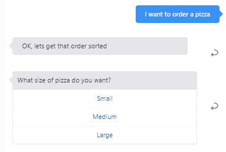

4. In the pizza size menu, select an option, e.g. **Small**.


5. Select a topping e.g. **Veggie**.


6. Enter a delivery time, e.g. `7:30 p.m.` You should receive an order confirmation similar to the one shown in the image below:

    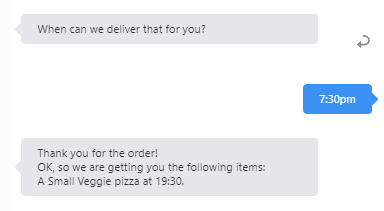


7. Click **Reset**.


8. Now try entering `Dude, can you get me the biggest hot and spicy pizza you can make at noon` and pressing Enter. This time, you should be immediately presented with the results of the order.
    
    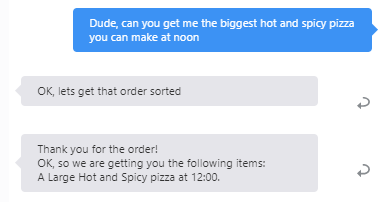


9. Within the **Conversation** tab, scroll down to take a look at the Variable section to see the entity values that were extracted from your input.

    

10. Finally, Click **Reset**, type `I want to a veggie pizza at 8:00pm` and press Enter. This time the topping menu and the delivery time should be skipped, but the pizza size list should be displayed.

    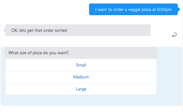


<br>

## Integrate your Oracle Digital Assistant with a Visual Builder App

This tutorial shows you how to use the Oracle Native SDK for Web/JavaScript (also known as **Oracle Web SDK**) to add to your web site a chat window that communicates with an Oracle Digital Assistant skill. You'll start with a basic web interface and then learn how to use the SDK to customize and enhance the behavior and look and feel.

**** 
**Note:** 

This tutorial won't work if you are using Oracle Digital Assistant Release 19.4.1, since the version of the SDK that this tutorial requires is only available for instances of Digital Assistant that have been provisioned on Oracle Cloud Infrastructure (Gen 2). 

For information on setting up a web channel on Digital Assistant 19.4.1, see [Expose Your Digital Assistant through a Web Channel](https://docs.oracle.com/en/cloud/paas/digital-assistant/tutorial-web-channel/index.html).

**** 

As part of this exercise, you will be provided with the following assets:

* [index.html](../files/index.html) (Click **Save Link As** and save it locally)
* [style.css](../files/style.css) (Click **Save Link As** and save it locally)
* [scripts.zip](../files/scripts.zip) (Click **Save Link As** and save it locally)


**Background**

While your customers can access your skills through many platforms, such as Android apps, Twilio SMS, Facebook Messenger, WeChat, and Slack, they also can access skills directly from your website through the Oracle Web SDK. 

This feature gives your customers the opportunity to ask questions, complete transactions, resolve problems, and so on, as they browse your web pages.

The SDK's features include configurable components, such as:
- Timestamp display
- Chat bubble size and padding
- Font color and size
- Custom buttons and icons
- Chat widget size
- Autocompletion of text
- JWT client authentication

The SDK connects to the Oracle Chat Server, which stands between Oracle Digital Assistant and the skill (or digital assistant). The chat server then passes messages to the skill for processing and delivers the skill's response to the client.

### Create The Channel

1. Let's start by creating a channel. Login into your Oracle Digital Assistant Console, click on the **General Menu**, select **Development**, and then **Channels**.

    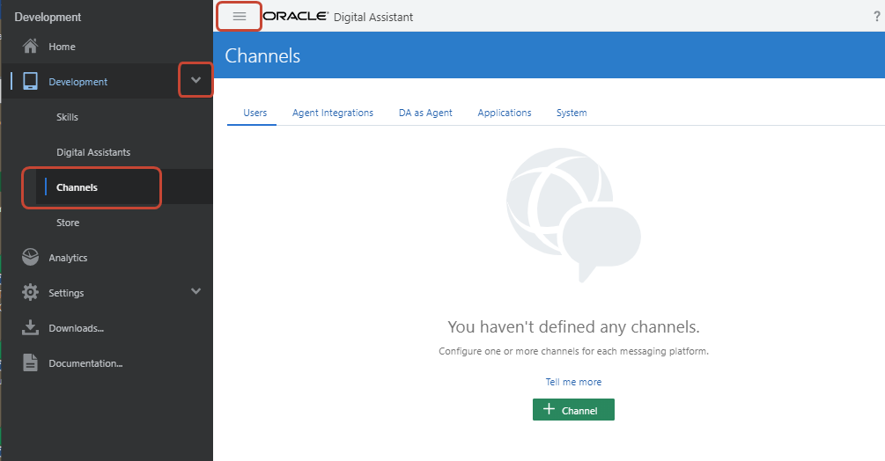


2. Click on the **General Menu** again to close the side menu and then **+Channel** to add a new channel.
    
    


3. Give the channel a name, a description, select channel type `Oracle Web`, in `Allow Domains` enter `*` and for the purpose of this lab disable `Client Authentication Enabled`. Click **Create**

    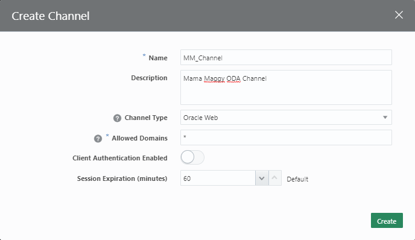


4. Make sure the **Route To** is set and the **Channel Enabled** is enabled. 

    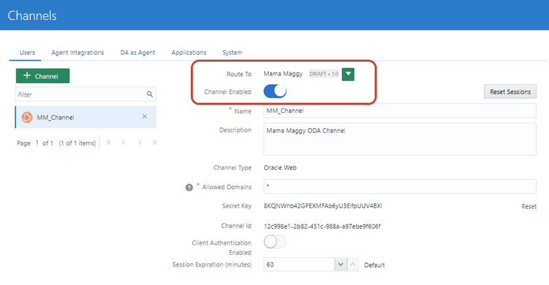


5. Copy the `Channel Id` and the `URI` to a notepad. We will use it for the WebApp configuration.

    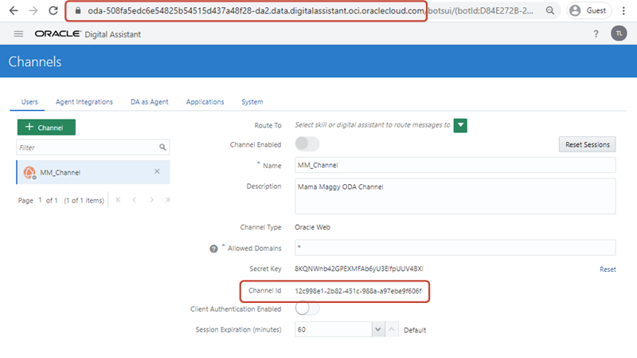


### Create The VBCS Web App

1. Now login into Visual Builder Cloud Service and create a new WebApp on a separate project.

    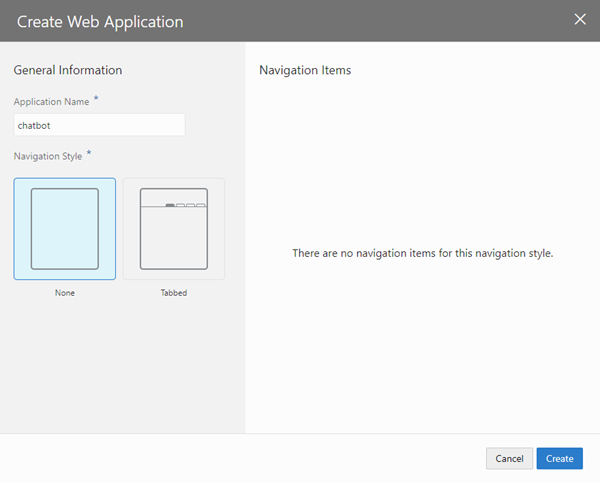

2. Select the app name at the root level and click on the code snippet, delete the content from the file and copy and paste the code from the sample file [Index.html](../files/index.html). 

   *Note: You must edit the file with a code editor (or text editor) of your choice and copy it’s content.*

   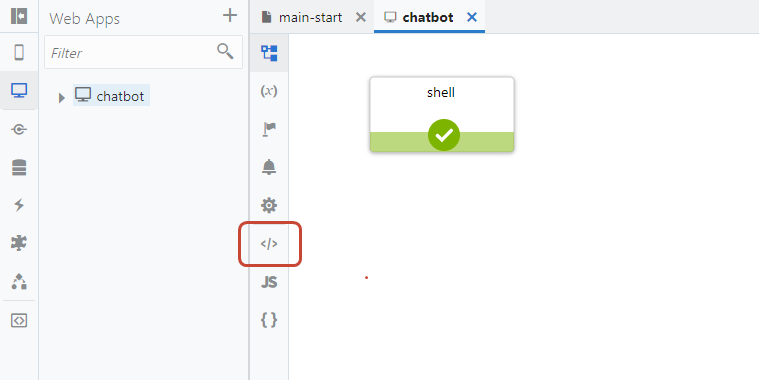

3. Replace the `URI` and `CHANNELID` variables with the information that you should already had saved from the previous exercise (step 5).

   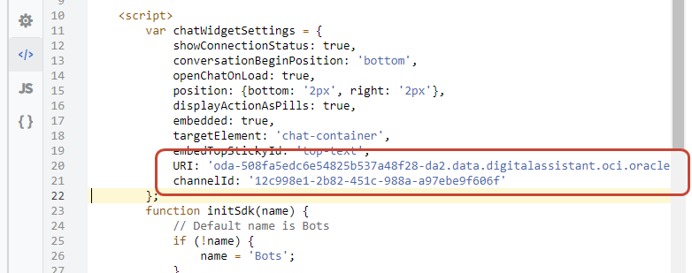


4. Download the ODA Web SDK script files [script.zip](../files/scripts.zip) to your laptop. You can download the latest version of the SDK from [Oracle Digital Assistant (ODA) and Oracle Mobile Cloud (OMC) Downloads](https://www.oracle.com/downloads/cloud/amce-downloads.html).


5. Right click on **Resource**  and select **Import**

    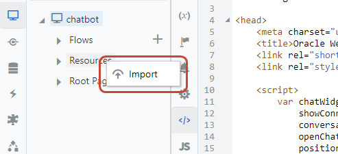


6. Drag or search the scripts zip file downloaded in the previous step.

    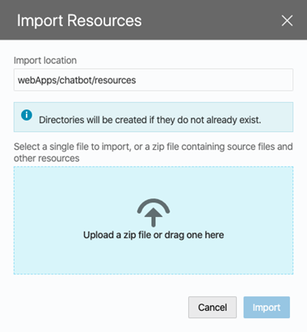


7. Click on the + option next to **css** under **Resources**, and add a new page.

    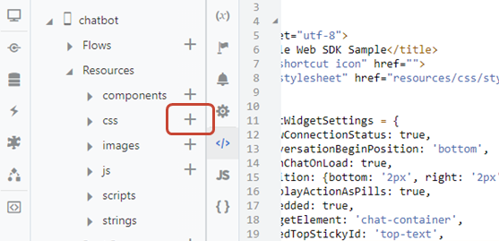


8. Name it `style.css`

    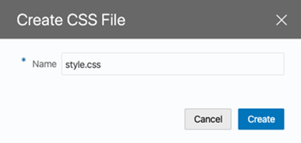


9. Select the new `style.css` page and copy the content from [style.css](../files/style.css)

    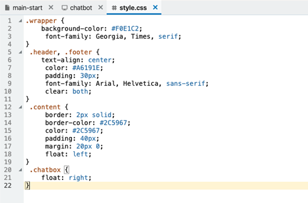


10. Now it is time to test your new app, click the play button locate at the top right of your screen.

    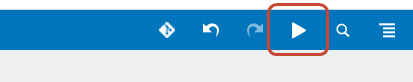


11. You should see the web app screen with the skill icon at the bottom right.

    **Note:** The chatbot's default behavior is to popup as the webpage load. 

    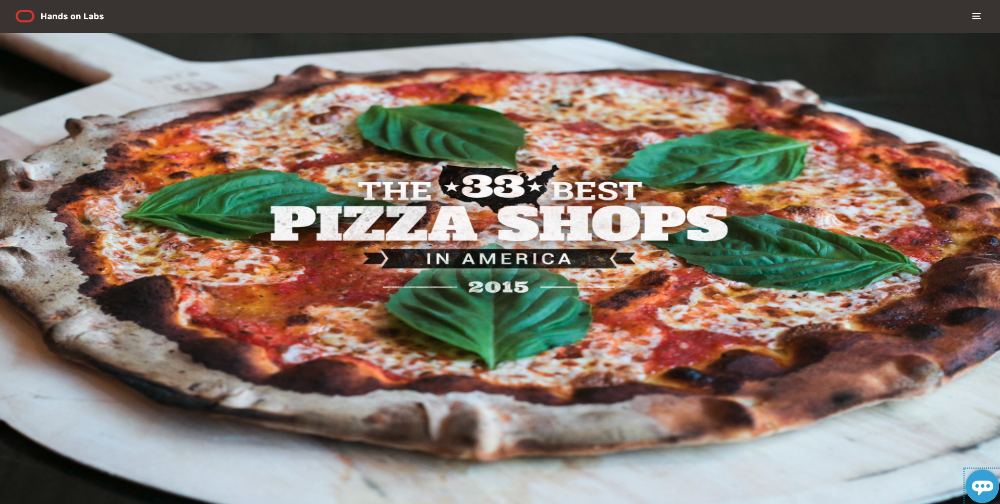
    
    If it's not active, click on the chatbot icon to initiate the test.

    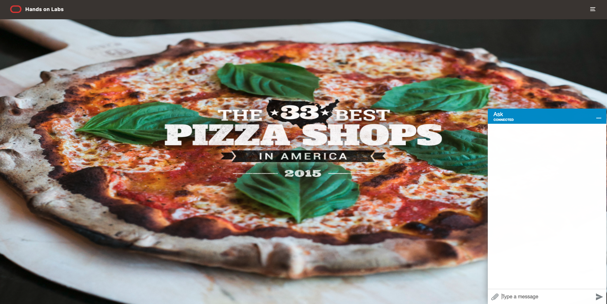


12. Type `I want a pizza` and press enter. You will experience the same behavior in testing the Digital Assistant that you had created earlier.

    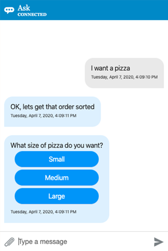


13. Finally, Let's use one of the message created during the training process. type the message `Dude, can you get me the biggest hot and spicy pizza you can make at noon` and press enter. 

    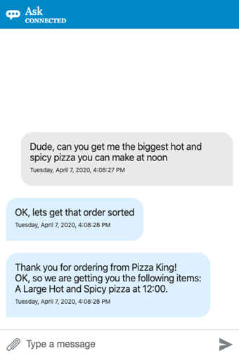

<br>

*****************************

**Congratulations!**

You have created your first skill that can be used by customers to interact with Mama Maggy stores, including ordering pizzas and canceling orders. As part of this process, you have completed the following tasks:
* Define intents, utterances, entities.
* Design a conversation flow.
* Validate, debug and test your skill.
* Integrate the skill with your WebApp/Mobile App

*****************************

<br>

[**Return to Main Page**](../index.html)


