# Visual Builder Cloud Service

**Before you begin**

This 3 hours hands-on lab is an entry-level exercise for building a Web and Mobile App.

**Background**

Visual Builder provides an easy-to-use WSYIWG *(What You See Is What You Get)* graphical interface for **painting** applications and providing values declaratively allowing people who are not professional developers to create applications. Professional developers may use Visual Builder too; they might also choose to use VBCS’s advanced features and coding capabilities to make applications more-robust.

**Lab Objectives**

These exercises are designed to provide you with an introduction to using Visual Builder to create Web and Mobile applications and to prepare you to demonstrate its features to customers.

Here are some general guidelines that will help you get the most from these exercises.

  - Read through an entire exercise before executing any of the steps. Becoming familiar with the expected flow will enhance your learning experience.

  - Ask before you do. If you have any questions, please ask the instructor before you march down a path that may lead to wasting your time.

  - Follow the steps as shown in the Exercise Guide. This is a live environment. If you want to do something that is not in the Exercises, ask the instructor first. In particular, do not create, delete, or alter any cloud objects without asking first.

  - There is no prize for finishing first; there is no penalty for finishing last. The goal is to gain a firm understanding of Oracle Visual Builder.

  - Ask questions freely. The only dumb questions are those that are not asked.

**Intended Audience**

- Beginner/Intermediate technical learners
- New to cloud
- New to Oracle Cloud Infrastructure

**Changelog**
- April 6, 2020 - version 1

**What Do You Need?**
* Access to Oracle Visual Builder Cloud Service.

**Mama Maggy Need Your Help**

Today when a manager or franchisee needs to order supplies everything is accomplished with a series of phone calls between the manager/franchisee and Mama Maggy headquarters. The only status checks available are by again calling headquarters. 

* Manager/franchisee determines need.
* Manager/franchisee calls HQ for product name and pricing info.
* Manager/franchisee calls HQ to create an order for one or more products.
* Manager/franchisee waits for delivery, if they wish to check status they must once again call HQ.

In addition, if store managers/franchisees wish to contact other stores to ask about borrowing supplies or to discuss business, they once again have to go through headquarters to get contact information. 

These processes are often inconvenient and slow, the managers/franchisees would like to improve things.

In these exercises you will use Visual Builder to help Mama Maggy by adding product ordering and order tracking solutions.

**The Solution**

In our exercise we will BEGIN to address the needs of the managers/franchisees by creating the following applications:

- Product Catalog Web application for managers/franchisees.
- Web application to help managers/franchisees to track order's product, quantity, and prices.
- Mobile application allowing busy manager/franchisee to check the status of their orders from anywhere with their phone.
- Web application to list all Mama Maggy stores and their locations and the list of associates in that location along with contact information.

In the interest of time this exercise focuses on creating apps to help managers/franchisees to self-serve information they currently rely on headquarters for. Future work will be necessary to automate the creation and update of orders and/or the other information.

The exercise is presented in five parts:

* Exercise 1 – Introduction and Setup
* Exercise 2 - Spreadsheet-based Business Objects
* Exercise 3 - Build Mama Maggy Data Application
* Exercise 4 – Web and Mobile Apps
* Exercise 5 – Data from Service

**Getting Started**

Before starting these exercises, you should have an OCI login and access VBCS instance.

You will need to download the data files, all the files are available in a single .zip file named [vbcsfiles.zip](../files/vbcsfiles.zip); download the file and expand it to find the following files (keep them handy they will be used later in this exercise):
 

* Exercise 2 (Data for VBCS Business Objects)
  * Product.csv
  * ProductOrder.csv
  * ProductOrderLine.csv
 
 
* Exercise 3 (Build Mama Maggy Data Application)
  * Associate.csv
  * Store.csv
 
 
* Exercise 5 (Links used for VBCS Service Connections)

*****************************
**NOTE** 

* All four files may also be downloaded directly from GitHub, however, to download the .csv files directly will require extra steps;  open the .csv in your browser, then, click 'Save As' to store the file as .csv (use the .zip file it's easier)

* Content is driven by external factors such as user data entries and login date. As a result, what you see displayed in your environment may not exactly match with the lab screenshots. Screenshots are provided solely for illustrative purposes to help guide you through the user interface.

**Disclaimer:**  This exercise is designed ONLY for individual learners; however you can share an instance and work along other team members.Keep in mind that you must set up instance access to your group before start the exercises.
 
*****************************

 

## Welcome to Oracle Visual Builder Cloud Service

## Day 1 Introduction, setup, and demo

**Introduction**

In this exercise you will make sure you can access your VBCS instance and navigate the main console.

### Exercise 1: Introduction, setup, and demo

1. First, go to cloud.oracle.com, click on **View Accounts** and select **Sign in to cloud**

    

2. Enter the name of your **tenancy** or the **cloud account**.
    
    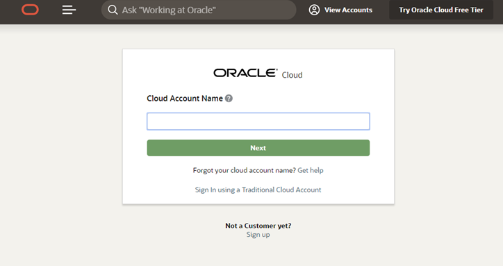

3. On the login screen select Oracle SSO and provide your credentials.

    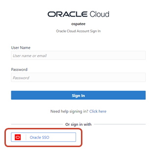

4. Once in the main dashboard, open the **General Menu** located at the top left hand side of the screen, select **Platform Services**, and click on **Visual Builder**.
    
    

1. Click the dropdown menu next to your instance name, and select **Open Visual Builder Home Page**.
    
    

6. When the **Visual Applications** welcome appears; choose the **New Application** button.
    
    

9.  When the **Create Application** page appears, provide a name for the application; you may call your applications anything you wish.

    If you are sharing your lab environment with a group of people you might find it convenient to follow a naming convention to make it easier for you to find your work and for the facilitators to help you.
          
    Be sure the **Empty Application** template is selected and click **Finish** to continue.

    

10. You are now ready to begin creating your application\!

    

**This concludes exercise 1.**

 

******

### Exercise 2: Spreadsheet-based Business Objects

To build the solutions for Mama Maggy's managers/franchisees, data is required, right now that data is stored in several spreadsheets. We need to make that data available inside VBCS so that it may be used in the web and mobile applications created in these exercises.

Visual Builder provides two main methods to access data: built-in business objects, and service connections. VBCS business objects store data in tables like a database. This exercise focuses on creating and using built-in business objects with data supplied via spreadsheet (.csv/.xlsx) files. These files get copied into an Oracle Database (under the covers of VBCS) and are actually accessed using the same type of RESTful APIs as those used for service connections (more on this in exercise 5).

NOTE: For this exercise you will need three data files (Product.csv, ProductOrder.csv, and ProductOrderLine.csv), if you have not already downloaded them they may be obtained from GitHub as a .zip file named [vbcsfiles.zip](../files/vbcsfiles.zip); download the file and expand it to find the following three files (keep them handy they will be used later in this exercise):

| File                 | Description                                                  |
|----------------------|--------------------------------------------------------------|
| Product.csv          | Products available for managers/franchisees to order         |
| ProductOrder.csv     | A list of order submitted by manager/franchisses  |
| ProductOrderLine.csv | Order lines showing the products requested in each of the current orders, their unit price, and the quantity desired |

******

**Begin Exercise 2**

1.  If you have logged out of the Oracle Cloud, please log back in and return to your VBCS application.

    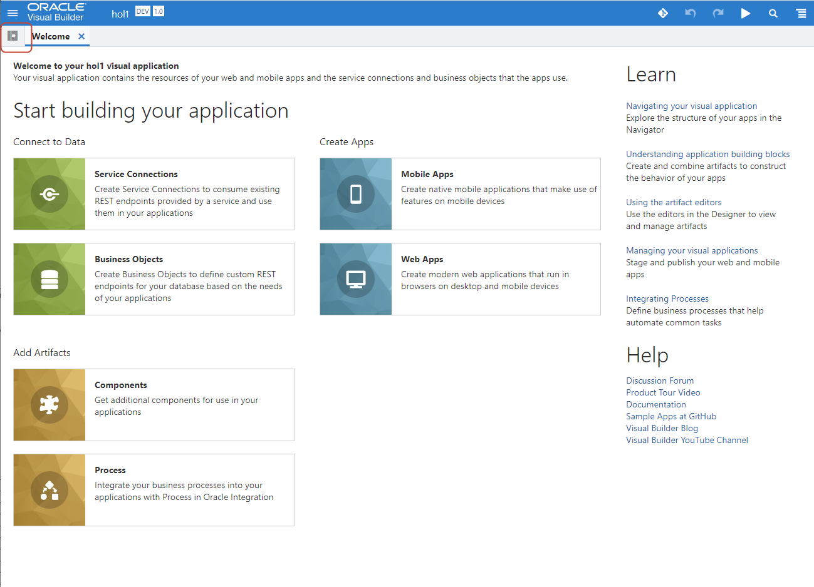

2. Select business objects, if you don’t see the navigator, click the **Expand Navigator** icon in the upper-left corner. 

    - If you don't have any Business Objects already you'll see the following **You don't have any business objects defined yet** image; click on the **+ Business Object** button.
    
        

    - If you already have Business Objects a list will appear; click the plus sign **+** at the top of the Business Objects list.
    
       

3.  From the application page, click **+ Business Object** to begin adding
    a business object
       
    The first Business Object you will create will contain information about what products are available for managers/franchisees to order for their stores; 
    set the business object name to **Product** and when ready click **Create**.
    
     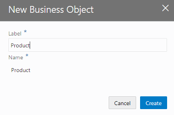

4. The Business Object page allows you to create fields and manage your Business Object. Note that some fields have been defined automatically, this is normal. The **id** field is treated as a key and will be used to access items in the business object automatically later.

    

5. To add a field click the **+New Field** button 

6. For each new field the Name and General Data Type are specified

    - Set the label of the first field to `Product Name` note that Visual Builder creates the name as `productName`
    
    - Set the Type to character by making sure the **A**  is selected as shown below (be sure to select the correct **type**)

    - Click the **Create Field** when done
      
    

7.  In the box at the lower-right part of the VBCS editor set the field property to **Required**. This setting will make this field mandatory.

    

8.  Now add two more fields; be sure to mark the all **Required** 

     |    Display Label        | Field Name           | Type  |
     |:------------- |:-------------|:-----|
     | Product Description     | productDescription| A |
     | Unit Price      | unitPrice      |   # |
     
     You end up with a list like this (note that all four of the fields added should be marked **Required**):
     
     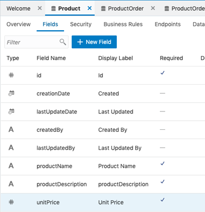

9.  Create another Business Object named **Product Order** (ProductOrder) by clicking the **plus sign** at the top of the Business Objects list again

    

    The **Product Order** Business Object will contain specifics about orders made by managers/franchisees including the associate that made the order, the order date, the current order status (open, shipped, complete) , and the last transaction date (order shipped, order closed, etc.) occurred on the order.
   
    Add these fields; be sure to mark them all **Required**

    | Display Label | Field Name  | Type     |
    |:--------------|:------------|:----------|
    | Associate     | associate   | #         |
    | Order Date    | orderDate   | Date Time |
    | Order Status  | orderStatus | A         |
    | Action Date   | actionDate  | Date Time |
    
    The final result should looks like below (Check the fields added are set the correct **type** and marked **Required**)

    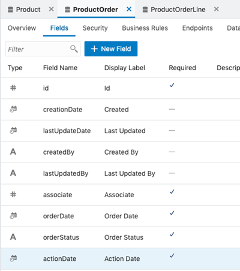

10. Create another Business Object named **Product Order Line** (ProductOrderLine).
The **Product Order Line** Business Object will contain specifics about each item included in **Product Orders** made by managers/franchisees including the **Product** ordered, its Unit Price, and the Quantity ordered.

    To make it possible for VBCS to connect the **Product Order Line** with the correct **Product Order** and the **Product** being ordered (so that the product name can display rather than a product id) you will create two **Relationships**:

      - between the **Product Order Line** and its associated **Product Order** record
      - between the **Product Order Line** and the **Product** being ordered

    But this time before adding fields you will first add two relationships to the other business objects that will show up as `references` later. 
    
    These relationships connect specific `Products` to `Product Order Lines` and `Product Order Lines` to `Product Orders` allowing VBCS to **automatically** connect that data when building web and mobile applications later.
    
    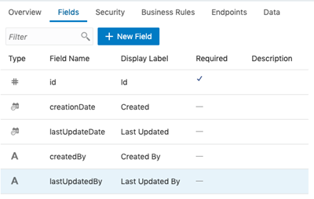

15. Click on the **Overview** tab to see where relationships are defined.
    
    

16. Click on the plus sign **+** to begin adding relationships.
    
    

17. Use the **drop down** on the right side of the screen to select **Product Order** and check to make sure that **Product Order** is on the **One** side and **ProductOrderLine** is on the **Many** side of the relationship. Click **Create Relationship** once you are done.

    

18. Click on the plus sign **+** to add another relationship.

    

19. Using the drop-down on the right side of the screen select the **Product** and make sure that **Product Order Line** is on the **Many** side and that **Product** is on the **One** side of the relationship. Click **Create Relationship** when done (defaults are ok).

    
    
    The relationships have been defined, now to enter remaining fields.
    
    

20. Return to the **Fields** tab; the two relationships are now listed as fields with a **reference** icon  indicating the relationship is established. Select the last row, **Product** as shown in next screenshot and click **+ New Field** icon  to continue (VBCS adds new fields below the currently selected field).

    

21. Next, you will add two fields in the usual manner. Add **Unit Price** and **Quantity** as numeric fields.

    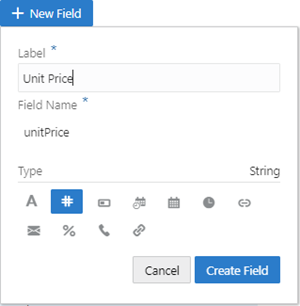

    

22. The completed field list should look like this:
    
    

23. Examine the **Endpoints** created by VBCS for each of the Business Objects you defined; these are the RESTful APIs that allow your applications (and others) to access the Business Object; Get (read), Post (create), Patch (update), Delete (delete) – we will use at least two of these in the next lab.

    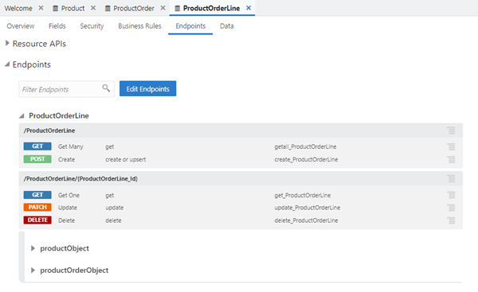

24. It will be useful for testing purposes to have some data in the **Product** Business Object. VBCS provides a way to load single rows/records manually as shown below. (Later you will add many rows/records from an input **csv** file).

    Reopen the **Product** Business Object (from the Business Objects list); click on the **Data** tab and then click **+ Add Row** to add a row of data

    

25. Provide the following values for the new row:

    - Product Name: MOZZARELLA
    - Product Description: Mozzarella cheese
    - Unit Price: 7

    (click the **Add Row** when done)
    
     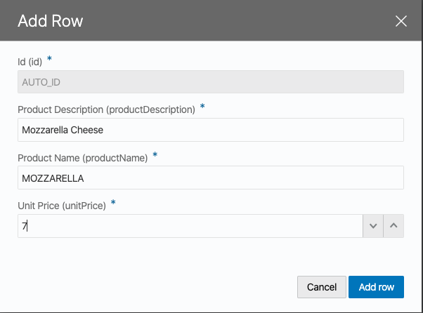

    
26. Add rows for DOUGH:

    - Product Name: DOUGH
    - Product Description: Dough
    - Unit Price: 11

    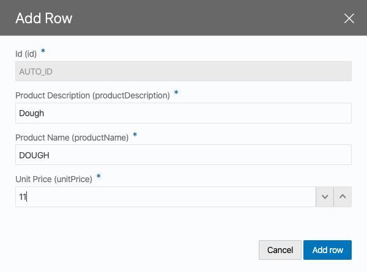

27. Add rows for PIZZA\_SAUCE:

    - Product Name: PIZZA\_SAUCE
    - Product Description: Pizza Sauce
    - Unit Price: 6
    
    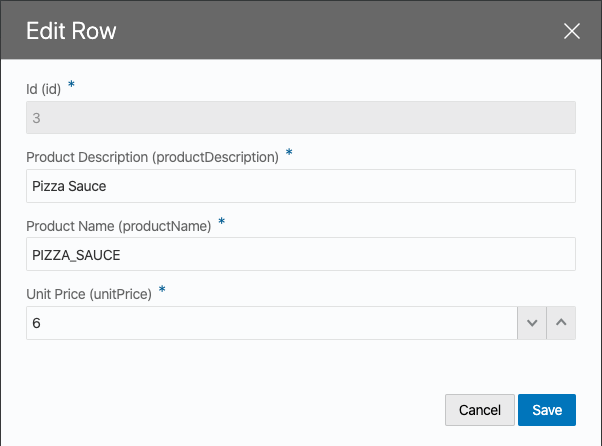

28. Review the rows

    

29. To load more rows from a .csv file; click on the **Product** Business Object’s hamburger menu  and choose **Data Manager**

    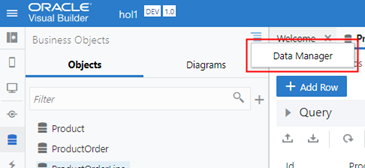  

30. Choose **Import from File**

    

31. Click on **Upload** a file or drag it here
    
    

32. Select the **Product.csv** file provided
    
    

33. Click the **Import** button to upload the selected file
    
    

34. You should see success message like the following; if not, try again or ask the instructor for help; click **OK** button when complete
    
    

35. Review the **Product** business object data to see the results of the load. 
    
    

36. Create an initial **Product Order** (`Product Order -> Data -> + Add Row`) as follows, then review your results  

33. Create an initial **Product Order Line** as follows, use the **Product Order** and **Product** pull-downs to choose those values (if the value you want does not appear in the list you can start to type the value in and it will appear, for instance **M** for **Mozzarella**), type in the other two then review your results and click the **Add Row**

    

34. Now, using the technique illustrated above, import data to the **Product Order** and **Product Order Line** business objects in that order, (note: file names same as business object names) using the provided data files

    - Product Order - ProductOrder.csv

        

    - Product Order Line - ProductOrderLine.csv

        

*****************************

**Congratulations!** The data needed allowing Mama Maggy managers/franchisees to see what products are available to order and to check the status of existing orders is now ready for use. This data will be used in the web and mobile application you are going to build.

*****************************

**This concludes exercise 2.**

******

### Exercise 3: Build Mama Maggy Data Application

This exercise shows how the **Mama Maggy** application was created to serve as a data source for the Application Development exercises.

Make sure a co-worker has not already performed this task if you are working on a shared environment. However, it is possible you may need to create this VBCS application; it is used to simulate **external** data available via RESTful APIs.

In this exercise you will create:
  - A VBCS Application to house the data components (we suggest the name **Mama Maggy**)
  - A **Store** Business Object containing fields and data for the list of Mama Maggy’s stores
  - An **Associate** Business Object containing fields and data for Mama Maggy associates
  - Two .csv files are provided to provide data for Store and Associate   (be sure to create **Store** before **Associate** (Associate references Store), and load data into **Store** first before loading data into **Associate**)

1. Log into your tenancy using cloud.oracle.com; be sure it has been provisioned to allow Visual Builder Cloud Service and the database and object storage instances also required. (check with your tenancy admin if unsure)

2. Select **Platform Services** and click on **Visual Builder** 
   

3. When the VBCS Service Console **Instances** list appears; use the **General Menu Icon** on the far right and choose **Open Oracle Visual Builder Cloud Service Home Page** to begin creating your new application

    

4. When the **Visual Applications** list appears; choose the **New** button
   
   

5. When the **Create Application** panel opens; provide an **Application Name** of **Mama Maggy** (**Application Info** will default based upon what you type), provide a description (optional), and select the **Empty Application** template (should be the default)

   
 

6. Click the **Finish** button when done

   

7. This application will be used to host two Business Objects that will be used by other applications via RESTful APIs; this is simulating the use of external API access such as database or SaaS application

8. Select the **Business Object** button to start creating business objects

   
 

9. From the application page, click **+ Business Object** to begin adding a business object

   
 
 
10. Provide a name **Store** and click the **checkbox** icon

    
 

11. Add the following fields as required to the Store object (please create them as shown to match the .csv data):
    
    - Name
    - Address
    - City
    - State
    - Mailcode

    

12. Create an **Associate** object next; this will happen in steps to account for the reference in the **Associate** row to the **Store** row

13. Add fields as follows:
     - From the **Fields** tab, click **+ New Field** and add **Name** as required
     - Define the **Store** relationship:
       1.  Switch to the **Overview** tab
       2.  Click **Relationships +**
       3.  Use dropdown to select **Store**
       4.  Make sure the relationship is one **Store** to many **Associate**
       5.  On the **Display Field** select **Id**
       6.  Click **Create Relationship** when finished
     - From the **Fields** tab, click **+ New Field** and add **Hire Date** as required (date field)
     - From the **Fields** tab, click **+ New Field** and add **Email** as required (email field)
    
    
 

14. To load data into the objects, select the **General Menu** within the business object section , and click the **Data Manager** option

    
 
 
15. Click on **Import from File** from the **Manage Application Data** panel
    
 
 
16. Click on the **Upload a file or drag it here** picture

    
 
 
17. Select the **Store.csv** file supplied as part of the course setup and click the **Import** button
    
    

18. Visual Builder will report upon the success/failure of the import

    

19. Import the **Associate.csv** file using the same technique
    
    

20. Results should be.

    

21. Review the added data using the **Data** tab for the two objects

    * Store
    
      

    * Associate

      
 

22. Click on **Endpoints** to see resources. Access points currently have a **version** number and will change each time the objects are modified. Currently only the **development** addresses are available. The steps below will show you how to publish and make the addresses constant

    
 

23. To **set** the access points so that they will not change over time; you must first **Stage** and then **Publish** the application.  (When the application is in **Development** and **Staging** the addresses are versioned; once an application is published to the **Live** environment the address will not change and is suitable for sharing)
  

24. Using the **General Menu** icon  (far right) open the menu and select **Stage** for the application

    
 
 
25. Select **Populate Stage with Development data** to copy the data loaded previously into the staging environment, then click the **Stage** button

    
 

26. The addresses we need are still not final, so the application must be published. Return to the list of applications and click the **General Menu** icon again. This time choose the **Publish** option

    

27. Be sure to **Include data from Stage** before you click the **Publish** button

    

28. Reopen the application. In order for others to use REST APIs to access the data in the application’s business objects the Resource API addresses must be made available

29. Select the **Store** business object and click on the **Endpoints** tab. Addresses are listed for Development, Staging, and Live environments. Also there are two columns, the ones on the left provide Metadata that more-advanced client applications (like Visual Builder) may take advantage of. The column on the right shows data-only **Endpoints** that require a little more work to use
 

30. From the left column select the **Live** address and click the **clipboard** icon . Paste the resulting string into a text file in your local environment to share with applications wanting to use the data
 
    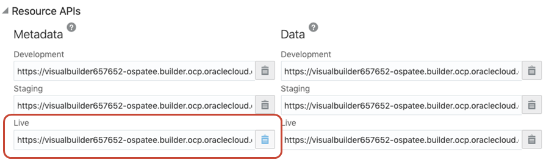

     This is the address needed to access **Store** data

31. Select the **Associate** business object and once again display the **Endpoints** tab. Copy the value from the **Metadata** column **Live** row using the **clipboard** icon . Paste the resulting string into a text file in your local environment to share with applications wanting to use the data

    
    
    This is the address needed to access **Associate** data

*Note: Keep these endpoints information in a notepad. We will use it as part of another exercise.*

*****************************

**Congratulations!** you’ve created an application with business objects that may be accessed using REST APIs like those used in exercise 5.

*****************************

**This concludes exercise 3.**

******
 
 

## Day 2 Web and Mobile Apps

**Introduction**

In exercise 4 you will create web and mobile applications so that Mama Maggy managers and franchisees may see what products are available for order and to track the status of orders once they are made.

Exercise 4 has three sections:

  - Section 1 – [Create First Web Application](#exercise-4-section-1--create-first-web-application)

  - Section 2 – [Create Master-Detail Application](#exercise-4-section-2--create-master-detail-application)

  - Section 3 – [Create Mobile Application](#exercise-4-section-3--create-mobile-application)

 

### Exercise 4 - Section 1 – Create Web Application

In exercise 2 you created three business objects and uploaded data to the embedded database; now you will create a web application to work with them.

1.  If you're still logged in to the Oracle Cloud and VBCS, skip to #2 below. 

    If you have logged out of the Oracle Cloud, please log back in and return to your VBCS application. You might find it useful to close any open windows.
    
2. On the left-hand side of the Visual Builder interface is a navigator listing several options; choose **Web Applications** 

    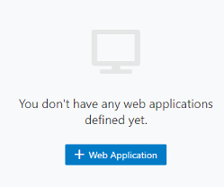

    If you don’t see the navigator, click the **Expand Navigator** icon in the upper-left corner, then click the **Web Applications** button 
 

3. Add a new Web Application

    First, you'll create a web application with two features; displaying a list of all products that a manager/franchisee might order, and a page showing specifics about a chosen product.
    
    If you don’t have any Web Applications yet; click the **+ Web Application** button
    
    
    
    Or, if you want to add to your existing Web Applications; click the plus sign **+** at the top of the Web Apps list
    
    
 

4. The first Web Application you will create will be called **productList** - Type the name in the Application Name box and click the **Create** button to start building the application.

    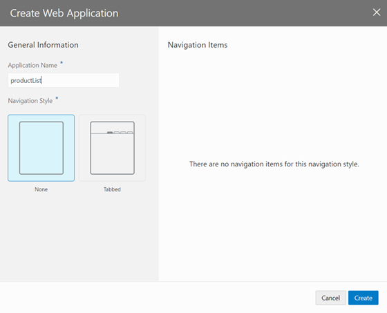

5.  The Visual Builder interface has three main tabs for creating web applications:  Designer,  Components, and  Page Structure.

    

    Visual Builder will also display an object list in the navigator
    
    

6. Let's start designing our app. Add a **Heading** component from the Component list (icon is a toggle)

    

    Drag and drop the component **Heading** to the design area as shown here

    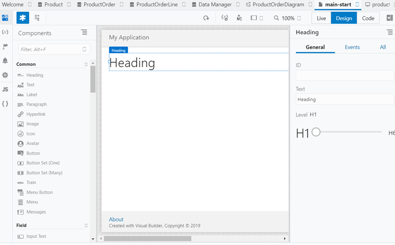

    Change the heading to **Product List** using the Property Inspector on the right-side of the screen. The **slider** may be used to alter the heading’s size.

    

    If you don’t see the Property Inspector; click the **Expand Property Inspector Icon** in the upper-right corner. 

    The screen should look something like this now.

    

7. Add a table to the application by scrolling the Components list until you see the Table icon. This component will allow us to display the results organized on a table format.
    
    
 
    Drag the Table icon to the design area.
 
    
 

8. To add data to the table, select the table and click the **Add Data** option from the list on the right.

    

    The **Add Data** wizard will list any Business Objects and/or Service Connections currently defined.

    

    Choose the **Product** business object created in the previous exercise, and then click **Next** to go to the next step in the wizard.

    Select the fields you wish to display (select them in the sequence to be displayed, you can move them if you make a mistake) and click **Next** to continue in the wizard to **bind** the business object’s data to the objects on the screen.
    
    

    For this app you will not be changing the query, so just click the **Finish** button

    

    Visual Builder will then show some data in the design window.

    

9.  Test the application by clicking the **Preview** button  in the upper-right part of the screen.

    

    A new browser window will open with your running application.

    

    Success! Mama Maggy managers/franchisees can now see a list of the various products available for order (without having to call headquarters).

10. Now, let’s add a page of detail, this page will allow us to drill down and get further information on the specific items. Return to the Visual Builder Designer and select the table containing the property list. Notice the icon on the right side near the top of the Property Inspector.

    
    

11. The **Quick Start** button makes adding to your application easy. 
 The Quick Start options include: Adding data, building a Create Page (new row), an Edit Page (update row), a Detail page (display single row), Delete Action (delete row), or Task Actions (add task controls).
    
    

13. Click **Add Detail Page** to begin the wizard.
    
    

14. Once the wizard starts; select the **Product** Business Object and click **Next** to continue.
    
    
    

15. Select the fields to be displayed; you may either select by checking them in the list or **dragging** them to the fields in the center area. You may also change title and other features, even the name of the button that will display on the main page to launch this page. Click **Finish** when done.
    
    

16. When complete, the object navigator on the left will show the new page. Select the new page **main-product-detail** to see what it looks like. Note that the **Product List** screen is called **main-start** and the **Product Detail** screen is called **main-product-detail** (These may be renamed if desired but it's not really necessary).

    
    
    **Potential Context Error**
    
    You may see an **error** message similar to the following. Remember that Visual Builder is WYSIWYG (*what you see is what you get*) and attempts to show real data during the design process.
    
    

    This error frequently occurs because Visual Builder cannot find a **context** to tell it which data to display. (in this case, the VBCS editor wants to show the Product Detail page with **live** data, but, does not know which record to display). 

    There are two methods to set the context.

    **Method 1: Use the Page Input Parameters button**

    Click on the Page Input Parameters button
   
    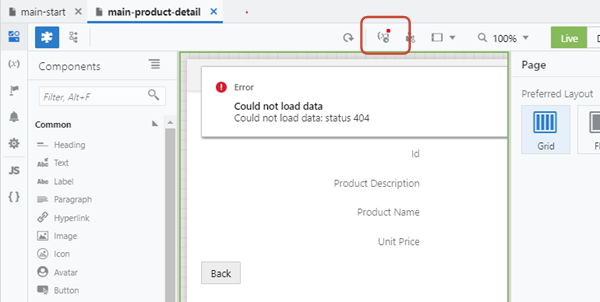
 
    Enter the details of the context, in this example it is the product ID number:

    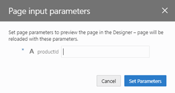
 
    
    **Method 2: Use the VBCS editor's **Live** capability**
    
    First, look for the **Live/Design/Code** button in the upper-right part of the Visual Builder editor. Click on **Live** to begin the process.

    

    Now, return to the Product List page, you can click the **Back** button or select the **main-start** page (You should see **main-start** on the top bar as a tab), and select a row, this sets the context to the selected row. (**MOZZARELLA** selected below)

    
    
    Click the **Product Detail** button to return to the Product Detail display and you should now see data rather than the error message
    
    
    
    The VBCS **Live** mode is useful in testing to see how changes might behave, it is not the same as running the application

    Click **Design**  to exit **Live** mode

17. Now, to really test the application; run the application using the **Preview**  button in the upper-right corner. 

    When the **Product List** displays note the **Product Detail** button is not available (it is **grayed out**) since no product has been chosen. Select one of the products and the **Product Detail** button will become active. 

18. Click on the **Product Detail** button to see the details for that product
  
    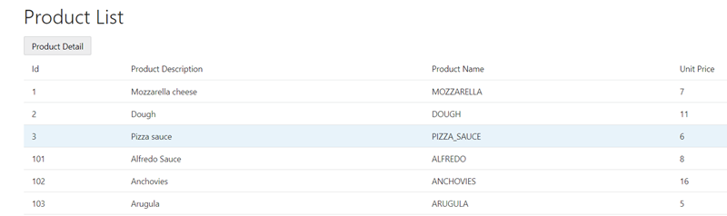

19. Once you have reviewed the product details, click the provided **Back** button to return to the list.

    

    In addition to viewing the data; you may also use the **Quick Start** do add Create, Edit, and Delete pages for products. (not part of this exercise).

*****************************

**Congratulations!** 

You’ve successfully created your first Visual Builder web application. 

You've also made a day in the life of a Mama Maggy manager/franchisee easier since they can now see what products are available to order without having to play telephone-tag with headquarters.
*****************************

 

### Exercise 4 - Section 2 – Create Master Detail Application

In this section you will create a set of screens to represent product orders. Here’s what the data model looks like.

The second application will allow Mama Maggy managers/franchisees to track the status of their product orders. This will include a list of all product orders, the ability to see the specifics of a single order including a list of each product in that order, its unit price, and the quantity ordered.

In this exercise section you will create a two-screen application similar to the last one with a twist, the Product Order Detail screen will include the list of Product Order Lines that match the Product Order. The exercise guide will not be as detailed for activities you have already gone through.

  - Product Order List
  - Product Order Detail with list of matching Product Order Lines

1. Create a new Web Application to display a list of **Product Order** business object rows. Follow the same steps but using the **Product Order** business object.

    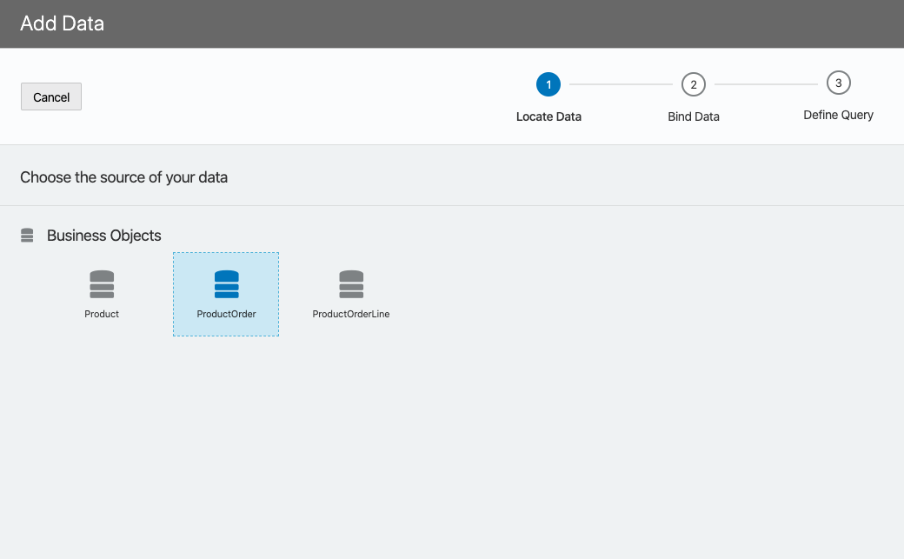

2. Include these fields:
     - Id
     - Associate
     - Order Date
     
    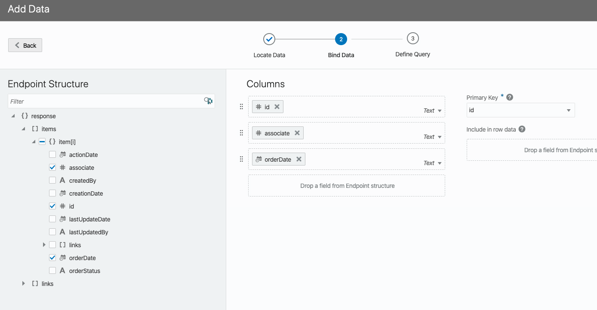

3. This is very similar to the Product List created earlier and you will end up with a screen that looks something like this.

    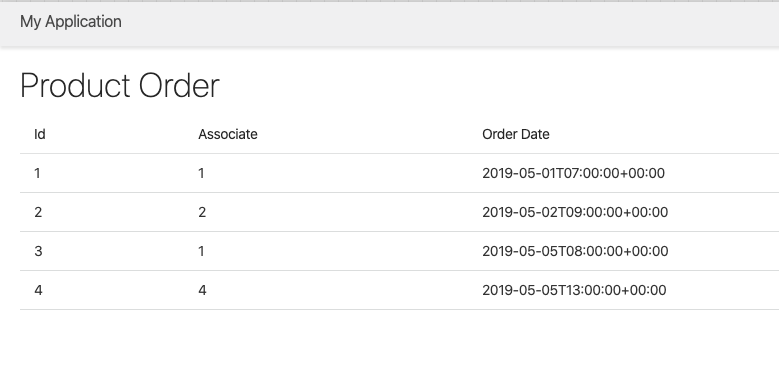

4. Wow, that date does not look very nice! A simple way to change the format is by dragging the **Input Date Time** component from the component list and dropping it into the date column

    
    
    It should look like this
   
    

5. Create a Product Order Detail page for the Product Order page’s table. Click **Add Detail Page** to begin the wizard.

    

    Select ProductOrder Business Object
    
    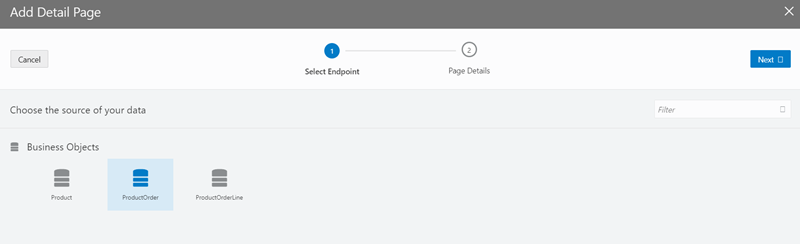

    Select these fields:
    - Id
    - Associate
    - Order Date
    - Order Status
    - Action Date

    Your page should look something like this when done (again, you may need to [switch into **Live** mode to set the context](#potential-context-error))
    
    

6. Add a new heading **Order Items** BELOW the **Back** button on the Product Order Detail page, make the heading size 2

    

7. Now you’ll add a new table with data from the **Product Order Line** business object making sure that only lines matching the Product Order appear. First, drag a Table component under the new heading.

    

8. Add data to the table from the **Product Order Line** business object. Click **Add Data** to begin the wizard.

    
    
    Choose **ProductOrderLine** as the source of your data:

    
    

9. In the **Bind Data** step of the Add Data wizard, select:
  
    - id
    - product
    - unitPrice (set type to **Input Number**)
    - quantity (set type to **Input Number**)
  
    
10. Set type to **Input Number**

    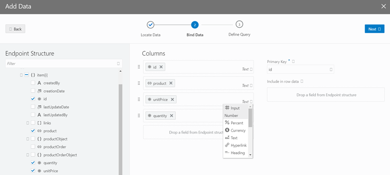

    Your bind data should look something like this when done.

    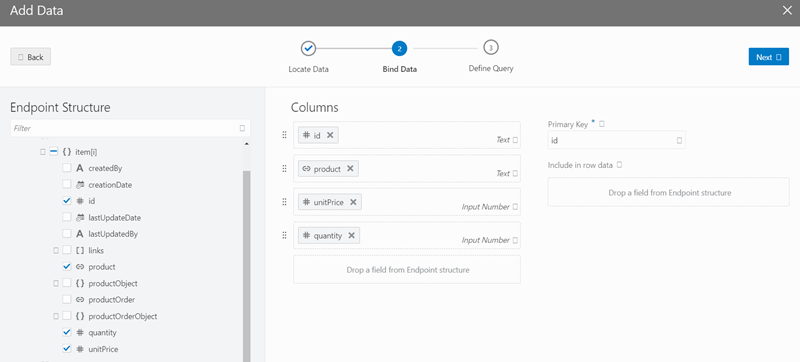
 

11.  Here’s the key step\! In step 3 **Define Query** of the Add Data wizard you will connect the data from the Product Order and the Product Order Line

   **DO NOT CLICK **Finish** until complete!**
       
   
   
10. On the right-side of the **Define Query** wizard page under **Target** expand **{} filterCriterion -\> \[\] criteria -\>{} item\[0\] -\>** to expose attribute, op, and **value** as shown below.

   
    
11. Select **attribute** and type **productOrder** as a **static** value (references Product Order).
    
    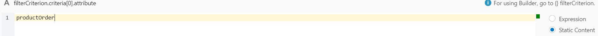
    
12. Select **op** and type **$eq** also as a **static** value (equal condition test).
    
    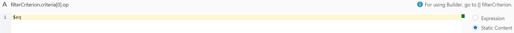
    
    Drag the **ProductOrderId** value from the left-hand **Sources** column and drop it onto the **value** under **Target**.
    
    
    
    You will see an expression inserted in to value as shown here
    
    
    
    Click the **Finish** button when done.
    
    The Product Order Line information matching the current order should be displayed, if not, you may need to reset the context using the **Live** mode again
    
    

You should now be able to test your **Product Order – Product Order Line** **master-detail** screens

*****************************   
**Congratulations\!**

You've enabled Mama Maggy's managers/franchisees to retrieve a list of their orders and check order status when it is convenient to them without having to call headquarters
    
You’re now ready to create your first Mobile application with Visual Builder
*****************************

 

### Exercise 4 - Section 3 – Create Mobile Application

Mama Maggy's managers/franchisees want to be able to check product order status anytime, not just when they are in their offices. So, in this exercise you will create a mobile application allowing them to check order status from their phone or other mobile devices.

1. Use Visual Builder’s Navigator to open Mobile Applications 

2. If you have not created any Mobile Applications yet click the **+ Mobile Applications** button; 

      

    Otherwise, click the **+** to the right of **Mobile Apps**

    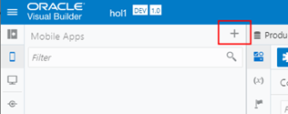

3. The New Mobile Application wizard has two steps; Fill the **Application Name** (i.e. **ProductOrders**), select **None**,  and click the Next button **\>** to continue

    

4. Click **Create** on the second page of the wizard

    

5. Notice the **mobile** frame to help visualize a mobile app; select the title then modify it in the property inspector
    
    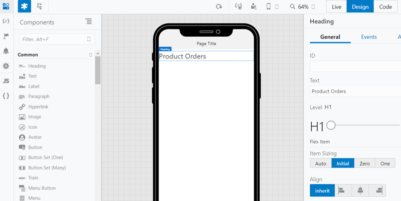

6. Drag a **Table** component into the body of the phone, below the title.

    

7. Click on the empty table, then use **Quick Start** to **Add Data** - choose the **Product Order** business object
    
    

8. Select the following fields (no need to Define Query):

    `id` (Input Number)    
    `orderDate` (Input Date)    
    `orderStatus` (Text) fields 
    
    Click **Next** and then **Finish** when you are ready to continue.

    

9. Review the page. Make the Order Date column more readable.

    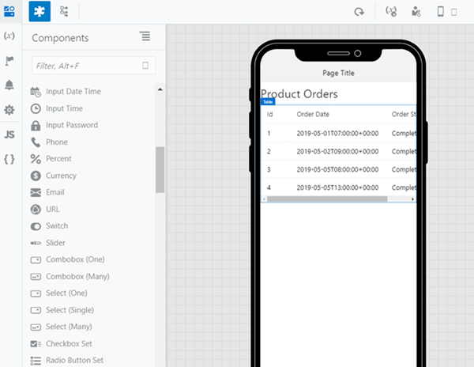

10. Drag and drop the **input date time** component to the Order Date column. That looks better!

    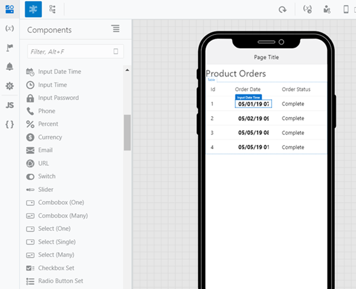

10. Add a Detail page using the **Quick Start** menu and `ProductOrder`. Select `id`, `associate`, `orderDate`, and `orderStatus`

    

11. View detail page by clicking each item on the screen. The basic Order Detail page looks like this.

    

12. Add a heading **Items** below the Order Status by dragging the **Heading** component to the **Flex Container** in the Visual Builder Page Structure (click the Page Structure icon  to show/hide) then change the heading text to **Items** and the size to **H3**.

    

13. Add a table below the new heading by dragging a **Table** component to the mobile **Flex Container** in the Page Structure display
    
    

14. Use the table’s **Quick Start** to **Add Data** from **ProductOrderLine** to the table

15. Select the following fields (As shown on the picture) and click **Next**:
    - ID (Input Number)
    - Product Name (Text) 
    - Unit Price (Input Number)
    - Quantity (Input Number)

    **How to Find Product Name by drilling down** 
&nbsp;&nbsp;&nbsp; __{} response  
&nbsp;&nbsp;&nbsp;&nbsp;&nbsp;&nbsp; [] items  
&nbsp;&nbsp;&nbsp;&nbsp;&nbsp;&nbsp;&nbsp;&nbsp;&nbsp;{} item\[i\]  
&nbsp;&nbsp;&nbsp;&nbsp;&nbsp;&nbsp;&nbsp;&nbsp;&nbsp;&nbsp;&nbsp;&nbsp;{} Product Object  
&nbsp;&nbsp;&nbsp;&nbsp;&nbsp;&nbsp;&nbsp;&nbsp;&nbsp;&nbsp;&nbsp;&nbsp;&nbsp;&nbsp;&nbsp;[] items  
&nbsp;&nbsp;&nbsp;&nbsp;&nbsp;&nbsp;&nbsp;&nbsp;&nbsp;&nbsp;&nbsp;&nbsp;&nbsp;&nbsp;&nbsp;&nbsp;&nbsp;&nbsp;{} item[i]  

    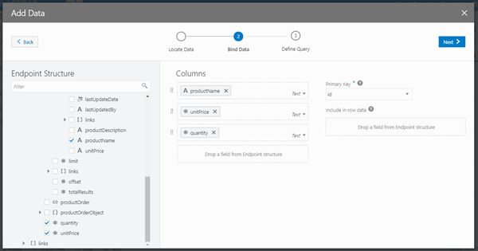

    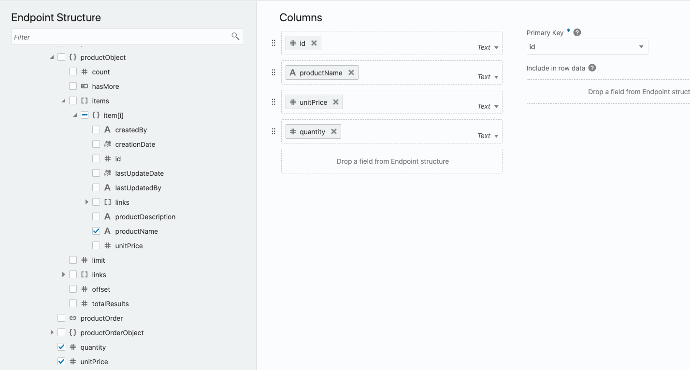

1.  Use **Define Query** to connect the Product List to the list of Items as follows:

    - Open {} filterCriterion -\> \[\] criteria -\> {} item\[0\] -\>

    - Select **attribute** and type **productOrder**

      

    - Select **op** and type **$eq**

      

    - Drag **productOrderId** to **value**

      

      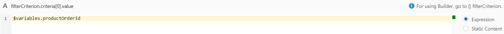

    Click Finish when you are ready to continue.
    
    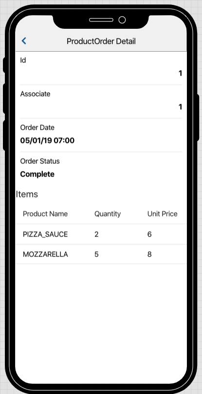

*****************************
**Congratulations!** 

You have made the daily lives of Mama Maggy managers/franchisees easier. 

Instead of calling headquarters to check the status of their product orders they can now use your mobile app when and where it is convenient.
*****************************

**This concludes exercise 4.**

******

### Exercise 5: Accessing external data using VBCS service connection features

**Introduction**

Mama Maggy has multiple existing databases and other data stores being used to run their business. Mama Maggy management would prefer to access existing databases and any new databases directly rather than duplicating data in VBCS Business Objects.

While using Visual Builder’s built-in business objects is useful; they limit applications to data found within the Visual Builder instance. Most modern applications will use data from varied sources both in and outside of an organization’s systems. 

This is accomplished using service connections that take advantage of RESTful APIs exposed by databases and other providers. API stands for Application Programming Interface; a pre-defined calling mechanism used to read and modify data using standardized calls over the internet with HTTP/HTTPS (often called RESTful APIs). RESTful APIs are the most common way of using external data in modern applications. 

In this exercise you will add stores and associate information to another brand new application using RESTful API calls rather than Business Objects (though, the truth is that VBCS uses RESTful API calls when accessing Business Objects too).

Your resources for this exercise include two (2) service connections used to access data for Mama Maggy stores and Mama Maggy associates. You will use these **Service Connections** to provide data services to your applications.

**Prerequisite**

You will need two service connections (Rest services) to access data for:
   - Mama Maggy stores and
   - Mama Maggy associates

   You will use these **Service Connections** later in the lab to provide data to your applications. 
   
   If your environment does not have access to the Mama Maggy APIs; use the instructions in [Exercise 3: Build Mama Maggy Data Application](#exercise-3-build-mama-maggy-data-application) to create them.

**Begin Exercise 5**

In this exercise you will create new VBCS Web applications to display a list of Mama Maggy stores and the Associates who work in them. This will make it easier for a Mama Maggy manager/franchisee to collaborate with other. 

The data used to create these apps will come from **Service Connections** that you will create allowing the application to use data via RESTful APIs provided by the service provider.

1. If you have logged out of the Oracle Cloud, please log back in and return to your VBCS application. You might find it useful to close any open windows

    On the left-hand side of the Visual Builder interface is a navigator listing several options; choose **Service Connections**  to get started.

    If you have not yet created any **Service Connections** click the **+ Service Connection** button

    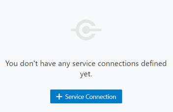
 
 
    If you are presented with a list of one or more existing connections click the plus **+** sign at the top of the list to the right of the word **Services**

    
 

2.  The **Create Connection** wizard starts by asking for the source of the connection; for this exercise we will choose **Define by Specification** for the connections created. Please click **Define by Specification** to continue. 

    
 

3.  The wizard will then ask for specifics about the endpoint:

    - Choose **ADF Describe** from the API Type pulldown
    - Choose **Web Address** as the Service Specification
    - Paste the **Associate** connection URL created during **Exercise 3 - Step 30** into the space provided
    - Name the Service Id **mmassociates**
    - Choose **Oracle Cloud Account** from the Authentication pulldown
    - Select Dynamic, the service supports CORS in Connection Type
    - Click next when you are ready to continue
   
    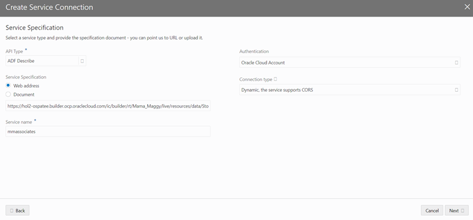
 
 
4. When prompted to **Select Endpoints** open the navigator-style list under **Associate**; and for this exercise choose the two GET methods as shown in the screen; one returns all **Associate** rows, the other selects specific **Associate** rows using an id value
  
    Click **Create** to complete the process

    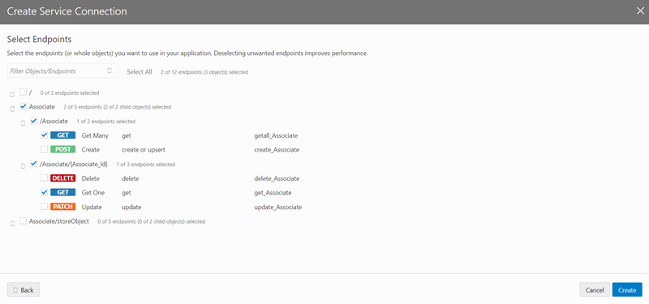
 

5. Next, open the service for testing: select the connection, choose the  **Endpoints** tab, find and click over the **getall_associate** endpoint as shown in the screen 
    
    
 

6. Test the connection by selecting the **Test** tab, filling in any necessary parameters
    
    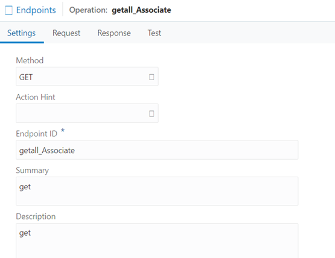

    Then click **Send** to make a request.
    
    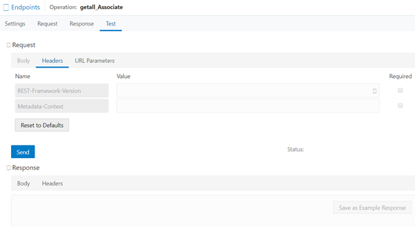
 
 
7. When the service responds, look for a response status **200** (everything ok) and check the results

    

8. If the response looks good to you click the **Save as Example Response** so that Visual Builder will map out the response details as part of the connection

    

9. Locate the next endpoint to test and select it

    
 

10.  This endpoint gets a single **Associate** row that is identified by passing in an **{Associate\_Id}** value (or whatever the key field is named). Click on **URL Parameters** tab, type an associate id number (**7 in the example**) and **Send** to test
    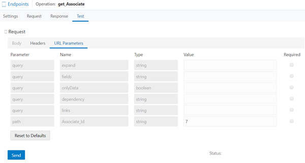  
  
 
11. You now have created a connection and tested two endpoints

    

12. Repeat the steps above to create the following two **mmstores** connection endpoints

    
  
13. Select the GET endpoints

    

14. Once you have created the connections, test them; repeat the steps 6 to 9 above for the two **mmstores** connection endpoints

    - Mama Maggy Store – get all
    - Mama Maggy Store – get single using {Store\_id}
    
        
    
    - Test the endpoint **getall_Store**
    
        
    
    - Test the last endpoint **get_Store** with **store_id** as value 2
    
        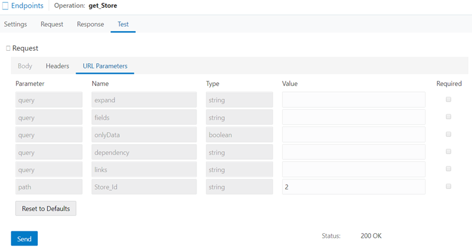
    
    - Check the result; dont forget to click **Save as Example Response**
    

15. Create a new Web Application named **storelist** that displays all of the Mama Maggy stores in a table. Refer to exercise 4: Web and Mobile Apps if you need a refresher on the basic steps  

    

16. Create a header that says **Mama Maggy Stores** 

    

17. Drag and drop a table component below it
    
    

18. Use the **mmstores** service connection as the data source for the table

    

***

**Note**: If you are not able to see the **mmstores** as data source, click the **Pencil** icon located at the bottom right corner to edit your connections.
Verify that you have the GET /store/{Store_Id} selected. Click next and finish.

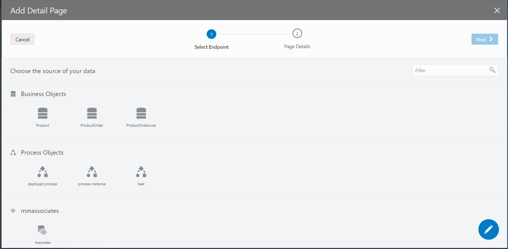

 

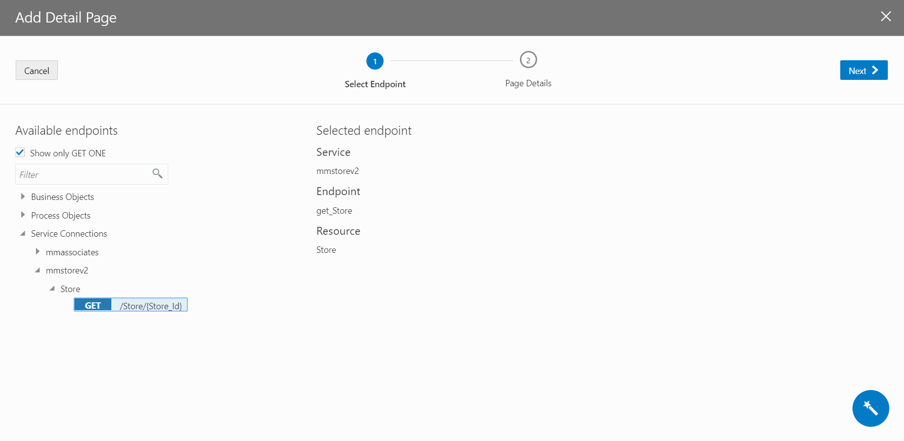

***

19. Choose the following fields and the primary key:
     - id
     - name
     - city
     - state
 
20. Be sure to select **id** as the Primary Key too. This will allow you to use the store id as unique key, rather than a name that might affect the end result.

21. Click the **Next** button when you are ready to continue

    

22. No need to Define Query, click the **Finish** button to continue

    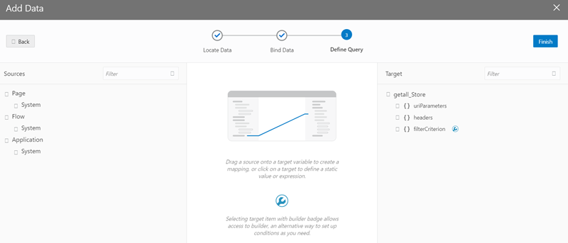

23. The finished screen will look something like this
    
    
 
24. Use the table’s **Quick Start**  to **Add Detail Page** to get started
    
    

25. Use the **mmstores** again (because our connection used the standardized descriptors Visual Builder will choose the correct endpoint)

    

26. Choose the following fields from the Endpoint Structure and **Click Finish** once you are done:
    - id 
    - name
    - address
    - city
    - state
    - mailcode  
    
    

27. Your Store details screen should look something like this

     

***
**Note**: If you get a **"Could not load data"** error message, you must check whether the Endpoint **StoreID** is mapped.

* Click on the **main-store-detail** page, click **Actions** and select **LoadAssociateChain**

    

* Select the main node **Call REST Endpoint mmstores/get_Store** and on the right hand side of the screen click the **Store_Id** field.

    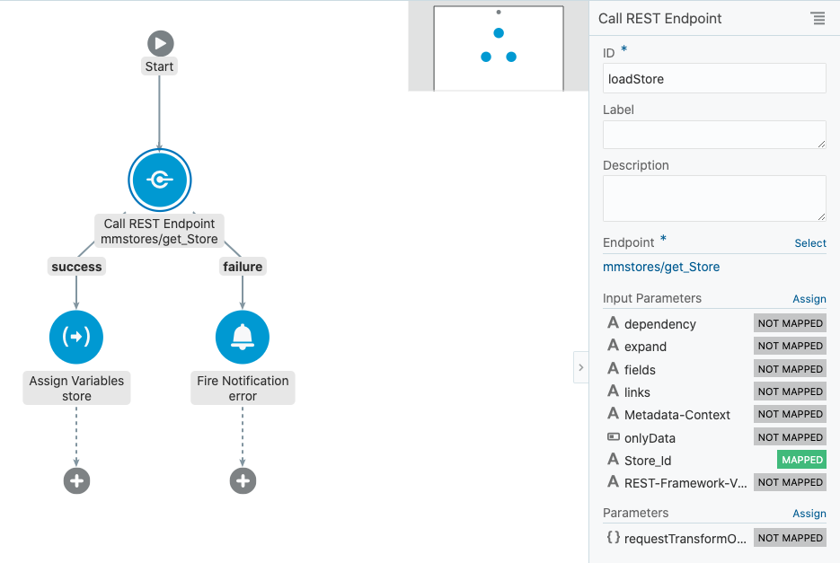

* On the query page, drag and drop the **storeid** value from the left to the **Store_Id** parameter located in the right. Click Save

    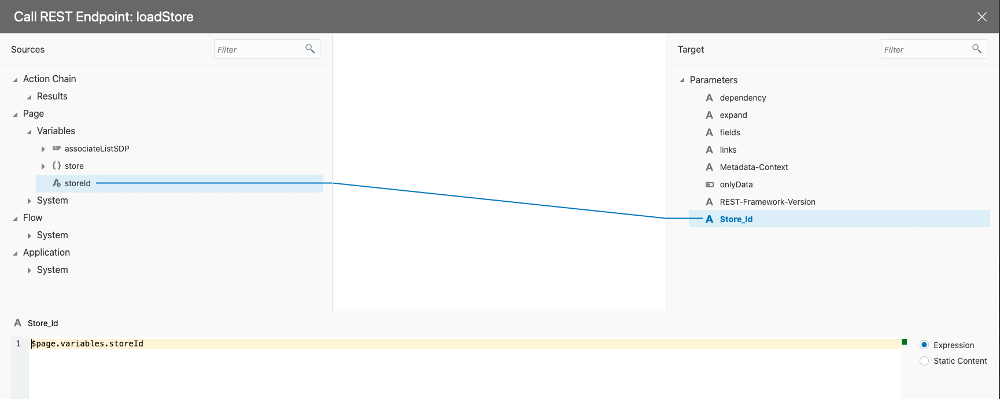

* Now you should be able to see data. Go to the **main** page, select a field and drill down to the detail page.

***

28. Now create an **associatelist** web application to display all **Associate** rows (you pick the fields) and provide a **Add Detail Page** to display a single Associate (you pick the fields here too).

    - List display of all Associates (**mmassociates**)
    - Details display of selected Associate (**mmassociates** using
    **associate\_id**)

**Note**: If you face the same issue when displaying **Detail page** information as described for Store, follow the same steps to map the **Associate_Id** parameter.

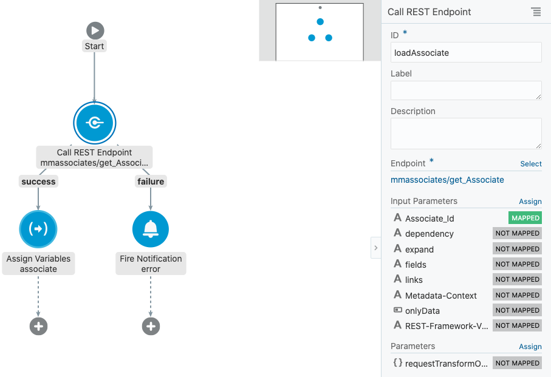

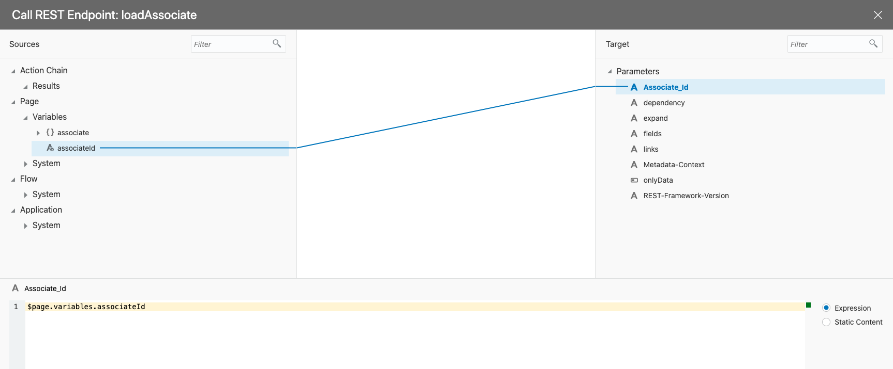

**Test your application**

***

29. For something really fun; return to the **storelist** application and display the **Stores Detail** page (probably called **main-store-detail** or something close)

   
 

30. Add a heading **Associates** under the **Back** button and add a **Table** component under the heading. Use the table’s **Quick Start** menu to **Add Data** to the screen. Choose the **mmassociates** connection to supply the data

    
 
 
31. Select `id`, `name`, `email`, and `hire date`. Also be sure the **Primary Key** is set to the `id` field.

 

32. **STOP** on step (3) **Define Query** so that you can connect the Associates to the Store listed on the page. Under **Define Query** expand **{} filterCriterion -\> \[\] criteria -\> {} item\[0\]**.

    
 
 
33. Select **A attribute** and type **store** into the text box provided, this is **static** content.

    
 
 
34. Select **A op** and type **$eq** into the text box provided, this is **static** content.

    
 
35. Expand the **Sources** values under **Page-\>{} store** and drag the **id** value from the left side of the screen to the **A value** position on the right. This establishes the link between the current screen (source) and the Associates data (target).

    
 

36. The completed screen should look something like this. Note, if the system is under stress it may take a few moments for the filtering to work properly. (This delay can be masked using an **if** test but is not necessary for our exercise.)

    
 

37. You may save today’s work using Visual Builder’s **export** capability, this will provide you with a starting point if you would like to continue working on the exercises, **but more importantly will give you a starting point when you want to create a customer demonstration using VBCS**:

  - Return to the list of VBCS applications, highlight your application, then click the **Option** menu icon on the right.

     

  - Choose **Export**

     

  - Specify **Export with Data** and you will be prompted for the location where you want the application’s **.zip** file copied. (this file may be imported into another Visual Builder instance when you want to work some more).

     

 

*****************************
**Congratulations!** 

You have addressed your customer's needs by creating the following applications:

- Product Catalog Web application for managers/franchisees.
- Web application to help managers/franchisees to track order's product, quantity, and prices.
- Mobile application allowing busy manager/franchisee to check the status of their orders from anywhere with their phone.
- Web application to list all Mama Maggy stores and their locations and the list of associates in that location along with contact information.

We hope you have enjoyed Oracle Visual Builder Cloud Service. We encourage you to visit the following URLs to get the latest and greates from Oracle Visual Builder Cloud Service.

[Developing Applications with Oracle Visual Builder](https://docs.oracle.com/en/cloud/paas/app-builder-cloud/visual-builder-developer/toc.htm)

[Oracle Visual Build Cloud Service at Oracle.com](https://www.oracle.com/application-development/cloud-services/visual-builder/)

******

**This concludes exercise 5.**

******

[**Return to Main Page**](../index.html)

 

