# Provisioning an Autonomous Database

## Table of Contents

- [Module 1: Learn how to login to the Oracle Cloud Console](#module-1--learn-how-to-login-to-the-oracle-cloud-console)
- [Module 2: Learn how to provision a new Autonomous Database](#module-2--learn-how-to-provision-a-new-autonomous-database)

*****

## Module 1:  Learn How to Login to the Oracle Cloud Console

In this section you will be provisioning an ADB database using the cloud
console.

1. Go to [cloud.oracle.com](https://cloud.oracle.com), click View Accounts and then Sign in to Cloud to log in.

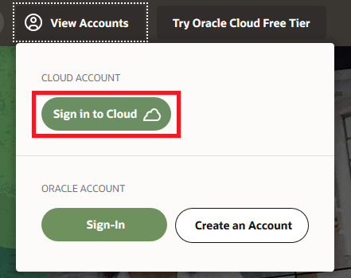

2. Enter your Cloud Account Name (sometimes referred to as Tenancy, for the Class of most likely its OSPATraining1 or OSPATraining2) and click **Next**.

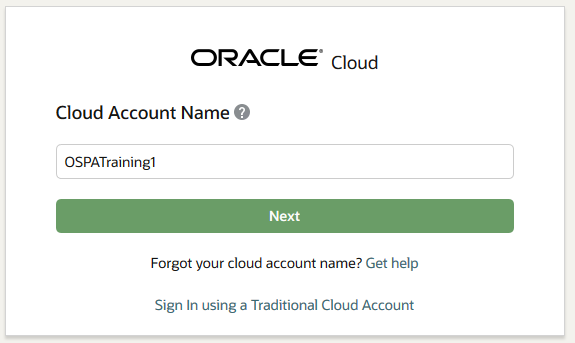

3. Click Oracle SSO at the bottom to log in. If you don't have an SSO login, enter your Cloud username and password, and click **Sign In**.

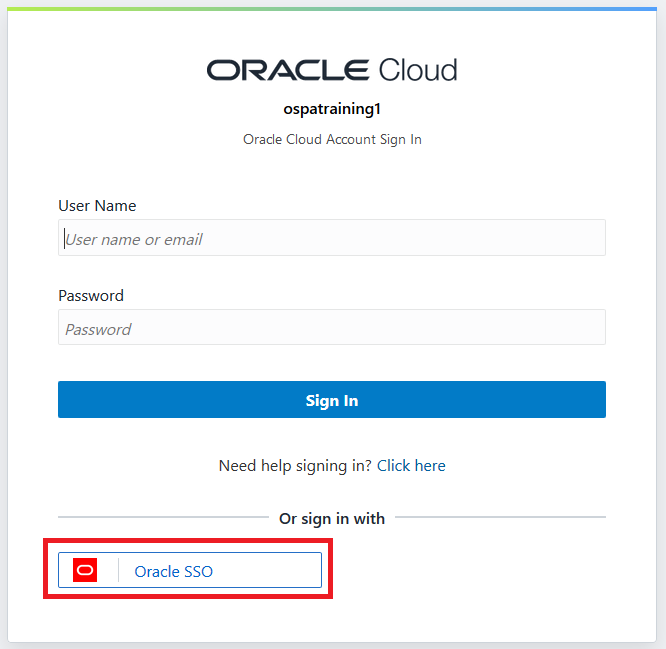

**PLEASE NOTE: Because the environment you are using is a LAB environment the pages you land on may be different than the ones  you see in this lab section. We try to incorporate all posibilities, however there may be some cases were the lab does not follow exactly what you see on your screen. Your objective is to get to the Autonomous Database (Data Warehouse or Transaction Processing) page.**

4. Either from the Quick Actions menu or from the menu in the upper left corner of the page select Autonomous Transaction Processing.

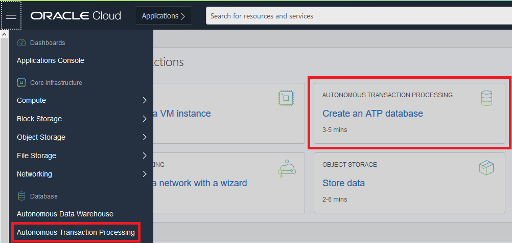

5. This will put you in the main Autonomous Database Landing page. Any Autonomous database you create will get listed here. A few things to take note of:
* Set your Compartment to the one you were assigned. You will get error messages trying to create objects in compartments you don't have privileges on.
* Set your filter to Workload Type All. Otherwise you will only see either ATP or ADW databases, not both.
* In the upper right is your region. Your instructor will tell you which region to use. This page will only list the ADB instances for that specific region. Also when you create them, they will create in that specific region.

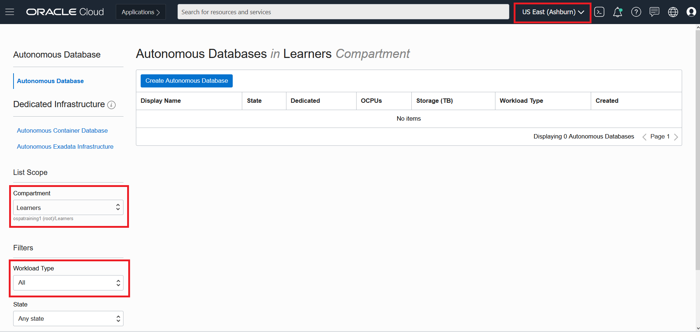

Continue onto the next module to create your Autonomous Transaction Processing Database.

*****

[Back to Top](#table-of-contents)

## Module 2:  Learn How to Provision a New Autonomous Database

1. Click on the “**Create Autonomous Database**” button, as
shown below:

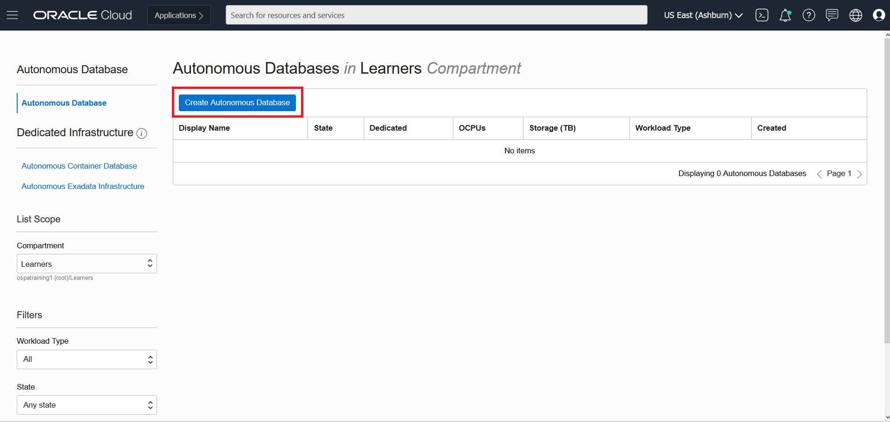

2. The following information must be filled in this page:

**Compartment** – This should already be filled in with the compartment from the landing page. If not, select the compartment you were assigned.

**Display Name –** The name of the service displayed. For this lab use your initials followed by the time.

**Database Name –** The name of the actual database. For this lab use your initials followed by the time.

**Workload Type-** Data Warehouse or Transaction Processing. For this lab we will use Transaction Processing.

**Deployment Type-** Shared Infrastructure is going to give the lowest cost, most flexibility and what we will choose for this lab. Dedicated Infrastructure is a less common option for customers that want more isolation at a higher cost running on dedicated Exadata infrastructure.

**Always Free-** For customers looking at wanting to try the service they have the option to create a free Autonomous Database. We will not be using this option for the lab.

**Choose Database Version-** This is the list available database versions for the Autonomous Database. For our lab we will use 19c.

**OCPU Count–** Number of OCPU’s allocated to the database. We will use 1 to make sure we have enough OCPUs for everyone. You can also scale up/down later.

**Storage–** The amount of storage in terabytes. Again we will use 1 to make sure we have enough for everyone and we won't use close to that for these labs. This can be changed later if more storage is needed.

**Auto scaling–** This feature allows for the database to scale up to three times the number of OCPUs. The scaling occurs as the load increases and decreases on the database. For our lab we will uncheck this option.

**Administrator Credentials–** The username is there by default as ADMIN but you will need to set a password. Make sure to remember this password as we will use it in future labs.

**Network Access–** You can allow access to the database externally or lock it down to private access only. For our labs we will select "Allow secure access from everywhere" and we will **NOT** check Configure access control rules.

**License Type –** If a customer already has licenses and wants to leverage them they can use BYOL if not then License Included will include everything they need. For this lab we will use BYOL since we already have licenses.

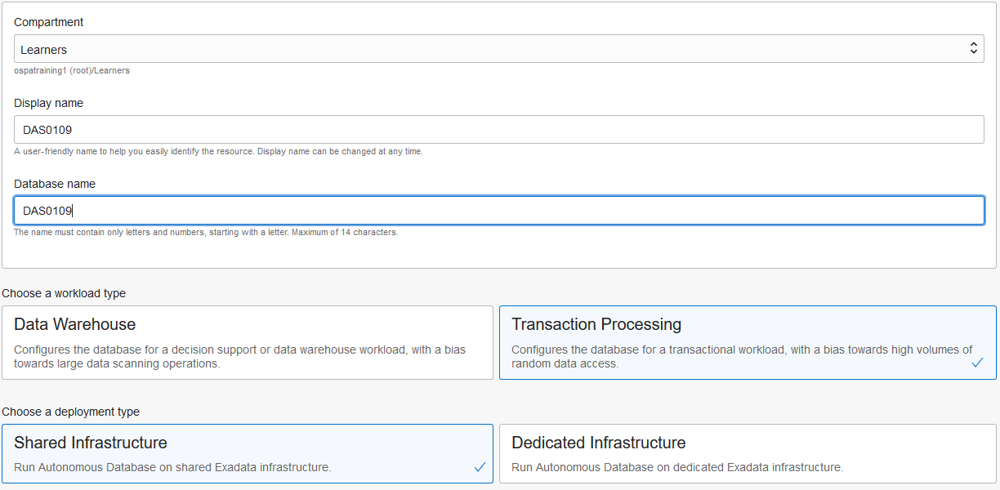
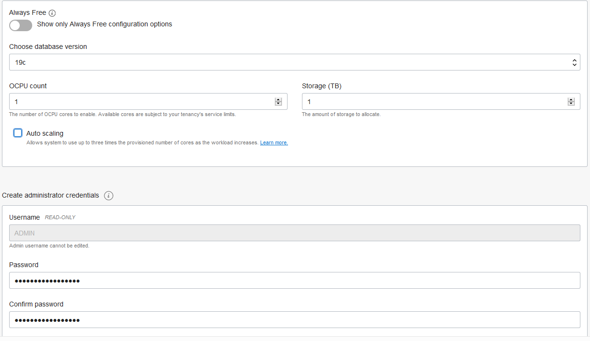
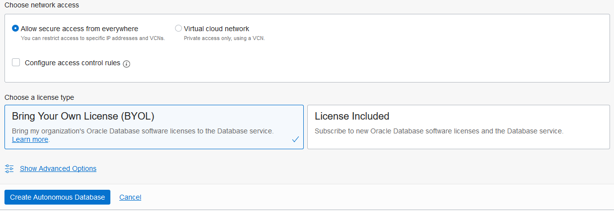

3. After filling fields, click **Create Autonomous Database** which will open up
the screen to complete you database information. You will be placed on the Database Details page and your database will be in “**Provisioning**” status. The Database Details page displays more information about your instance. The status will automatically change to “**Available**” when the database is ready in a few minutes.

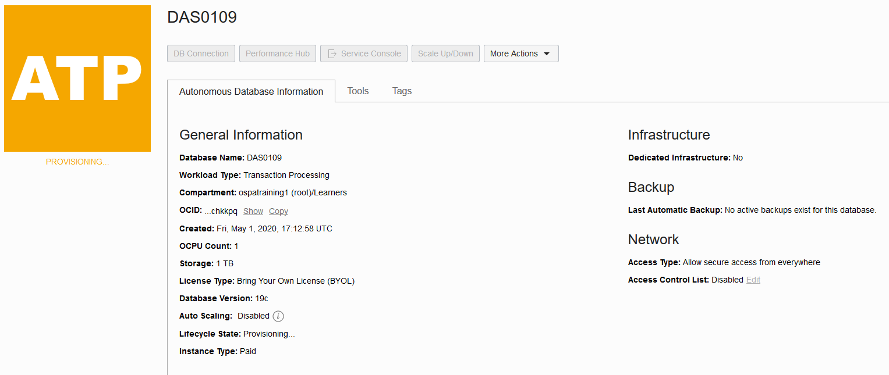

Your Autonomous Database is up and running! Take notice of the green color of the ATP logo indicating the service is available and the commands are no longer greyed out.

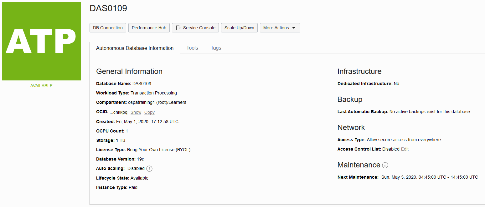

**You have successfully provisioned an Autonomous Database. In the future labs we will explore the Tools tab, Performance Hub and the Service Console.**

***END OF LAB***

[Back to Top](#table-of-contents)   
