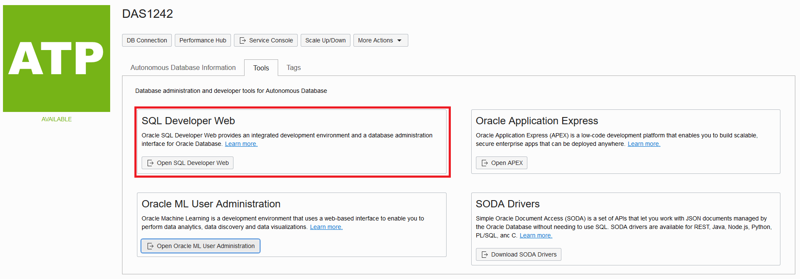
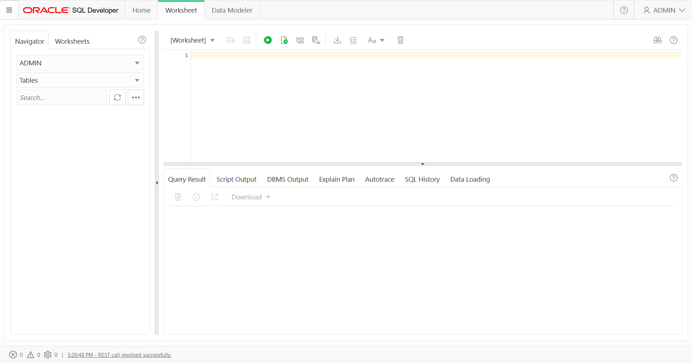
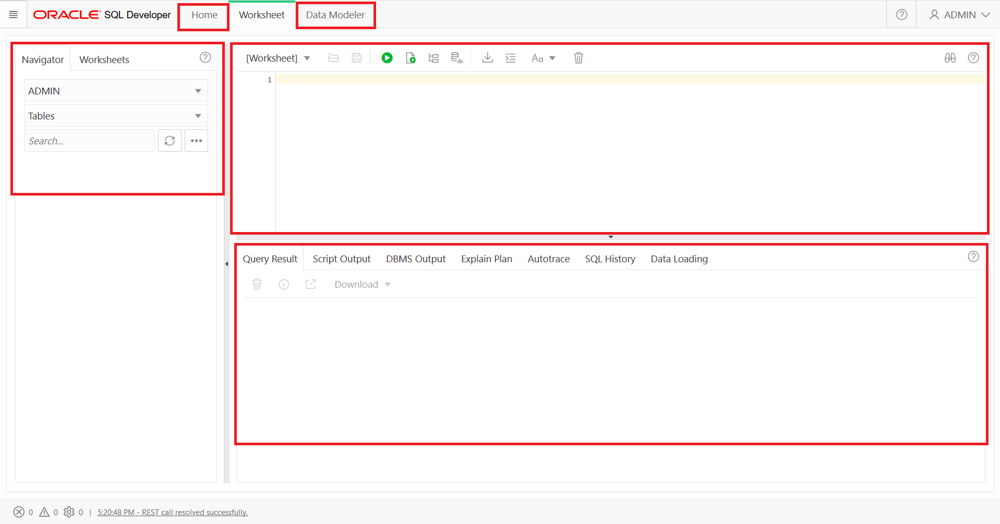
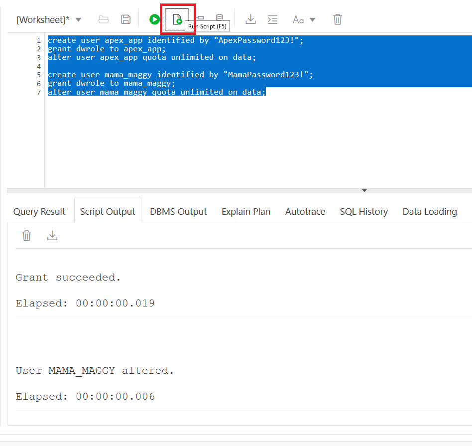
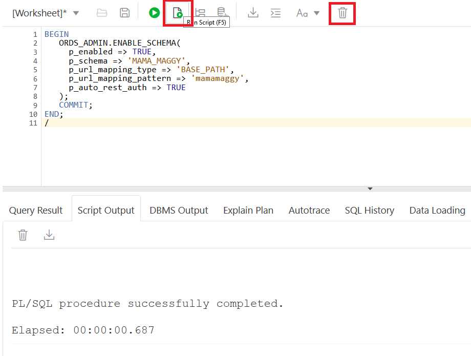
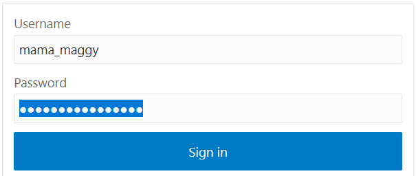

## Who Should Complete This Lab: One Person Per Group

# Using SQL Developer Web and Creating Database Users

## Table of Contents

- [Module 1: Using SQL Developer Web](#module-1--using-sql-developer-web)
- [Module 2: Creating Database Users](#module-2--creating-database-users)

*****

This lab picks up exactly where the Provisioning an Autonomous Database lab finishes. Please review that lab if you are not in the correct location of your Autonomous Database Console to continue with this lab.

## Module 1:  Using SQL Developer Web

Traditionally you would have to download and install client tools onto your local machine to be able to connect and use a database. With the Autonomous Database an integrated development environment has been provided called SQL Developer Web. This module will get you familiar with how to use it.

1. From the Autonomous Database Details page of the database that you just created there is a Tools tab located in the middle of the page. On this tab you will see SQL Developer Web, Oracle ML User Administration, and Oracle Application Express. Click on "Open SQL Developer Web" to launch the login page.



2. Since you haven't created any users yet, you first have to login as ADMIN using the password you specified when you created the Autonomous Database.


3. Once you are logged in you will be presented with a screen that looks like the one below:



4. The components of the window that you can explore:
* **Worksheet-** This is where you will type all of your commands and run them. Most of the time we spend in SQL Developer Web will be in the worksheet. The large green play button will run a single command. The smaller green play button will run many commands as a script. You have the option of saving and opening worksheets. There are some more advanced buttons like explain plans and autotrace that once you are more familiar with SQL you will be able to try out.

* **Result Window-** Directly below the worksheet is the result window. If you run a single statement the results will be in the Query Result tab. If you run many commands as a script the result will be in the Script Output tab. The SQL History tab will contain previously executed SQL statements if you need to go back and retrieve one that you have executed. The rest of the tabs tie to the more advanced options on the worksheet.

* **Navigator-** The navigator lets you quick explore the different objects within a schema. In the future labs you will create tables. Try using the navigator once they have been created to see what they look like.

* **Home-** The homepage will let you see any saved worksheets, diagrams you created in the data modeler, objects that have been created/modified, and different pieces of information about objects in your schema.

* **Data Modeler-** We won't be looking into the data modeler, however, if you were working on designing an actual system you can use the data modeler to visually design and generate the schema.



[Back to Top](#table-of-contents)
*****


## Module 2:  Creating Database Users

1. Navigate to the Worksheet window so we can create the users needed for the rest of the labs.

2. Create the users needed for the APEX application and for the loading lab. The dwrole is a role that comes with the Autonomous Database and gives the user the ability to login as well as create objects. We will also give them unlimited quota on data so they can create objects. Copy the code below into the worksheet and click the Run Script button. In the Script Output window you will see if the commands succeeded.

```
create user apex_app identified by "ApexPassword123!";
grant dwrole to apex_app;
alter user apex_app quota unlimited on data;

create user mama_maggy identified by "MamaPassword123!";
grant dwrole to mama_maggy;
alter user mama_maggy quota unlimited on data;
```



You will use the user mama_maggy in SQL Developer Web to load some data in a future lab. To enable SQL Developer Web for this user there are two more steps to do. The first is enabling their schema to log into SQL Developer Web. The second is building a URL for the user to use to log into.

3. To enable the user mama_maggy to log into SQL Developer Web we will use the command below. p_schema is the user you are enabling and p_url_mapping_pattern is an alias you are giving the user to use in the URL for their login in the next step. Click the Clear button (trashcan) to clear the worksheet and then copy and paste the code below. Then click the Run Script Button.

```
BEGIN
   ORDS_ADMIN.ENABLE_SCHEMA(
     p_enabled => TRUE,
     p_schema => 'MAMA_MAGGY',
     p_url_mapping_type => 'BASE_PATH',
     p_url_mapping_pattern => 'mamamaggy',
     p_auto_rest_auth => TRUE
   );
   COMMIT;
END;
/
```


4. The second step is you have to create a specific URL for that user to use. If you look at the URL for your SQL Developer Web session it will break down like the one below. Make sure to copy your URL and make the change for the p_url_mapping_pattern you created in the previous step. I used mamamaggy so you can see I substituted mamamaggy for admin, the rest of the URL stays the same.


**Save this URL. We will use it in future labs**

5. If you want to try logging in as MAMA_MAGGY, open a new window and paste your URL in and try it. We will be using this user and URL for the Loading an Autonomous Database Lab.



[Back to Top](#table-of-contents)
*****
