## Who Should Complete This Lab: All Participants

# Loading an Autonomous Database

## Table of Contents

- [Module 1: Creating Tables and Inserting Data with SQL](#module-1--creating-tables-and-inserting-data-with-sql)
- [Module 2: Creating Tables and Inserting Data with SQL Developer Web](#module-2--creating-tables-and-inserting-data-with-sql-developer-web)


*****

Now that you have connected and tested your connection to the Autonomous Database
let’s move on to some of the most important uses for a database. That includes
creating, loading, and querying tables, Most customers will want to load
information they already have, often times from flat files.

In this lab we will use SQL Developer Web to create and insert data into tables
using SQL, the language of databases, and then create and insert data into a
table using the SQL Developer Web. The data you will populate will be used later for the Oracle Machine Learning lab.

## Module 1:  Creating Tables and Inserting Data with SQL

In the previous lab you created a user MAMA_MAGGY, a URL for them, and logged in as that user. If you logged out make sure to log back in as that user using your URL.

1. Make sure you are logged into your URL as MAMA_MAGGY.


2. Let’s create 2 tables, using SQL in the Worksheet screen, one named **DEPT** and
one name **EMP**. Copy the SQL below and post it in the Worksheet window, then click **Run Script** (the smaller green arrow).

```
CREATE TABLE DEPT (
DEPTNO NUMBER(2) CONSTRAINT PK_DEPT PRIMARY KEY,
DNAME VARCHAR2(14),
LOC VARCHAR2(13)
) ;

CREATE TABLE EMP (
EMPNO NUMBER(4) CONSTRAINT PK_EMP PRIMARY KEY,
ENAME VARCHAR2(10),
JOB VARCHAR2(9),
MGR NUMBER(4),
HIREDATE DATE,
SAL NUMBER(7,2),
COMM NUMBER(7,2),
DEPTNO NUMBER(2) CONSTRAINT FK_DEPTNO REFERENCES DEPT
);
```


3. Hit the Refresh Button on the Navigator window and the tables you just created are now displayed.


4. To load data into your tables click on the trash can in the worksheet window to clear the worksheet so we can paste the next step in.

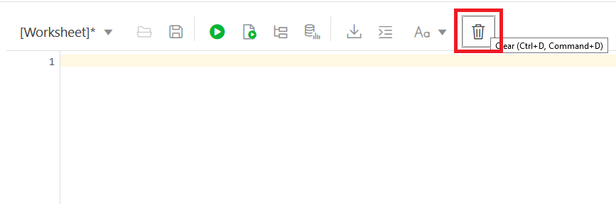

5. Copy and paste the code below, which inserts several rows of information into
both tables. Paste it into the worksheet window you just cleared. Then click the **Run Script** button.

```
INSERT INTO DEPT VALUES (10,'ACCOUNTING','NEW YORK');
INSERT INTO DEPT VALUES (20,'RESEARCH','DALLAS');
INSERT INTO DEPT VALUES (30,'SALES','CHICAGO');
INSERT INTO DEPT VALUES (40,'OPERATIONS','BOSTON');

INSERT INTO EMP VALUES (7369,'SMITH','CLERK',7902,to_date('17-12-1980','dd-mm-yyyy'),800,NULL,20);
INSERT INTO EMP VALUES (7499,'ALLEN','SALESMAN',7698,to_date('20-2-1981','dd-mm-yyyy'),1600,300,30);
INSERT INTO EMP VALUES (7521,'WARD','SALESMAN',7698,to_date('22-2-1981','dd-mm-yyyy'),1250,500,30);
INSERT INTO EMP VALUES (7566,'JONES','MANAGER',7839,to_date('2-4-1981','dd-mm-yyyy'),2975,NULL,20);
INSERT INTO EMP VALUES (7654,'MARTIN','SALESMAN',7698,to_date('28-9-1981','dd-mm-yyyy'),1250,1400,30);
INSERT INTO EMP VALUES (7698,'BLAKE','MANAGER',7839,to_date('1-5-1981','dd-mm-yyyy'),2850,NULL,30);
INSERT INTO EMP VALUES (7782,'CLARK','MANAGER',7839,to_date('9-6-1981','dd-mm-yyyy'),2450,NULL,10);
INSERT INTO EMP VALUES (7788,'SCOTT','ANALYST',7566,to_date('13-JUL-87','dd-mm-rr')-85,3000,NULL,20);
INSERT INTO EMP VALUES (7839,'KING','PRESIDENT',NULL,to_date('17-11-1981','dd-mm-yyyy'),5000,NULL,10);
INSERT INTO EMP VALUES (7844,'TURNER','SALESMAN',7698,to_date('8-9-1981','dd-mm-yyyy'),1500,0,30);
INSERT INTO EMP VALUES (7876,'ADAMS','CLERK',7788,to_date('13-JUL-87','dd-mm-rr')-51,1100,NULL,20);
INSERT INTO EMP VALUES (7900,'JAMES','CLERK',7698,to_date('3-12-1981','dd-mm-yyyy'),950,NULL,30);
INSERT INTO EMP VALUES (7902,'FORD','ANALYST',7566,to_date('3-12-1981','dd-mm-yyyy'),3000,NULL,20);
INSERT INTO EMP VALUES (7934,'MILLER','CLERK',7782,to_date('23-1-1982','dd-mm-yyyy'),1300,NULL,10);
COMMIT;
```

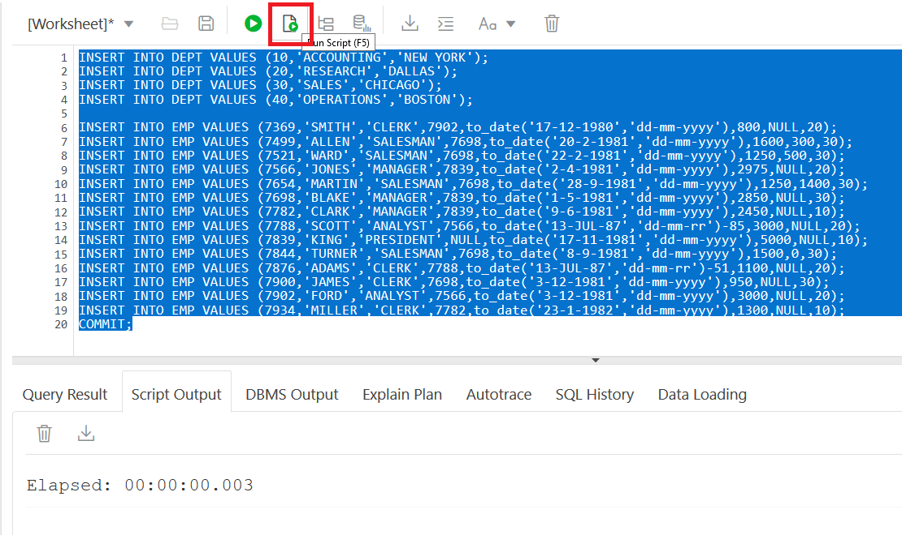

5. Clear the worksheet again like you did above and cut and paste the following
code and run it (by clicking on Run Script):

```
select * from emp;

select * from dept;
```

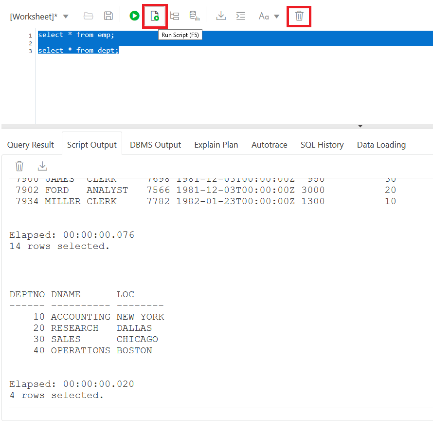

Look in the Script Output window. You just used SQL to query the tables you created and inserted data into, and have displayed the information in the tables!

[Back to Top](#table-of-contents)

## Module 2:  Creating Tables and Importing Data with SQL Developer Web

Another way to create tables and load data into the tables is the import data
function in SQL Developer Web. This allows you to load from files you have stored on
your machine directly onto a table in ADB. In this part of the lab we will
load data that is in a comma delimited text file called channels.csv into a new
table called channels in your database.

1. Download the file called **mm_order_stats.csv** ([from here](https://oradocs-corp.documents.us2.oraclecloud.com/documents/link/LD67BF60471BB8666A167A50F6C3FF17C1177A968060/fileview/D58165A8FC2BAB77F65D05CEF6C3FF17C1177A968060/_channels.csv)) Please note the local directory you save it in as you will need it in the next step. See screenshots on how to download and save the file.


2. In SQL Developer Web at the bottom of the page you will see a tab called **Data Loading**. Click on that tab and then click on the Cloud to start the wizard.

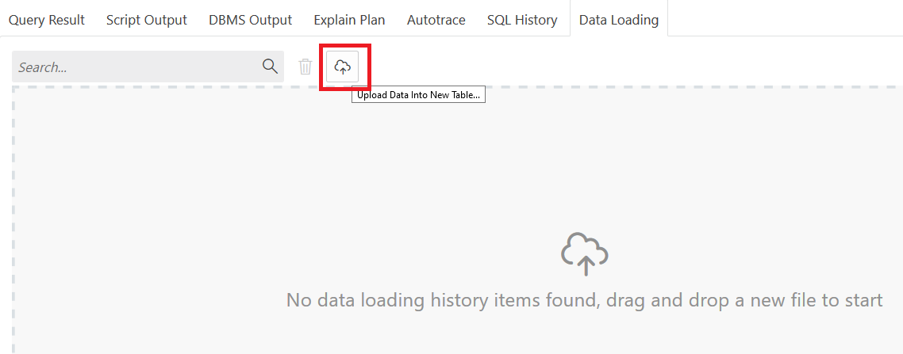

3. You can either click on Select files or drag and drop the channels.csv file into the window.


Once the file is selected and open, information from the file will be pre-loaded
into the fields in the wizard. Notice it correctly determined this is a comma
delimited file. The first line in the file has the table column names and the
next lines in the file have the actual data.

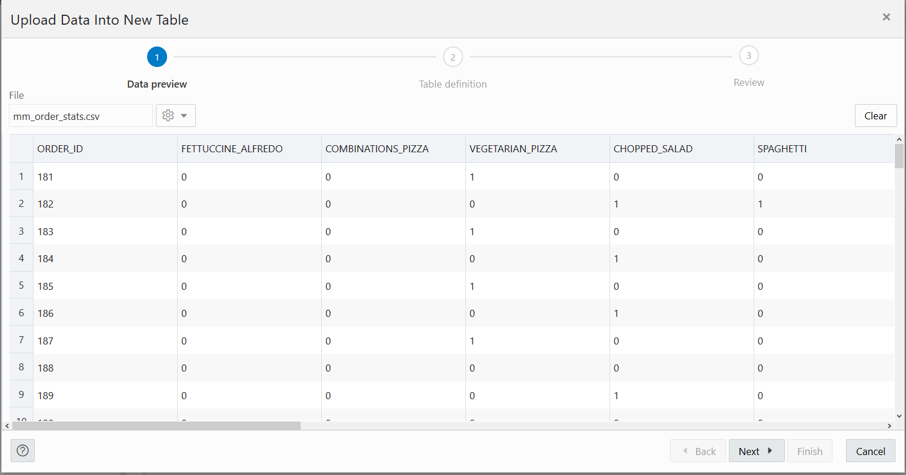

4. Click **Next** and you will be placed on the Table definition screen. Here you can name the table which we will call **MM_ORDER_STATS**. Also you can set the column types, the length, primary keys, and if the column can be nullable. Further to the right are example rows so you can see what the data will look like. For our example we will just leave the column definitions the way they are.

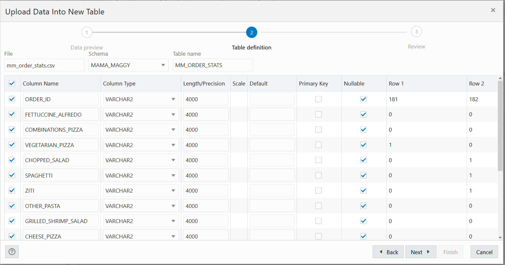

5. Click Next and it will give you a preview of what will be run. The DDL for the table will be generated as well as the column mapping. Click **Finish** and the upload will run. This will take about 2-5 minutes.

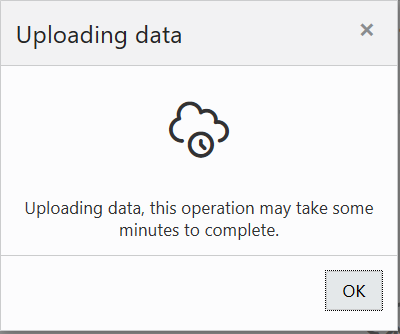

6. In the bottom left of the screen you will see a message that says "Importing data".

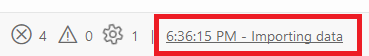

7.  When the load finishes that will change to "Data import completed" and you will see an entry appear in the Data Loading tab.

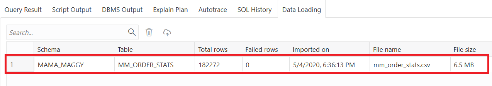

8. Hit the Refresh Button on the Navigator Window. You will now see the **MM_ORDER_STATS** Table you just created displayed there as well as an error table called **SDW$ERR$\_MM_ORDER_STATS**. Any issues loading the table will show up in the ERR table.

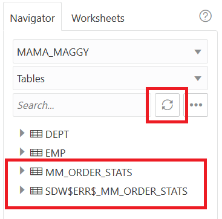

10. Go back to the Worksheet screen and erase the code you have there (hit the
trash can button) and copy and paste the SQL below and run it like you did before. In the Script Output you will see 10 rows of the data you loaded into the table you just created. We will also drop the error table since we didn't have any errors loading. Also we are going to grant select on the table so that our Oracle Machine Learning user later can use it for analysis.

```
drop table SDW$ERR$_MM_ORDER_STATS;
select * from mm_order_stats where rownum <= 10;
grant select on mm_order_stats to public;
```

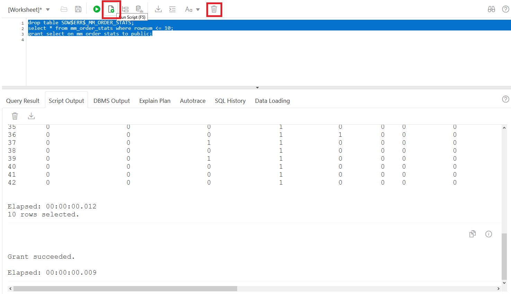

You have queried the table you just created and loaded with SQL Developer Web from your text file on your local machine.

**You have successfully created, loaded, and queried tables in the Autonomous Database**

***END OF LAB***

[Back to Top](#table-of-contents)   
