# Creating an Application Express Application with ATP

## Table of Contents

- [Module 1: Provisioning the Workspace](#module-1--provisioning-the-workspace)
- [Module 2: Creating an APEX Application](#module-2--creating-an-apex-application)


*****

There are times where your customer has a spreadsheet that they pass around and want everyone to update but there are issues with everyone locking the spreadsheet. Worse yet, who has the current copy. Wouldn't it be great to load the spreadsheet quickly into a database and throw a quick screen over it for people to input their data. Maybe they have departments that need to stand up a quick application to do something but don't want to go through a full application lifecycle process or don't have the skillset to code it. This lab will look at how someone with little to no code experience can stand up a quick application.

## Module 1:  Provisioning the Workspace

In this module we will create a workspace within Application Express using the user apex_app we created earlier.

1. You will need to be on the tools tab of your Autonomous Database details page as shown below.

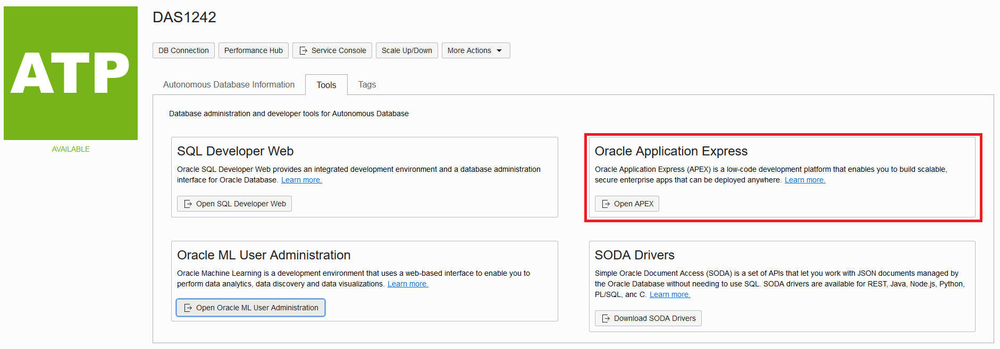

2. Click on Open APEX which will launch the Administration Services page if this is your first time logging into APEX.


**NOTE**- If this is not your first time logging into APEX it will bring up a login for your APEX application. There will be a link at the bottom of the login page that says administration. Click that link to get to this screen.

3. Login with the ADMIN account you created when you initially created the ATP instance.

4. Either click on the Create Workspace button or go to the Manage Workspaces drop down and click Create Workspace.


8. For the Database User click on the list button and select the database user you created earlier called "apex_app". Since we are not creating a new user you don't have to specify the password. You only specify a password if you want APEX to create a new database user. The workspace name will automatically get populated with apex_app. Click on create workspace.

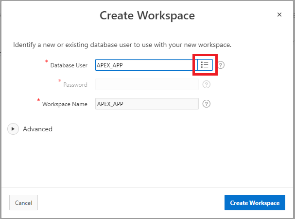

9. After you create the workspace you will need to log into the workspace as the apex_app user to create the app. You will notice at the top of the page a notification saying to do this. Click on the apex_app hyperlink to do this.

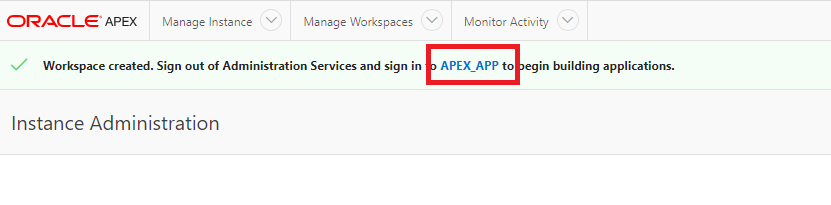

If you don't have that hyperlink, you can go to the upper right corner and click on admin and choose sign out. Then you will have the option to log back in.

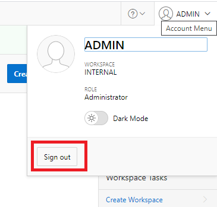

10. Login with the password you assigned to the apex_app user when you created it in sql developer web.

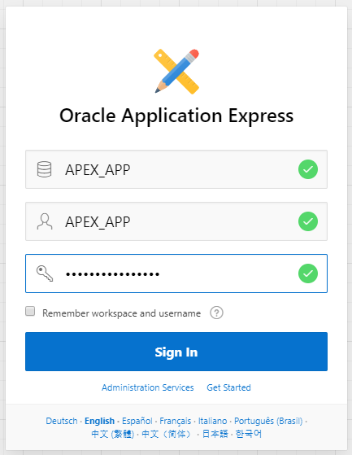

11. When you log in you will see a button to Set APEX Account Password. Click on this button.

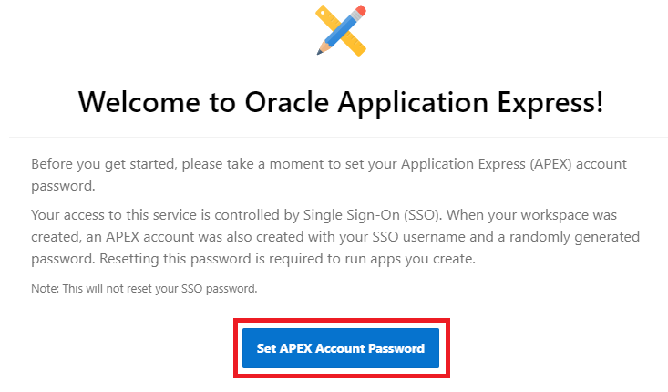

12. Fill in your email address and then scroll down and set a password to use when launching your application. You can set it to the same password as you had before. Click on Apply Changes.

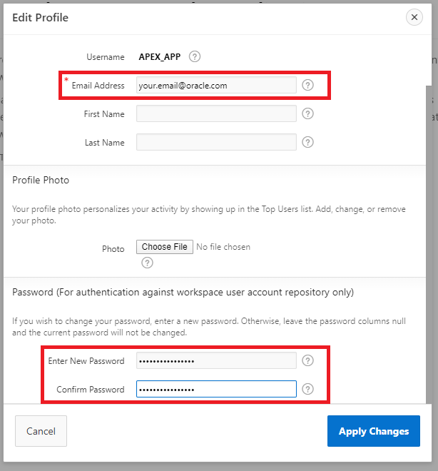

You are now logged into your workspace and ready to start creating your application!

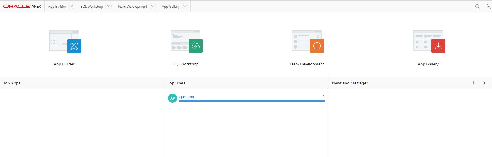

[Back to Top](#table-of-contents)

## Module 2:  Creating an APEX Application

In the previous module you created a workspace. In this module you will create an APEX application. The application will be based on the sales.csv. It will have a data grid to allow data entry/editing, a data lookup, a report, and a dashboard.

1. Download the file called **mm_sales.csv** ([from here](https://oradocs-corp.documents.us2.oraclecloud.com/documents/link/LD67BF60471BB8666A167A50F6C3FF17C1177A968060/fileview/D58165A8FC2BAB77F65D05CEF6C3FF17C1177A968060/_channels.csv)) Please note the local directory you save it in as you will need it in the next step. See screenshots on how to download and save the file.


2. You should be on the main page of your workspace below. If not then launch APEX and log back into your workspace.


3. Click on App Builder.

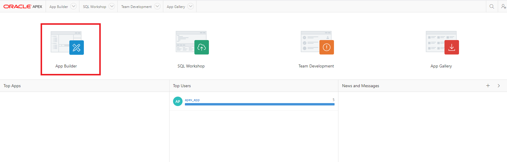

4. Click on Create a New App.

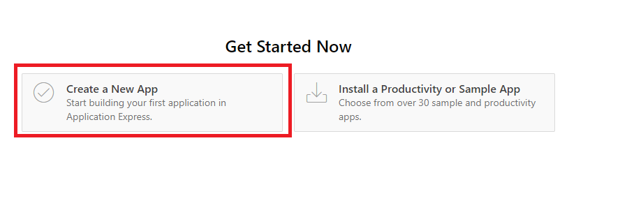

5. There are several ways to create a new application. Since we have the mm_sales.csv we will choose From a File.

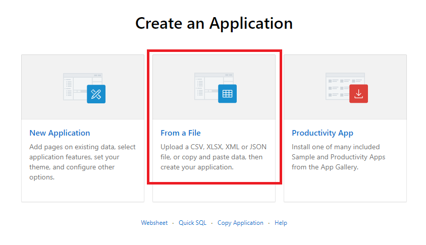

6. Click on Choose File and navigate to where you saved the mm_sales.csv and choose that to start the wizard.

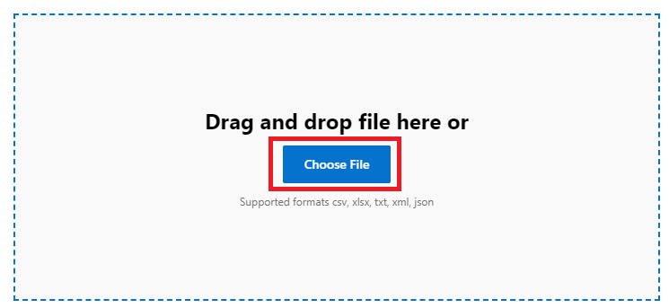

9. On the Load screen we will choose:
- Load To: New Table (We don't have to precreate the table)
- Table Owner: APEX_APP
- Table Name: SALES
- Error Table Name: SALES_ERR$(This is automatically filled in)
- Primary Keys: Identity Column
- Use Column Data Types (Make sure it's checked)
- First line contains headers (Make sure it's checked)
- Column Delimiter: ,
- Enclosed By: "
- File Encoding: Unicode UTF-8

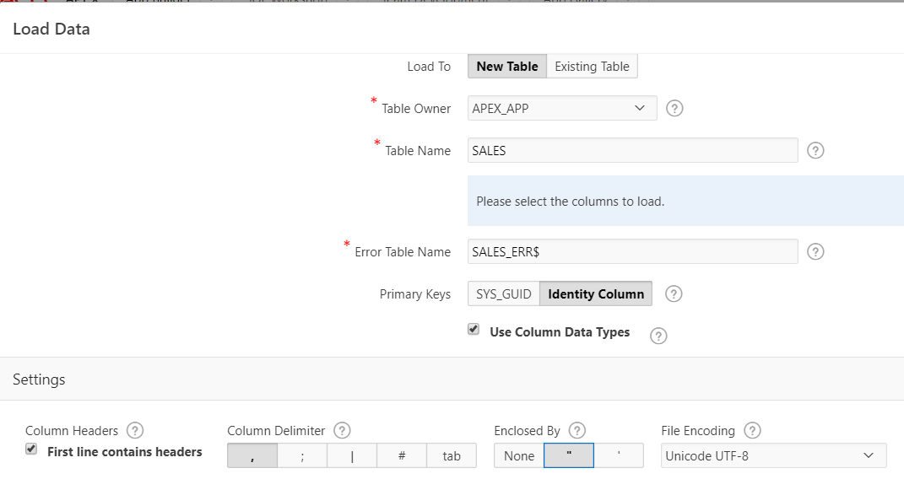

10. The rest of the screen should be the data from the file. The columns should have the names from the file and the data should line up correctly. If everything looks ok click on Load Data.

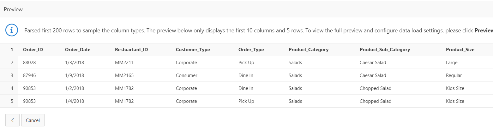

11. You should see a screen once it's done loading that says how many rows were loaded. You can see there were 45 rows rejected and below it will actually tell you the error message. Those rows are ok they were rejected and can be ignored. Click Create Application.

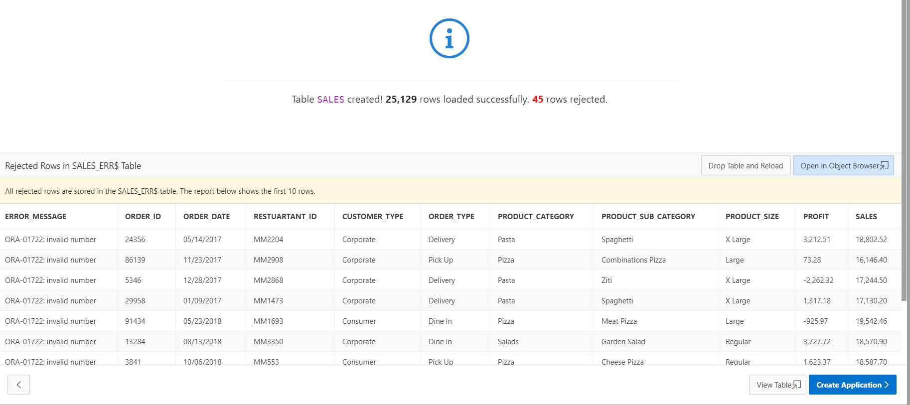

12. Create a name for you application "Mama Maggy". There should be a standard set of pages listed. By default we will get a dashboard, search, report, and calendar. Under features click on Check all to include those features. Then scroll to the bottom and click on Create Application.

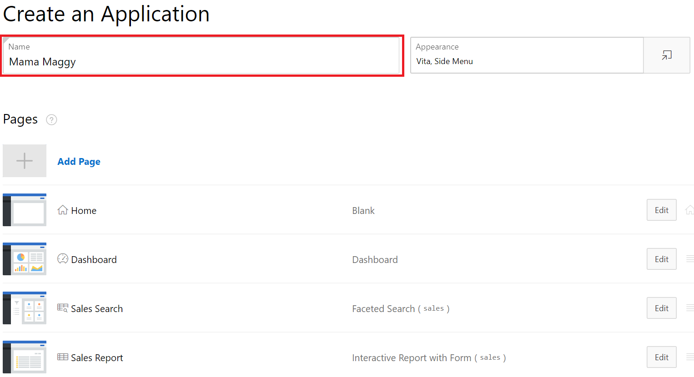
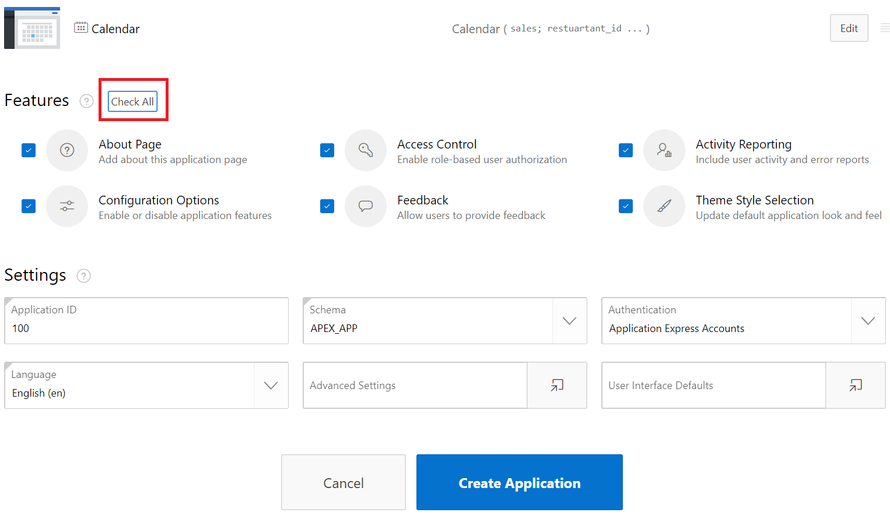

13. Once it's done creating your application you should end up on a screen like this.


14. Take a look at what you have so far by clicking on Run Application.

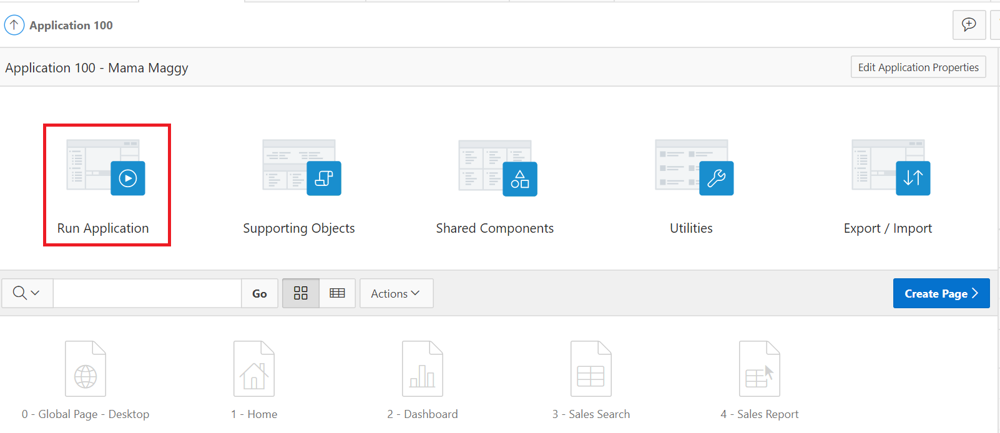

15. Login with the user apex_app and the password you created when you setup the workspace.


16. Take some time and explore your application. Click through the Dashboard, Sales Search, Sales Report, and Calendar. When you are finished go to the next step and we will add the data grid and look at how to change the SQL behind the graphs on the dashboard.

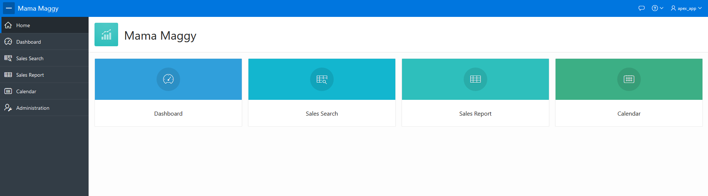

17. Click on the Dashboard.

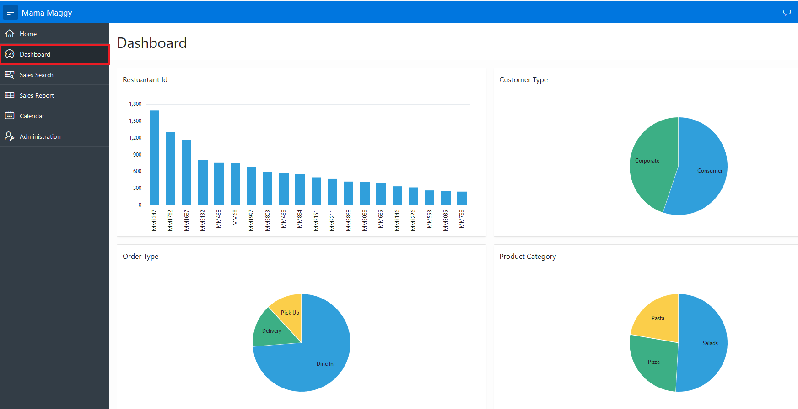

18. If you look at the Restaurant ID graph and hover over one of the bars you will see it says value. The challenge here is that profit, sales, discount, gross unit price? The application didn't know. It made a guess based on data type of what the best charts would be. Let's go take a look at the SQL behind this graph.

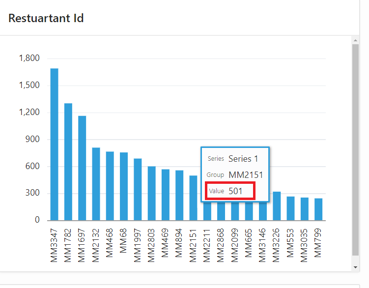

19. At the bottom click on Application 100 to get back to your Workspace.


20. Down at the bottom you should see all of your pages. Let first start with fixing the Dashboard. Click on Dashboard.

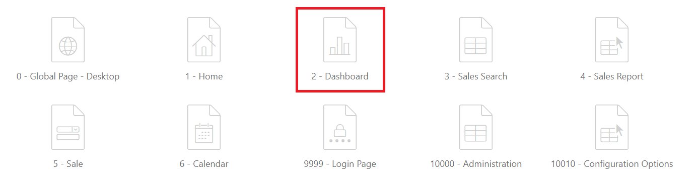

21. This will bring up the Page Designer for the Dashboard. On the left you will see areas for the breadcrumbs, content body and other areas. In the content body are the various graphs that we care about, specifically the Restuartant ID graph. Click on Series 1 under Units Sold on the left side.


22. Over on the right side of the screen you will see an area that says Source with a box that says SQL Query. This is where you would define the query against the table to get the data for the graph. As you can see it's selecting Restuartant_ID and doing a count. What would make more sense would be to select the Restuartant_ID and then a sum of the Sales. The reason we had to do the formatting around sales is that when we imported the spreadsheet it treated the sales column as a varchar2 due to the comma formatting in the excel spreadsheet. If we would have taken those out and loaded that field as a number we would not have needed the formatting. Take the SQL statement below and paste it into the window.

```
select Restuartant_ID, sum(to_number(sales,'999,999,999.99')) total_sales
from sales
group by Restuartant_ID
order by 2 desc
```

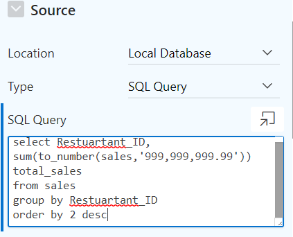

23. After you paste the SQL statement in you will get an error message on Value. That is because we changed the name of one of the columns in the SQL statement and it no longer matches. So make the following changes:
- Series Name: TOTAL_SALES
- Label: RESTUARTANT_ID
- Value: TOTAL_SALES

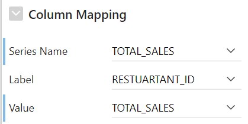

24. Click on Save and Run button in the upper right.


25. Now go back to the Dashboard and look at the graph. Later if you want to you can look at the other graphs and adjust them if you want. Now let's add the data grid.


26. Click on Application 100 at the bottom.


27. Click on Create Page

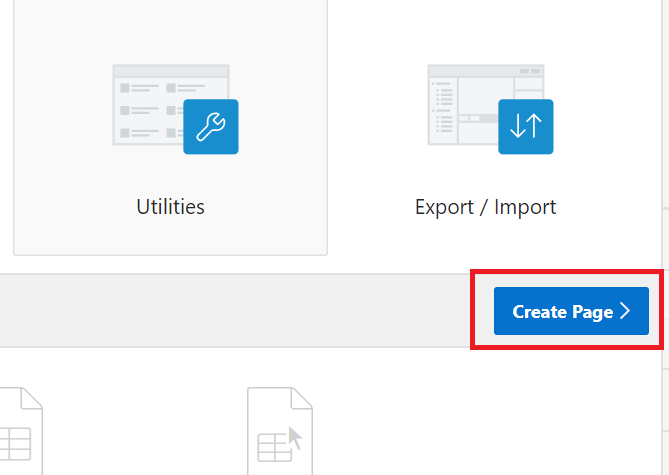

28. Select Form

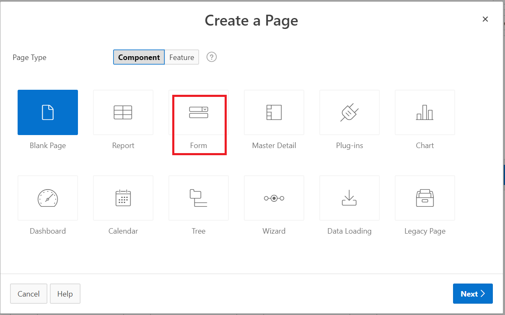

29. Select Editable Interactive Grid

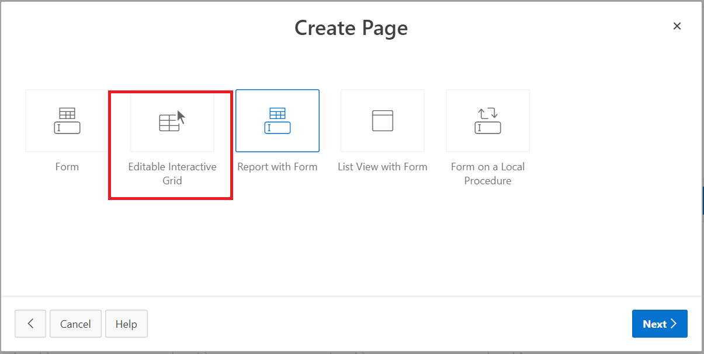

30. Name the page "Data Grid" and leave the other options as default. Click Next.

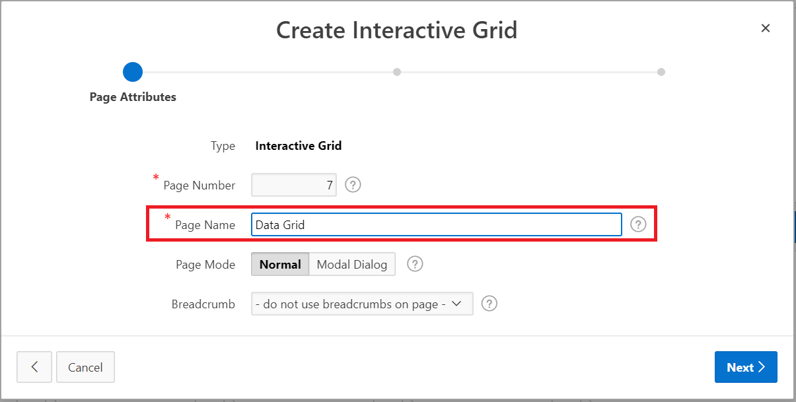

31. Click on "Create a new navigation menu entry". The default Entry name will be "Data Grid" which is fine and do not select a parent. If you do select a parent what will happen is it will nest the page under another page. Click Next.


32. Select the following:
- Data Source: Local Database
- Editing Enabled: On
- Source Type: Table
- Table/View Owner: APEX_APP
- Table/View Name: SALES (click on the list and choose it)

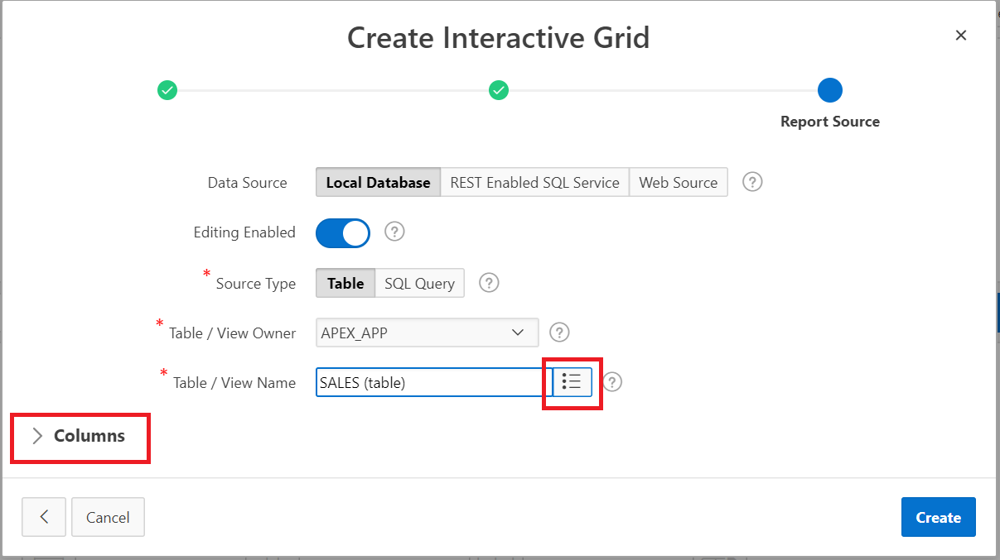

Open up the column list and remove the ID column. It's important to do this because the ID column is a generated field and you don't want someone to edit this.


33. Click on Create.

34. Once your page has been created click on the save and run button in the upper right corner.


35. Notice you have a new page added to the left navigation called Data Grid.

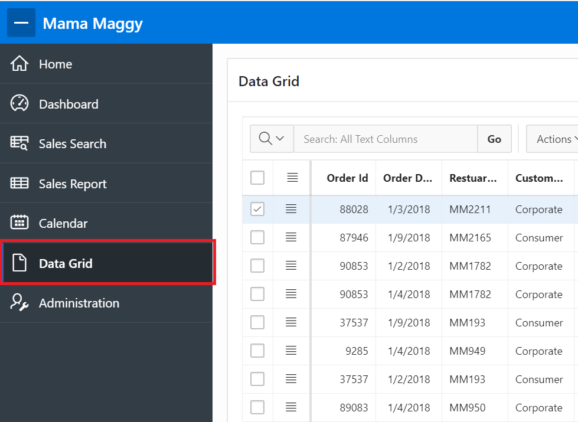

36. You can click on a record and change a value in it and click the save button at the top of the grid.


37. Click back over to your Dashboard and notice the change in the Dashboard.

38. Take some time and explore your application.

**You have successfully created an application!**

***END OF LAB***

[Back to Top](#table-of-contents)   
