# Using Oracle Machine Learning with ATP

## Table of Contents

- [Module 1: Creating Oracle Machine Learning Users](#module-1--creating-oracle-machine-learning-users)
- [Module 2: Creating a Notebook](#module-2--creating-a-notebook)
- [Module 3: Creating and Testing a Model](#module-2--creating-and-testing-a-model)


*****


## Module 1:  Creating Oracle Machine Learning Users

In this module we will create a workspace within Application Express using the user apex_app we created earlier.

1. You will need to be on the tools tab of your Autonomous Database details page as shown below.

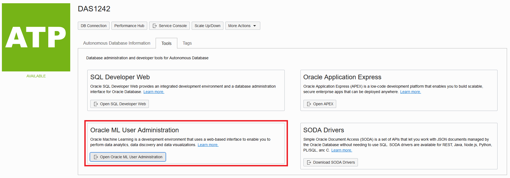

2. Click on Open Oracle ML User Administration. This will launch the a login screen to be able to administer your OML users.

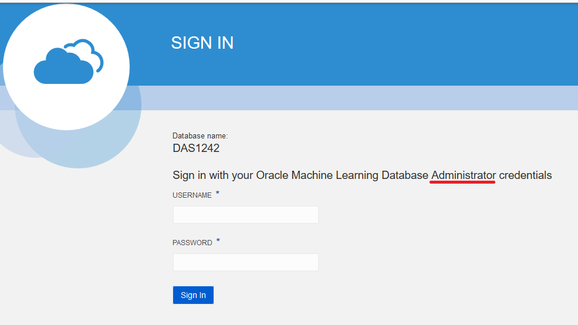

3. Login with the ADMIN account you created when you initially created the ATP instance.

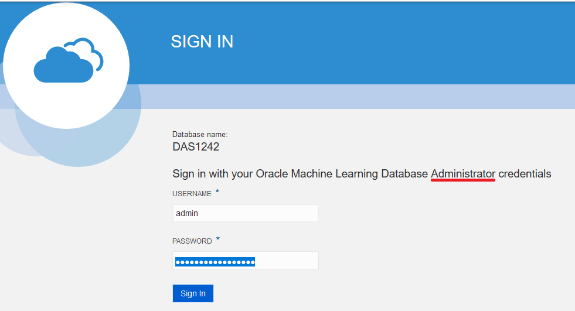

4. The only user listed is Admin with the role of System Administrator. Click on create.


5. Use the following information to create the user:
- Username: MLUSER1
- EMail Addres: <your work email address>
- Uncheck generate password
- Password: <any password you will remember>
Click on Create when done.

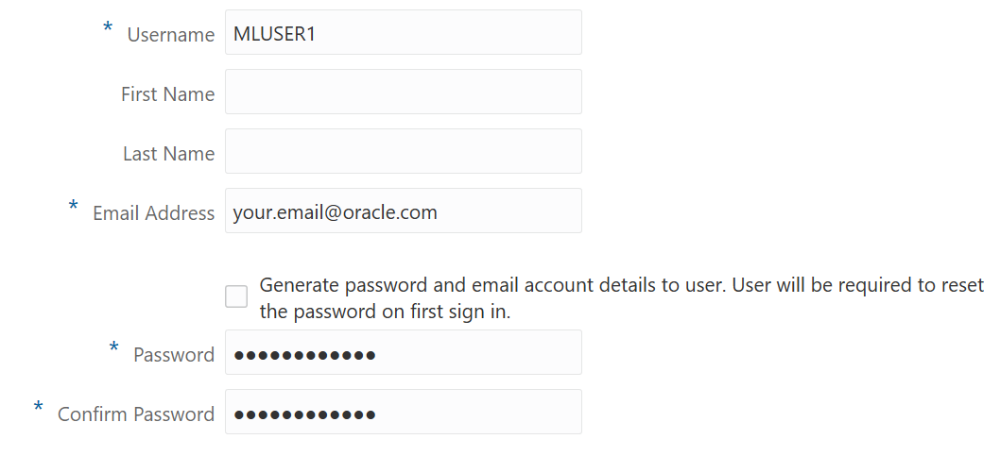

6. After creating the user you will now have a user MLUSER1 with the role of Developer. In the upper right corner of the screen click on the home button.


7. You should be on the login screen. This is now the login screen for the users, not the administrators. Copy the URL and save it. If you need to log back in as MLUSER1 this is the URL you will use. If you setup a user they would get an email with this URL in it. Once you have copied the URL, login with the user MLUSER1 and the password you assigned it.

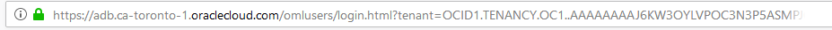

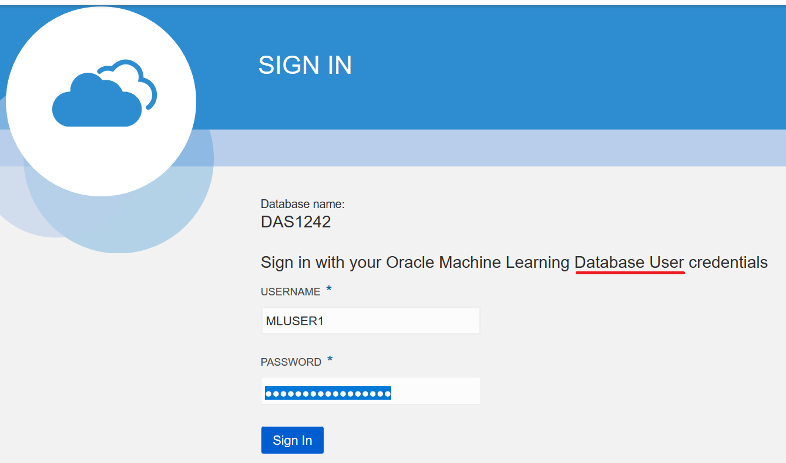

8. You should now be on the OML landing page. Here you will have several areas. A few to take note of:
- Run SQL Statements: If you wanted a scratchpad to run some ad hoc SQL statements quickly you could go here. This is a less formal approach when you just want to do something quickly. You can go back later and
- Run SQL Scripts: This is the same as Run SQL Statements but for SQL Scripts.
- Notebooks: These are going to be areas you can perform data exploration, visualization, data preparation and machine learning. Later in this lab we will use a notebook.
- Jobs: Some notebooks could take a while to prepare and analyze a large amount of data. It might make sense to use a job to schedule the notebook to run so it's ready when you login.
- How Do I?: If this lab is interesting and you want to learn more on your own these are great topics to explore further.

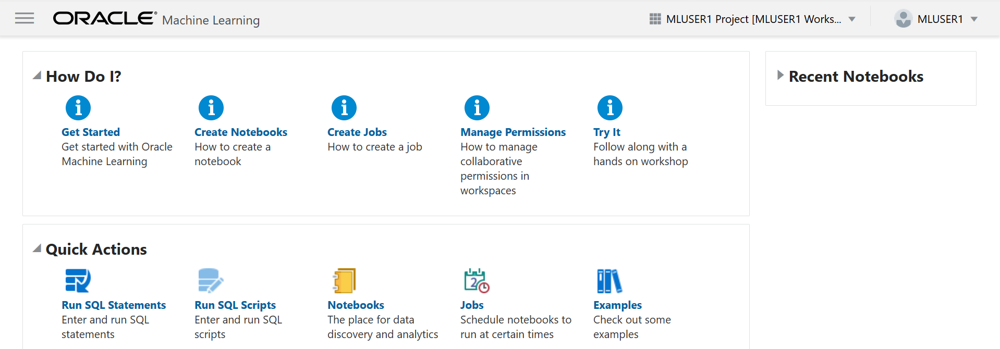

9. To import our notebook click on Notebooks.

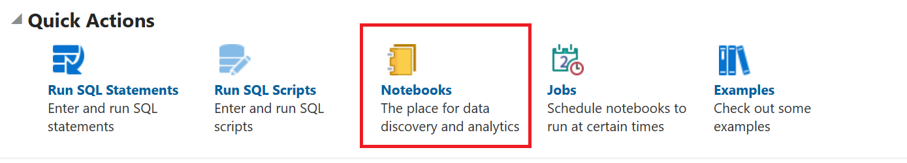

10. Click on Import and navigate to where you saved the mamamaggy.json and open it. The reason you are importing the notebook is just to save on copying and pasting. This lab will cover each of the section and what they are doing in detail.

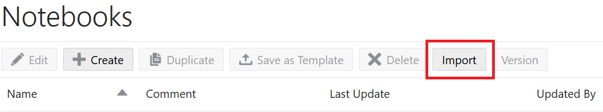

11. It should say that the notebook was imported successfully. Under Notebooks you should have MamaMaggy listed. In the next Module we will explore that notebook.

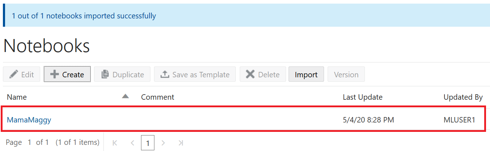

[Back to Top](#table-of-contents)

## Module 3:  Creating and Testing a Model

1. You should be on the Notebooks page and the notebook MamaMaggy should be listed. Click on that notebook.


2. A few things to understand about the notebook before we dive into the code:
- Along the top will be the name of the notebook and next to that will be a menu bar. Here you will find two important buttons Run All Paragraphs and Export this Notebook.
- Run All Paragraphs: This button is used to run the entire notebook. This is used when you adjust the data in the source and want to rerun the data through your model. We are going to run each paragraph separately just to see what each one does.
- Export this Notebook: This button is how I created the json file for you to import. It's a way of sharing notebooks with other people or backing them up.
- Each statement is in a box called a paragraph. Paragraphs are a way to create a logical piece of work. In our case, it could be a sql statement like a create table or an insert, a script like a PL/SQL block, or a select statement for a report.
- Run this Paragraph: On the right side of the paragraph there is a button called Run this Paragraph. As we go through each step, I will explain what the paragraph does and then you can run just that paragraph using that button.

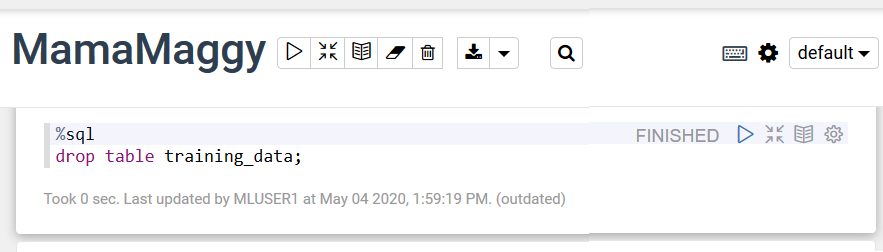

3. Since we just imported the notebook we need to associate a connection with this notebook. On the right side of the connection you will see a wheel. Click on that.


4. This will bring up the Interpreter binding. Select the databasename_tp for %sql and %script. This will sending all %sql and %script paragraphs to your database connection. Click Save.

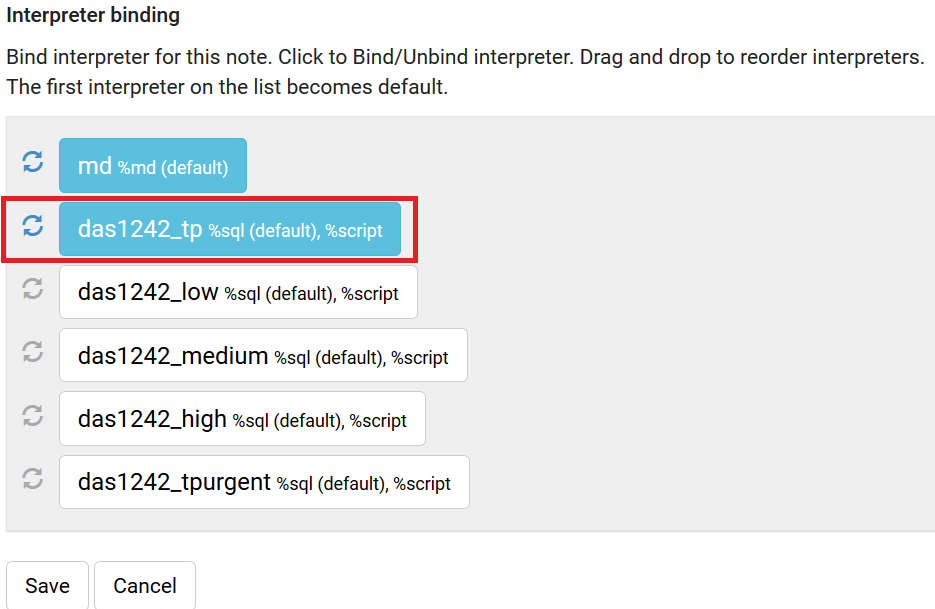

5. The first step might fail. If it's your first time running this the training_data table does not exist. The reason we drop it instead of just truncating the table is because we might change the structure of the source table and add more columns. Click on the run paragraph button.

```
drop table training_data;
```


6. We are going to split the data from the source into a set of data to train our model and a set of data to test our model. This step is to create a set of data to train our model. We create a table with the same columns as the source using the create table with the select * from the source, however, we use sample and seed. Sample says each record has a 60% chance of being chosen and seed populates the random number generator that sample uses with a specific number so that we get a constant result. Click on run Paragraph.

```
create table training_data as select * from mama_maggy.mm_order_stats sample (60) seed (1);
```


7. Just like in the first step, we need to drop the table we are going to use to hold the data used to test the model. It might fail if this is the first time running through. Click on run Paragraph.

```
drop table test_data;
```

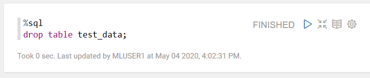

8. We are going to create the table for the test data just like we did for the training data but with the rest of the data from the source. To do that we simply select all the data from the source that doesn't exist in the training table by using a minus statement. Click on run Paragraph.

```
create table test_data as select * from mama_maggy.mm_order_stats minus select * from training_data;
```

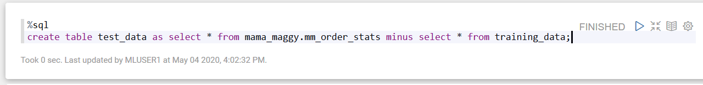

9. In the next couple steps we need to create and populate a table to store the settings for creating our model. The first step is to drop the model_settings table. If it doesn't exist this statement will fail which is ok. Click on run Paragraph.

```
drop table model_settings;
```

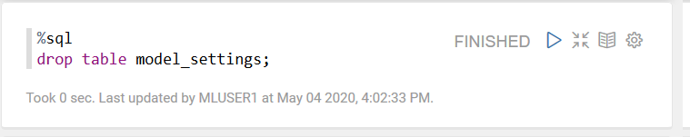

10. This statement will create the model_settings table. There are just two columns, the name of the setting and the value to use. These are very specific values that can be found in the Oracle documentation for the procedure dbms_data_mining.create_model. Click on run Paragraph.

```
CREATE TABLE model_settings (SETTING_NAME VARCHAR2(30), SETTING_VALUE VARCHAR2(4000));
```

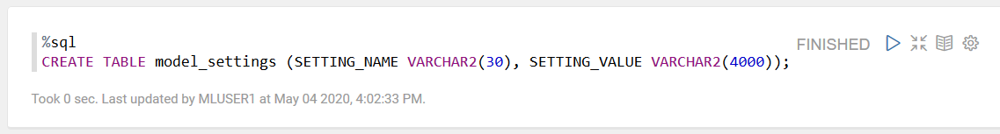

11. The model setting we are going to insert is ALGO_NAME and the value for that is ALGO_DECISION_TREE. What we are telling the model is to use a decision tree for the type of algorithm. Click on run Paragraph.

```
INSERT INTO model_settings (SETTING_NAME, SETTING_VALUE) VALUES ('ALGO_NAME', 'ALGO_DECISION_TREE');
```

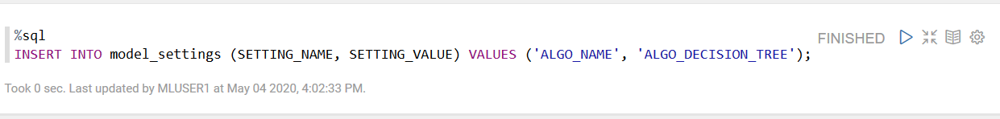

12. This script will drop the model if it was previously created. Just like in previous steps we are making this so it can be run over and over as the data is changed. One thing to take note of is the %sql is now a %script because this is a PL/SQL block instead of a SQL statement. Click on run Paragraph.

```
BEGIN
  execute immediate 'CALL DBMS_DATA_MINING.DROP_MODEL(''CLASS_MODEL'')';
END;
```

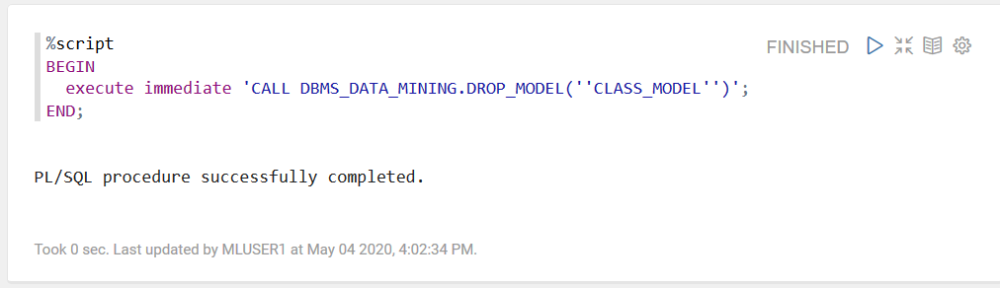

13. This script will call dbms_data_mining.create_model and create a data model using your training data. The first parameter is going to be the name of the data model it will create. We will use that name later on and it's user defined. The second is the function, in our case it's a classification function since we are using a decision tree algorithm. The third is the data set to use to train the model. The fourth is the case identifier for the record in the table which is order_id for our table. The fifth is the target column or which one are we trying to predict. The last column we are specifying is the table where the settings are stored in. When you are done you will have a data model called CLASS_MODEL. Click on run Paragraph.

```
BEGIN
  execute immediate 'CALL DBMS_DATA_MINING.CREATE_MODEL(''CLASS_MODEL'', ''CLASSIFICATION'', ''TRAINING_DATA'', ''ORDER_ID'', ''BREADSTICKS'', ''MODEL_SETTINGS'')';
END;
```

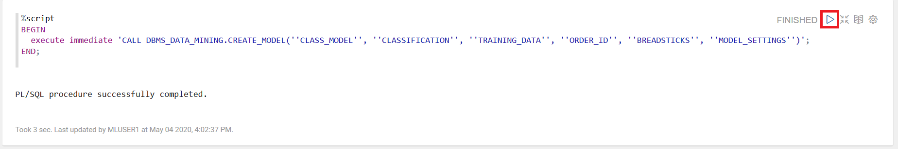

14. Now that you have a model generated you need to test it. The first step is to go to the test_data table and add a new column called breadsticks_pred. In the next few steps you are going to populate that field using your CLASS_MODEL and see if you can predict if customers will buy breadsticks. You will be able to compare the breadstick column to the breadsticks_pred column to see if you were correct or not. Click on run Paragraph.

```
alter table test_data add breadsticks_pred number(1);
```

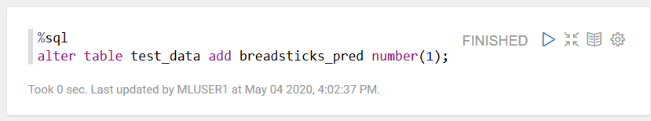

15. This update statement will populate the breadsticks_pred column. Notice the prediction function, it takes a model which uses a set of data and returns a prediction. The model was generated based on a table with the same structure as the one we are testing and so it can use the same inputs to generate it's prediction using the \* or all columns. Click on run Paragraph.

```
update test_data set breadsticks_pred = prediction(CLASS_MODEL using *);
```


16. To compare how well your model did you can select the breadstick column (what they actually purchased), the breadstick_pred column (what you predicted they would purchase), and a count. Where the two columns are equal it is a match. Where they are not equal then it is a miss. The 0 means they didn't buy and a 1 means they did buy. Click on run Paragraph.

```
select breadsticks, breadsticks_pred, count(*) from test_data group by breadsticks, breadsticks_pred order by 1,2;
```

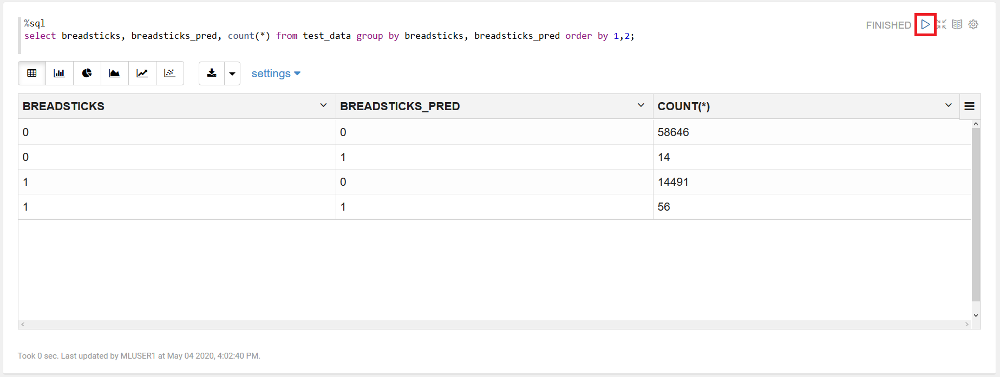

16. When looking at the accuracy of a model, we usually look at a percentage. That percentage is the number correct divided by the total number. You will see that this model is in the upper 70s to lower 80s for accuracy. Click on run Paragraph.

```
select to_char((select count(*) from test_data where breadsticks = breadsticks_pred) / (select count(*) from test_data)) from dual;
```

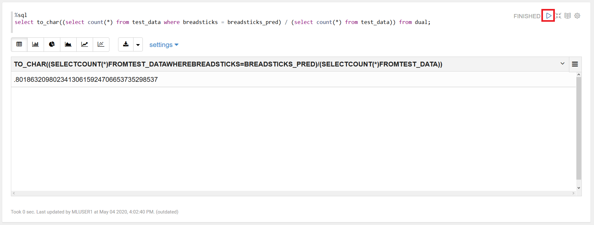

How could this model be more accurate? If you had more data to train your model so it could find patterns. We only started with less than 200,000 rows and then split that into training and testing data. Many times millions of rows would be examined. Maybe additional pieces of information. We only looked at what people ordered. What about location? Are there regional preferences that we don't know about? Are there specials going on that could influence orders? What about specific times of years when these orders took place? As a data scientist goes through and starts to analyze this data they need a workspace they can quickly bring in new pieces of information and try out an idea. They can't wait for a traditional DBA to model their request and populate the data for them. They need to try something, scrap it, and try something new and they need a platform that can do this quickly at scale like the Autonomous Database.

**You have successfully use Oracle Machine Learning!**

***END OF LAB***

[Back to Top](#table-of-contents)   
