# Compute Service

Overview

Oracle Cloud Infrastructure Compute lets you provision and manage compute hosts, known as instances. You can launch instances as needed to meet your compute and application requirements. After you launch an instance, you can access it securely from your computer, restart it, attach and detach volumes, and terminate it when you're done with it. Any changes made to the instance's local drives are lost when you terminate it. Any saved changes to volumes attached to the instance are retained.

Be sure to review [Best Parts for Your Compute Instance](https://docs.cloud.oracle.com/iaas/Content/Compute/References/bestPartscompute.htm?target=_blank) for important information about working with your Oracle Cloud Infrastructure Compute instance.

In order to complete this lab, you'll need a user name and password, tenancy, and a compartment name.  We've created a security policy that will allow you to create any resources you'll need in order to complete the exercise.

## Part 1: Obtain your credentials and login

1.  To retrieve your tenancy and credentials, double click the desktop file named **Luna-Lab.html**.


*The page will open and you will find all the information you need to login to the OCI Cloud environment and get started with the lab.    Your details will be different but notice that you can copy each entry using the Copy button on the right of each field.*


2. Start by copying the **Username**.   *Don't try and hand type either the username or the password, they are system generated and very long!*  Then click on the **OCI Console** button to open the login screen to access your tenancy.  

Copy and paste the Username and Password credentials from the Luna Lab landing screen into the Oracle Cloud Account Sign In screen.  

3. Click the **Sign In** button.


**Note:** *You can use the right click Copy/Paste menu but if that doesn't work you can also use ```<CTRL><C> and <CTRL><V>``` to copy and paste.*

## Part 2: Create a Compute Instance 

Oracle Cloud Infrastructure  offers both Bare Metal and Virtual Machine instances:

- **Bare Metal**  - A bare metal compute instance gives you dedicated physical server access for highest performance and strong isolation.
- **Virtual Machine**  - A Virtual Machine (VM) is an independent computing environment that runs on top of physical bare metal hardware. The virtualization makes it possible to run multiple VMs that are isolated from each other. VMs are ideal for running applications that do not require the performance and resources (CPU, memory, network bandwidth, storage) of an entire physical machine.

An Oracle Cloud Infrastructure VM compute instance runs on the same hardware as a Bare Metal instance, leveraging the same cloud-optimized hardware, firmware, software stack, and networking infrastructure.

In this hands on exercise we will create a Virtual Machine compute instance.

1. Click on the OCI main navigation menu, choose **Compute** and from the fly out choose **Instances** 

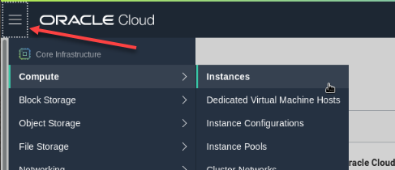

2. At the bottom left, under **List Scope** choose your compartment.   You have been assigned a specific compartment for this lab environment.   It should be easily accessible by clicking the root, then clicking the '+' signs until you reach the assigned compartment.  Click on the compartment name.

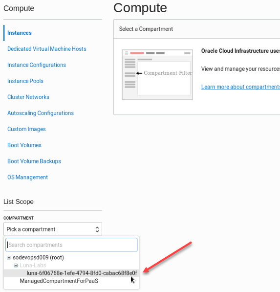

3.  Click the **Create Instance** button to launch the compute instance.

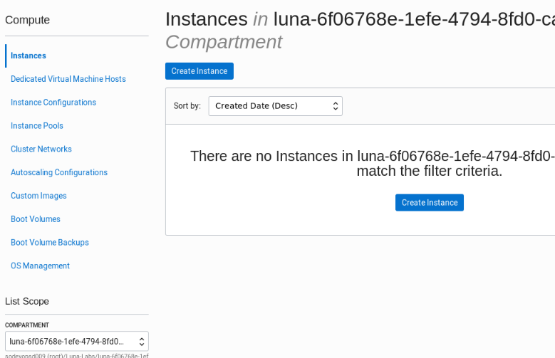

The **Create Compute Instance** workflow will default to the most common selections.   We'll look at the the instance creation dialog as three sections, instance details, networking, and Adding SSH keys.

**Note:**  *As this lab focuses on creating an instance, and not on networking, we will not step through network or VCN creation.   We will allow the Create Instance dialog to automatically create the VCN for us with the proper routing and security list information.  For training on OCI networking, see the network and VNC Hands On Labs.*

4.  Click on **Create Compute Instance**.  

| **Field**                | **Recommended Information** |
| ------------------------ | ------------------------------------------------ |
|**Name:** | Accept the default or name your instance  |
|**Image Operating System:** | Oracle Linux 7.7 or latest |
|**Availability Domain:** |Choose any Availability Domain  |
|**Instance type:** | Virtual Machine |
|**Instance Shape:**|  Virtual Machine - VM.Standard2.1  |

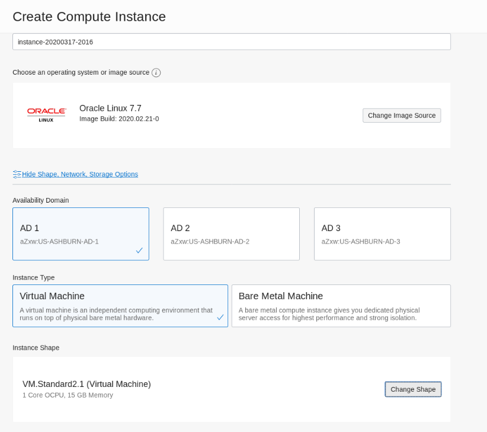

5.  In the **Configure networking** section, verify that the proper department has been selected.   The dialog will create all of the required networking automatically.  Accept the default VCN name or create your own if you wish.   Be sure that the radio button for "ASSIGN A PUBLIC IP ADDRESS" has been selected.

| **Field**                | **Recommended Information** |
| ------------------------ | ------------------------------------------------ |
| **Virtual Cloud Network Compartment:** | Choose your assigned compartment |
| **Name:** | Accept the default or name your VCN |
| **Assign a Public IP Address:** | Selected |


And finally, the last two sections are the **Boot Volume** and **Add SSH Keys** sections.   Leave the boot volume section with the defaults.   Note the you can specify a custom size or data encryption.  Do not select anything at this time.

Next you'll need to create and paste SSH keys so that you can securely access the new instance.  

6.  Click on the Applications Menu at the top of your screen and choose **Terminal Emulator** to open up a terminal window in your desktop environment.


7.  From the system prompt, type in the command ```ssh-keygen``` and hit the return key.   Simply press the **return** key three times to accept the default file and path, as well as to create an empty passphrase.   The ssh-keygen command will create a public key, a private key, and a folder labeled .ssh to store them in.


In this next step, we'll display the contents of the public SSH key so that we can copy it and paste it into our compute instance creation dialog.    Type

8.  Type the following command in the terminal window.

```cat .ssh/id_rsa.pub```


9.  With the contents of the SSH key displayed, select the contents of the key, from the line starting with *ssh-rsa ...* to the last character.   Right click and choose **Copy** to copy the key contents to the clipboard.


10.  Return to the OCI Web console and find the *Add SSH Keys* section.   Choose the radio button labeled **Paste SSH Keys** and then paste the key you copied in the last step into the form.  Right click with your mouse and choose the **Paste** command or you can use the CTL-V keyboard command.


11.  After you've successfully pasted the SSH key, you can now click on the **Create** button to create the instance.


The instance will begin provisioning.  You should see the instance details screen with the orange icon indicating it's provisioning status.   Wait a few moments.  When it's finished, the icon will turn green and enter the *running* state.


## Part 3: Connect to the instance

1.  Examine the instance details screen.  Left click to drag and select the **Public IP Address** and right click or CTL-C to copy the IP address.  We'll need that to connect to the instance next.


2.  Return to the terminal window, or open a new one if you closed it earlier.   Type the following command to connect to the new instance via SSH.   This command uses the private SSH key we created earlier and is logging in as the default admin user, *opc*.

```ssh -i .ssh/id_rsa opc@<IP ADDRESS OF YOUR INSTANCE>```

Answer *yes* to the question about continuing your connection.    You should now be logged into your instance.


## Part 4: Install and configure a web server

In the next steps we will install and configure an Apache webserver via the Linux command line and verify that it's running and accessible over the public internet.

**Note** *Apache is the most commonly used Web server on Linux systems. Web servers are used to serve Web pages requested by client computers and commonly used to host customer applications.*
 
1.  Install the Apache web server.  Type the following command.

```# sudo yum install httpd -y```

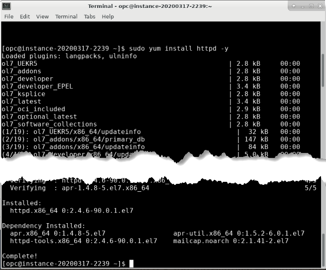

2.  In the terminal window, type the following three commands to start the apache web server, enable the httpd processes, and check the web server configuration.

```sudo apachectl start```

```sudo systemctl enable httpd```

```sudo apachectl configtest```

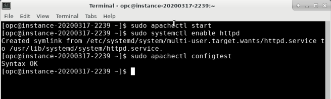

3.  Type the following commands to enable http traffic to pass through the Linux firewall service.  Then reload the service.

```sudo firewall-cmd --permanent --zone=public --add-service=http```

```sudo firewall-cmd --reload```

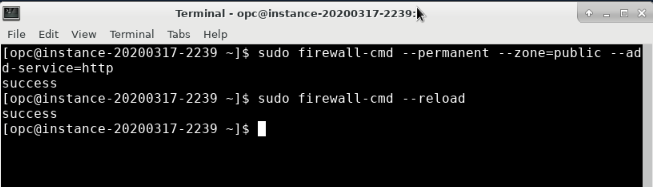

4.  Create the landing page for your web server.  For standard http the default web page is normally named index.html.  We'll use the linux *echo* command to alter the default file in its default location.

```sudo bash -c 'echo This is my Web-Server running on OCI >> /var/www/html/index.html'```

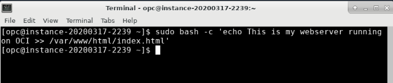

## Part 5:  Test the connection to the web server

1. Open a new browser tab in the Firefox browser on your training session desktop.  Type `http://<public ip address of your instance>` into the URI locator and press enter.

**NOTE:** The connection should time-out because the OCI security list has not been altered to allow traffic to port 80.

2.  Navigate to the OCI Console and click on the services menu, choose **Networking > Virtual Cloud Networks**.

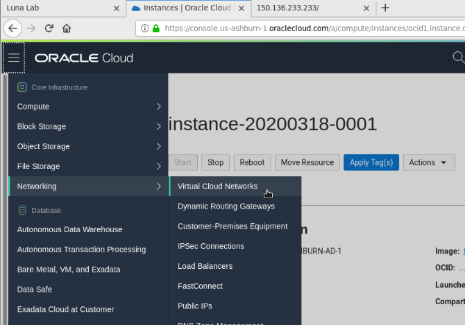

3.  Make sure your compartment is selected, then select the vcn that was created with your instance.  

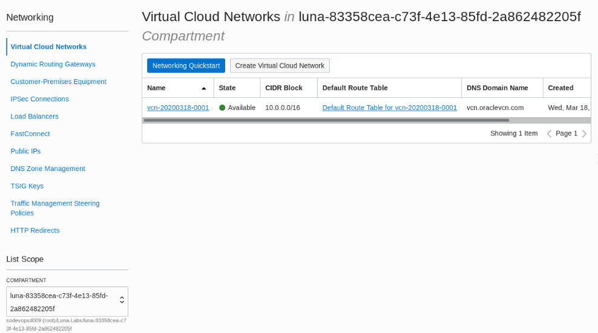

4.  On the bottom left of the screen, click on **Security lists** and then click on the **Default Security List** for your vcn.

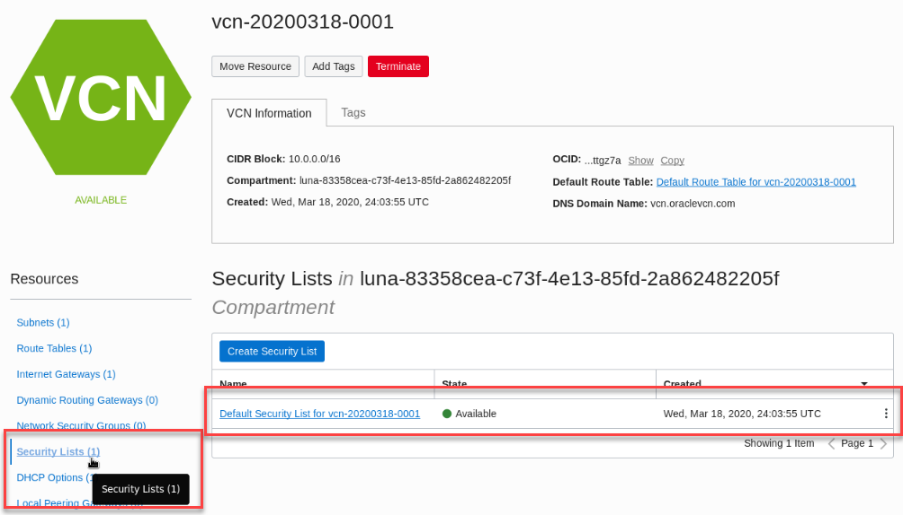

5.  Within the security list rules screen, click the blue button to **Add Ingress Rules**.

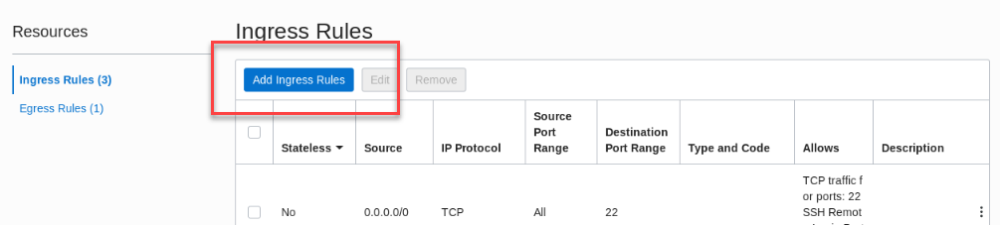

6.  In the dialog box, enter the following information to open port 80 on your instance.  Then click the **Add Ingress Rules** button.

| **Field**                | **Recommended Information** |
| ------------------------ | ------------------------------------------------ |
| **Source Type:** | CIDR |
| **Source CIDR:** | 0.0.0.0/0|
| **IP Protocol:** | TCP |
| **Source Port Range:** | All (default) |
| **Destination Port Range:** | 80 |

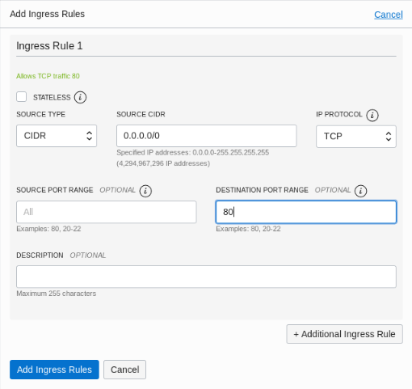

7. Return to your browser and open a new tab on your training session desktop.  Type `http://<public ip address of your instance>` into the URI locator and press enter.

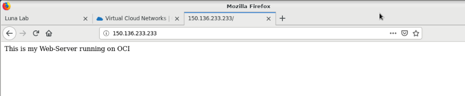

## Part 6: You have successfully completed this lab.

You have successfully completed this lab.    Continue to explore the OCI environment or click the **End Session** button on the desktop browser window to end your session immediately.


Great job!   Come back and try this lab again or proceed to the next lab in the series to learn more about Oracle Cloud Infrastructure!


