# OCI Basics Lab (VCN, Compute, Boot, Block Volume)

**Description**

In this lab we will illustrate deploying a single instance web application environment.  We will create a Virtual Cloud Network (VCN), a compute instance, attach block volume storage, and install a simple application.  Then we'll create a second compute instance that will re-use the boot volume of the first compute instance.  And finally we'll move the application block volume to the second compute instance.

The goal of this lab is to demonstrate basic functionality of OCI.  You'll create a VCN, a compute instance, and block volume storage.  You'll deploy a simple web-application.   Then you will demonstrate the ability to move both the boot and block volume to a new instance for portability and scaling needs.  

**Lab Objectives**

- Create a virtual cloud network 
- Deploy a Linux based virtual machine in the cloud
- Attach block volume storage to the instance
- Login remotely via secure connection
- Install and configure a simple web-application
- Terminate the instance and transfer the boot and block volumes to another instance
- Remove the instance and associated boot and block volumes

**Intended Audience**

- Beginner/Intermediate technical learners
- New to cloud
- New to Oracle Cloud Infrastructure

**Changelog**

- March 19, 2020 - version 1

## Part 1: Obtain your credentials and login

1.  To retrieve your tenancy and credentials, double click the desktop file named **Luna-Lab.html**.


*The page will open and you will find all the information you need to login to the OCI Cloud environment and get started with the lab.    Your details will be different but notice that you can copy each entry using the Copy button on the right of each field.*

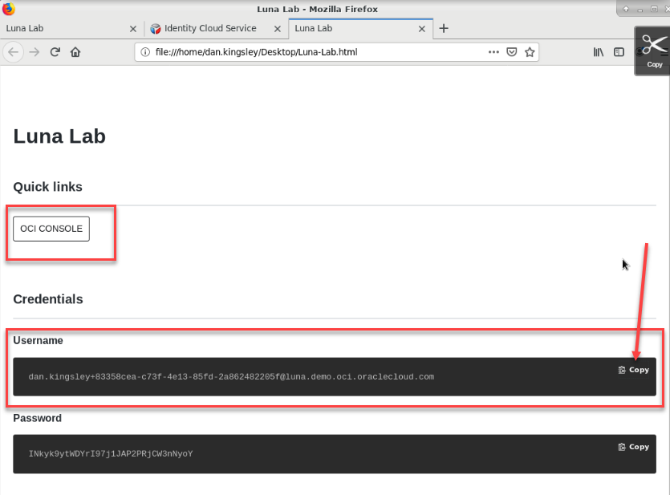

2. Start by copying the **Username**.   *Don't try and hand type either the username or the password, they are system generated and very long!*  Then click on the **OCI Console** button to open the login screen to access your tenancy.  

Copy and paste the Username and Password credentials from the Luna Lab landing screen into the Oracle Cloud Account Sign In screen.  

3. Click the **Sign In** button.


**Note:** *You can use the right click Copy/Paste menu but if that doesn't work you can also use ```<CTRL><C> and <CTRL><V>``` to copy and paste.*

## Part 2: Create a VCN

1. From the OCI Services menu,Click **Virtual Cloud Network**. 

 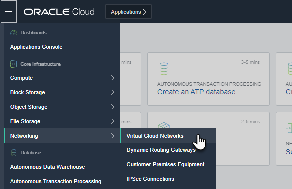

2. Select the compartment where you want to create your resources from the List Scope/Compartment drop down menu.   Then click the Networking Quickstart button.

 

3. Click **VCN with Internet Connectivity** and click **Start Workflow**

 

4. Fill out the configuration form with the following information

| **Field**                | **Recommended Information** |
| ------------------------ | ------------------------------------------------ |
|**VCN NAME:** | Provide a name |
|**COMPARTMENT:** | Ensure your compartment is selected |
|**VCN CIDR BLOCK:** |Provide a CIDR block for the entire network (10.0.0.0/16)|
|**PUBLIC SUBNET CIDR BLOCK:** | Provide a CIDR block for the public facing network (10.0.0.0/24)|
|**PRIVATE SUBNET CIDR BLOCK:** |Provide a CIDR block for the private internal network (10.0.1.0/24)|

- Click **Next**

 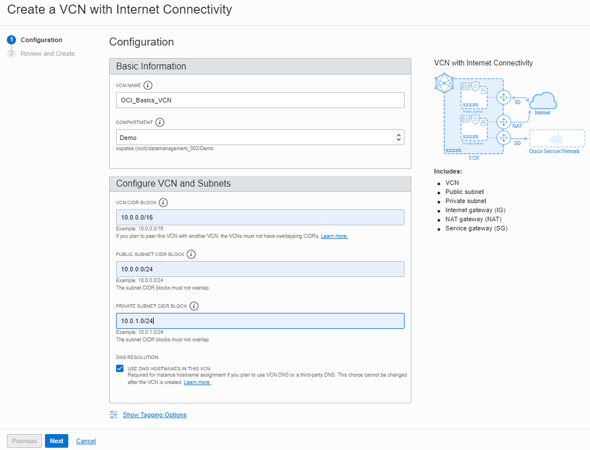

5. Verify all the information and  Click **Create**

 

6. You have created a virtual cloud network (VCN) with following components:

- **VCN**
- **1 x Public subnet**
- **1 x Private subnet**
- **Internet gateway (IG)**
- **NAT gateway (NAT)**
- **Service gateway (SG)**
- **DNS domain information**
- **Security list and routing information**

7. After the workflow has completed, click **View Virtual Cloud Network** to display your VCN details.

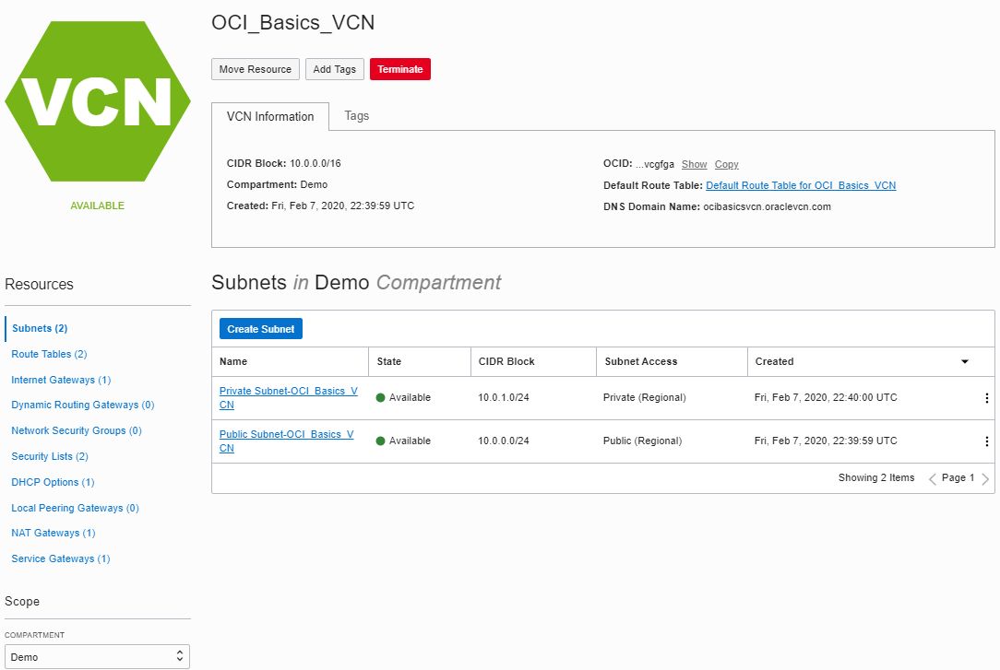
             
In the next step we will update the VCN security list to open port 80 to http traffic to pass through to the application we're going to create.   

8. Click **Security List** and then **Default Security list for<YOUR_VCN_NAME>**

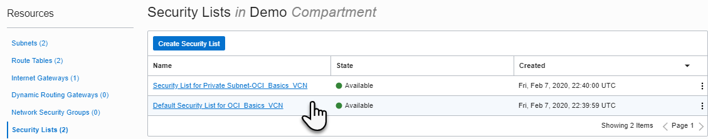

9. Click **Add Ingress Rule** under **Ingress Rules** and add below rule:

| **Field**                | **Recommended Information** |
| ------------------------ | ------------------------------------------------ |
|**STATELESS** | Leave flag unchecked |
|**SOURCE TYPE:** |CIDR (default)|
|**SOURCE CIDR:** | **0.0.0.0/0**|
|**IP PROTOCOL:** | TCP (Default)|
|**SOURCE PORT RANGE:** | ALL (Default) |
|**DESTINATION PORT RANGE:** |**80** |

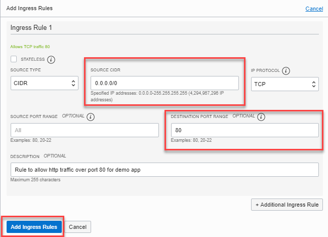

10. Click **Add Ingress Rule** button at the bottom of the dialog box.  You have now created a security rule to allow http traffic into your VCN.  


Next we'll launch a compute instance and install our application.

<!--   Commenting out the SSH section of the lab.  Build a separate lab for SSH keys covering Windows, Linux, and Mac.
              
## Create ssh keys, compute instance and Block Volume. Attach block volume to compute instance

1. Click the Apps icon in the toolbar and select  Git-Bash to open a terminal window.


2. Enter command 
```
ssh-keygen
```
**HINT:** You can swap between OCI window, 
git-bash sessions and any other application (Notepad, etc.) by Clicking the Switch Window icon 


3. Press Enter When asked for 'Enter File in which to save the key', 'Created Directory, 'Enter passphrase', and 'Enter Passphrase again.


4. You should now have the Public and Private keys:

/C/Users/ PhotonUser/.ssh/id_rsa (Private Key)

/C/Users/PhotonUser/.ssh/id_rsa.pub (Public Key)

**NOTE:** id_rsa.pub will be used to create 
Compute instance and id_rsa to connect via SSH into compute instance.

**HINT:** Enter command 
```
cd /C/Users/PhotonUser/.ssh (No Spaces) 
```
and then 
```
ls 
```
to verify the two files exist. 

5. In git-bash Enter command  
```
cat /C/Users/PhotonUser/.ssh/id_rsa.pub
```
 , highlight the key and copy 


6. Click the apps icon, launch notepad and paste the key in Notepad (as backup)


-->

## Part 3: Launch Compute Instance

1. From OCI services menu, Click **Compute** then **Instances** to bring up the instance create section


2. Click the **Create Instance** button.

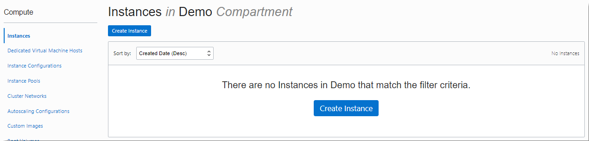

There are several sections in the **Create Compute Instance** dialog.   Generally, the sections are Instance Information, including name, OS, AD Location, Instance type, and Shape.  Next is networking where you choose the network configuration you've create earlier.  The next section contains boot volume information.  There's a section for adding an SSH key, and finally an Advanced Options section where you can choose the Fault Domain, add a script to execute on boot, and more.  We will not work with the advanced options in this lab but feel free to explore on your own.

3.  Use the information from the following tables to fill out the Create Compute Instance form:

| **Field**                | **Recommended Information** |
| ------------------------ | ------------------------------------------------ |
| **Name your instance** | Enter a name  | 
| **OS Source** | Oracle Cloud Developer Instance |


For operating system source, click on the **Change Image Source** button, select the **Oracle Images** tab.  Select the **Oracle Cloud Developer Image**. 

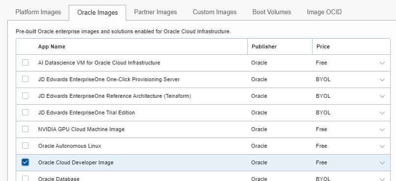

4. Scroll to the bottom of the page and accept the *Oracle Standard Terms and Restrictions* and click **Select Image**.


For the compute instance section, leave the rest of the information at their defaults.

| **Field**                | **Recommended Information** |
| ------------------------ | ------------------------------------------------ |
| **Availability Domain** |AD 1 |
| **Instance Type** |Virtual Machine |
| **Instance Shape** | VM.Standard2.1 (Virtual Machine) - *Feel free to change the shape to a lower cost shape or free tier if desired.* | 

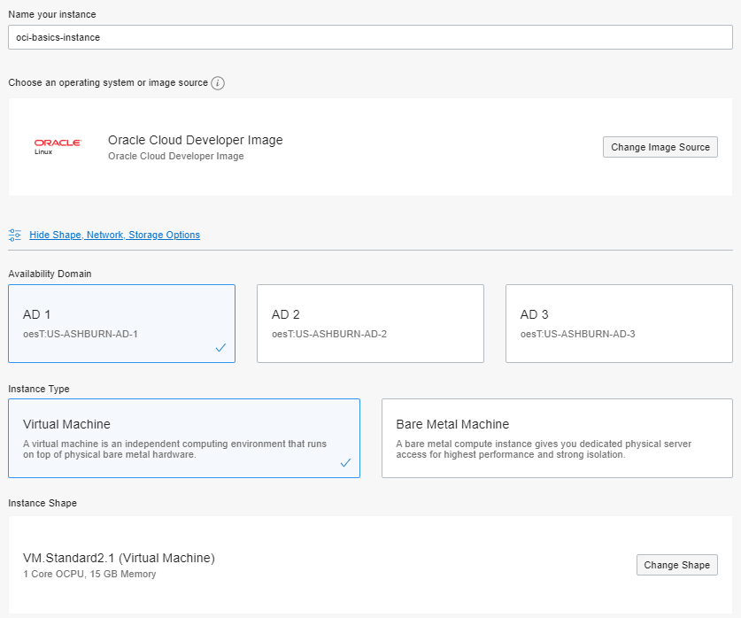

5. In the **Configure networking** section, accept most of the defaults, but verify that you've selected the proper **compartment** and **subnet compartment**.  You will select the **public subnet** and **assign a public IP address** to this instance.

| **Field**                | **Recommended Information** |
| ------------------------ | ------------------------------------------------ |
| **Virtual cloud network compartment** | Select your compartment  | 
| **Virtual cloud network**  | Choose the VCN you created earlier |
| **Subnet compartment**  | Choose your compartment |
| **Subnet** | Choose the Public subnet from your compartment |
| **Use network security groups to control traffic** | Leave unchecked |
| **Assign a public IP address** | Select this option |


In the boot volume section you can leave the defaults.


<!-- here's the new ssh section inserted -->

Next is the **Add SSH Keys** section.  You'll need to create and paste SSH keys so that you can securely access the new instance.  

6.  Click on the Applications Menu at the top of your screen and choose **Terminal Emulator** to open up a terminal window in your desktop environment.


7.  From the system prompt, type in the command ```ssh-keygen``` and hit the return key.   Simply press the **return** key three times to accept the default file and path, as well as to create an empty passphrase.   The ssh-keygen command will create a public key, a private key, and a folder labeled .ssh to store them in.


In this next step, we'll display the contents of the public SSH key so that we can copy it and paste it into our compute instance creation dialog.    Type

8.  Type the following command in the terminal window.

```cat .ssh/id_rsa.pub```

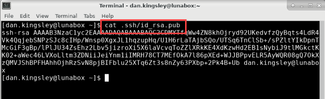

9.  With the contents of the SSH key displayed, select the contents of the key, from the line starting with *ssh-rsa ...* to the last character.   Right click and choose **Copy** to copy the key contents to the clipboard.

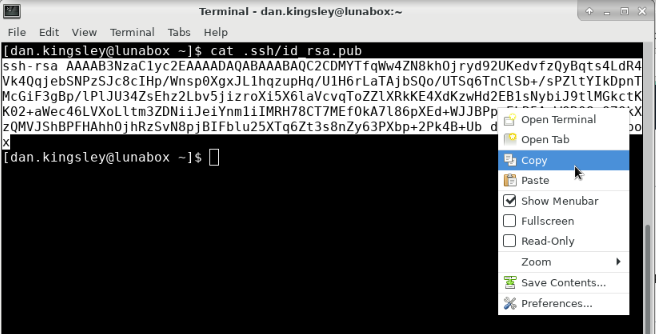

10.  Return to the OCI Web console and find the *Add SSH Keys* section.   Choose the radio button labeled **Paste SSH Keys** and then paste the key you copied in the last step into the form.  Right click with your mouse and choose the **Paste** command or you can use the CTL-V keyboard command.


11.  After you've successfully pasted the SSH key, you can now click on the **Create** button to create the instance.


The instance will begin provisioning.  You should see the instance details screen with the orange icon indicating it's provisioning status.   Wait a few moments.  When it's finished, the icon will turn green and enter the *running* state.


<!-- heres the old SSH key section that needs to be replaced

- In the **Add SSH Key** section, select **Choose SSH key file** if you know where your SSH Key file is stored on your system.  Or if you've saved or copied the key in a notepad or other utility, you can choose 'Paste SSH Keys' and paste the Public Key.  


If you haven't yet created your SSH Key and need guidance, click on the link below to view the SSH Key creation instructions for different system types like Windows, Linux, and MacOS.

[Create SSH Key Lab](http://www.oracle.com)

-->

Wait for Instance to enter the **Running** state.   Examine the information in the Instance Information screen.   Identify the assigned Fault Domain, Private and Public IP addresses, and other important information.   Click on the **View Usage Instructions** button in the instance details screen for further details on connecting to your instance via SSH.


## Part 4: Connect to the instance

1.  Examine the instance details screen.  Left click to drag and select the **Public IP Address** and right click or CTL-C to copy the IP address.  We'll need that to connect to the instance next.


2.  Return to the terminal window, or open a new one if you closed it earlier.   Type the following command to connect to the new instance via SSH.   This command uses the private SSH key we created earlier and is logging in as the default admin user, *opc*.

```ssh -i .ssh/id_rsa opc@<IP ADDRESS OF YOUR INSTANCE>```

Answer *yes* to the question about continuing your connection.    You should now be logged into your instance.


<!-- old connect section

Next we'll use a terminal to connect to our new instance using SSH.

12.  Open a terminal window and navigate to the folder where you've stored your private SSH key.

From the terminal window, use the ```cd``` command to navigate to the folder where the SSH keys are stored.  In this example they're in a folder called .ssh under the users/user-name subdirectory.  ```c:/Users/dkingsle/.ssh```  In Windows, the .ssh directory is not hidden.   In Linux and MacOS the .ssh directory is hidden but you can list it and cd to it.

```cd /C/Users/<your_username>/.ssh```

13. Verify that you're in the correct directory and your key exists.  Use the ls command to verify.  The key in this example is called id_rsa.pub.

14. Enter command 
```ssh -i id_rsa opc@<public IP address of instance>```


**HINT:** *If 'Permission denied error' is seen, ensure you are using '-i' in the ssh command.*

15. Enter 'Yes' when prompted for security message


16. Verify that the terminal prompt reflects the user name you're logged in as and the instance name.  ```opc``` @ ```instance name ```

-->

You have successfully created an instance and logged in via SSH.  Feel free to explore the instance environment and set up your personal preferences if you have time to explore.  In the next section we'll add external block storage to the instance for application data storage.

## Part 5: Create and mount block storage

1. From OCI services menu Click **Block Storage** and select **Block Volumes** from the flyout menu.


2. Click on the **Create Block Volume** button and fill out the form with the following information.

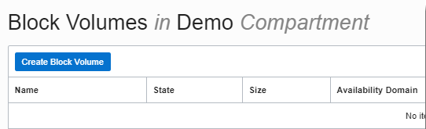

| **Field**                | **Recommended Information** |
| ------------------------ | ------------------------------------------------ |
| **Name:**   |  Name of your choice |
| **Create in Compartment:** | Select your compartment |
| **Availability Domain:** | Verify the availability domain location|
| **Size:**  | 50 GB|
| **Compartment for Backup Policies:** |  Select your compartment |
| **Backup Policy:** |  No selection is necessary|
| **Volume Performance:** | Leave as 'Balanced' but note that you can change this if you wish |
| **Encryption:** | Default to Oracle Managed Keys|


Click the **Create Block Volume** button. The volume icon will turn orange in color and enter the **Provisioning** state.   In a few moments it will turn green and enter the **Available** state.  It is now ready to use with your instance.

In the next step, we'll attach the block volume to the compute instance.  You can attach a block volume from the **Instance** section of the console or from the **Block Volume** section of the console.  We'll show you both.

3a. *Method 1:  Attach from the Block Volume menu.*  If you're still in the Block Volume information screen, click on **Attached Instances (0)** under the **Resources** section.  From OCI services menu Click **Instance** under Compute 

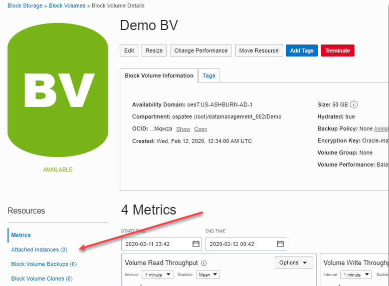

Click the **Attach to Instance** button and use the following information to fill out the resulting dialog box.

| **Field**                | **Recommended Information** |
| ------------------------ | ------------------------------------------------ |
| **Attachment Type:** | Paravirtualized |
| **Access Type:** | READ/WRITE |
| **Select Instance:** | Checked|
| **Choose Instance:** | Choose the instance you created earlier|
| **Device Name:** | Optional but you can choose the Linux device name if you wish|

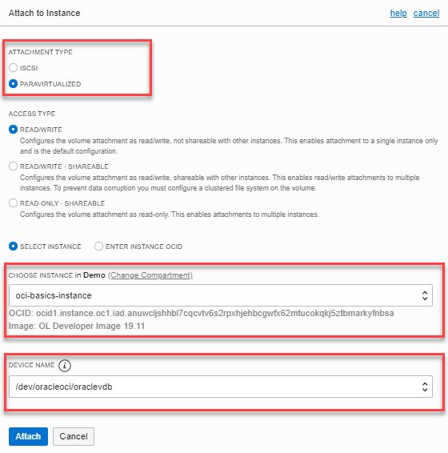

Click **Attach**  After a few moments, you will get a confirmation screen that your block volume is attached.  Note that from this screen, the heading says **Attached Instances**.  This is because we're viewing the block volume mount from the **Block Volume** section of the console.

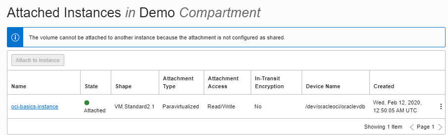

3b. *Method 2:  Attach from the Instance menu.*  Navigate to the Instance menu and locate the instance you created earlier.  Choose **Instance Details** and click on the **Attached Block Volumes (0)** item under the Resources section.   Click on the blue **Attach Block Volume Button**.


If you're attaching via the Instance dialog, it's the same resulting attachment form.  Use the information from step 3a above.

Once the volume has attached, the volume icon will turn green and you will see the details of your mounted block volume.  Note that from this view the heading says **Attached Block Volumes**


**Note:** *For this example we've chosen paravirtualized attach because it's fast and simple.  A paravirtualized attachment is a technique where the guest OS utilizes the hypervisor API to access remote storage directly as if it were a local device.  It's fast and simple to mount storage.  There may be a performance hit using paravirtualized block volumes so you may also want to be familiar with mounting storage directly via iSCSI.  See the OCI documentation for instructions on mounting storage to instances via iSCSI.*  

From either section of the console, Instance or Block Volume, you should now have confirmation that the block volume has been attached to the instance.  In the next step, we'll switch back to the SSH session, verify that the block volume is attached, install software, and configure our application on the newly created storage.  

4. Return to the terminal window.  Login to the instance again, if necessary.

5.  As the opc user issue the ```lsblk``` command to verify the paravirtualized block volume has mounted and confirm the device path.  In this case, we used the console to choose /dev/sdb and sized it to 50GB so we can verify the device has been mounted.


6.  Format the volume for use by the operating system

```sudo fdisk /dev/sdb -l```


7.  Create a filesystem on the volume using the ext4 filesystem and naming the volume 'data'.   We are using the entire disk so enter *Y* at the prompt for a single partition.

```sudo mkfs.ext4 -L data /dev/sdb```


8. Create a mount point. mount the block volume, and verify that it's mounted to the system.

```sudo mkdir -p /mnt/www/html```

```sudo mount /dev/sdb /mnt/www/html```

```lsblk```


## Part 6: Install and configure a web application

 In the following section we'll install the Apache web server and configure it for use with our simple application.
 
 1.  Install the httpd server, Enter the following command:

```sudo yum install httpd -y```


2. Open port 80 on the instance firewall to allow http traffic.  

```sudo firewall-cmd --permanent --add-port=80/tcp```
```sudo firewall-cmd --reload```


Start up the web service and install a simple html application.

3. Start the httpd service.  Enter the following command in the terminal.   (Note: There's no output for this command.)

```sudo systemctl start httpd```

4. Download a pre-built application and install it.    Run the following command from the *opc* users home directory.

```wget https://github.com/snafuz/oci-quickstart-lab/archive/master.zip```


5. Unzip the file into the *opc* users home directory.   And copy the web application structure into the web servers document root.

```unzip master.zip```
```sudo cp -R oci-quickstart-lab-master/static/* /mnt/www/html/```


6. Next you will need to modify the server configuration file (httpd.conf) with the application location.    Use *vi* or your favorite Linux text editor and modify /etc/httpd/conf/httpd.conf.     You will be replacing the default folder */var/www/html* with a new folder on the block volume we mounted, */mnt/www/html*.   **Note:**  *A good idea would be to make a copy of the configuration file with a .bak extension in case you make any mistakes or accidentally corrupt the file.*

Launch *vi*, from the a terminal window.  Or you can use *gedit* from the demo client desktop to complete the next steps.  The examples will be using vi.

```sudo vi /etc/httpd/conf/httpd.conf```

7. Search for the string */var/www* and replace it with */mnt/www/html*. You'll make three (3) replacements and one is a comment, you don't need to edit the comment if you don't want to. 


Be sure to save your changes.   (Hint:  In *vi* its ```:wq!```)

8.  Change the security context of the application subdirectory. And then restart the httpd server.   Enter the following commands:

```sudo chcon -R --type=httpd_sys_rw_content_t /mnt```

```sudo systemctl restart httpd```


9. Launch a web browser from your local system, enter http:// and your compute instance's public IP in the URI field.

```http://<COMPUTE_INSTANCE_PUBLIC_IP>```

You should see the simple http application form in your browser.  


**Congratulations!  Your application is up and running on OCI!**

So far you have created a cloud network, launched and instance, created and attached block storage, configured a web server, and created a simple application.   In the next section you will launch a new compute instance with the boot and block volume that you created for the first instance, thus retaining all the configuration work you've done.

## Part 7: Re-use the boot and block volumes for a new instance.

In this section we're going to detach the block volume and stop the compute instance we launched.  We'll then use the existing boot volume to launch a second compute instance, then we'll attach the block storage.

1. SSH to the instance and unmount the block volume.  Enter the following command, adding the device path from your instance.

```sudo umount /dev/<VOLUME_NAME>```


2. Open the OCI console window, navigate to the compute instance information page and click on the **Attached Block Volumes(1)** Resources item. Click the ellipsis to the right and select **Detach** from the brief menu.   Click OK when prompted for 'Are you sure ...'


Wait for the block volume to completely detach.

3. While still in the instance information screen, stop the compute instance by clicking the **Stop** button.   


Click **OK** to confirm your choice. 

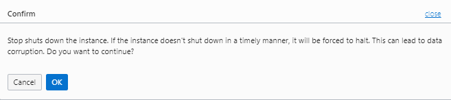

4. The instance will initially enter the **Stopping** state.  Once it enters the **Stopped** state, select **Boot Volume** from the Resources section, click on the ellipsis (action menu) and select **Detach**.  Click **OK** to confirm your selection.


5. Once the Boot volume is detached, we will terminate this compute instance.  Click **Terminate** to terminate the instance.


In the confirmation dialog box, **DO NOT** check the box for "Permanently delete the attached Boot Volume".


6. Once the instance is terminated, scroll down to the Boot Volume section showing the *detached* boot volume and click the action menu ellipsis.  Choose **View Boot Volume Details**.

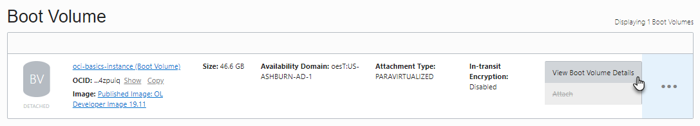

7. In the Boot Volume Details window click the **Create Instance** button towards the top and use the following information to create a new compute instance.


| **Field**                | **Recommended Information** |
| ------------------------ | ------------------------------------------------ |
|**Name your instance:** |Enter a name |
|**Choose an operating system or image source:** |Defaults to **Boot Volume**|
|**Availability Domain:**| Select availability domain |
|**Instance Type:**|Select Virtual Machine |
|**Instance Shape:**| VM.Standard2.1|
|**Virtual cloud network compartment:**| Select your compartment |
|**Virtual cloud network:**| Choose VCN created earlier|
|**Subnet Compartment:** |Choose your compartment. 
|**Subnet:** |Choose the **Public** Subnet |
|**Use network security groups to control traffic:**|Leave un-checked |
|**Assign a public IP address:** |Check this option |
|**Add SSH Keys:** |Choose the key file or paste the contents of your public SSH Key|

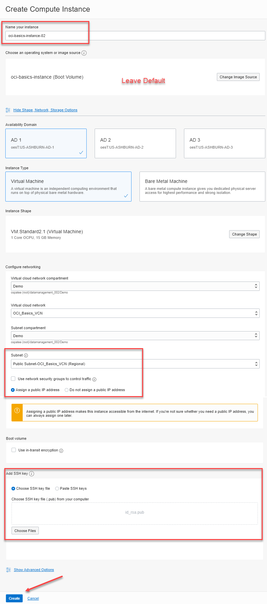

8. Click **Create**.

9. Once the instance is in the Running state, use the **Attached Block Volumes** dialog in the Resources section to attach the block volume to this new instance.  Choose **Paravirtualized** attach and choose the **Block Volume** from the drop down.  Choose the device path.


10. Once the volume has finished attaching, SSH to the new compute instance and mount the block volume as before.  Confirm adding the SSH key to the known hosts file, and enter the following commands to mount the block volume and restart the web server.   Enter the following commands:

```lsblk```
```sudo mount  /dev/sdb  /mnt/www/html```
```sudo systemctl restart httpd```

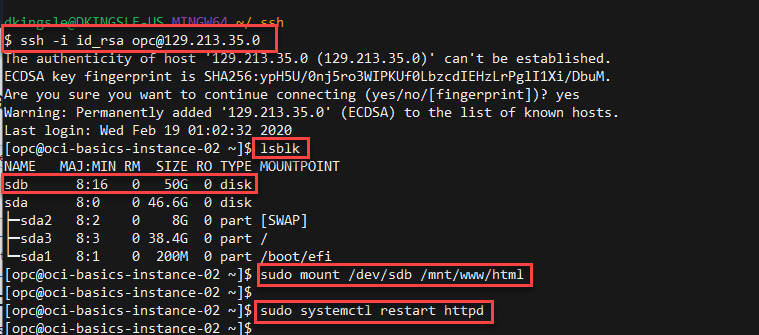

12. Launch a web browser and enter compute instance's public IP address in the URI locator.  The IP address below is just for example.

**http://129.213.35.0**


You should see the simple form for the web application.    You have successfully re-used the boot and block volume that were attached to another instance with all the data preserved.   This example might apply if a customer wanted to use change compute shapes, create a golden image, or easily change networking parameters for a system.

In the next section you will permanently delete the resources you created in order to avoid unnecessary charges.

## Part 8: Delete the resources (Optional)

In this section you will delete all the resources that you created earlier.  You'll need to remove the compute instance and it's boot volume, the block volume, then the network resources that were created.

1. Open the OCI console window and use the hamburger menu to navigate to **Compute** then fly out to **Instances**.  From the instances page, choose your compartment and locate the instance you created earlier.   Click on the ellipsis action menu and choose **Terminate**.


2. In the confirmation dialog, check the box to *Permanently delete the attached boot volume*.   You will not need to save it.  Click Terminate and wait  few moments.   The icon will turn grey and will indicate the instance has been terminated.   


6. From the OCI Services hamburger menu navigate to **Block Storage** and choose **Block Volumes**.     Confirm that you're in the correct compartment and locate the block volume you created earlier for this lab.   Click on the ellipsis on the far right and choose **Terminate** to remove the block volume.   Click **Terminate** in the confirmation box.


7. From OCI services hamburger menu choose **Networking** then **Virtual Cloud Networks**.   Ensure you are in the correct compartment.   Click on the ellipsis to the far right of your VCN and choose **Terminate**


8.  The *Terminate Virtual Cloud Network* dialog will appear and provide an inventory of network services that will be deleted.  Review and click on **Terminate All** to delete the VCN.

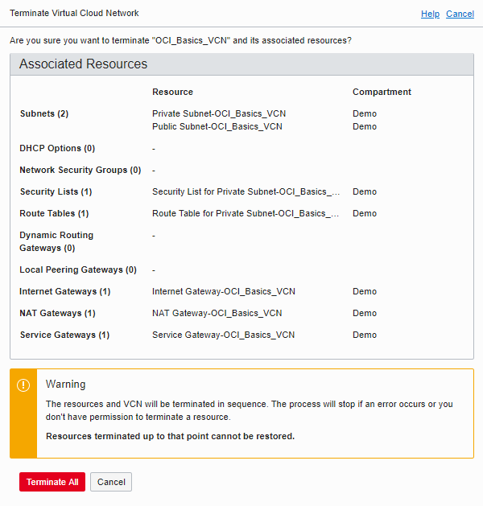

9.  And finally, you should receive confirmation that your VCN was terminated properly.   


**Note:** *If you have created any services outside of this lab, you may get an error that OCI cannot delete the VCN because of service dependencies.   If you receive this type of error, follow the instructions and find the dependent resources and delete them.  Then follow the steps to delete the VCN*

**Congratulations!** You have completed the OCI Basics lab.   You have created a cloud compute instance and a cloud network.  You've attached block storage, installed a simple http application, and migrated boot and block storage to a new instance.  Then you deleted and cleaned up the resources that you created.
