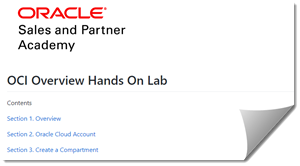
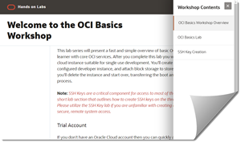
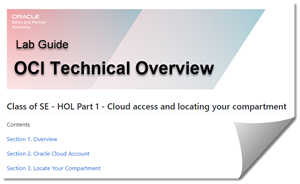
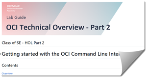
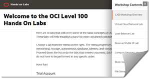
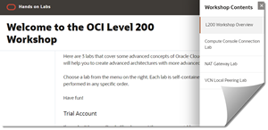

# OSPA - OCI Hands On Lab Repository

Click on an image or link below for hands on labs covering the basics of Oracle Cloud Infrastructure.  

****
[OCI Overview Lab](https://github.com/oracle/learning-library/blob/master/ospa-library/oci/oci-overview/OCI_Overview_HOL.md)

- A complete OCI overview.  You'll create a VCN, compute instance, block storage, and then install a Docker container.

[OCI Basics Workshop](https://oracle.github.io/learning-library/ospa-library/oci/OCI-Basics-Workshop/)

 - Similar to the above workshop but in this lab we use the Oracle Developer instance instead of Docker.  Create block storage, then un-mount the storage and mount it on a different instance.   This workshop also includes a section on how to create and use SSH keys for the major desktop platforms.

[Class Of SE - HOL 1 for Technical Training](https://github.com/oracle/learning-library/tree/master/ospa-library/oci/Class-Of-HOL-01)

- Lab for specific Class of SE Event.  4 section introductory hands on lab to accompany lecture.

[Class Of SE - HOL 2 for Technical Training](https://github.com/oracle/learning-library/tree/master/ospa-library/oci/Class-Of-HOL-02)

- Lab #2 for specific Class of SE Event.  OCI CLI practice exercise.

[OCI L100 Workshop](https://oracle.github.io/learning-library/ospa-library/oci/L100-Workshop/)
- Current OCI L100 Workshop in easy to use web format.

[OCI L200 Workshop](https://oracle.github.io/learning-library/ospa-library/oci/L200-Workshop/)
- Current OCI L200 Workshop in easy to use web format.

****
### Trial Account
If you don't have an Oracle Cloud account then you can quickly and easily sign up for a free trial account that provides:
- $300 of free credits good for up to 3500 hours of Oracle Cloud usage
- Credits can be used on all eligible Cloud Platform and Infrastructure services for the next 30 days
- Your credit card will only be used for verification purposes and will not be charged unless you 'Upgrade to Paid' in My Services
  
[Click here to request your trial account:](https://cloud.oracle.com/tryit)