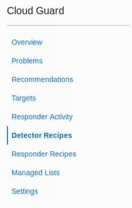
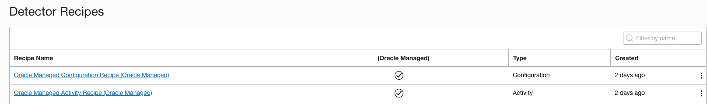
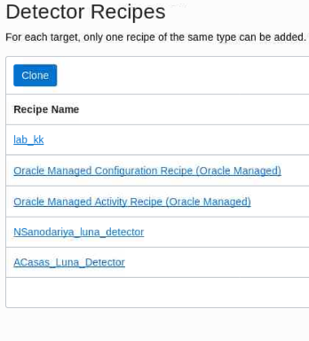
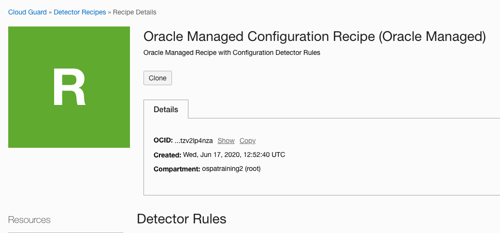
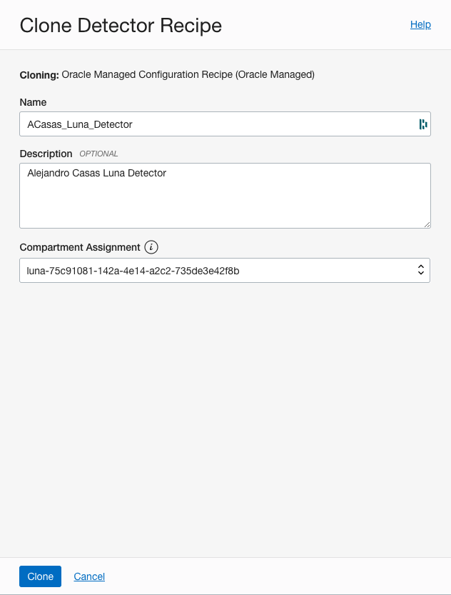
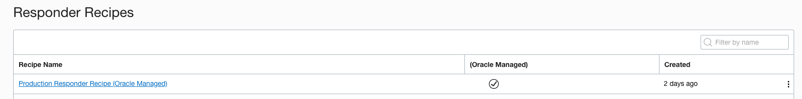
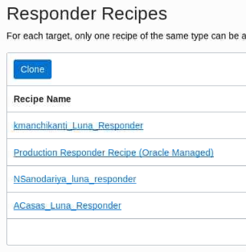
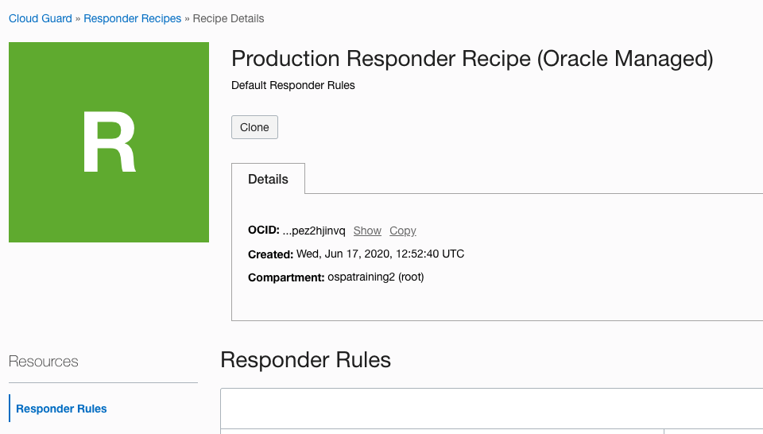
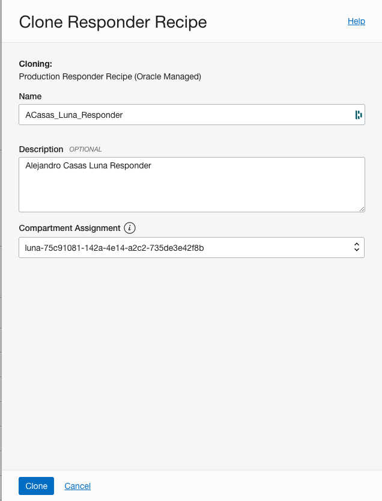

# Lab 2: Dectectors and Responders

## STEP 1: Tailoring Detectors

1. We will need the compartment name that you will be using as part of this lab. You can use your **root** compartment or create a new one for this lab purposes. For further information on how to create a compartment, please refer to [Creating an Oracle Cloud Infrastructure Compartment
](https://docs.oracle.com/en/cloud/paas/integration-cloud/oracle-integration-oci/creating-cloud-storage-compartment.html)

2. Now, You will create your own detector recipe. Make sure that you are at the root compartment and click **Detector Recipes** on the left menu.

    
   
3. Click on the **Oracle Managed Configuration Recipe(Oracle Managed)**
   

4. Click **Clone**

   
   
   
5. Provide a **Name** to the new detector recipe, a **Description**, make sure that you select the compartment required in **step 1**, and click **Clone**. We recommend the following name convention for your detector:

    ***[First Leter of your name and your last name]+_livelabs*** 
    
    

## STEP 2: Tailoring Responders

1. Now, You will create your own responder recipe. Make sure that you are at the root compartment and select **Responder Recipes**.
   
2. Click on the **Production Responder Recipe (Oracle Managed)**
   

3. Click **Clone**

   

   

4.  Provide a **Name** to the new responder recipe, a **Description**, make sure that you select the compartment required in **step 1**, and click **Clone**. We recommend the following name convention for your responder:

    ***[First Leter of your name and your last name]+_livelabs*** 

     

******

**What you have done**

You have tailored your first Detector and Responder based on Oracle Cloud Guard Managed recipes.

******