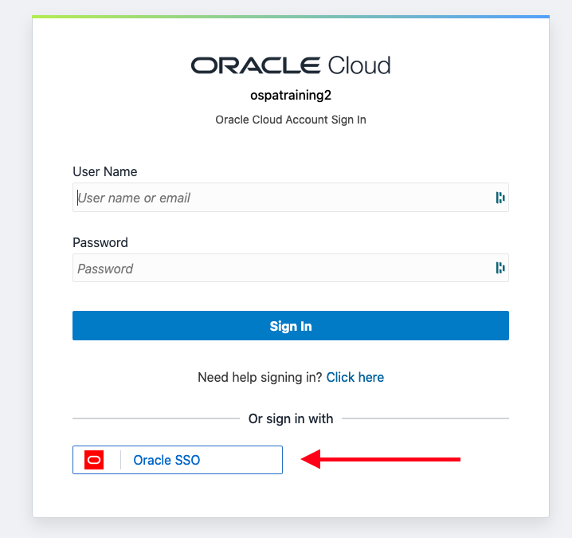
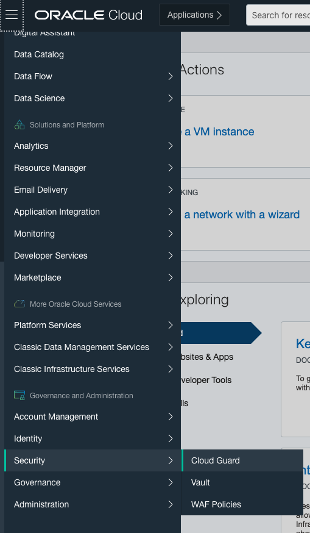
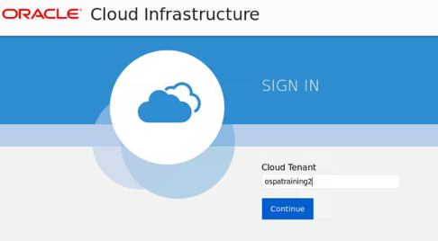
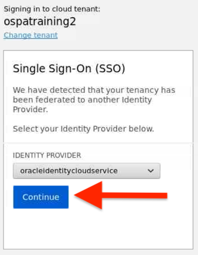
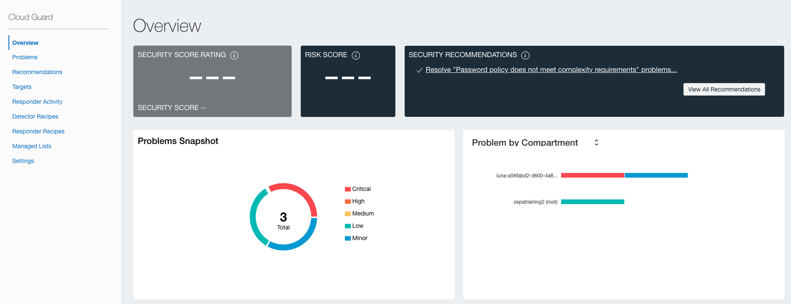
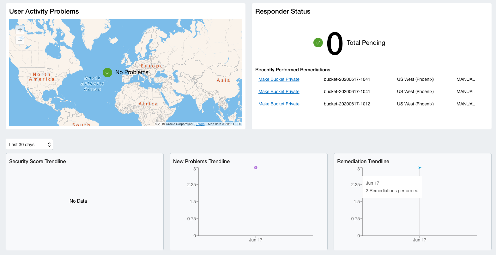

# Lab 1: Accessing Cloud Guard

## STEP 1: Login to Cloud Guard

1. Use your credentials to login to the OCI console. *Note: Contact your tenant administrator for further reference on whether you must use standard OCI credentials or SSO.*

2. Open the general menu located at the left-hand side of the screen, click on **Security** and select **Cloud Guard**. Keep in mind that every resource created as part of this lab, must remain within the same reporting region.
   
   

3. During a region swap, you might need to re-enter the your tenant information. Click **Continue** to use your SSO to login to the console.

    

    

4. This is Oracle Cloud Guard dashboard. Here you will be able to identify threats and activities affecting your entire tenant or specific comparments. The Security Specialist can review deviations and take actions accordingly.

    

5. If you scroll down, you will be able to see the reponder status and whether you have any pending action.

     

******

**What you have done**

You have accessed Oracle Cloud Guard console and navigate its main dashboard.

******