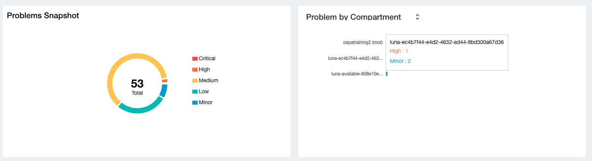
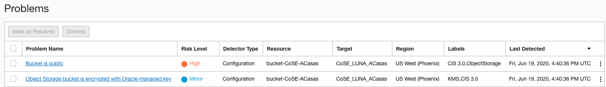
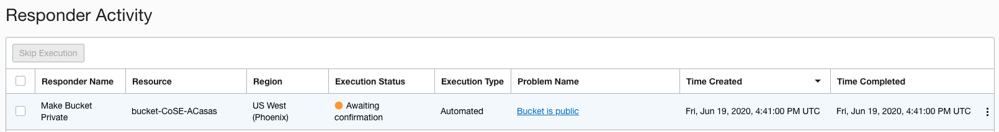
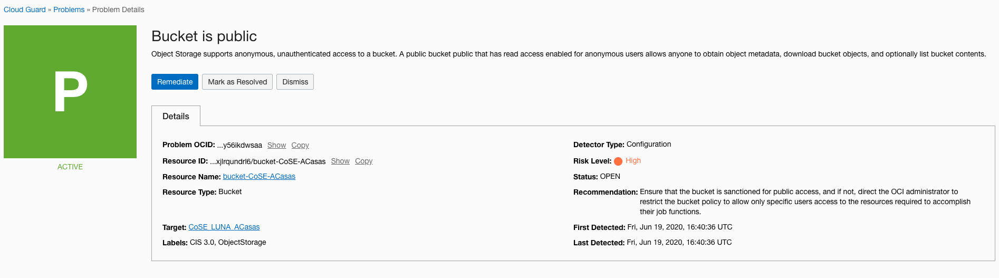
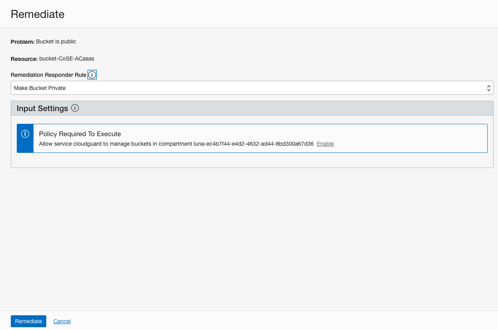
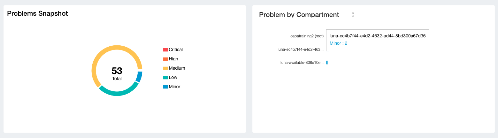
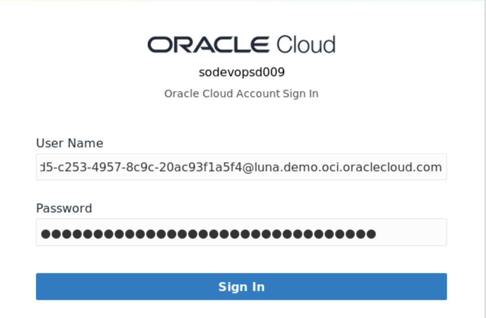
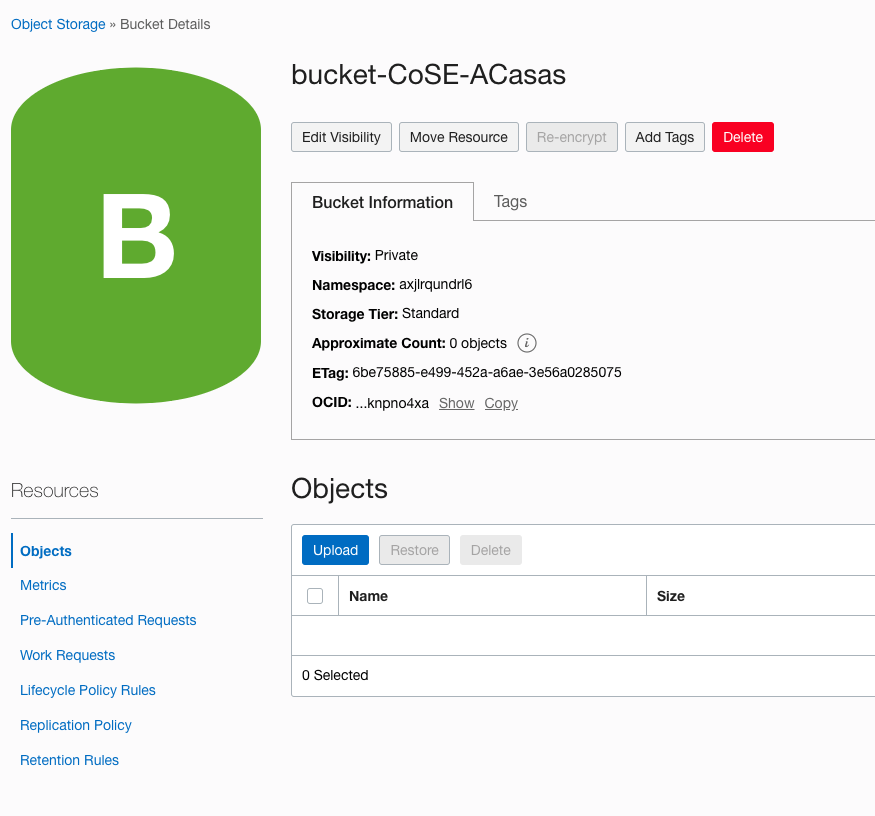

# Lab 5: Remediation Actions

## STEP 1: Executing remediation actions

1. Login back to **Cloud Guard** Console using your credentials. Open the general menu located at the left-hand side of the screen, click on **Security** and select **Cloud Guard**. 
   
    

2. In the main dashboard you will see your environment status and current activities to be remediated. Considering that we have recently created a bucket, seeing the update in the console can take up to 10 minutes.

    

3. After a few minutes you will see the new alerts being reported. As you can see we can identify the issue rised by the setting in our bucket. You can click on **Problems** on the left-hand side of the screen to further investigate the issue.

    

4. As you can see, our Bucket public alert is listed as **High** risk level and not as **Critical** as configured by default on the Oracle Managed Detector list. 

    

5. Let's dig into the issue. Click on **Responder Activity** on the left-hand side of the screen. We can easily identify the issue, the resource and the execution status and type. Click on the problem name **Bucket is Public** link.

    

6. On this page we can see the details about the issue, risk level, status, resource and recommendations. As a Security Analyst you can mark this issue as resolved if you have manually remediated this tasks, or dismiss it if you consider this is a false postive. However; we know that this is a critical exposure, so let's fix it. Click on **Remediate** This will trigger an action and will restore the bucket to private. 

    

7. Review the actions and click **Remediate**

    

8. Finally, back to the **Cloud Guard** dashboard you will see that the action is now gone as remediated.

    

## STEP 2: Verifying remediation actions

1. Open the OCI console. Make sure that you are logged into the same reporting region and where you have created the sanctioned resource.

    

2. Open the general menu located at the left-hand side of the screen, click on **Object Storage** and select **Object Storage**
   
   

3. Open the bucket that you have created, verify if the bucket is listed as **Private** now.

    

******

**What you have done**

**Oracle Cloud Guard** is a unified security solution that provides a global and centralized approach to the protection of all of a customers’ assets.
As part of this lab you have navigated Cloud Guard console, tailored detectors and responders, enrolled new targets, identified deviations, and executed remediation actions. 

******
 