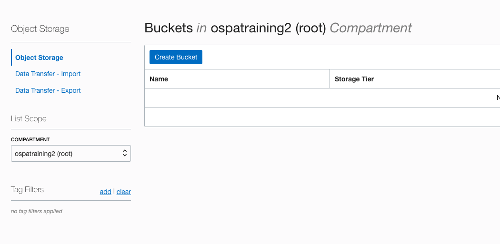
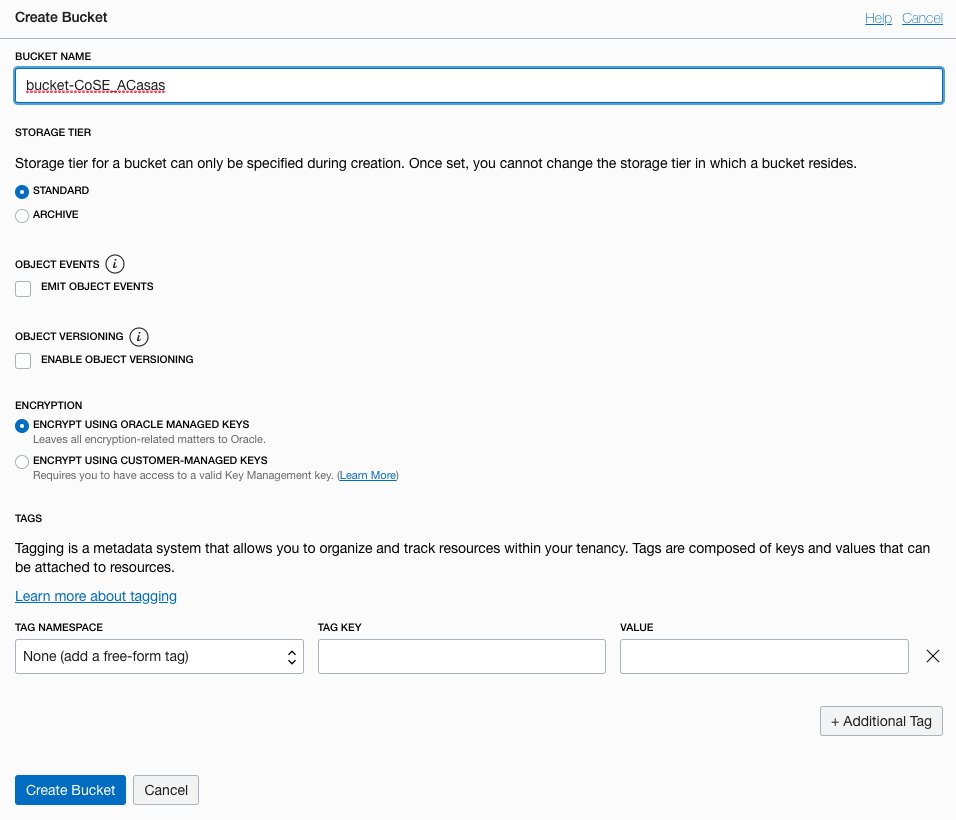
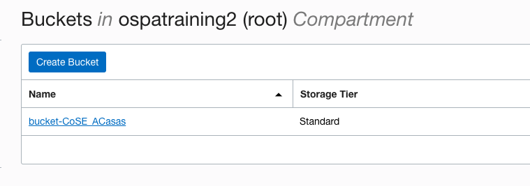
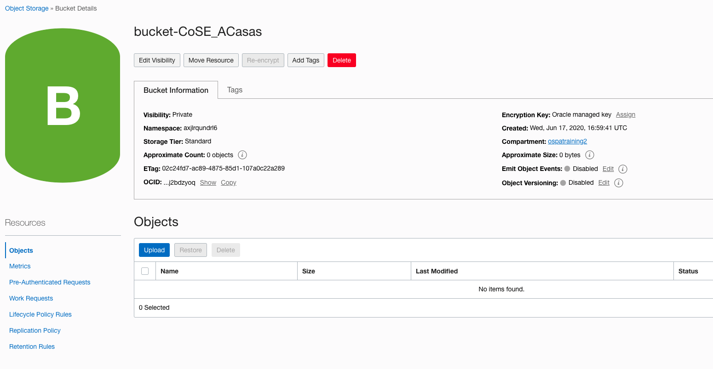
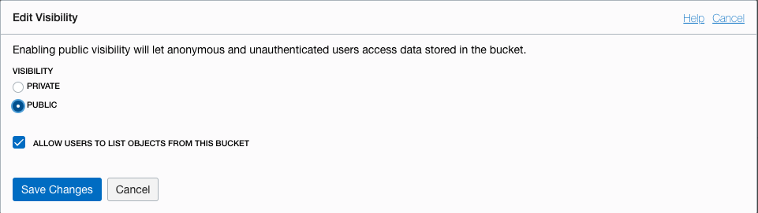
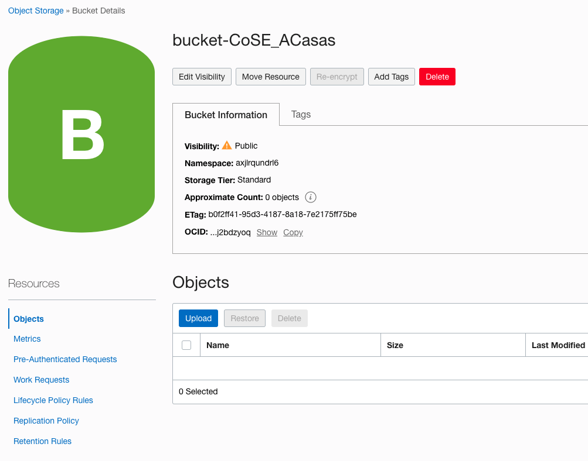

# Lab 4: Creating a sanctioned resource

## STEP 1: Adding a new resource

1. Log in to OCI with your credentials.

    

2. Make sure your are working on the same reporting region where you have enabled Cloud Guard. Open the general menu located at the left-hand side of the screen, click on **Object Storage** and select **Object Storage**
   
   

3. Select the compartment that you have defined as part of Lab 2 - step 1, and click **Create bucket**. 
   
   

4. Enter a Bucket name and click **Creat Bucket**. For tracking purposes we recomend the following name convention:
   
    * bucket-CoSE-YourInitials 
  
    

5. Back on the buckets list, click on the bucket recently created
   
    

6. Review the information, and click on **Edit Visibility**
      
    

7.  Change the visility to **PUBLIC** and click **Save Changes**
    
    

8.  Now the bucket is publicly exposed. Don't worry, we will remediate this issue within the next minutes.

    

******

**What you have done**

You have created a public bucket in a compartment being monitored by Cloud Guard.

******