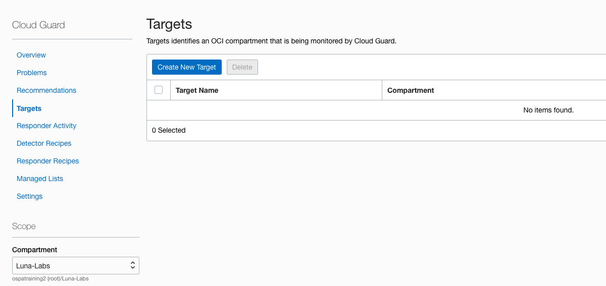
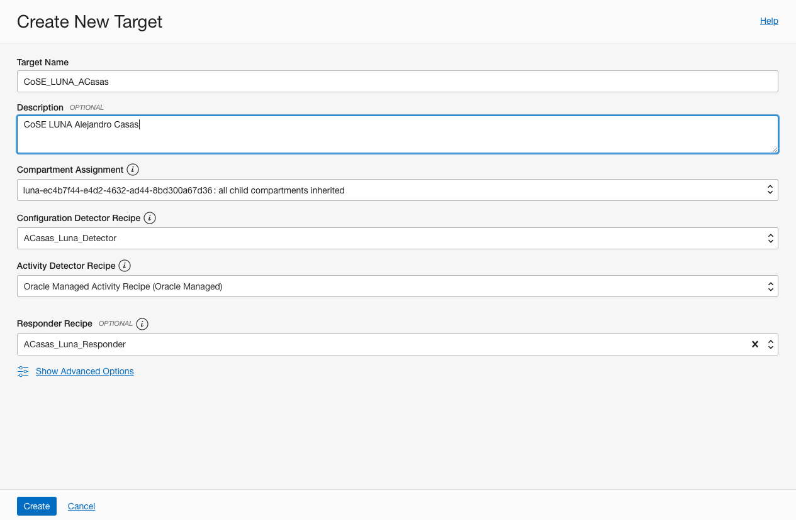
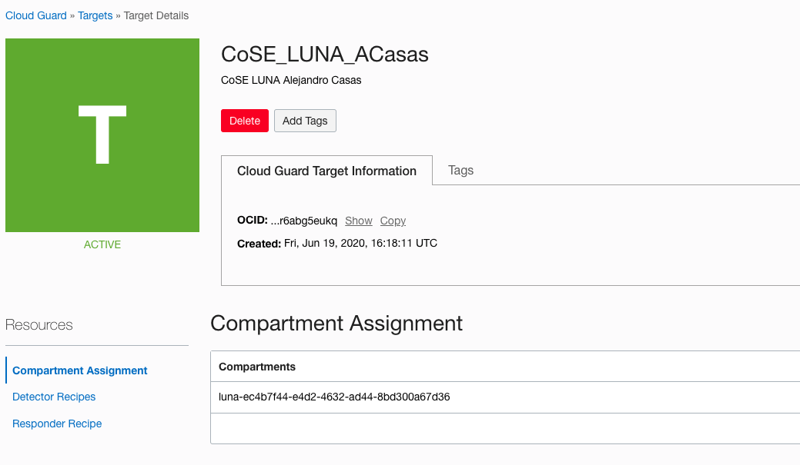

# Lab 3: Registering a new target

## STEP 1: Managing targets

1.  Login to Cloud Guard using your Credentials. You can use the following URL instead (https://console.us-phoenix-1.oraclecloud.com/cloud-guard/overview) to access the console directly.
   
2.  Select **Targets** and click on **Create New Target**
   
    

3. Provide a **Target Name**, a Description, select your Luna Compartment *(Please refer to the previous steps on how to get your compartment information)*, Select the **Configuration Detector Recipe** created in the previous steps, Select the default **Activity Detector Recipe**, and finaly select the **Responder Recipe** created in the previous steps ass well. Click **Create**
We recommend the following name convention for your responder:
 ***livelabs_[First Leter of your name and your last name]***

    

1. After the target is created you will be redirected to your target information. You can explore the settings. Once done, click the **Cloud Guard** Hyperlink located at the top left hand-side of the screen to get back to the main dashboard.
    

******

**What you have done**

You have accessed register a new target to be monitored by Cloud Guard.

******