# Securing your databases with Data Safe


## STEP 1: Register databases with Data Safe

1. Use your SSO credentials to login to the OCI console.


2. From the menu in the upper left corner of the page select **Autonomous Transaction Processing**.

	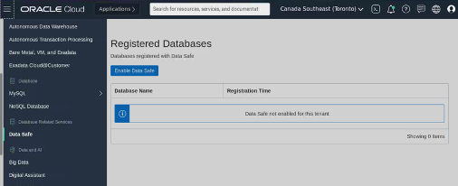

3. This will put you in the main Autonomous Database Landing page. Any Autonomous database you create will get listed here. 
Set the compartment to the one that you will use as part of this lab (*Note: We recommend create a new compartment for the purpose of this lab*).

	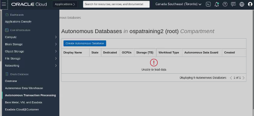

4. Select the database by the **Display Name** of the database you want to register. If no database exists, you can **Create Autonomous Database** or double check the Compartment to make sure you are in the right place for your databases.
   
   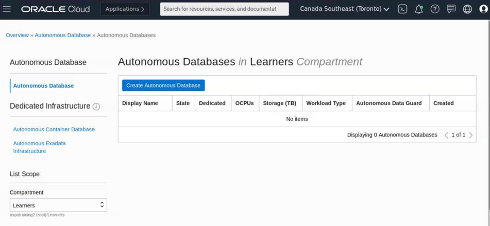

5. Fill out the required information and select **Transaction Processing**, click **Create Autonomous Database**
   
   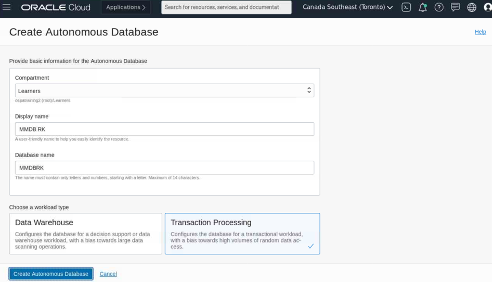

6. You will see the status as provisioning. Might take a few minutes until you see the status change to avaialble.

   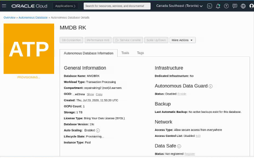

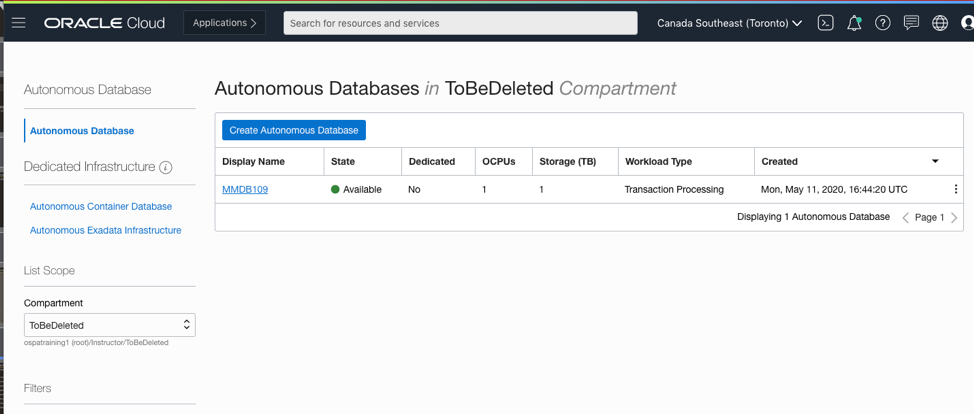

7. Bottom right hand corner of the database information, you will see **Data Safe. Status** will be **Not registered**.

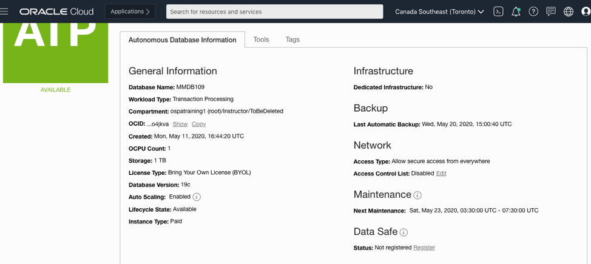

8. Click **Register**. And then **Confirm**. 
   
   ***NOTE: This process might take up to 10 min, time to grab a coffee.***

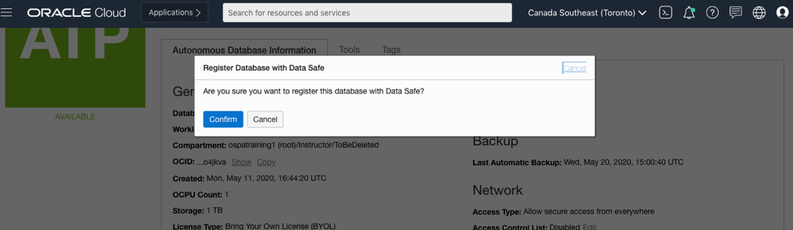

9. After registration is complete you will be able to **View Console** or **Deregister** the database. Right now we want to **View Console**. 

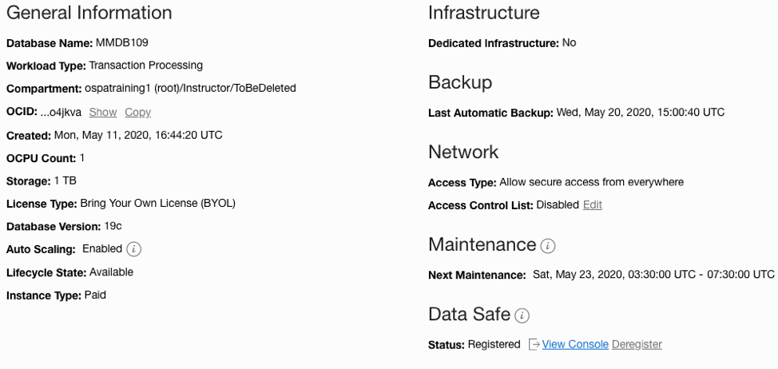

10. If you receive a login prompt, click on **Continue** under **Single Sign-On (SSO)** 

	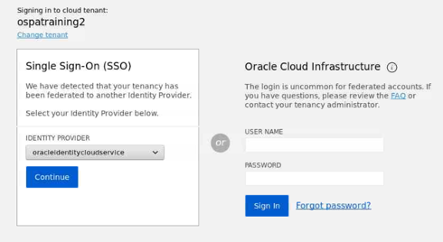

11. There is not going to be much data to view yet for a newly created and registered database.

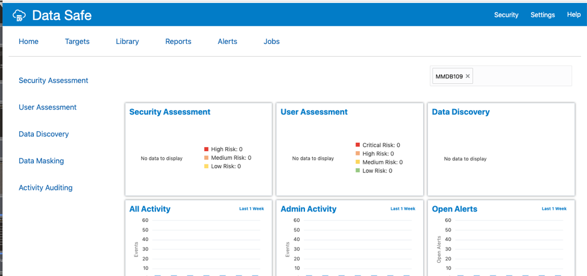

12. Select **Targets** Tab and you should see your database you registered under **Target Name**.

	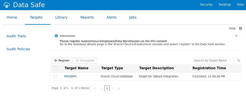

**You have successfully enabled Data Safe for your environment and registered an Autonomous Database. Now we can look to perform database security assessment and look at the audit logs with Data Safe.**

*****

## STEP 2: Database Audit Trail in Data Safe

1. Use your SSO credentials to login to the OCI console.


2. Once in your Tenancy from the menu in the upper left corner of the page select Data Safe.


3. Select the **Target** you had just registered in order to view the settings for auditing and collection. This is important to make sure to stay in the required limits for the free Data Safe options. Enterprises might have different requirement for audit log retention and sizes allowed. ***You don't need to make any change in the global settings panel.***

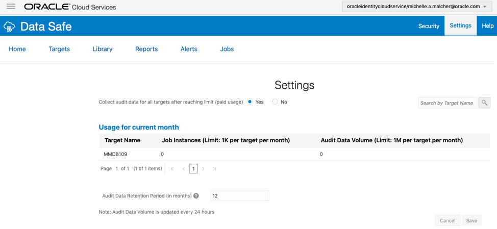

4. Select **Targets** again, and click **Audit Trails** from the side menu. There are no targets yet selected until they are added. Click **Add**.

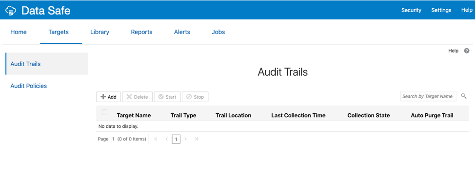

5. In the **Add trail** window run the following settings. This will allow the audit records to be collected for the target database with the selected retention period.
   
   * **Trail Type** as Table 
   * Select the database that you have registered as **Target** 
   * Check the **UNIFIED_AUDIT_TRAIL** box 
   * Turn **ON** **Auto Purge Trail** 
   * Set **Collect Audit Data From** with the starting date you want to go back in time to start collecting data. For this lab purposes select your current date
   * Click **Register**. 

   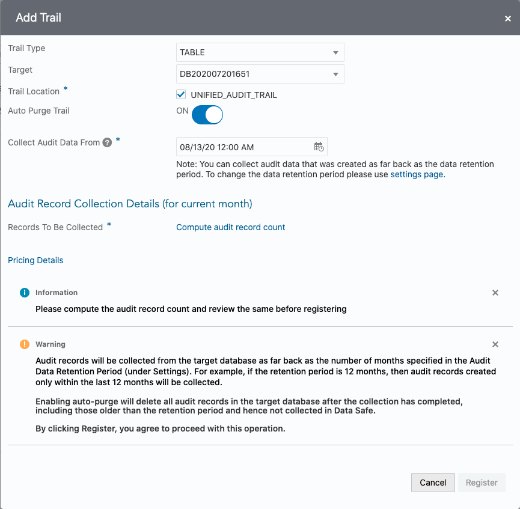

6. Audit Trails will be listed and status will be collecting. Now on the home page of Data Safe, additional monitoring and audit logs will be seen.

   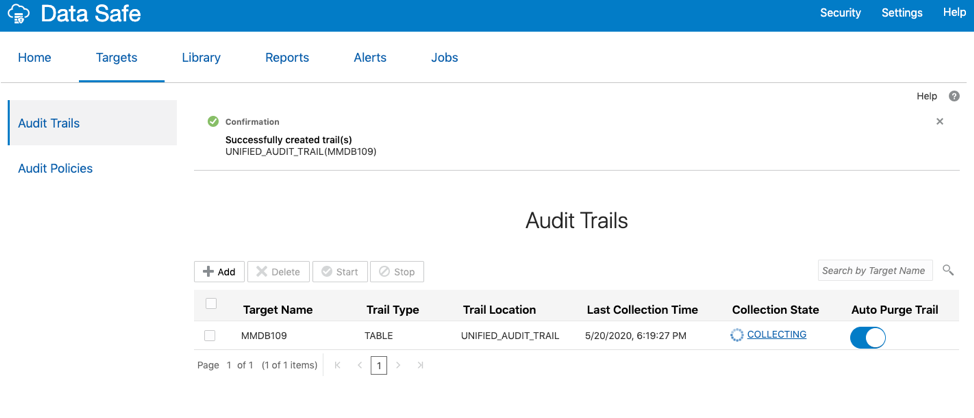

   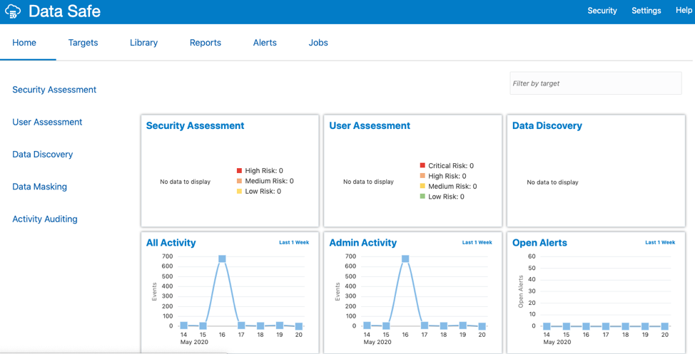

Now, let's move to the database security assessments.

*****

## STEP 3: Database security assessment with Data Safe

1. Under Data Safe menu there is an option for **Security Assessment**. The target should be selected and then click **Assess Now**.

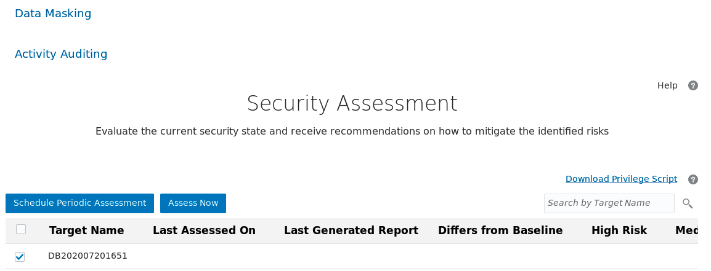

When the assessment is completed, you can view the report and set as **Baseline** report especially if this is the first report created. This will allow for any configuration drift.

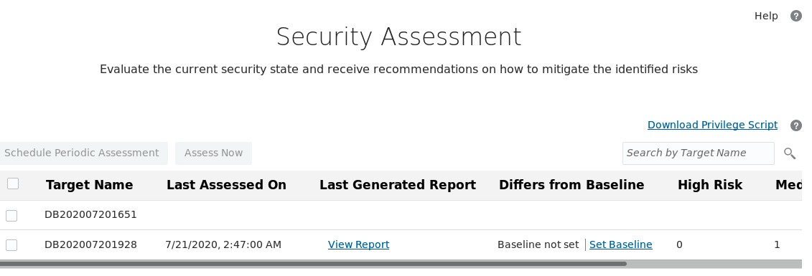

2. A report can be generated for **User Assessment** too. 

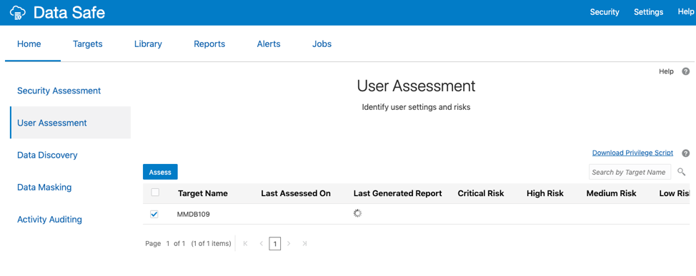

There are steps for generating reports for the targets and configuration of the policies and audit trails. 

3. Select **Activity Auditing** will walk through the steps for this.

4. Click on **Activity Auditing** on the side menu.

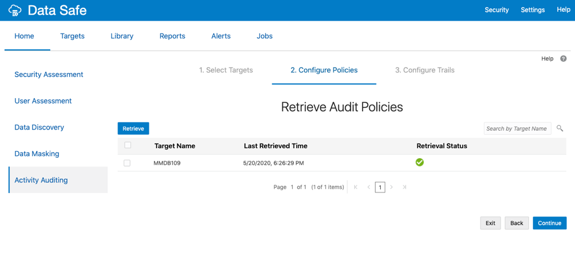

5. Select your target and click **Continue**. Then **Yes** on the warning message.

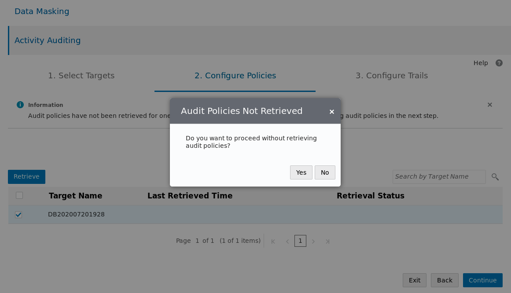


6. Click **Continue** and finally click **Done**.

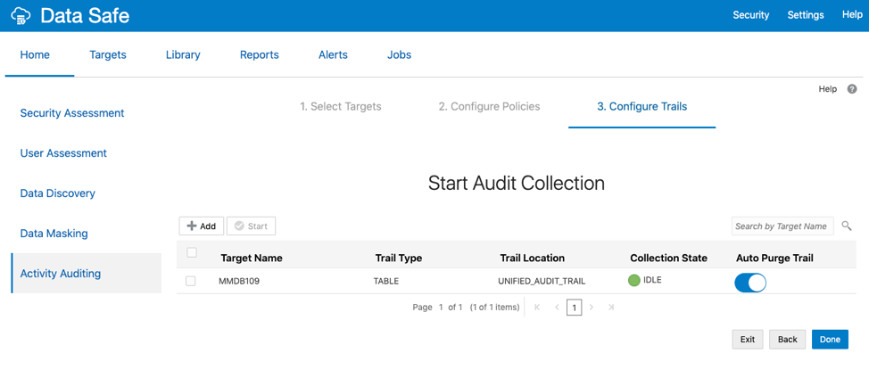

7. Click the **Home** tab. The Data Safe Dashboard will start to fill in with different users and activity. 

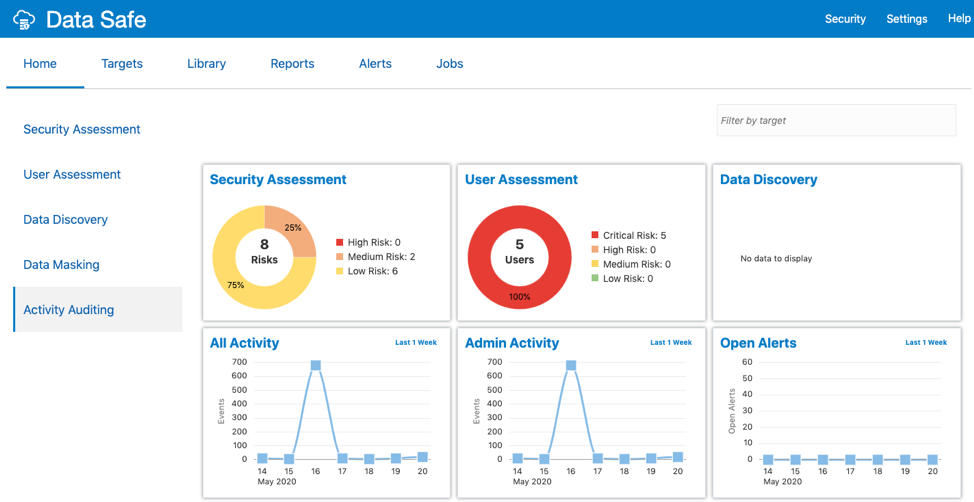


8. Now the **Comprehensive Security Assessment** report should be available. In the remainder of the lab, you can explore the different views and information that  have been generated.

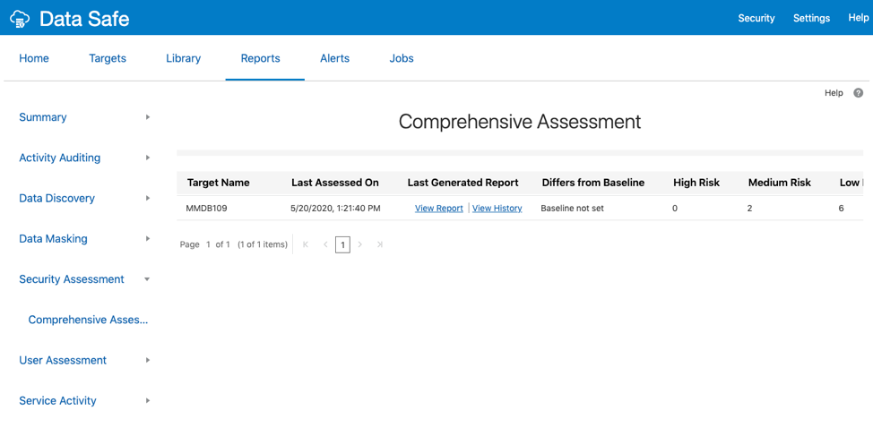

9. Select **Reports** from the top menu and scroll down to the **Comprehensive Assessment** and click on it. 
    
10.  Select **View Report**. You will be able to see the High, Medium and Low Risk. 

*NOTE:Since this is ATP there shoud not be too many risks especially not high risks.*

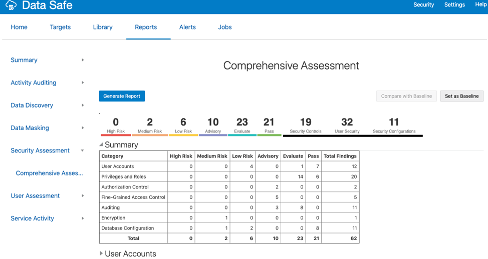

11.  Select **Medium Risk**. It should concern about unencrypted tablespaces.

12.  Also notice there are GDPR and STIG as standards and security baselines where the findings are mapped back to as **References**.

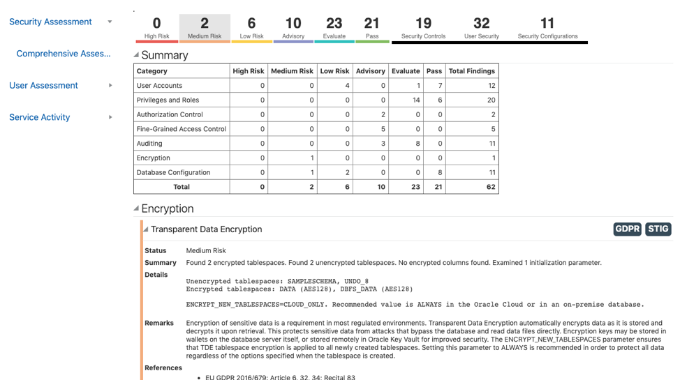

13.  Select **Advisory** from the top report menu. It will lists options that can be applied to the database. In this case, security features like Database Vault could be enabled for additional database protection. These references are there for compliance and to help your organization to improve their security posture.


Reports can be explored for additional information and baselines should be set to compare against configuration drift.


## STEP 4: Enabling Data Masking in your Data Base

In this section you will be enabling Data Masking in your data base.

1. Use your SSO credentials to login to the OCI console.


2. From the menu in the upper left corner of the page select Autonomous Transaction Processing.

3. This will put you in the main Autonomous Database Landing page. Any Autonomous database you create will get listed here. 
Set your Compartment to **Learners**. You might not see the databases you created or you will get error messages trying to create objects in compartments you don't have privileges on.

4. Select the database by the **Display Name** of the database you want to register. If no database exists, you can **Create Autonomous Database** or double check the Compartment to make sure you are in the right place for your databases.

5. Select the **Tools** tab and click on  **Open SQL Developer Web** to be able to edit the groups for Data Safe user to perform data masking tasks. Use the admin and its password that you set when you created the Autonomous Database.

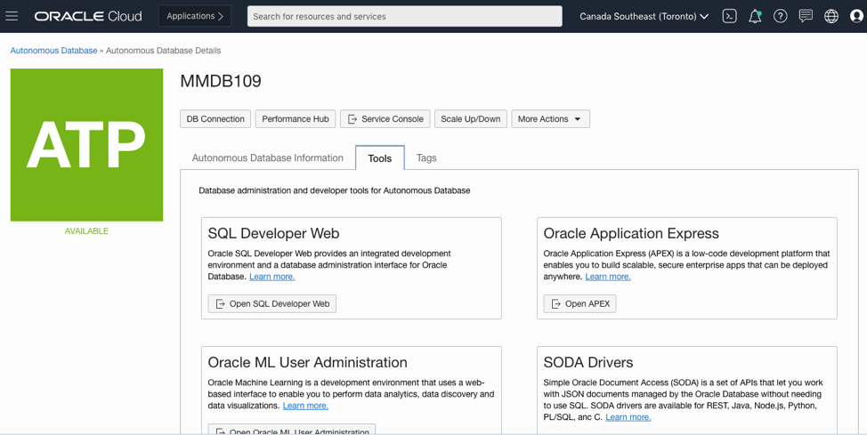

6. Run a query to view the permissions of the **DS\$ADMIN**. By default **DS\$ADMIN** has **DS#AUDIT_COLLECTION_ROLE** and **DS\$ASSESSMENT_ROLE** which allows for access for database security assessments and auditing of the databases registered. Again the user is following least privilege so additional roles will need to be granted to perform data discovery and masking.
```
		SELECT * from DBA_ROLE_PRIVS
		WHERE grantee = 'DS$ADMIN'
```

7. Run the following statement to grant the roles needed to DS\$ADMIN. *(Recommendation would be to only set these permissions in a development environment)*

```
		BEGIN
		DS_TARGET_UTIL.GRANT_ROLE('DS$DATA_DISCOVERY_ROLE');
		DS_TARGET_UTIL.GRANT_ROLE('DS$DATA_MASKING_ROLE');
		END;
```
	

8.  Run the query again to view the permissions for DS$ADMIN

```
		SELECT * from DBA_ROLE_PRIVS
		WHERE grantee = 'DS$ADMIN'
```


**You have successfully added permissions to Data Safe to perform Data Discovery and Masking Task. There are warnings for data masking to only be performed in Development Environments and I would recommend that these permissions only be granted in the targets that are development.**


## STEP 5: Create Database Users

1. After a database is created, user accounts are normally added for diferent business users that will access the database to perform their work. In the SQL Worksheet window you are going to now add users that you will need to complete the remainder of the lab activities.

2. You will create a user for the APEX application and one for loading data into the database. The **dwrole** is a default role that comes with every Autonomous Database and grants that user the ability to login as well as to create objects in the database. You are going to assign users unlimited quota on data so they are able to create objects within the database.

From the left of your screen in the instruction window just to the right of the SQL code, use the Copy command to copy the code displayed.

```
create user apex_app identified by "ApexPassword123!";
grant dwrole to apex_app;
alter user apex_app quota unlimited on data;

create user mama_maggy identified by "MamaPassword123!";
grant dwrole to mama_maggy;
alter user mama_maggy quota unlimited on data;
```

3. Then from the top middle between your instruction window and SQL Developer worksheet window, select the clipboard icon with the up arrow for pasting, and then click into your SQL Worksheet window and use the CNTL V keyboard command combination to paste the code into the worksheet. Afterwards click the Run Script button (not the Run Command icon) to process the code. In the Script Output window you will observe if the commands ran sucessfully adding the users.


**NOTE:** write down these 2 user account and passwords you just added as you will need them for Activity 6. The user **mama_maggy** will be used in a future lab activity to load data into the database.

Next to enable SQL Developer Web for this user, there are two additional steps to perform. The first is to enable SQL Developer Web to access their schema. The second is building a URL making it easy for the user to get logged in.

4. To enable the user mama_maggy to log into SQL Developer Web we use the command below. **p_schema** is the user you are enabling and **p_url_mapping_pattern** is an alias you are giving the user to use in the URL for their login in the next step. Click the Clear button (trashcan) to clear the worksheet and then copy and paste the code below. Then click the **Run Script** Button.

```
BEGIN
   ORDS_ADMIN.ENABLE_SCHEMA(
     p_enabled => TRUE,
     p_schema => 'MAMA_MAGGY',
     p_url_mapping_type => 'BASE_PATH',
     p_url_mapping_pattern => 'mamamaggy',
     p_auto_rest_auth => TRUE
   );
   COMMIT;
END;
```


5. The second step is you have to create a specific URL for that user to use to access the database. If you look at the URL for your SQL Developer Web session it will break down like the one seen below. Make sure to copy your URL and make the change for the p**_url_mapping_pattern** you created in the previous step. We used mamamaggy so you can see that we just substituted mamamaggy for admin, the rest of the URL stays the same.


**Save this URL. You will use it later on this lab.**

6. Open a new window and paste your URL in to test login as `MAMA_MAGGY`. (password `MamaPassword123!`) You will use this URL and user login for loading data.


## STEP 6: Create Database Tables, Populate Data Using SQL

In the prior lab activity you created a user `MAMA_MAGGY`, a URL for them, and logged in as that user. If you then logged out, log back in as that user with your URL.

1. Check to make sure you are logged into your URL as `MAMA_MAGGY` (password `MamaPassword123!`).


2. Next you are going to create 2 new tables in the database to hold data using SQL in the Worksheet screen. You will name one table **DEPT** and the other **EMP**. Copy the SQL below and post it into the Worksheet window, then click **Run Script** (the smaller green arrow).

```
CREATE TABLE DEPT (
DEPTNO NUMBER(2) CONSTRAINT PK_DEPT PRIMARY KEY,
DNAME VARCHAR2(14),
LOC VARCHAR2(13)
) ;

CREATE TABLE EMP (
EMPNO NUMBER(4) CONSTRAINT PK_EMP PRIMARY KEY,
ENAME VARCHAR2(10),
JOB VARCHAR2(9),
MGR NUMBER(4),
HIREDATE DATE,
SAL NUMBER(7,2),
COMM NUMBER(7,2),
DEPTNO NUMBER(2) CONSTRAINT FK_DEPTNO REFERENCES DEPT
);
```


3. Select the **Refresh Button** in the Navigator window and the tables you just created are now displayed.


4. To load data into the two new tables, click on the **Trash Can** icon in the worksheet window to clear the worksheet of any past commands.


5. Now copy and paste the code below, which will insert several rows of information into the two tables you created. Paste the code it into the SQL Worksheet window you just cleared and then click the **Run Script** button.

```
INSERT INTO DEPT VALUES (10,'ACCOUNTING','NEW YORK');
INSERT INTO DEPT VALUES (20,'RESEARCH','DALLAS');
INSERT INTO DEPT VALUES (30,'SALES','CHICAGO');
INSERT INTO DEPT VALUES (40,'OPERATIONS','BOSTON');

INSERT INTO EMP VALUES (7369,'SMITH','CLERK',7902,to_date('17-12-1980','dd-mm-yyyy'),800,NULL,20);
INSERT INTO EMP VALUES (7499,'ALLEN','SALESMAN',7698,to_date('20-2-1981','dd-mm-yyyy'),1600,300,30);
INSERT INTO EMP VALUES (7521,'WARD','SALESMAN',7698,to_date('22-2-1981','dd-mm-yyyy'),1250,500,30);
INSERT INTO EMP VALUES (7566,'JONES','MANAGER',7839,to_date('2-4-1981','dd-mm-yyyy'),2975,NULL,20);
INSERT INTO EMP VALUES (7654,'MARTIN','SALESMAN',7698,to_date('28-9-1981','dd-mm-yyyy'),1250,1400,30);
INSERT INTO EMP VALUES (7698,'BLAKE','MANAGER',7839,to_date('1-5-1981','dd-mm-yyyy'),2850,NULL,30);
INSERT INTO EMP VALUES (7782,'CLARK','MANAGER',7839,to_date('9-6-1981','dd-mm-yyyy'),2450,NULL,10);
INSERT INTO EMP VALUES (7788,'SCOTT','ANALYST',7566,to_date('13-JUL-87','dd-mm-rr')-85,3000,NULL,20);
INSERT INTO EMP VALUES (7839,'KING','PRESIDENT',NULL,to_date('17-11-1981','dd-mm-yyyy'),5000,NULL,10);
INSERT INTO EMP VALUES (7844,'TURNER','SALESMAN',7698,to_date('8-9-1981','dd-mm-yyyy'),1500,0,30);
INSERT INTO EMP VALUES (7876,'ADAMS','CLERK',7788,to_date('13-JUL-87','dd-mm-rr')-51,1100,NULL,20);
INSERT INTO EMP VALUES (7900,'JAMES','CLERK',7698,to_date('3-12-1981','dd-mm-yyyy'),950,NULL,30);
INSERT INTO EMP VALUES (7902,'FORD','ANALYST',7566,to_date('3-12-1981','dd-mm-yyyy'),3000,NULL,20);
INSERT INTO EMP VALUES (7934,'MILLER','CLERK',7782,to_date('23-1-1982','dd-mm-yyyy'),1300,NULL,10);
COMMIT;
```


6. Now clear the worksheet like you did before and cut then and paste the code below and run it (by clicking on **Run Script**):

```
select * from emp;
select * from dept;
```

7. View the Script Output window. You just used SQL to query the tables you created and inserted data into, displayed the information in those tables!


## STEP 7: Data Discovery

1. Open Firefox once the Luna desktop is fully loaded.


2. Click on the OCI console option.


3. Use your SSO credentials to login to the OCI console.

*IMPORTANT: You must log in with your SSO credentials. Luna ephemeral account does not has access to this service running at the tenant level*


4. Once in your Tenancy from the menu in the upper left corner of the page select Data Safe.

5. Return to the Data Safe Service Console and Select **Data Discovery**. Select the **Target** for discovery. And then **Continue** This will bring up the senstivite data model for edits and review. 

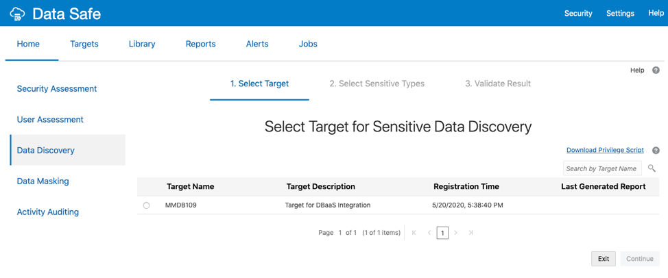

6. We are going to "Create" a model for an example here, but there are choices to "Upload" or use a "Library". Select Set **Show and save sample data** on and **Resource Group** to **Default Resource Group**. Click **Continue**.

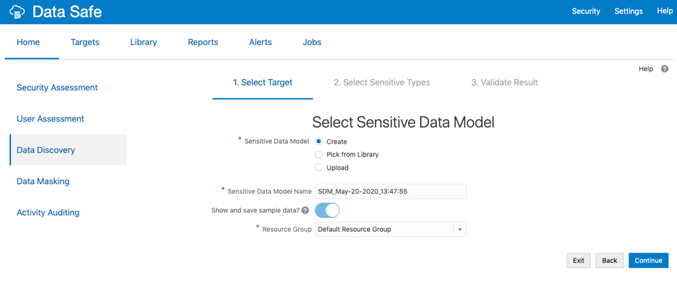

7. Choose the Schema Name - which we are using the "MAMA_MAGGY" since it contains our test data. Select **Continue**

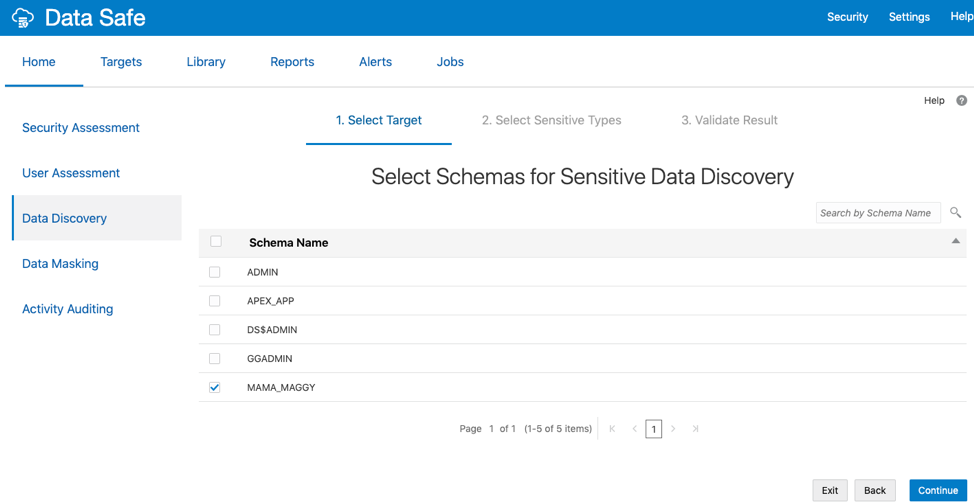

8. Here you can now select types of data for discovery. Select "All" and then **Continue**

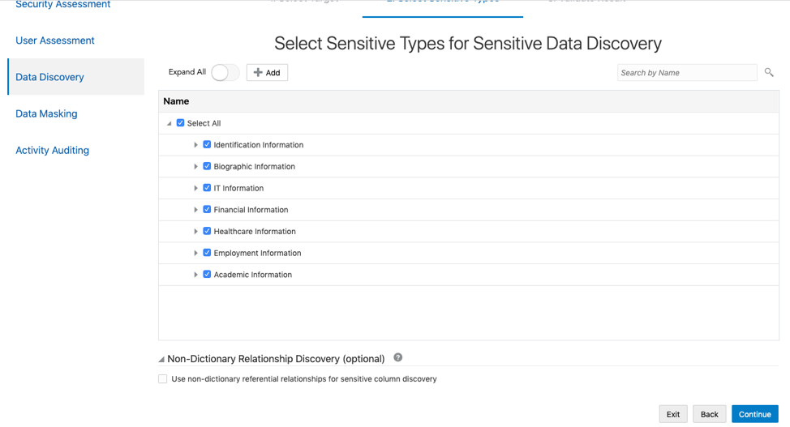

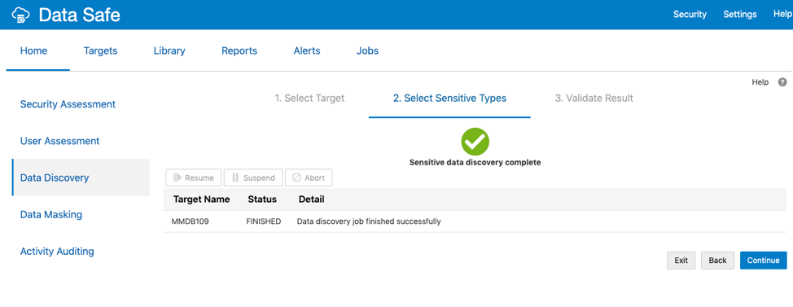

Now the data discovery is complete and we can validate the result of the discovery. 

9. Select **Continue**.


10. It shows that we have found Employment Information in 4 columns. Select **All** then the go to the **Report**

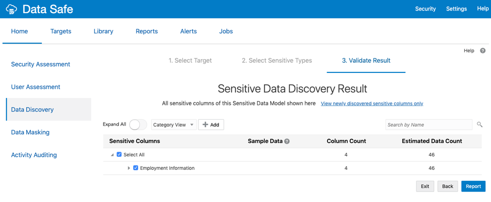

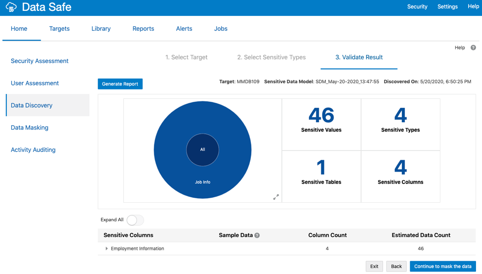

11. Select **Employement information** and will show the columns and give you an option to mask the data.

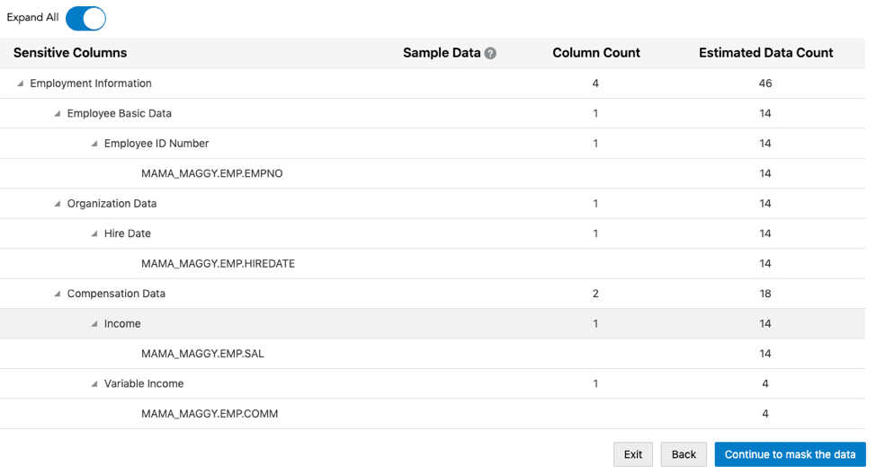

We have now completed the discovery of the data and we can see the report and decide if we want to mask the data. We will show the masking in the next step.

## STEP 8: Mask Data

1. Select the **Continue to mask the data**.


2. You will see that the masking process has started.
   
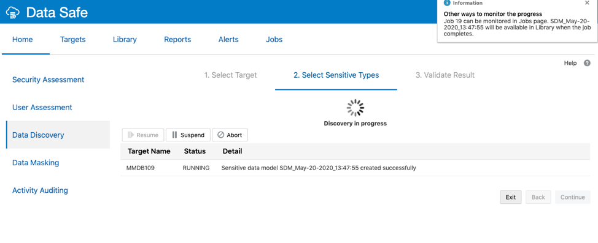

3. You will have the option to set the masking format as part of the masking policy for the different columns discovered. Each of the options will preserve the referential integrity if there are relationships setup in the tables. **Select All** in order to deselect all of the columns, and only select `Compensation Data  - Income MAMA_MAGGY.EMP.SAL`

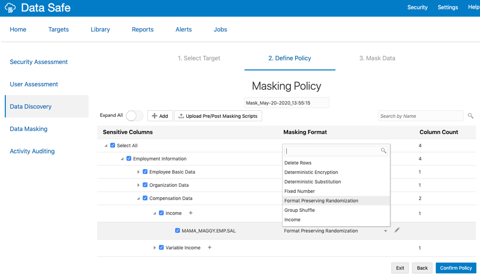 

4. After select the masking format for the columns, select **Confirm Policy**.

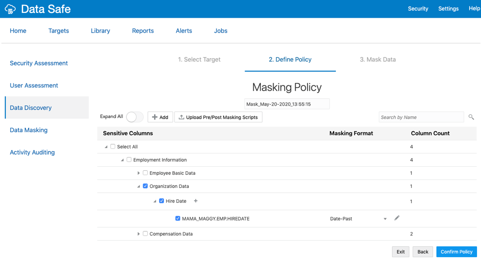

5. Depending on size of the database and current activity you might want to schedule the job. We are just going to perform it **Right Now** and then select **Review**

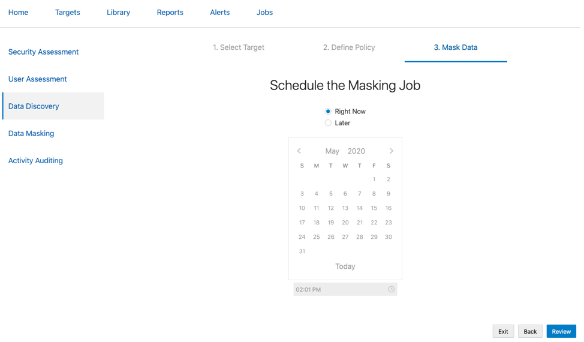

6. There is a **Review and Submit** option, so use this opportunity to confirm the correct database! Big red letters this should not be a production database! Then select **Submit**.

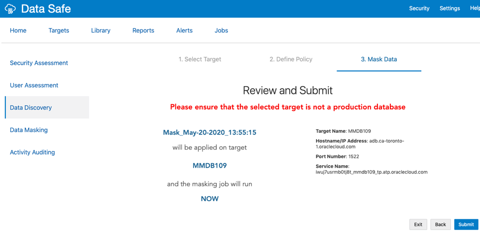

7. The Masking Job will run and generate the scripts for execution. 

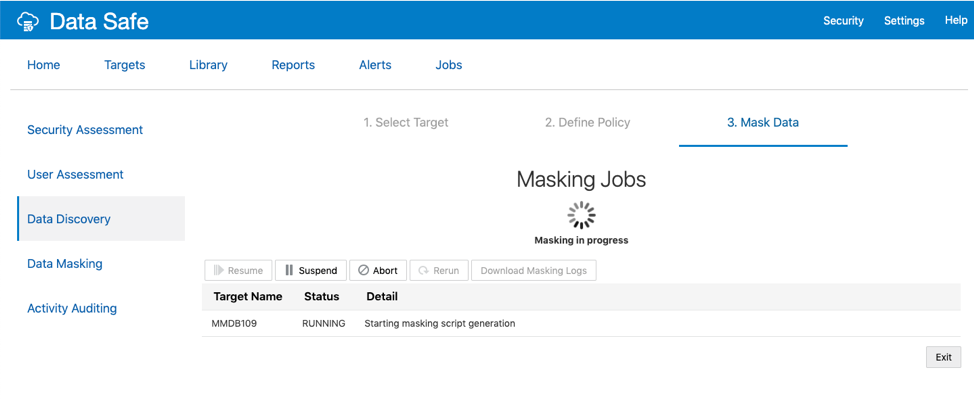

8. Exit out and we are back to the Data Discovery and can see we have Masked Values and Tables.

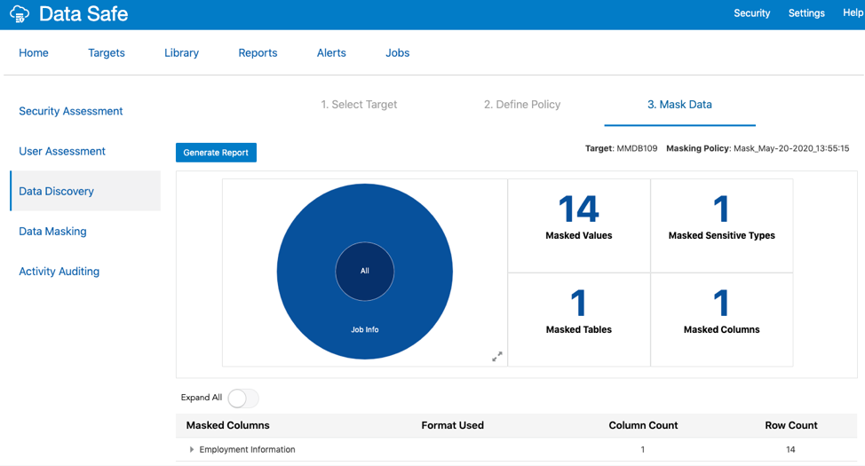

At this point, you have masked data from production that you can share with other environments without compromising data declassification policy and compliance mandates.

******

**What you have done**

**Oracle Data Safe** helps you to understand the sensitivity of your data, evaluate risks, mask sensitive data, implement and monitor security controls, assess user security, monitor user activity, and address data security compliance requirements.
As part of this lab you have registered your autonomous database with Data Safe, audit the data and run assessment to find deviations or non-compliance.
You have also enabled Data Masking capabilities and successfully used Data Safe in your test environment to mask the data that discovered as employee data.**

******
 
