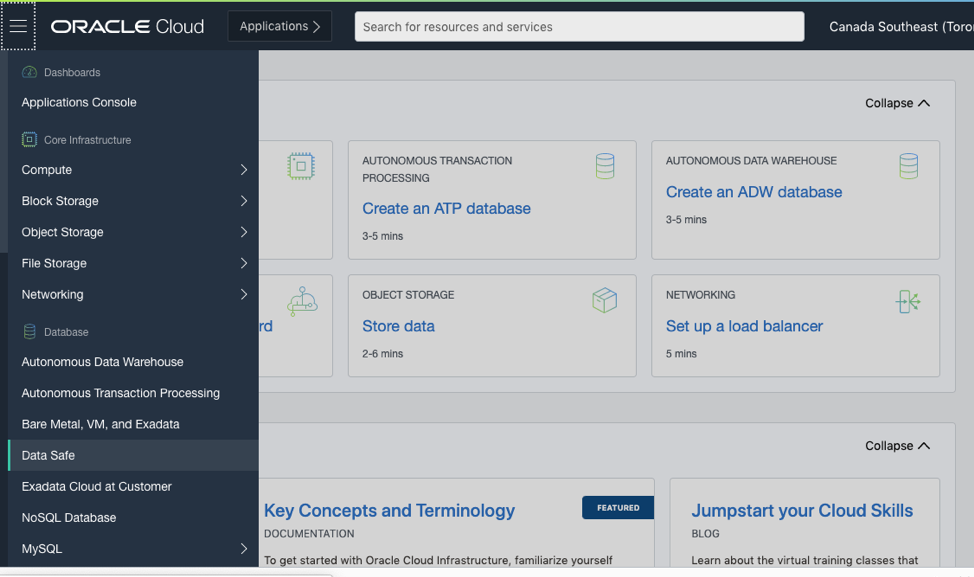
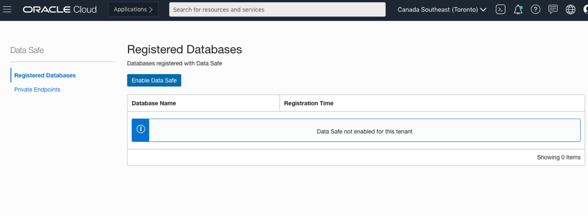
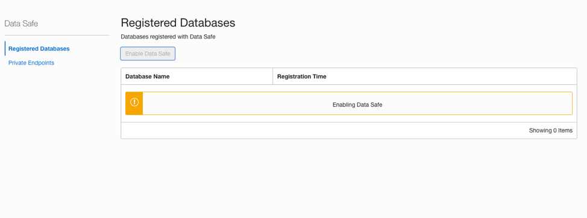
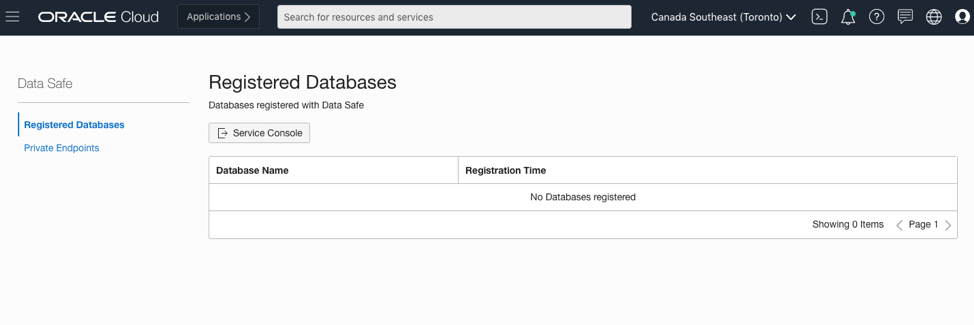

# Prerequisites

For the purpose of this lab you will use the following services. 

* Autonomous Transaction Processing (*Note: User should be familiar with this service*)
* Data Safe
* SQL Developer Web (*Note: User should be familiar with SQL programing language*) 
  
For further references on how to connect to SQL Developer Web Client, please refer to [Connect with Built-in SQL Developer Web](https://docs.oracle.com/en/cloud/paas/autonomous-data-warehouse-cloud/user/sql-developer-web.html#GUID-0D93A57B-193B-43F0-BDE2-174BC3E13FCC)

## STEP 1: Enabling Data Safe

In this section you will be learn how to enable Data Safe in your cloud Tenancy.

Oracle Data Safe administrators can enable Oracle Data Safe in a region of their tenancy. Be aware that it is not possible to disable Oracle Data Safe after it's enabled.
To enable Oracle Data Safe in your tenancy in Oracle Cloud Infrastructure, you require a paid Oracle Cloud account. You cannot enable Oracle Data Safe in the following situations:
* You are using Oracle Cloud Free Tier. With the Free Tier, your Oracle Cloud account is granted a 30-day free trial and US$300 in free credits. Your account is also allowed to use the Always Free services for an unlimited time.
* Your Oracle Cloud account is suspended.
To enable Oracle Data Safe, you must belong to one of the following groups in Oracle Cloud Infrastructure Identity and Access Management (IAM):
* Your tenancy's Administrators group. This group has permission on all resources in your tenancy.
* A group in your tenancy that has the manage permission for Oracle Data Safe and can inspect groups in the tenancy.
To grant the Data-Safe-Admins group all permissions on all resources in a tenancy, the policy might be:
    `Allow group Data-Safe-Admins to manage all-resources in tenancy`
    `Allow group Data-Safe-Admins to inspect groups in tenancy`
Once the required permissions have been set up, you can enable Data Safe by following the next steps:
  

1. Once in your Tenancy from the menu in the upper left corner of the page select Data Safe.

2. This takes you to the registered databases under the Data Safe. This task will only need to be completed once for the Tenancy. You will notice that Data Safe is not enabled for this tenant.

3. You will see "Enable Data Safe" button. Click that option to enable Data Safe. If greyed out, it has already been enabled.

4. After Data Safe is enabled, you will see "No Databases registered". 

Now you can start registering databases to be monitored by Data Safe. Let's take a look on how we can protect our data.

******

**What you have done**

You have enabled Data Safe at the tenant level. From now on, database owners and Admins will be able to register databases in Data Safe for continuous monitoring.

******
 
